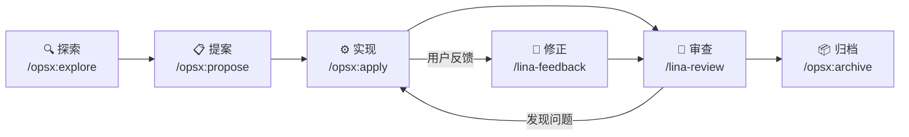

## 什么是规范驱动开发

规范驱动开发（`Specification-Driven Development，SDD`）是一种`AI`原生研发工作流。其核心理念是：**规范先于代码存在，代码由规范驱动产生**。

在传统开发流程中，需求文档和技术方案往往在代码实现后迅速过时，成为无人维护的历史文档。`SDD`通过以下机制解决这个问题：

- 每次功能迭代都以规范文档作为起点和终点
- 规范文档是`AI`理解上下文和做出决策的依据
- 代码实现完成后，规范同步更新并归档为基线
- 后续迭代的`AI`以已归档的基线规范作为约束，保证一致性

## OpenSpec 工作流

`LinaPro`内置规范驱动的`AI`研发工作流，`OpenSpec`是该工作流可选但特别建议安装的实现工具。它不是`LinaPro`运行时依赖，项目不安装也可以启动和运行；但框架已经围绕`openspec/`目录、`opsx`指令和相关`Agent Skills`提供了良好支持，建议团队在正式迭代中使用它形成完整研发闭环：



### 阶段一：探索（/opsx:explore）

**目的：** 在写任何代码之前，充分理解需求和现有架构，识别风险和边界。

**触发方式：**

```text
/opsx:explore <需求描述>
```

**AI 的工作：**

- 读取`CLAUDE.md`和`openspec/`目录，了解项目规范和当前架构状态
- 浏览相关源码，理解现有实现和可复用的能力
- 主动提出澄清问题，帮助明确功能边界、数据模型和影响范围
- 识别潜在风险，如数据迁移、权限变更、`i18n`影响等

**人类的工作：**

回答`AI`的问题，提供更多背景信息，在多种方案之间做出决策。

**阶段输出：** 双方对需求有共同理解，确定实现方向。

### 阶段二：提案（/opsx:propose）

**目的：** 将探索阶段的共识固化为结构化的变更文档。

**触发方式：**

```text
/opsx:propose <change-name>
```

其中`change-name`使用`kebab-case`格式描述本次变更，如`content-article`、`user-export`。

**AI 的工作：**

在`openspec/changes/<change-name>/`目录下生成以下文档：

| 文件 | 内容 |
|------|------|
| `proposal.md` | 变更背景、目标范围、影响分析、成功标准 |
| `design.md` | 数据库表设计、`API`接口定义、前端页面结构、关键决策说明 |
| `tasks.md` | 分解为可执行的任务清单，每条任务有明确的完成标准 |
| `specs/<capability>.md` | 增量能力规范，描述新功能应当具备的行为 |

**人类的工作：**

审阅文档，重点检查数据库设计的合理性、任务拆分的完整性，确认方向正确后告知`AI`可以开始实现。

**阶段输出：** 完整的变更提案文档，作为实现阶段的输入。

### 阶段三：实现（/opsx:apply）

**目的：** `AI`按任务清单逐条完成代码实现。

**触发方式：**

```text
/opsx:apply
```

**AI 的工作：**

- 按照`tasks.md`中的任务顺序，依次完成每项实现
- 每完成一个任务，在`tasks.md`中标记为完成（`[x]`）
- 实现结束后自动触发`/lina-review`进行审查
- 审查发现问题时自动修正，重复直到全部通过

**典型任务清单结构：**

```markdown
## 1. 数据库层
- [x] 1.1 创建安装 SQL（content_article 表）
- [x] 1.2 创建卸载 SQL
- [x] 1.3 生成 DAO/DO/Entity

## 2. 后端层
- [x] 2.1 定义 API DTO 和路由
- [x] 2.2 实现控制器
- [x] 2.3 实现业务服务
- [x] 2.4 注册插件入口

## 3. 前端层
- [x] 3.1 实现列表页面
- [x] 3.2 实现表单弹窗
- [x] 3.3 接入后端 API

## 4. i18n
- [x] 4.1 更新宿主/插件语言包

## 5. 测试
- [x] 5.1 编写 E2E 测试用例
- [x] 5.2 运行测试通过
```

**人类的工作：**

主要是等待，偶尔回答`AI`遇到的决策问题。实现完成后，验证功能是否符合预期。

**阶段输出：** 完整的代码实现，所有`E2E`测试通过。

### 阶段四：审查（/lina-review）

`/lina-review`技能在以下节点自动触发，无需手动调用：

- `/opsx:apply`实现完成后
- 用户通过`/lina-feedback`反馈问题修正后
- `/opsx:archive`归档前

审查内容包括：

- **代码质量**：命名规范、错误处理、日志记录
- **规范遵循**：实现是否与`design.md`一致
- **安全检查**：`SQL`注入、权限遗漏、敏感信息泄露
- **`i18n`完整性**：新增文案是否都有对应翻译键
- **`E2E`测试**：测试覆盖是否足够

### 阶段五：归档（/opsx:archive）

**目的：** 将本次迭代的设计决策和规范沉淀为持久化基线。

**触发方式：**

```text
/opsx:archive
```

**AI 的工作：**

1. 再次执行全面审查，确保一切就绪
2. 将`proposal.md`、`design.md`、`tasks.md`统一改写为英文（方便国际化）
3. 将`specs/`中的增量规范合并到`openspec/specs/`基线目录
4. 将变更目录从`openspec/changes/`移动到`openspec/changes/archive/`

**阶段输出：** 变更归档，`openspec/specs/`基线更新，下一次迭代可以基于新基线推进。

## 目录结构

```text
openspec/
├── changes/                    活跃和已归档的变更
│   ├── <change-name>/          进行中的变更
│   │   ├── proposal.md         变更提案
│   │   ├── design.md           技术设计
│   │   ├── tasks.md            任务清单
│   │   └── specs/              增量规范
│   └── archive/                已完成并归档的变更
├── specs/                      当前生效的基线规范
│   └── <capability>.md         具体能力的规范文档
└── config.yaml                 OpenSpec 项目级配置
```

## 用户反馈处理

当用户发现问题或提出改进意见时，通过`/lina-feedback`技能处理：

```text
/lina-feedback <问题描述>
```

`AI`会将用户反馈追加到当前活跃变更的`tasks.md`中，修正实现后重新审查，确保每次反馈都有完整记录。

:::tip 关键规则
在用户未明确要求新建变更的前提下，无论反馈内容是否与当前活跃迭代的主要功能相关，都必须追加到当前活跃迭代中，便于统一归档管理。
:::

## 活跃变更的判定

**以是否归档为准**：凡是仍位于`openspec/changes/`根目录下、且未移动到`openspec/changes/archive/`中的变更目录，都属于活跃变更。即便该变更的所有任务都已完成，只要尚未执行归档，仍然视为活跃变更。
