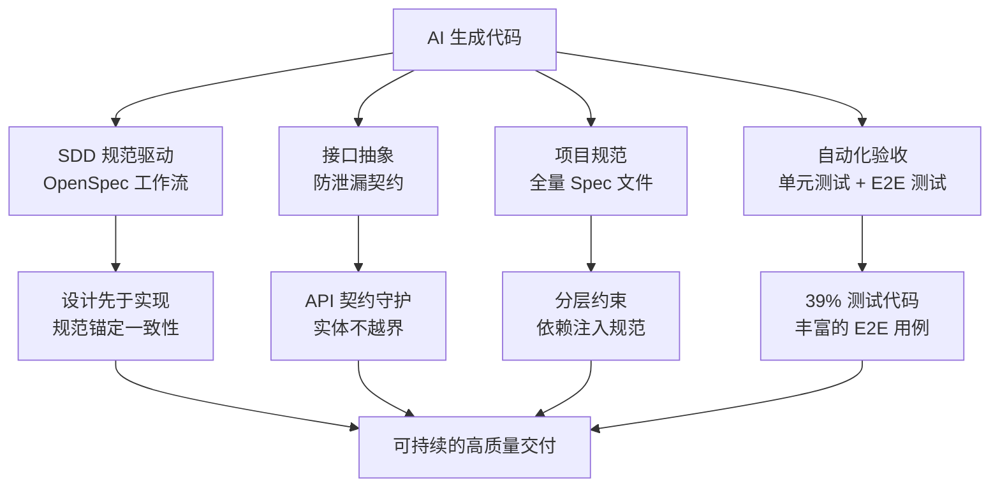
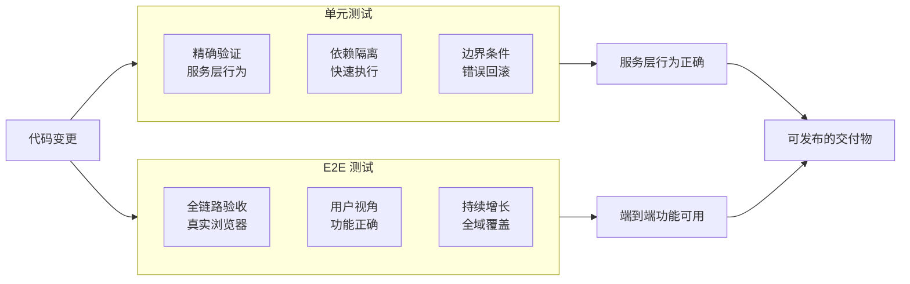
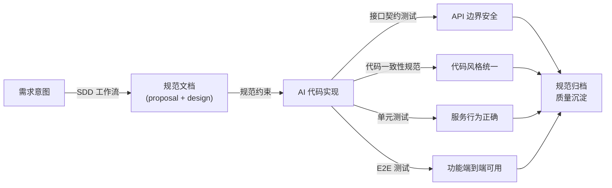

## AI 让代码更快，但质量谁来保障

`AI`辅助编程正在深刻改变软件开发的速度方程——一个熟练使用`AI`编程工具的开发者，在单位时间内产出的代码量可以是传统方式的数倍甚至十倍。然而，速度提升背后隐藏着一个工程管理上的新困境：**代码越来越多，但谁来保证这些代码是正确的、一致的、可维护的？**

在实践中，团队面临的不只是"`AI`写错了"这种简单问题，而是一系列更深层的工程挑战：从日常的风格不一致、接口边界模糊，到长期积累的架构漂移、规范空洞，再到几乎不可感知的安全数据泄漏风险。这些问题在传统开发中同样存在，但在`AI`高速迭代下，问题的暴露速度和规模都被急剧放大。

`LinaPro`在框架立项之初就将工程质量保障作为`AI`原生设计的核心命题之一。本文将从当前行业的真实挑战出发，系统介绍`LinaPro`如何通过规范驱动、接口抽象、高密度测试等手段，构建一套完整的`AI`工程质量保障体系。

## 当前 AI 工程的质量挑战

### 挑战一：代码一致性的快速崩坏

在引入`AI`编程之前，一个团队的代码库往往经历数月乃至数年的打磨，形成了相对一致的风格和习惯：变量命名方式、错误处理模式、日志记录规范、分层调用惯例……这些习惯往往不成文，但形成了团队的"代码文化"，新成员通过阅读代码可以快速理解什么是这个项目"正确"的做法。

`AI`编程工具打破了这种积累机制。每次会话中，`AI`会基于自己的训练数据和当前上下文产生决策，而不同的上下文、不同的提示词、甚至不同版本的模型，都可能产生风格迥异的输出。随着功能数量增长，代码库中开始出现多种并存的依赖注入方式、若干套错误处理风格、以及互不兼容的命名约定。**代码库的一致性不是被有意破坏的，而是在无数次"差不多就行"中悄悄消失的。**

### 挑战二：架构漂移与设计意图的失忆

软件架构不是某个文件里的几张图，而是团队对系统边界、职责分配和演进路径的共识。在传统开发中，这种共识通过代码评审和团队讨论持续传递；而在`AI`主导编码的团队中，架构共识往往只存在于某次对话的上下文窗口里。

一旦会话结束，`AI`就"忘记"了这次交流中达成的架构决定。在下一次对话中，`AI`可能会为了完成一个局部需求，在一个领域内引入另一个领域的依赖，悄悄地打破既有的模块边界。这类改动单独来看往往合理，但积累到一定程度就会让系统的架构变得面目全非——**所有人都知道问题存在，但没有人知道从哪里开始修复。**

### 挑战三：Vibe Coding与质量门禁缺失

"Vibe Coding"是近年来在`AI`编程社区中兴起的一种实践风格——用直觉驱动、快速迭代，不过多纠结代码结构，把"能跑就行"奉为行动准则。这种方式在原型验证阶段有其价值，但作为正式工程方法，它带来的问题是严重的：**缺乏质量门禁的代码库，技术债务的积累速度远超`AI`带来的效率收益。**

没有清晰的通过/失败标准，团队就无法判断`AI`的一次修改是否破坏了既有功能；没有自动化测试，一个关键路径上的回归问题可能在发布后才被用户发现；没有接口契约约束，一个内部字段的意外暴露可能成为安全漏洞的入口。

### 挑战四：测试空洞与验收真空

即便团队意识到测试的重要性，`AI`编程场景下的测试覆盖依然面临结构性困难。当`AI`生成一段业务逻辑时，若不要求其同步产生测试代码，测试往往被推迟到"有时间的时候再补"——而这个时候几乎不会到来。

更隐蔽的问题在于：即便`AI`生成了测试代码，这些测试可能只验证了正常路径，而遗漏了边界条件、错误回滚、权限隔离等关键场景。**测试文件的存在不等于测试覆盖，覆盖率数字的存在不等于质量保障。**

### 挑战五：接口边界模糊与数据泄漏风险

在`AI`快速生成的代码中，一个常见且危险的模式是**直接将数据库实体暴露为`API`响应**。数据库表的字段往往包含内部治理信息（如软删除标志、密码散列、内部路径等），直接暴露这些字段既违背了`API`设计原则，也可能带来安全隐患。当`AI`在某个领域内同时看到实体定义和控制器代码时，最"自然"的做法往往就是直接返回实体——而这恰恰是最危险的做法。

## LinaPro 的质量保障体系

`LinaPro`的质量保障体系建立在四个相互配合的维度之上：规范先行、接口约束、代码分层和自动化验收。这四个维度共同构成了一道多层防护网，使`AI`生成的每一段代码都能在结构化的约束下运行。

### 维度一：SDD 规范驱动工作流

`LinaPro`的核心研发工作流是**规范驱动开发**（`Specification-Driven Development，SDD`）。其核心理念是：**规范先于代码存在，代码由规范驱动产生**。每次功能迭代不从写代码开始，而是从一套结构化文档开始：

- `proposal.md`——明确需求边界和实现目标
- `design.md`——描述数据库设计、`API`接口定义和前端页面结构
- `tasks.md`——分解为可逐项完成的实现任务清单
- `specs/`——落地后的增量规范文件，归档为持久化基线

这套文档不是交付完成后的总结材料，而是**驱动实现的输入**。`AI`在开始写代码之前，先理解规范；`AI`在完成实现之后，将规范更新归档。规范始终与代码保持同步，而不是随着时间推移变成遗弃的历史文档。

规范驱动带来的质量价值体现在以下方面：

| 质量维度 | 传统方式 | SDD 方式 |
|---------|---------|---------|
| **架构一致性** | 依赖开发者记忆和口口相传 | 规范文档作为约束基线，`AI` 每次都从规范出发 |
| **变更可追溯** | 代码提交历史难以反映设计意图 | 每次变更有对应的 `proposal.md` 和 `design.md` |
| **跨会话一致性** | `AI` 每次对话都从零开始理解 | 规范文档提供跨会话的稳定上下文锚点 |
| **架构漂移检测** | 只能靠代码评审发现 | `E2E` 测试作为硬性门禁，漂移即失败 |

`LinaPro`通过`OpenSpec`工具实现`SDD`工作流，支持完整的五阶段研发闭环，详情参见：[AI规范驱动开发](/docs/spec-driven-development)。

### 维度二：两层项目规范约束体系

`LinaPro`通过两种互补的规范文件覆盖`AI`编码行为的全部约束面：一种是在每次`AI`会话启动时即时加载、覆盖全项目的**常驻约束文件**；另一种是随功能演进持续沉淀、精确到验收场景的**能力域基线规范**。两者分工明确、相互配合，共同构成完整的规范约束体系。

#### 常驻约束文件：AGENTS.md

`AGENTS.md`（同时作为`CLAUDE.md`的符号链接）是`LinaPro`项目中`AI`编码代理在每次会话开始时必须优先读取的**项目级规范文件**。与`openspec/specs/`中的能力域规范不同，`AGENTS.md` 是一套**常驻的、跨迭代的全局约束**，无论当前迭代涉及什么功能，这套约束都始终有效。

`AGENTS.md` 覆盖的核心约束维度包括：

- **架构设计约束**：明确项目定位与`lina-core`主框架边界，防止核心域与工作台展示结构强绑定，保持核心领域契约的稳定性。
- **模块设计规范**：业务模块支持按需禁用、前端联动隐藏；数据权限必须在查询层显式注入，不允许内存层过滤替代；源码插件目录结构严格固定。
- **接口设计约束**：强制`RESTful`语义，禁止动作化路径命名，全仓库资源路径风格保持一致等规范。
- **代码质量规范**：运行期依赖必须显式注入，错误必须通过`bizerr`封装，日志沿调用链传递`ctx`，缓存在集群模式下必须跨实例协调。
- **`API`响应契约**：时间点字段必须返回`Unix`毫秒整型；`DTO`字段必须包含英文文档标签；开发工具必须跨平台可执行等规范。
- **编译与测试门禁**：`Go`生产代码变更前必须运行`go test`烟测，接口签名变更还需通过启动绑定包测试，不允许仅凭静态分析认定可编译。
- **持续治理要求**：功能改动必须评估`i18n`影响；缓存设计必须区分单机与集群策略；`bugfix`必须附带自动化测试等规范。

这套约束不是软性建议，而是`AI`代理的**行为规范**。`AI`每次生成代码前都必须以这些规则为基准进行决策，任何偏离都会在代码审查阶段被明确指出。这意味着，即便在一个全新的会话中，`AI`也不会因为"不知道项目规范"而产生偏离项目风格的输出——**规范文件本身就是`AI`的记忆**。

这套约束是仓库级别的，框架代码和业务插件代码都在其覆盖范围之内。团队无需为自己的插件单独定义分层约束、接口设计规范或数据权限规则，框架规范文件已经构成了`AI`的全局行为底线，团队只需按业务需要在此基础上按需补充。

#### 能力域基线规范：openspec/specs/

在`LinaPro`的`openspec/specs/`目录下，沉淀了覆盖系统各个能力域的**基线规范文件**。这些规范不是概念层面的愿景描述，而是精确到场景级别的工程约束：每一条规范都有明确的`SHALL`/`MUST NOT`语义，配套的`Scenario`描述了具体的验收条件。

以后端一致性规范为例，该规范覆盖了依赖注入方式、服务组件拆分粒度、数据库操作规范、错误处理约定等场景级别的工程约束。这些规范文件是`AI`进行代码生成时的上下文依据，也是代码评审时的对照标准。当一段`AI`生成的代码与规范不符时，问题可以被明确识别，而不是依赖审查者的主观判断。

#### 两层规范的分工

| 规范层次 | 文件 | 适用范围 | 更新时机 |
|---------|------|---------|---------|
| **常驻约束** | `AGENTS.md` | 全项目、全迭代、所有`AI`会话 | 架构决策变化时修订 |
| **能力域基线** | `openspec/specs/<domain>/spec.md` | 特定能力域的验收场景 | 每次功能迭代归档后沉淀 |

两层规范从不同粒度覆盖了`AI`的编码行为：常驻约束提供全局底线，确保任何会话中的`AI`输出都不会偏离项目的根本设计原则；能力域基线提供局部精度，确保每个具体功能的实现细节符合该能力的验收预期。

### 维度三：接口抽象与 API 防泄漏契约

清晰的接口边界是系统长期可维护的基础，也是`AI`生成代码最容易出现问题的地方。当`AI`在同一个上下文中同时看到数据库实体定义和`API`控制器代码时，最"自然"的做法往往是直接将实体返回给调用方——这条捷径短期看起来没有问题，但它让`API`合同悄悄地与内部数据结构耦合在一起，之后的每次数据库变更都可能在不经意间改变外部接口行为。

`LinaPro`的设计理念是：**`API`层是系统与外部世界之间的稳定契约，而不是内部实现的透明窗口**。无论内部数据模型如何演进，`API`合同都应该保持独立控制。基于这一理念，框架在接口设计上形成了两条核心原则：

**原则一：接口响应与数据库实体严格隔离**

`API`响应必须使用独立定义的数据结构，显式映射允许对外暴露的字段，而不是直接透传数据库实体。这样的好处是双重的：一方面，数据库字段的新增、重命名或结构调整不会被动改变外部`API`合同，两者可以各自按照自己的节奏演进；另一方面，内部治理字段——如软删除标志、密码散列、系统路径、存储引擎等——永远不会因为疏忽而出现在外部响应中，从源头消除一类数据泄漏风险。

**原则二：接口边界由自动化契约测试持续守护**

仅靠设计文档和代码评审来维持接口边界是脆弱的——在`AI`高速生成代码的场景下，规范可能在某次迭代中被悄悄绕过而无人察觉。`LinaPro`为此引入了专门的 **`API`契约守护测试** ：每次构建时自动扫描所有`API`包，验证公开响应结构不引入数据库实体依赖、敏感字段不出现在`JSON`序列化中。任何一处违反，构建立即失败。

**接口边界不是靠代码审查来维持的，而是由自动化测试来守护的**——这是`LinaPro`处理接口质量的基本态度。规范写在文档里终究只是软性约束，只有将边界检查变成可执行的测试，接口的安全性才能在每次迭代中得到持续保证，而不是依赖团队成员的记忆和自律。

值得强调的是，这套契约测试的触发**不依赖开发者手动介入**。该能力是通过`LinaPro`框架提供的项目规范以及内置的`AI`技能（`skill`）自动执行——`AI`在完成接口相关代码生成后，会按照项目规范自动触发契约验证，而无需开发者记住应该在何时运行哪些测试。对于使用`LinaPro`的团队而言，接口质量守护是框架内置的默认行为，而不是需要额外建立的开发习惯，显著降低了对开发者的心智负担，也使框架在`AI`编程场景下更易于正确使用。

### 维度四：高密度测试覆盖

`LinaPro`最显著的工程质量特征之一，是其极高的**测试代码密度**。在整个代码库中，**测试代码占总代码量的`39`%**——这一比例远超行业平均水平，也是`LinaPro`工程质量理念最直接的体现。

测试体系分为两个层次，各司其职：

#### 单元测试：精确验证服务层行为

后端单元测试覆盖了框架核心和官方插件的所有关键服务层逻辑。测试直接在服务层构建，绕过`HTTP`层，通过依赖注入替换外部服务（数据库、缓存、插件运行时等），精确验证单一行为的正确性。

典型的测试场景包括但不限于：

- **插件生命周期**：验证安装、启用、禁用、卸载等状态流转的正确性，以及依赖关系的自动解析和回滚行为
- **多租户隔离**：验证租户创建失败时的事务回滚，确保不留下半创建状态
- **启动一致性检查**：验证非法的插件治理配置组合在服务启动时被拒绝，防止运行时出现不可恢复的状态
- **安全边界**：验证单节点模式下不产生多节点状态投影，平台级操作对租户级插件的隔离性

这一测试要求**由项目规范和框架内置的`AI`技能自动驱动执行，无需开发者手动触发**。

#### E2E 测试：全链路浏览器级验收

端到端测试基于`Playwright`，通过真实浏览器驱动完整的前后端链路进行验收。每个功能迭代都要求同步补充对应的`E2E`测试用例，`LinaPro`已覆盖从用户认证、权限管理、字典与配置、文件管理、任务调度、多租户，到插件扩展等核心能力域，且测试用例数量随着项目迭代持续增长。

`E2E`测试不是可选的"加分项"，而是功能变更的**硬性前提**。在`LinaPro`的`SDD`工作流中，每个变更归档前必须有对应的`E2E`测试通过；若官方插件的`E2E`用例缺失，夜间构建（`Nightly`）的镜像发布将被阻止。

`E2E`测试的执行要求同样**内嵌在`SDD`工作流本身，而非依赖开发者记忆**。`LinaPro`将验收要求固化到工作流节点中，框架将"写测试"从一项需要自律维持的习惯，变成了`AI`驱动流程中一个不可跳过的步骤，显著降低了对开发者执行纪律的依赖。

#### 两个层次的配合

单元测试和`E2E`测试分别在不同的粒度上提供质量保障，两者互补而非替代：单元测试确保服务层逻辑的精确正确性，`E2E`测试确保整个系统对用户呈现正确的行为。

## 质量保障的整体效果

将四个维度的保障措施组合在一起，`LinaPro`形成了一条从规范设计到自动化验收的完整质量链路：

这套体系带来的核心价值在于：**质量保障是系统性的，而不是依赖个别开发者的自律性的**。规范是机器可读的，门禁是自动化的，测试是强制的——这意味着即使在`AI`高速迭代、代码大量产出的场景下，质量标准也不会因为"今天赶时间"或"这次先跳过"而悄悄降低。

对于使用`LinaPro`的团队而言，这套体系意味着：

- 任何违反`API`契约的代码，在`CI`中自动失败，不会进入主干
- 任何破坏功能的变更，会被`E2E`测试捕获，不会流入发布流程
- 任何偏离规范的实现，有明确的文档可以对照，评审有据可依
- 每次迭代产生的设计决策，通过规范归档永久保留，不随会话结束而消失

在`AI`时代，速度是起点，不是终点。
