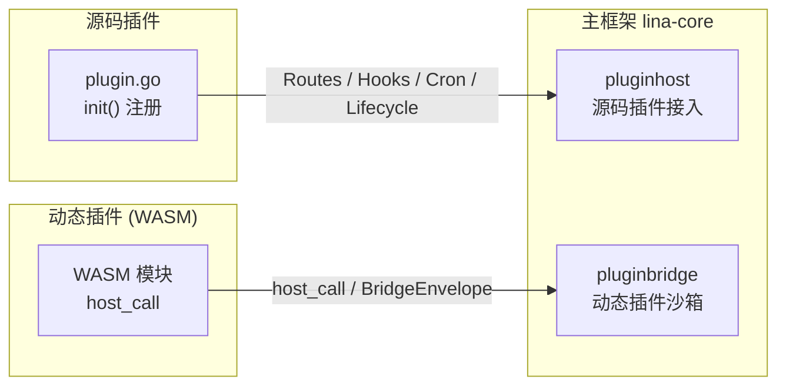

## 设计理念

`LinaPro`在设计之初就确立了一个原则：**主框架只负责轻量级的领域能力和稳定的扩展接口，业务能力尽可能通过插件来扩展实现**。

这一原则背后的出发点是明确的。主框架若承载过多的业务逻辑，会随着业务需求的变化而频繁修改，导致升级成本高、稳定性下降。反过来，将业务能力完全下推到插件，主框架就可以专注于保持稳定的基础设施——认证、授权、多租户、路由调度、定时任务、静态资源、插件生命周期——而这些基础设施一旦稳定，就能长期支撑上层插件的快速迭代。

然而，主框架与插件之间并非完全隔离，协作本身需要边界与规范。若插件对主框架产生过度依赖，比如直接导入主框架的`internal`包、绕过发布的接口调用私有实现，那么插件就会随主框架内部实现的变动而频繁破坏。反过来，若主框架为迁就某个特定插件而暴露专用接口，插件与主框架之间就产生了不必要的耦合，损害了整个系统的可维护性。

`LinaPro`通过以下方式在主框架和插件之间建立清晰的协作边界：

- **源码插件通过`pluginhost`契约接入**：`pluginhost`包定义的所有接口是主框架对源码插件的稳定承诺，源码插件只能通过这些接口使用主框架能力，不能直接导入主框架的`internal/`目录。
- **动态插件通过`pluginbridge`沙箱通信**：动态插件运行在`WASM`沙箱中，通过`host_call`机制调用主框架服务，主框架按安装时确认的`hostServices`授权快照校验所有调用的边界。
- **主框架提供通用领域能力，不为特定业务场景定制接口**：`pluginhost`暴露的是认证、租户、配置、缓存、通知等通用服务适配器，而非特定的业务域接口，插件在这些通用领域能力之上自行实现业务逻辑。

这种设计让主框架的稳定性和插件的灵活性同时成立，两者在明确划定的边界上协作，而非相互渗透。

## 架构分层

主框架`lina-core`提供的能力可以分为两个层次：**基础领域能力**和**插件扩展接口**。

### 基础领域能力

基础领域能力面向整个运行时环境，不针对任何特定的业务场景设计：

| 能力域 | 说明 |
|--------|------|
| **认证与授权** | `JWT`签发与校验、`RBAC`权限模型、菜单与按钮权限、权限标识校验 |
| **在线会话** | 会话存储、用户在线状态查询、强制登出 |
| **多租户** | 租户解析、租户上下文注入、租户过滤 |
| **数据字典** | 字典标签解析、值列表管理、可见性校验 |
| **文件管理** | 文件批量检索、按业务场景与关键词搜索、可见性控制 |
| **AI 能力** | 文本生成、图像生成、向量嵌入、语音转写、视觉分析等`AI`子能力统一供给 |
| **定时任务** | 任务调度、分布式主节点选举、任务执行日志 |
| **配置管理** | 静态配置读取、运行时配置项 |
| **缓存控制** | 插件粒度的缓存命名空间 |
| **插件治理** | 插件目录扫描、依赖检查、生命周期编排 |

上表仅列出部分关键能力域。主框架还提供了用户域、组织架构、对象存储、国际化、分布式锁、基础设施状态监控、`API`文档等领域能力，完整的能力清单和接口说明请参阅：[插件可用领域能力概览](/docs/domain-capabilities)。

这些能力被封装为稳定的服务适配器，向插件暴露。主框架不会为某个业务场景单独定义一个专用接口，而是提供可以组合使用的通用原语，由插件在自身逻辑中决定如何使用。

### 插件扩展接口

业务能力通过插件形式扩展，主框架定义了两套面向插件的稳定扩展接口：

源码插件通过`pluginhost`在编译时注册路由、钩子、定时任务、生命周期回调和治理逻辑；动态插件通过`pluginbridge`在运行时通过沙箱通信访问主框架能力。两套扩展接口在能力范围上虽有所差异，但主框架对两者都是同等透明的治理主体。

## 核心边界划分

### 框架控制面与插件命名空间

`LinaPro`的路由体系存在三个独立边界：

| 边界 | 默认路径 | 说明 |
|------|----------|------|
| **框架控制面`API`** | `/api/v1/...` | 主框架内建系统治理、用户、权限、配置等控制面接口 |
| **统一插件`API`** | `/x/{plugin-id}/...` | 插件`API`命名空间，后续路径段由插件自行组织 |
| **默认管理工作台** | `/admin` | 内建管理界面，不是主框架`API`路由 |

`/x`表示`eXtension`，是一个约定的命名空间前缀，表明该路径属于插件扩展的`API`，而非主框架控制面接口。源码插件和动态插件的业务`API`都必须进入这个命名空间，主框架通过`{plugin-id}`隔离不同插件。

源码插件还拥有注册非保留`HTTP`路由路径的自由度，可以注册`/`、`/portal/...`、`/assets/...`等路径用于页面、门户、静态资源或自管`fallback`。这种自由度为源码插件提供了极大的灵活性，但也要求开发者注意路由冲突风险。

### 工作台职责边界

`LinaPro`内置了一个基于`Vue 3 + Vben5`的管理工作台，默认通过`/admin`路由进入。工作台是主框架`API`和插件`API`的标准`UI`表达层，而不是业务逻辑的定义者。

`/admin`是管理工作台的入口边界，而不是整个系统的前端边界。根路径、门户页面、插件自管静态资源和其他非保留公开路径可以由源码插件自行注册。管理工作台入口由主框架静态配置`workspace.basePath`控制，详情请参阅：[工作台配置](/docs/workspace)。

插件通过在`plugin.yaml`中声明`menus`字段，将自身的管理页面接入工作台的导航体系。主框架会将已启用插件声明的菜单与内置菜单合并，按当前用户权限过滤后返回给工作台。插件禁用后，对应菜单入口会自动从导航中消失。

开发者可以用自定义前端完全替换内置工作台，只要新的前端遵循主框架公开的`RESTful API`和权限模型，就能使用同一套后端能力。详情请参阅：[工作台与插件对接](/docs/workspace-integration)。

### 插件路由与静态资源

两种插件在路由注册能力上存在明确的设计差异：

| 插件类型 | 路由能力 | 说明 |
|----------|----------|------|
| 源码插件 | 编译时注册 | 通过`pluginhost`注册`HTTP`处理器，可注册任意非保留路径 |
| 动态插件 | 运行时桥接 | 通过`route contract`声明路由，主框架桥接到`WASM`沙箱 |

插件`API`都必须使用统一命名空间`/x/{plugin-id}/...`，但源码插件可以额外注册公开页面、门户入口等非`API`路由。

主框架通过声明式`public_assets`模型为插件托管可公开静态资源，统一映射到`/x-assets/{plugin-id}/{version}/...`。这种统一治理提供了插件启用状态联动、`MIME`类型自动派生、内存缓存、版本路径隔离等能力，避免插件重复实现。详情请参阅：[插件路由与静态资源](/docs/plugin-routing)。

### 门户路由与管理路由

插件在实现业务能力时，通常需要同时提供两类接口：面向前台用户的**门户路由**（数据面），以及面向管理后台的**管理路由**（管控面）。

| 维度 | 门户路由（数据面） | 管理路由（管控面） |
|------|-------------------|-------------------|
| **访问主体** | 前台用户、匿名访客 | 管理员、后台运维 |
| **认证要求** | 可公开或按需登录 | 通常需要登录和权限 |
| **接口语义** | 内容查看、业务操作 | 数据管理、配置变更 |

主框架不感知插件内部的路由分组逻辑，插件完全自行管理路由的内部分组。`/x/{plugin-id}`只承载插件`API`命名空间；门户`API`和管理`API`可以放在`/x/{plugin-id}/portal/...`与`/x/{plugin-id}/admin/...`等插件自定义子路径下。

管理`API`对应的接口权限标识通过`g.Meta`的`permission`字段声明，并在`plugin.yaml`的`menus`中配置对应的菜单入口和权限项，最终通过工作台的扩展中心展示给管理员。详情请参阅：[插件权限与菜单](/docs/plugin-permissions)。

### 基础领域能力访问

主框架将基础领域能力通过稳定的服务适配器接口向插件暴露：

- **源码插件**：通过`pluginhost.Services`访问，该接口内嵌`capability.Services`并额外提供可信管理命令和租户过滤
- **动态插件**：通过`pluginbridge`暴露的`host_call`机制访问，运行时调用经过`hostServices`授权快照校验

主框架的基础领域能力涵盖认证、缓存、配置、国际化、通知、租户、文件存储、数据记录、`AI`等多个服务域，并会随版本迭代持续扩充。插件可以根据实际需要选择性地使用这些能力，无需感知主框架内部服务的具体实现。

关于各领域能力的详细说明、接口列表和使用方式，请参阅：[插件可用领域能力概览](/docs/domain-capabilities)。

## 边界设计的延伸意义

主框架与各个组件的职能边界设计不仅关乎当前的功能划分，也影响整个生态的长期演进方式。

- **对主框架而言**，稳定的扩展接口意味着内部实现可以安全地演进——主框架可以重构领域能力的具体实现、优化插件治理流程、扩展新的领域能力，只要`pluginhost`和`pluginbridge`的公开契约保持稳定，所有已有插件就不会受到影响。

- **对插件开发者而言**，明确的边界意味着可以放心地使用主框架提供的领域能力，无需了解其内部实现，也不必担心未来版本的主框架升级会破坏插件逻辑——只要插件严格通过稳定契约与主框架协作，版本兼容性就由主框架的接口稳定性来保障。

- **对系统整体而言**，这种分层架构让不同团队可以独立维护主框架和各自的插件，减少了协作摩擦，也为将来引入更多插件类型或扩展治理能力保留了充足的空间。
