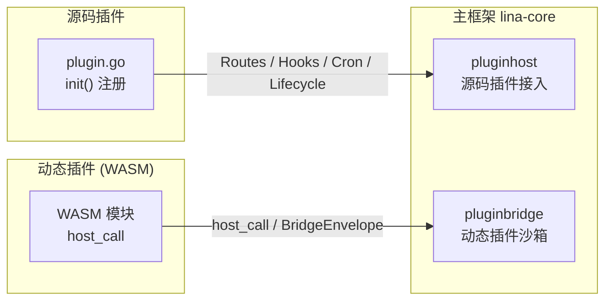
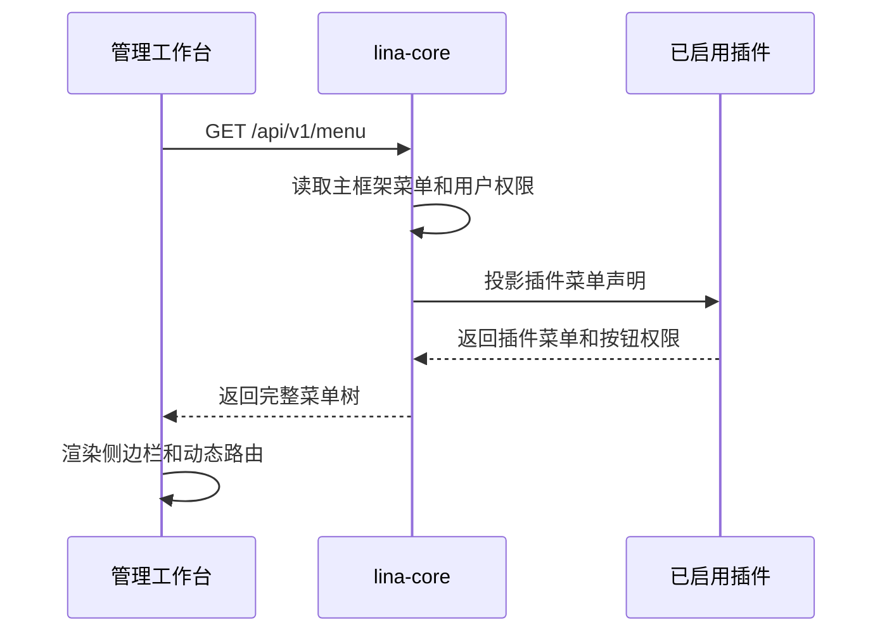

:::warning 注意
由于目前`LinaPro`处于测试阶段，相关的边界设计和实现细节可能会有调整，本文内容仅供参考。
:::

## 设计理念

`LinaPro`在设计之初就确立了一个原则：**主框架只负责轻量级的基础能力和稳定的扩展接口，业务能力尽可能通过插件来扩展实现**。

这一原则背后的出发点是明确的。主框架若承载过多的业务逻辑，会随着业务需求的变化而频繁修改，导致升级成本高、稳定性下降。反过来，将业务能力完全下推到插件，主框架就可以专注于保持稳定的基础设施——认证、授权、多租户、路由调度、定时任务、静态资源、插件生命周期——而这些基础设施一旦稳定，就能长期支撑上层插件的快速迭代。

然而，主框架与插件之间并非完全隔离，协作本身需要边界与规范。若插件对主框架产生过度依赖，比如直接导入主框架的`internal`包、绕过发布的接口调用私有实现，那么插件就会随主框架内部实现的变动而频繁破坏。反过来，若主框架为迁就某个特定插件而暴露专用接口，插件与主框架之间就产生了不必要的耦合，损害了整个系统的可维护性。


`LinaPro`通过以下方式在主框架和插件之间建立清晰的协作边界：

- **源码插件通过`pluginhost`契约接入**：`pluginhost`包定义的所有接口是主框架对源码插件的稳定承诺，源码插件只能通过这些接口使用主框架能力，不能直接导入主框架的`internal/`目录（内部实现逻辑）。
- **动态插件通过`pluginbridge`沙箱通信**：动态插件运行在`WASM`沙箱中，通过`host_call`机制调用主框架服务，主框架按安装时确认的`hostServices`授权快照校验所有调用的边界。
- **主框架提供通用基础能力，不为特定业务场景定制接口**：`pluginhost`暴露的是认证、租户、配置、缓存、通知等通用服务适配器，而非特定的业务域接口，插件在这些通用基础之上自行实现业务逻辑。

这种设计让主框架的稳定性和插件的灵活性同时成立，两者在明确划定的边界上协作，而非相互渗透。

## 主框架能力设计

主框架`lina-core`提供的基础能力可以分为两类：**基础设施能力**和**插件扩展接口**。

### 基础设施能力

基础设施能力面向整个运行时环境，不针对任何特定的业务场景或页面设计：

| 能力域 | 说明 |
|--------|------|
| **认证与会话** | `JWT`签发与校验、会话存储、强制登出、会话活跃刷新 |
| **权限管理** | `RBAC`模型、菜单与按钮权限、权限标识校验中间件 |
| **多租户** | 租户解析、租户上下文注入、租户过滤服务 |
| **路由与中间件** | 统一响应序列化、`CORS`、请求体限制、业务上下文注入 |
| **定时任务** | 任务调度、分布式主节点选举、任务执行日志 |
| **静态资源** | 嵌入式前端构建产物、插件资产统一供给入口 |
| **配置管理** | 静态配置读取、运行时配置项 |
| **缓存控制** | 插件粒度的缓存命名空间 |
| **插件治理** | 插件目录扫描、依赖检查、生命周期编排、运行时升级 |

这些能力被封装为稳定的服务适配器，通过`HostServices`接口向插件暴露。主框架不会为某个业务场景单独定义一个专用接口，而是提供可以组合使用的通用原语，由插件在自身逻辑中决定如何使用。

### 插件扩展接口

主框架定义了两套面向插件的稳定扩展接口：



源码插件通过`pluginhost`在编译时注册路由、钩子、定时任务、生命周期回调和治理逻辑；动态插件通过`pluginbridge`在运行时通过沙箱通信访问主框架能力。两套扩展接口在能力范围上虽有所差异，但主框架对两者都是同等透明的治理主体。

## 工作台职责边界

`LinaPro`内置了一个基于`Vue 3 + Vben5`的管理工作台，默认通过`/admin`路由进入。工作台提供了对系统各项模块功能的可视化管理能力，是主框架`API`和插件`API`的标准`UI`表达层。

`/admin`是默认管理工作台的入口边界，而不是整个系统的前端边界。工作台`SPA`的静态资源服务和刷新`fallback`只服务`/admin`及其子路径，不默认占用根路径`/`。因此，根路径、门户页面、插件自管静态资源和其他非保留公开路径可以由源码插件通过代码自行注册；如果没有任何主框架或插件路由匹配，请求应返回未匹配结果，而不是回退到管理工作台`index.html`。

### 工作台入口路由配置

管理工作台入口由主框架静态配置`workspace.basePath`控制，默认值为`/admin`。该配置在启动期生效，用于决定内建工作台`SPA`静态资源和刷新`fallback`绑定到哪个浏览器路径下：

```yaml
workspace:
  basePath: "/admin"
```

在普通单域名部署中，建议保留`/admin`，让根路径和其他公开路径继续留给门户页面、源码插件自管页面或静态资源。若使用独立管理后台域名，也可以把`workspace.basePath`配置为`/`，让整个域名只承载管理工作台。

无论使用哪个入口路径，都不能占用主框架保留命名空间，例如主框架控制面`/api`、统一插件`API`命名空间`/x`、插件公开资产命名空间`/x-assets`以及其他保留路径。修改该配置后，需要让主框架公开配置、前端路由基准和部署入口保持一致。

### 工作台与插件的对接方式

插件通过在`plugin.yaml`中声明`menus`字段，将自身的管理页面接入工作台的导航体系：

```yaml
menus:
  - key: plugin:linapro-demo-source:example
    name: 示例管理
    path: linapro-demo-source-example
    component: system/plugin/dynamic-page
    perms: linapro-demo-source:example:view
    type: M
```

主框架在响应前端菜单请求时，会将已启用插件声明的菜单与内置菜单合并，按当前用户权限过滤后一起返回给工作台。插件禁用后，对应菜单入口会自动从导航中消失，工作台无需为此单独修改代码。



这种机制让插件的管理界面完全由插件自身声明和维护，主框架不感知具体的业务页面内容，只负责菜单数据的聚合与权限过滤。

### 工作台与主框架的职责划分

工作台是主框架的标准`UI`消费者，不是业务逻辑的定义者。主框架提供`API`契约，工作台通过这些契约展示数据和提供操作入口；插件扩展了主框架的`API`，工作台同样通过统一的菜单和动态页壳机制承载插件页面，无需针对每个插件修改前端代码。

开发者可以用自定义前端完全替换内置工作台，只要新的前端遵循主框架公开的`RESTful API`和权限模型，就能使用同一套后端能力。
主框架控制面`API`、统一插件`API`和默认管理工作台是三个独立边界：

| 边界 | 默认路径 | 说明 |
|------|----------|------|
| 主框架控制面`API` | `/api/v1/...` | 主框架内建系统治理、用户、权限、配置等控制面接口 |
| 统一插件`API` | `/x/{plugin-id}/...` | 插件`API`命名空间，后续路径段由插件自行组织 |
| 默认管理工作台 | `http://localhost:5666/admin` | 本地开发默认工作台地址，不是主框架`API`路由 |

## 插件能力边界

### 动态路由

两种插件在路由注册能力上存在明确的设计差异，但它们的插件`API`都必须进入同一个主框架保留命名空间：

```text
/x/{plugin-id}/...
```

这里的`/x`表示统一插件`API`命名空间，`{plugin-id}`用于隔离不同插件，后续路径段由插件自行定义。官方插件建议在该命名空间下继续使用`/api/v1`作为版本分组，因此常见公开路径会呈现为`/x/{plugin-id}/api/v1/...`，但主框架强制的是`/x/{plugin-id}`边界，而不是固定的`/api/v1`子路径。

此外，**源码插件**拥有注册非保留`HTTP`路由路径的自由度。插件在`init()`阶段声明路由注册回调，主框架启动时统一触发，插件可以注册`/`、`/portal/...`、`/assets/...`或其他非保留公开路径，用于页面、门户、静态资源、自管`fallback`或其他`HTTP`响应逻辑。这种自由度为源码插件提供了极大的灵活性，但也带来了一个潜在风险：**当多个源码插件注册了相同的路由路径时，路由冲突会导致服务启动失败**。例如多个插件都注册了相同的`GET /`根路由，`HTTP Server`路由器会因路由重复而抛出错误，进程启动中止。

源码插件的插件`API`不是任意选择的公开路径，而是必须使用统一插件`API`命名空间。源码插件`RouteRegistrar`提供`APIPrefix()`方法，返回当前插件在主框架中的插件命名空间：

```text
/x/{plugin-id}
```

:::info 提示
`x`表示`eXtension`，是一个约定的命名空间前缀，表明该路径属于插件扩展的`API`，而非主框架控制面接口。
:::

源码插件对外暴露的业务`API`应挂载在该前缀下。插件可以直接在该前缀下注册接口，也可以按自身需要增加内部版本分组。例如：

```text
/x/linapro-demo-source/api/v1/demo-records
/x/linapro-demo-source/api/v1/demo-records/{id}
```

源码插件不得在`/x`下注册其他插件的路径。为了保持边界清晰，公开页面、门户入口、静态资源或健康检查等非`API`路由不建议放在`/x/{plugin-id}`下；公开页面和自管静态资源应继续使用`/`、`/portal/...`、`/assets/...`或其他非保留路径。

**动态插件**运行在`WASM`沙箱中，无法直接接触`HTTP Server`的路由注册机制。动态插件通过构建期`RegisterRoutes`和`route contract`声明内部`path`、`method`、`access`和`permission`。主框架运行时只拥有`/x/{plugin-id}`前缀，后续路径来自动态插件自己的`route contract`。典型公开路径示例为：

```text
/x/linapro-demo-dynamic/api/v1/demo-records
/x/linapro-demo-dynamic/api/v1/demo-records/{id}
/x/linapro-demo-dynamic/api/v1/backend-summary
```

源码插件请求由源码插件注册的`HTTP Server handler`处理，动态插件请求由主框架根据`route contract`桥接到对应运行时。主框架控制面`API`仍使用`/api/v1/...`；源码插件和动态插件都不应把插件业务接口挂载在主框架控制面命名空间下。

| 插件类型 | 路径约束 | 冲突风险 |
|----------|----------|----------|
| 源码插件`API` | 必须使用`APIPrefix()`返回的`/x/{plugin-id}`命名空间，后续路径由插件定义，建议使用`/api/v1`的版本路由 | 按插件`ID`隔离，不会与其他插件的`/x`命名空间冲突 |
| 源码插件自定义路由 | 可注册非保留路径，例如`/portal/...`或`/assets/...` | 与主框架或其他插件冲突时启动失败 |
| 动态插件`API` | 主框架拼接`/x/{plugin-id}`与契约内部路径，后续路径由插件契约定义，建议使用`/api/v1`的版本路由 | 由主框架按插件`ID`、活动产物和契约隔离 |

### 静态资源

主框架通过`Go Embed`管理自身静态资源，并通过声明式`public_assets`模型为插件托管可公开静态资源。源码插件和动态插件都可以在`plugin.yaml`根字段中声明可公开的资源目录，由主框架统一映射到`/x-assets/{plugin-id}/{version}/...`，例如：

```text
/x-assets/linapro-demo-dynamic/v0.1.0/pages/standalone.html
/x-assets/linapro-demo-dynamic/v0.1.0/css/main.css
```

声明项使用`source`指向插件内相对目录或动态`artifact frontend asset`前缀，使用可选`mount`指定它在`/x-assets/{plugin-id}/{version}/`下的相对挂载位置，使用可选`index`指定访问挂载目录本身时返回的默认文件。`mount`为空或`/`时，声明目录内文件直接挂载到版本根路径；`index`为空时默认使用`index.html`。

```yaml
public_assets:
  # source 指向插件内需要公开的资源目录。
  - source: frontend/public
    # mount 为资源在 /x-assets/{plugin-id}/{version}/ 下的挂载路径；
    # / 表示直接挂到版本根路径。
    mount: /
    # index 是访问挂载目录本身时使用的默认文件；省略时为 index.html。
    index: index.html
  # 也可以把另一组资源挂到子路径下，便于页面、样式等资源分组管理。
  - source: frontend/pages
    mount: pages
    index: standalone.html
```

当源码插件通过`plugin.Assets().UseEmbeddedFiles(...)`注册`embedded filesystem`时，主框架只从`public_assets`声明的目录读取可公开资源。例如：

| source | mount | 插件内文件示例 | 映射后的公开路径示例 |
|----------|---------|-----------|-----------------|
| `frontend/public` | `/` | `frontend/public/logo.png` | `/x-assets/{plugin-id}/{version}/logo.png` |
| `frontend/pages` | `pages` | `frontend/pages/standalone.html` | `/x-assets/{plugin-id}/{version}/pages/standalone.html` |

未声明目录中的文件不会因为存在于`embedded filesystem`中而被公开。

动态插件的`frontend assets`也必须迁移到同一声明式模型。主框架不再因为动态`artifact`中存在`frontend asset`就默认公开它，只有匹配`public_assets`声明的`asset`集合才会通过`/x-assets/{plugin-id}/{version}/...`返回。

`/x-assets`是可选托管入口，而不是源码插件公开前端强制性的唯一入口。源码插件仍然可以通过自己的`HTTP`路由返回页面、文件流、静态资源或`SPA fallback`；这些路由由插件代码闭环维护，主框架不会从`public_assets`反推出`HTTP`路由，也不会从`HTTP`路由反推出资源目录。

对于动态插件，管理工作台菜单可以引用`/x-assets`中的托管资源，但菜单路径不会直接成为工作台路由。当前内嵌挂载模式通常使用`component: system/plugin/dynamic-page`，菜单`path`指向`.js`或`.mjs`入口，并在`query`中声明`pluginAccessMode: embedded-mount`；主框架会把该托管资源地址作为`embeddedSrc`传给动态页壳。

```yaml
menus:
  - key: plugin:linapro-demo-dynamic:main-entry
    name: 动态插件示例
    path: /x-assets/linapro-demo-dynamic/v0.1.0/mount.js
    component: system/plugin/dynamic-page
    perms: linapro-demo-dynamic:view
    type: M
    query:
      pluginAccessMode: embedded-mount
```

此外，虽然插件也可以通过动态路由的方式自行暴露静态资源访问接口，但**不推荐**这种做法。主框架统一的静态资源入口提供了以下治理能力，自行实现会产生重复逻辑：

| 主框架统一治理能力 | 自行实现时的问题 |
|-----------------|-----------------|
| 插件启用状态联动（禁用时自动`404`） | 需自行实现启用状态检查 |
| `MIME`类型自动派生 | 需自行维护`Content-Type`映射 |
| 内存缓存与按需供给 | 需自行实现缓存机制 |
| 版本路径隔离（`/{version}/...`） | 需自行设计版本管理策略 |
| 与主框架资产路由优先级规则一致 | 可能与主框架路由顺序冲突 |

`public_assets`是插件作者的显式发布授权边界，只要声明指向插件自有资源集合中的真实目录或动态产物前端资源前缀，主框架就按普通公开静态资源处理。也正因为如此，插件作者必须只声明确实适合匿名访问的文件，不要把治理元数据、安装脚本、私密配置、租户专属文件或用户专属文件放入`public_assets`。

主框架会对声明执行严格路径校验，以下配置会被拒绝：

| 无效配置 | 原因 |
|----------|------|
| 空`source` | 无法形成明确发布边界 |
| 绝对路径或`URL` | 可能越过插件资源集合 |
| 规范化后包含`../`路径穿越的路径 | 可能越过声明目录或插件根目录 |
| 包含通配符、查询串或片段的路径 | 无法稳定映射为静态资源目录 |
| 重复或互相覆盖的`mount` | 会造成同一访问路径对应多个来源 |
| 不存在的`source` | 源码插件目录或动态产物前端资源前缀必须真实存在 |
| 符号链接逃逸插件根目录 | 可能读取插件外部文件 |
| 非文件名形式的`index` | 目录默认文件必须是安全的相对文件名 |

`public asset URL`以`{plugin-id, version}`作为缓存边界。同一个插件版本下的`public asset`内容必须保持稳定；如果资源内容变化，插件需要升级`plugin.yaml`版本，或引入等价的内容版本机制。插件未安装、未启用或当前租户不可用时，`/x-assets/{plugin-id}/{version}/...`默认返回`404`。动态插件可以在保持插件启用的前提下继续服务已安装或当前激活的版本化资源；源码插件则从当前编译进主框架的插件资源或插件目录中解析声明资源。

### 基础能力

主框架将基础能力通过稳定的服务适配器接口向插件暴露，插件只需调用这些接口，无需了解主框架内部实现。

**源码插件**通过`HostServices`接口访问主框架基础能力，该接口由`pluginhost.HTTPRegistrar`和`pluginhost.CronRegistrar`统一提供，例如：

```go
func registerRoutes(ctx context.Context, registrar pluginhost.HTTPRegistrar) error {
    svc := registrar.HostServices()
    // 使用主框架提供的 i18n、租户过滤、缓存等能力
    _ = svc.I18n()
    _ = svc.TenantFilter()
    _ = svc.Cache()
    _ = svc.Config()
    _ = svc.HostConfig()
    _ = svc.Manifest()
    _ = svc.Notify()
    // ...
    return nil
}
```

当前`HostServices`已覆盖以下服务域：

| 服务 | 能力 |
|------|------|
| `APIDoc()` | 接口文档本地化适配器 |
| `Auth()` | 租户认证适配器 |
| `BizCtx()` | 业务上下文适配器 |
| `Cache()` | 插件粒度缓存适配器 |
| `Config()` | 当前插件自己的静态配置读取适配器，只读取插件作用域配置，不回退扫描宿主完整配置树 |
| `HostConfig()` | 宿主公开配置读取适配器，仅暴露白名单键，例如`workspace.basePath`、`i18n.default`、`i18n.enabled` |
| `I18n()` | 运行时翻译适配器 |
| `Manifest()` | 当前插件`manifest/`声明资源读取适配器，用于读取`metadata.yaml`等非`config`、`sql`、`i18n`专用目录资源 |
| `Notify()` | 通知发送适配器 |
| `PluginState()` | 插件启用状态适配器 |
| `PluginLifecycle()` | 插件生命周期编排适配器 |
| `Route()` | 动态路由元数据适配器 |
| `Session()` | 在线会话适配器 |
| `TenantFilter()` | 租户过滤适配器 |

**动态插件**通过`pluginbridge`暴露的`host_call`机制访问主框架能力，所有调用都经过授权快照校验。动态插件在`plugin.yaml`中声明`hostServices`申请所需的服务和方法，主框架安装时记录这份授权快照，运行时对每次`host_call`按快照校验服务、方法和资源边界：

```yaml
hostServices:
  - service: data
    methods: [list, get, create, update, delete]
    resources:
      tables:
        - plugin_demo_dynamic_record
  - service: cache
    methods: [get, set, delete]
  - service: runtime
    methods: [log.write, info.uuid, info.now]
  - service: config
    methods: [get]
  - service: hostConfig
    methods: [get]
    resources:
      keys:
        - workspace.basePath
        - i18n.default
  - service: manifest
    methods: [get]
    resources:
      paths:
        - metadata.yaml
```

当前动态插件可申请的主框架服务能力包括：

| 服务 | 能力 |
|------|------|
| `runtime` | 运行时日志、插件作用域运行时状态读取、写入和删除，以及主框架时间、`UUID`、节点信息等运行时信息 |
| `cron` | 动态插件定时任务注册 |
| `storage` | 受授权路径约束的文件写入、读取、删除、列表和元信息查询 |
| `network` | 受授权`URL`模式约束的出站`HTTP`请求 |
| `data` | 受授权数据表约束的列表、详情、创建、更新、删除和事务操作 |
| `cache` | 插件缓存读取、写入、删除、自增和过期时间调整 |
| `lock` | 分布式锁获取、续期和释放 |
| `notify` | 消息通知发送 |
| `config` | 只读读取当前插件自己的配置；动态插件清单只声明`methods: [get]`，类型化读取是`SDK`便捷方法 |
| `hostConfig` | 只读读取宿主公开配置白名单键；必须通过`resources.keys`声明可读键 |
| `manifest` | 只读读取插件`manifest/`声明资源；必须通过`resources.paths`声明可读路径 |

其中，`storage`通过`paths`限定可访问路径，`data`通过`tables`限定可访问数据表，`network`通过资源声明限定可访问的`URL`模式，`hostConfig`通过`keys`限定宿主公开配置键，`manifest`通过`paths`限定插件声明资源路径；其他服务继续按`methods`控制可调用方法。

主框架的基础能力会随版本迭代持续扩充，插件可以根据实际需要选择性地使用这些能力，无需感知主框架内部服务的具体实现。

## 门户路由与管理路由的区分

插件在实现业务能力时，通常需要同时提供两类接口：面向前台用户的**门户路由**（数据面），以及面向管理后台的**管理路由**（管控面）。两者在访问主体、权限模型和接口语义上都存在明显差异。

| 维度 | 门户路由（数据面） | 管理路由（管控面） |
|------|-------------------|-------------------|
| **访问主体** | 前台用户、匿名访客 | 管理员、后台运维 |
| **认证要求** | 可公开或按需登录 | 通常需要登录和权限 |
| **接口语义** | 内容查看、业务操作 | 数据管理、配置变更 |
| **菜单挂载** | 不一定挂载到工作台 | 通常通过工作台菜单访问 |

主框架不感知插件内部的路由分组逻辑，不负责插件路由的管控面与数据面区分。插件完全自行管理路由的内部分组，通过路由子组在插件内部区分维护。需要注意的是，`/x/{plugin-id}`只承载插件`API`命名空间；门户`API`和管理`API`可以直接放在`/x/{plugin-id}/portal/...`与`/x/{plugin-id}/admin/...`等插件自定义子路径下。如果插件自行增加版本分组，它也只是插件后续路径的一部分，不是主框架强制前缀。源码插件的公开页面、门户入口、静态资源或自管`fallback`不属于插件`API`，应继续使用`/portal/*`、`/assets/*`等非保留路径。以下是源码插件同时注册公开门户入口、门户`API`和管理`API`的示例：

```go
func registerRoutes(ctx context.Context, registrar pluginhost.HTTPRegistrar) error {
    var (
        routes      = registrar.Routes()
        middlewares = routes.Middlewares()
        apiPrefix   = routes.APIPrefix()
    )
    // 插件 API：源码插件和动态插件都必须进入 /x/{plugin-id} 命名空间。
    // 这里把 /api/v1 作为插件内部 API 版本分组。
    routes.Group(apiPrefix, func(group pluginhost.RouteGroup) {
        group.Group("/api/v1", func(group pluginhost.RouteGroup) {
        group.Middleware(
            middlewares.NeverDoneCtx(),
            middlewares.HandlerResponse(),
            middlewares.CORS(),
            middlewares.RequestBodyLimit(),
            middlewares.Ctx(),
        )

        // 门户 API（数据面）：面向前台用户，部分接口可匿名访问。
        // 完整路径示例：/x/my-plugin/api/v1/portal/articles。
        group.Group("/portal", func(group pluginhost.RouteGroup) {
            // 公开接口：无需登录
            group.Bind(
                portalArticleCtrl,
            )
            // 登录接口：需要认证但不限管理权限
            group.Group("/", func(group pluginhost.RouteGroup) {
                group.Middleware(
                    middlewares.Auth(),
                )
                group.POST("/comments", commentCtrl.Create)
            })
        })

        // 管理 API（管控面）：面向管理后台，需要完整的认证和权限校验。
        // 完整路径示例：/x/my-plugin/api/v1/admin/articles。
        group.Group("/admin", func(group pluginhost.RouteGroup) {
            group.Middleware(
                middlewares.Auth(),
                middlewares.Tenancy(),
                middlewares.Permission(),
            )
            group.Bind(
                adminArticleCtrl,
                adminCommentCtrl,
            )
        })
    })

    // 公开门户入口：插件自管的页面、静态资源或 SPA fallback。
    // 这类路由不属于插件 API，不进入 /x，也不会自动投影为菜单、权限或 OpenAPI。
    routes.Group("/portal", func(group pluginhost.RouteGroup) {
        group.Middleware(
            middlewares.NeverDoneCtx(),
            middlewares.CORS(),
            middlewares.RequestBodyLimit(),
        )
        group.Bind(
            portalPageCtrl,
            portalAssetCtrl,
        )
    })

    return nil
}
```

这段示例中，`/portal`是插件自管的公开门户入口，`/x/my-plugin/api/v1/portal/articles`是插件门户`API`，`/x/my-plugin/api/v1/admin/articles`是插件管理`API`。管理工作台只通过`plugin.yaml`的`menus`感知插件贡献的菜单入口，不能因为插件注册了`HTTP`路由就自动生成工作台路由、菜单或权限节点。管理`API`对应的接口权限标识通过`g.Meta`的`permission`字段声明，并在`plugin.yaml`的`menus`中配置对应的菜单入口和权限项，最终通过工作台的扩展中心展示给管理员：

```go
// 管理接口 DTO 示例
type ArticleAdminListReq struct {
    g.Meta   `path:"/articles" method:"get" tags:"My Plugin Admin" summary:"List admin articles" permission:"my-plugin:article:view"`
    Page     int `json:"page"`
    PageSize int `json:"pageSize"`
}
```

## 边界设计的延伸意义

主框架与各个组件的职能边界设计不仅关乎当前的功能划分，也影响整个生态的长期演进方式。

- **对主框架而言**，稳定的扩展接口意味着内部实现可以安全地演进——主框架可以重构`HostServices`的具体实现、优化插件治理流程、扩展新的基础能力，只要`pluginhost`和`pluginbridge`的公开契约保持稳定，所有已有插件就不会受到影响。

- **对插件开发者而言**，明确的边界意味着可以放心地使用主框架提供的基础能力，无需了解其内部实现，也不必担心未来版本的主框架升级会破坏插件逻辑——只要插件严格通过稳定契约与主框架协作，版本兼容性就由主框架的接口稳定性来保障。

- **对系统整体而言**，这种分层架构让不同团队可以独立维护主框架和各自的插件，减少了协作摩擦，也为将来引入更多插件类型或扩展治理能力保留了充足的空间。
