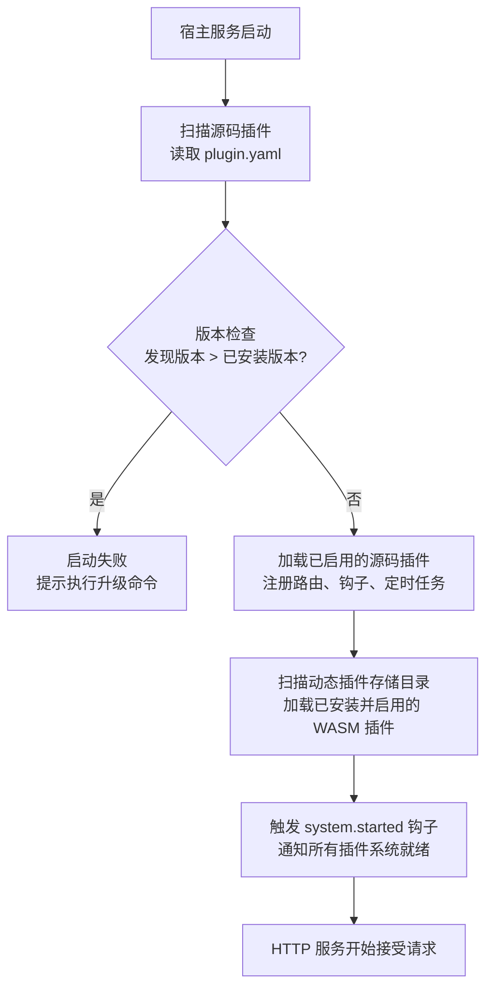

## 概述

`lina-core`是`LinaPro`框架的核心宿主服务，基于`Go`语言构建。它是整个系统的稳定地基，承担所有通用平台能力，同时为插件提供运行时环境和稳定的扩展接缝。

宿主的核心设计原则是：**只提供通用能力，不包含具体业务逻辑**。所有业务功能都通过插件机制扩展，宿主本身保持简洁和稳定。

## 目录结构

```text
apps/lina-core/
├── api/                     API DTO 与路由契约
│   ├── auth/                认证相关接口定义
│   ├── config/              系统参数接口定义
│   ├── i18n/                国际化接口定义
│   ├── job/                 定时任务接口定义
│   ├── menu/                菜单管理接口定义
│   ├── plugin/              插件治理接口定义
│   ├── role/                角色管理接口定义
│   ├── user/                用户管理接口定义
│   └── ...                  其他接口定义
├── internal/
│   ├── cmd/                 服务启动与路由注册
│   ├── controller/          HTTP 控制器
│   └── service/             业务服务层
│       ├── apidoc/          接口文档聚合
│       ├── auth/            认证服务
│       ├── cron/            定时任务启动入口
│       ├── i18n/            国际化运行时
│       ├── middleware/      HTTP 中间件（认证、权限、日志）
│       ├── plugin/          插件生命周期管理
│       └── ...              其他业务服务
├── manifest/
│   ├── config/              运行时配置文件模板
│   ├── sql/                 DDL + Seed 数据
│   └── i18n/                宿主运行时语言包
└── pkg/                     宿主与插件共享的稳定公共包
    ├── pluginhost/          插件扩展接缝定义
    ├── pluginbridge/        动态插件桥接层
    └── ...                  其他公共工具包
```

## API 接口层

宿主`API`层使用`g.Meta`结构体标签定义路由契约和`DTO`（数据传输对象）。每个接口的路径、方法、权限标识、国际化`Key`和文档说明都声明在`api/`目录下的`Go`结构体中。

这种声明式的接口定义方式带来以下好处：

- **权限天然可见可审计**：权限标识直接标注在接口定义上，一处修改全局生效
- **自动生成接口文档**：宿主在启动时扫描所有接口定义，自动生成`OpenAPI`格式的接口文档
- **插件接口自动聚合**：插件注册的路由同样遵循这套机制，所有接口统一呈现在接口文档中

## 治理服务

### 认证服务（JWT）

宿主提供基于`JWT`的无状态认证机制：

- 登录成功后颁发`Token`，有效期通过`jwt.expire`配置
- 每次请求携带`Token`，宿主验证有效性和权限
- 支持`Token`刷新，避免频繁重新登录
- 会话管理与`JWT`协作，支持强制下线特定用户

### 权限控制（RBAC）

`LinaPro`采用声明式`RBAC`权限体系：

- 权限标识通过`API`定义层的结构体标签声明（如`perm:"user:list"`）
- 角色管理页面可以为角色分配菜单权限和按钮权限
- 权限拓扑缓存在`KV`缓存中，变更后毫秒级生效，无需用户重新登录
- 操作日志自动记录所有写操作，包含请求参数（自动脱敏）和操作结果

### 会话管理

- 记录每个活跃会话的 `IP` 地址、设备信息、登录时间
- 支持管理员强制下线指定用户（由 `monitor-online` 插件提供 `UI`）
- 会话无活动超时通过 `session.timeout` 配置
- 定期清理过期会话（`session.cleanupInterval` 配置）


## 插件运行时

宿主在启动时依次完成以下插件加载流程：



**插件隔离机制：**

- 每个插件的数据库表以插件`ID`作为命名空间前缀，避免与宿主表和其他插件表冲突
- 每个插件的文件存储路径以插件`ID`作为命名空间，如`temp/upload/<plugin-id>/`
- 动态插件在`WASM`沙箱中运行，对宿主文件系统和网络的访问通过受治理的宿主服务桥接

## 扩展接缝（Extension Points）

宿主通过`pkg/pluginhost`包向插件暴露稳定的扩展接缝。插件只能通过这些接缝与宿主交互，永远不直接调用宿主`internal/`包中的函数。

**事件钩子（Hook）：**

| 扩展点 | 触发时机 | 默认执行模式 |
|--------|---------|------------|
| `auth.login.succeeded` | 用户登录成功后 | 阻塞/异步（可配置） |
| `auth.login.failed` | 用户登录失败后 | 阻塞/异步（可配置） |
| `auth.logout.succeeded` | 用户退出登录后 | 阻塞/异步（可配置） |
| `plugin.installed` | 动态插件安装后 | 阻塞/异步（可配置） |
| `plugin.enabled` | 插件启用后 | 阻塞/异步（可配置） |
| `plugin.disabled` | 插件禁用后 | 阻塞/异步（可配置） |
| `plugin.uninstalled` | 动态插件卸载后 | 阻塞/异步（可配置） |
| `system.started` | 宿主`HTTP`服务启动后 | 阻塞/异步（可配置） |

**注册类扩展点（Registrar）：**

| 扩展点 | 用途 | 执行模式 |
|--------|-----|---------|
| `http.route.register` | 插件注册自有`HTTP`路由 | 仅阻塞 |
| `cron.register` | 插件注册自有定时任务 | 仅阻塞 |
| `menu.filter` | 插件过滤或修改宿主菜单树 | 仅阻塞 |
| `permission.filter` | 插件过滤或修改宿主权限列表 | 仅阻塞 |

## 定时调度子系统

宿主内置了持久化的定时调度子系统，支持通过管理工作台配置和管理`Cron`任务：

- **任务管理**：在数据库中持久化任务配置，支持`Cron`表达式、立即触发、暂停恢复
- **执行日志**：记录每次任务执行的结果、耗时和异常信息
- **`Shell`执行**：支持通过`Shell`命令类型执行任意脚本，带超时控制和输出截断
- **插件任务**：插件可以通过`cron.register`扩展点注册自有的定时任务处理器

## 国际化运行时

宿主提供完整的`I18N`运行时，支持动态切换语言：

- 宿主运行时语言包位于`manifest/i18n/<locale>/`目录下，按语义域分文件维护
- 插件语言包位于各插件的`manifest/i18n/<locale>/`目录下，启用插件后自动合并
- 接口文档的多语言翻译位于`manifest/i18n/<locale>/apidoc/`目录下
- 通过`i18n.enabled`配置控制是否开启多语言，关闭时前端隐藏语言切换按钮

详见[I18N国际化](/docs/i18n)。

## 接口文档聚合

宿主提供内置的接口文档聚合能力，在启动时自动扫描宿主和所有已启用插件的接口定义，生成统一的`OpenAPI`格式文档：

- 访问地址：`http://localhost:8080/api.json`
- 管理工作台入口：「开发中心 → 接口文档」
- 接口文档支持在线调试和参数测试

详见[接口文档](/docs/api-docs)。

## 健康探针

宿主提供`/health`端点供负载均衡和编排平台（如`Kubernetes`）进行存活检查：

- 检查项：数据库连接可用性
- 超时配置：`health.timeout`
- 响应格式：标准`HTTP`状态码（`200`正常，`503`异常）
