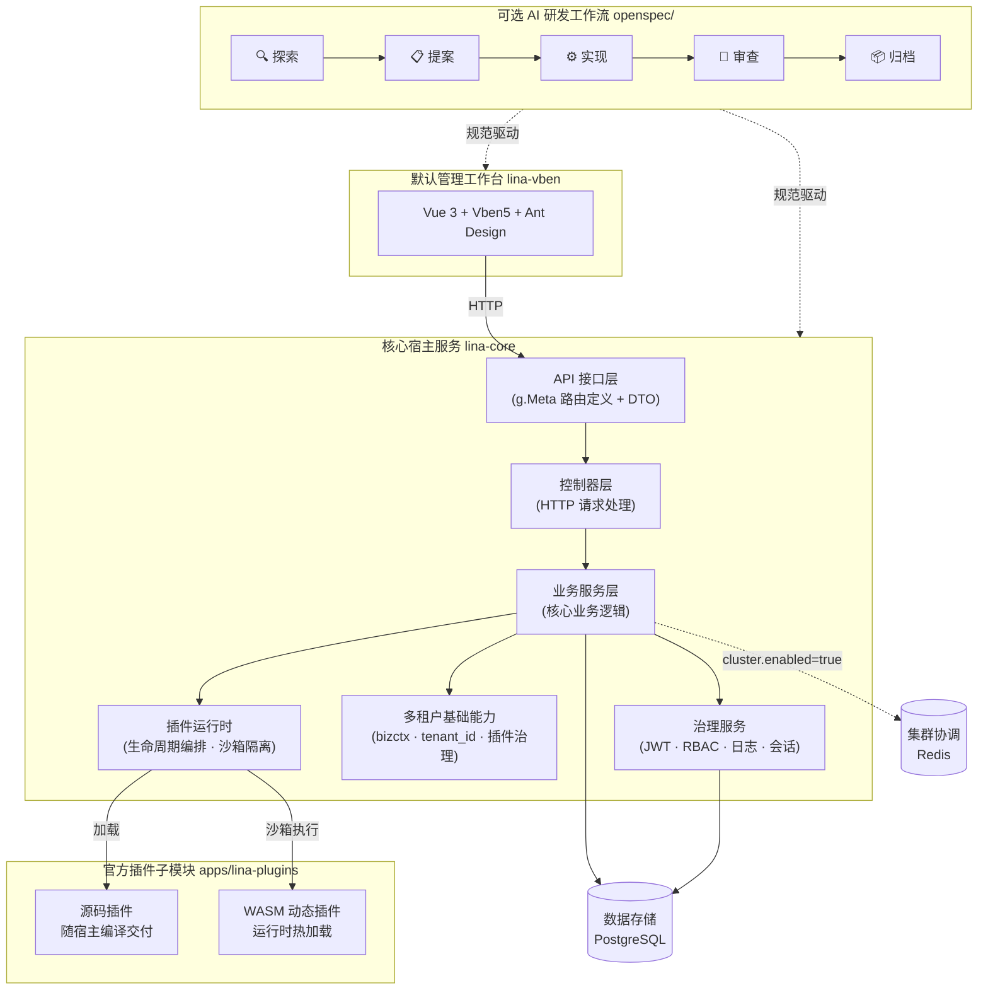
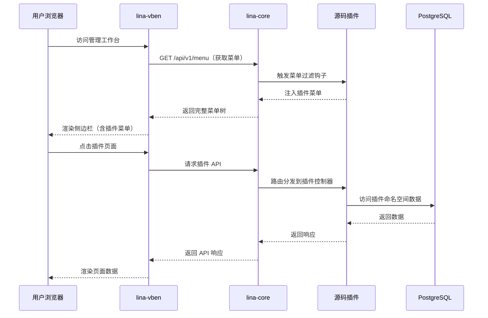
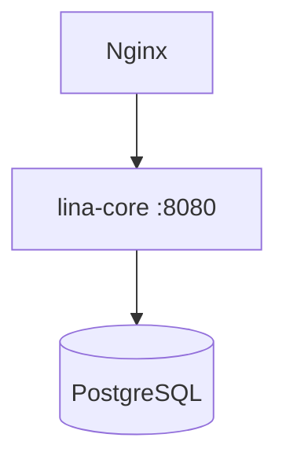
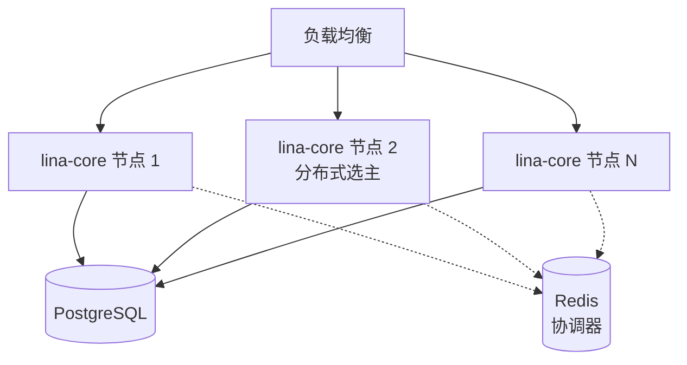

## 架构总览

`LinaPro`采用分层解耦的架构模型，每一层都遵循松耦合原则独立设计，层与层之间通过定义良好的接口协作，而不是硬依赖内部实现。关键的层级组件包括：



## 目录结构

```text
/                                   
├── AGENTS.md                         # AI 智能体协作规范
├── hack/                             # 开发工具脚本
├── apps/                             # 应用管理
│    ├── lina-core/                   # 核心宿主服务（Go）
│    ├── lina-vben/                   # 默认管理工作台（Vue 3）
│    └── lina-plugins/                # 官方插件子模块（按需初始化）
└── openspec/                         # 可选 AI 研发工作流
```

## 核心宿主服务（lina-core）

`lina-core`是框架的稳定地基，基于`Go`语言构建，承担所有通用平台能力。宿主服务不了解具体的业务域，只提供通用的基础设施。

**主要职责：**

- 提供系统管理、插件治理、用户认证、权限控制等`RESTful API`
- 拥有数据库迁移脚本、初始化数据和运行时配置
- 加载和管理源码插件及`WASM`动态插件的完整生命周期
- 运行宿主级定时任务和持久化定时调度子系统
- 提供国际化运行时，聚合宿主和插件的语言资源
- 提供多租户请求上下文、租户过滤和插件租户治理所需的稳定基础能力


## 默认管理工作台（lina-vben）

`lina-vben`是`lina-core`的标准消费者，基于`Vue 3 + Vben5 + Ant Design Vue`构建。工作台本身没有业务逻辑，它只是宿主`API`和插件`API`的`UI`表达层。

**关键特点：**

- 与宿主在接口契约、权限模型和设计规范上完全对齐
- 插件菜单通过宿主动态路由自动注入，无需修改工作台代码
- 开发者可以通过插件机制替换任意模块，甚至替换整个工作台

## 官方插件子模块（apps/lina-plugins）

插件层是`LinaPro`扩展能力的核心，支持两种截然不同的插件交付模式。宿主通过`pluginhost`包暴露稳定的扩展接缝，插件只能通过这些接缝与宿主交互，永远不直接访问宿主内部实现。

官方插件目录`apps/lina-plugins/`以`Git submodule`形式独立维护，远端仓库为`https://github.com/linaproai/official-plugins.git`。主框架仓库默认保持精简轻量，用户根据需要通过`git submodule update --init --recursive`按需拉取官方插件内容。未初始化该子模块时，宿主仍可按`host-only`模式运行；存在插件清单时，开发、构建和镜像命令会自动进入插件完整模式，也可以通过`plugins=0`强制宿主模式。

详见[双模式插件系统](/docs/plugin-system)。

## AI 研发工作流

`AI`研发工作流凌驾于所有层次之上，它是让规范、代码与测试保持同步的连接纽带。工作流不直接属于任何运行时组件，而是作为治理机制约束整个开发过程。`OpenSpec`不是`LinaPro`运行时依赖，项目不安装它也可以运行；但框架内置了对`OpenSpec`目录结构、指令和技能的良好支持，强烈建议在正式团队协作中安装并使用。

详见[AI规范驱动开发](/docs/spec-driven-development)。

## AI 技能体系（.agents/skills/）

`LinaPro`内置了覆盖研发全生命周期的`AI`专属技能，以领域知识的形式内嵌于框架的`AI`协作规范（`.agents/skills/`）中。这些技能不属于任何运行时组件，但它们是`AI`工具在每个具体工作场景下做出符合框架约束的专业决策的依据。

技能涵盖前端设计、前端工程模式、`Git`提交与工作树管理、`OpenSpec`探索/提案/实施/归档、反馈闭环、代码审查、`E2E`测试、性能审计、自动归档和浏览器自动化等场景。项目内置技能随源码自动加载；`OpenSpec CLI`、`goframe-v2`、`find-skills`等外部技能或工具按需安装。

详见[AI原生设计](/docs/ai-native)。

## 分层边界原则

理解以下边界原则，有助于避免常见的架构错误：

### 宿主不了解业务域

`lina-core`不包含任何具体的业务逻辑（如产品管理、订单管理等），这些能力在理想情况下是通过插件提供，而宿主只提供稳定的通用基础设施。多租户上下文、权限、会话、插件治理和调度属于宿主基础能力，不代表宿主直接承载具体业务域。

### 插件不修改宿主内部

插件通过`pluginhost`包暴露的稳定接口（路由注册、事件钩子、菜单过滤、权限过滤）与宿主协作。插件不直接调用宿主的`internal/`包，不直接访问宿主的数据库表。

### 宿主拥有顶级菜单目录

宿主拥有稳定的顶级菜单目录键（`dashboard`、`iam`、`setting`、`scheduler`、`extension`、`developer`），插件菜单只能挂载在宿主已发布的目录下或插件自己的菜单树中。

### 工作台是消费者，不是定义者

`lina-vben`消费宿主的`API`和插件的`API`，但不定义它们的行为。工作台的`UI`变化不应该影响后端行为，后端的`API`变化通过接口契约文档传达给工作台。

## 数据交互



## 部署模型

`LinaPro`支持两种部署模式，可以根据业务规模随时切换。无论单机还是集群，默认数据存储都是`PostgreSQL 14+`；`SQLite`仅适合单节点本地演示或冒烟验证。

### 单机模式（默认）



适合开发环境和小规模生产部署，配置简单，资源占用低。

### 集群模式



集群模式通过配置`cluster.enabled: true`启用，当前版本必须同时配置`cluster.coordination: redis`和可连通的`cluster.redis`端点。`PostgreSQL`负责持久化业务与治理数据，`Redis`协调器负责选主、分布式锁、热态会话和集群感知缓存等跨节点协调能力，无需修改业务代码。详见[原生分布式架构](/docs/distributed-architecture)。

## 相关文档

import DocCardList from '@theme/DocCardList';

<DocCardList />
