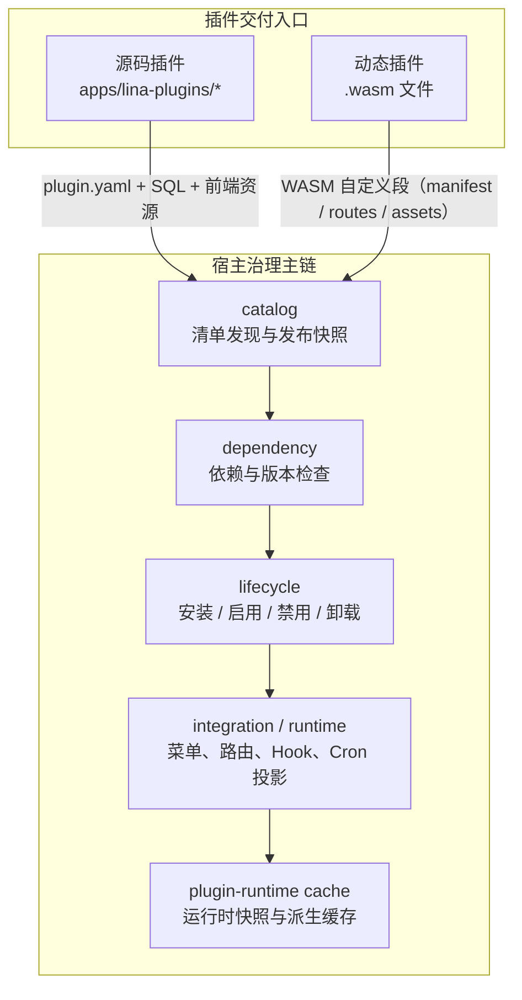
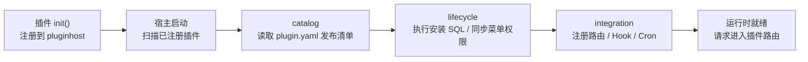
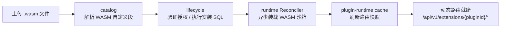
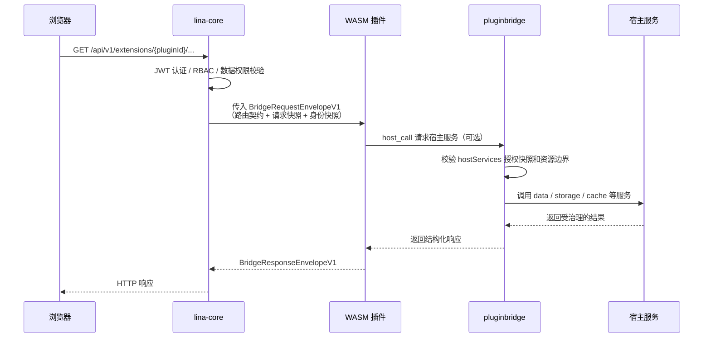
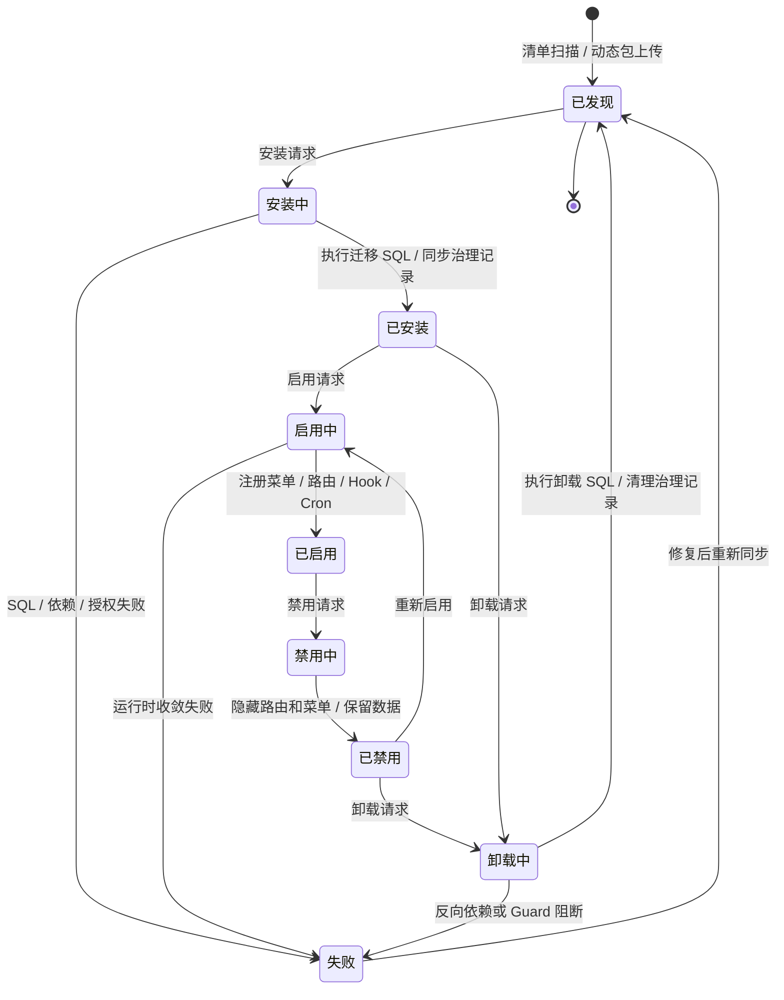

## 概述

插件系统是`LinaPro`实现业务扩展的核心机制。每个插件都是一个**自包含的功能模块**，可以独立声明`API`路由、业务服务、数据库表结构、前端页面和菜单项，**无需修改宿主代码**。

`LinaPro`提供两种插件交付模式：**源码插件**随宿主一起编译打包，与主框架共享完整的工具链和开发体验；**`WASM`动态插件**以独立`.wasm`文件形式在运行时热加载，无需重启宿主或重新编译主框架。两种模式共享同一套插件治理面，只是在运行形态和宿主能力访问方式上有所不同。

## 设计理念

### 为什么需要双模式

单一的插件交付方式很难同时满足研发效率、部署灵活性和安全性这三个维度的要求：

- **仅有源码插件**：所有业务功能需要一起编译，引入新插件或修复紧急问题都需要重新构建和重启整个服务，对生产环境影响面大，且商业化分发必须暴露源码。
- **仅有动态插件**：`WASM`沙箱的运行时开销在高吞吐场景下不可忽视，跨语言的`ABI`协议也增加了普通业务功能的开发复杂度，让大多数功能的迭代成本变高。

双模式设计让开发者可以根据实际场景选择最合适的交付方式：**长期业务功能首选源码插件**，获得最佳的开发体验和运行性能；**热修复、临时功能或需要保护源码的商业分发**则选用动态插件，实现不停机上线。

### 统一治理面

两种模式虽然在交付形态上不同，但在宿主侧共享同一套治理主链：

- 同一套`plugin.yaml`清单规范，同一套依赖检查、生命周期状态机和数据库治理记录
- 同一套隔离机制：数据库命名空间、文件存储命名空间、租户过滤接缝
- 同一套多租户策略：`scope_nature`、`supports_multi_tenant`、`default_install_mode`字段

无论插件以哪种方式交付，管理端看到的行为、API 接口和数据隔离保证都完全一致。

## 整体架构

插件系统的核心不只是"扫描插件目录并注册路由"，而是一条完整的治理主链：从清单发现、依赖检查，到生命周期编排、运行时收敛，再到宿主服务授权。

下图展示了插件从交付入口进入宿主治理主链的完整过程：



主链中各关键组件的职责：

| 组件 | 职责 |
|------|------|
| `catalog` | 将`plugin.yaml`或`WASM`自定义段转换为宿主可审查的清单与发布快照，写入`sys_plugin_release` |
| `dependency` | 检查框架版本范围、插件间依赖满足情况，以及是否存在循环依赖 |
| `lifecycle` | 负责状态转换（安装/启用/禁用/卸载）和迁移`SQL`执行；动态插件的运行态由`runtime Reconciler`最终收敛 |
| `integration` | 将已启用插件的菜单、权限、路由、钩子、定时任务同步到宿主运行时 |
| `plugin-runtime cache` | 维护启用插件的快照和派生缓存，供请求路径低延迟读取 |

### 两种模式对比

| 维度 | 源码插件 | `WASM`动态插件 |
|------|---------|--------------|
| **交付方式** | 随宿主一起编译打包 | 独立编译为`.wasm`文件，运行时上传 |
| **热加载** | 不支持，需重启宿主 | 支持，无需重启宿主 |
| **性能** | 原生`Go`性能 | 略低于原生，有沙箱调用开销 |
| **隔离程度** | 命名空间隔离 | 完整`WASM`沙箱隔离 |
| **宿主服务访问** | 通过`pluginhost.HostServices`和`pluginservice/contract`稳定契约直接调用 | 通过`hostServices`授权快照和`pluginbridge`统一协议访问 |
| **源码可见性** | 与宿主仓库一起管理 | 可只分发二进制，不暴露源码 |
| **适用场景** | 长期业务功能模块 | 热修复、临时功能、商业插件分发 |
| **开发复杂度** | 低，与宿主共享所有工具 | 中，需了解`WASM`构建流程 |

**在大多数场景下推荐优先选择源码插件**。以下情况再考虑动态插件：

- 需要不重启宿主即可上线的热加载能力
- 生产环境紧急热修复，最小化影响范围
- 商业化插件分发，不想对外暴露源码

## 工作原理

### 源码插件工作流程

源码插件以`Go`包的形式与宿主一同编译。插件在`init()`函数中通过`pluginhost.NewSourcePlugin()`创建插件实例，注册路由、事件钩子、定时任务和生命周期回调，最后调用`pluginhost.RegisterSourcePlugin()`完成注册。宿主启动时统一收集所有已注册的源码插件，并在生命周期流程中将它们的能力投影到运行时。



源码插件通过`pkg/pluginhost`暴露的`SourcePlugin`接口与宿主交互，可访问宿主发布的所有稳定服务，包括`TenantFilterService`（租户过滤）、`I18n`（国际化）、`Auth`（认证上下文）等。

### 动态插件工作流程

动态插件被编译为标准`WASM`模块，通过`WASM`自定义段（Custom Section）内嵌清单和路由表。上传到宿主后，`catalog`解析产物，`Reconciler`在后台异步收敛运行状态——将`WASM`模块装载到沙箱，并将路由注册到宿主的动态路由捕获器。



动态插件的所有`HTTP`请求统一由宿主前缀`/api/v1/extensions/{pluginId}/...`接收，宿主完成`JWT`认证、`RBAC`、数据权限校验后，将请求封装为`pluginbridge`协议传入`WASM`沙箱——插件代码永远无法绕过这层校验。

下图展示一次完整的动态插件`API`请求链路：



## 关键组件

### pluginhost

`pkg/pluginhost`是宿主向源码插件暴露的稳定公共包。插件只能通过这个包与宿主交互，严禁直接`import`宿主`internal/`目录下的任何包。

`SourcePlugin`接口提供了六个能力注册入口：

| 接口 | 说明 |
|------|------|
| `Assets()` | 绑定嵌入的前端静态资源（`embed.FS`） |
| `HTTP()` | 注册`HTTP`路由，获取宿主中间件（认证、权限、租户） |
| `Hooks()` | 订阅宿主发布的事件钩子（登录成功、插件安装等） |
| `Cron()` | 注册定时任务，自动感知主节点 |
| `Lifecycle()` | 注册安装前后、卸载、租户开通等生命周期回调 |
| `Governance()` | 声明菜单过滤和权限过滤逻辑 |

宿主通过`HostServices`目录向插件开放稳定的服务契约，包括`TenantFilterService`、`I18n`、`BizCtx`、`Config`、`Notify`、`Session`等。

### pluginbridge

`pkg/pluginbridge`是动态插件的沙箱通信层，定义了宿主与`WASM`模块之间的`ABI`协议。宿主侧负责将认证和授权结果打包为`BridgeRequestEnvelopeV1`，通过线性内存传入`WASM`实例；动态插件通过`pluginbridge`的`Guest`工具包接收请求并返回`BridgeResponseEnvelopeV1`。

动态插件需要导出三个`WASM`函数：

| 导出函数 | 说明 |
|------|------|
| `lina_dynamic_route_alloc(size)` | 宿主调用，分配请求数据缓冲区 |
| `lina_dynamic_route_execute(size)` | 宿主调用，触发请求处理并返回响应指针 |
| `lina_host_call_alloc(size)` | 接收宿主回调响应时分配缓冲区 |

插件需要访问宿主能力时，通过`pluginbridge`发起`host_call`，宿主的`pluginbridge`服务端校验授权快照后决定是否放行。

### plugin-runtime cache

`plugin-runtime cache`维护已启用插件的快照，供请求路径低延迟读取，避免每次请求都回查数据库。当插件状态发生变化（启用、禁用、升级）时，`lifecycle`会发布修订通知，`cache`重新刷新快照并使前端包、`i18n`资源和`WASM`编译缓存失效。

### catalog 与 lifecycle

`catalog`负责将`plugin.yaml`或`WASM`自定义段转换为宿主可审查的清单，写入`sys_plugin_release`表作为发布快照。`lifecycle`则基于快照执行状态转换：

- 安装时执行迁移`SQL`，同步菜单和权限到治理数据库
- 启用时将路由、钩子、定时任务投影到运行时
- 禁用时隐藏路由和菜单，保留数据
- 卸载时执行卸载`SQL`，清理治理记录

动态插件的启用/禁用状态还会通过`desired_state`字段和`generation`计数驱动`Reconciler`异步收敛，确保集群中各节点的`WASM`沙箱状态最终一致。

## 插件清单（plugin.yaml）

每个插件都需要在根目录放置`plugin.yaml`清单文件。宿主通过它识别插件身份、菜单结构、多租户策略和运行时依赖。

```yaml
# 插件唯一标识（kebab-case）
id: content-article

# 插件显示名称
name: 文章管理

# 语义化版本号（semver 格式）
version: v0.1.0

# 插件类型：source（源码插件）或 dynamic（动态插件）
type: source

# 多租户作用域：platform_only 或 tenant_aware
scope_nature: tenant_aware

# 是否支持租户级安装与治理
supports_multi_tenant: true

# 默认安装模式：global 或 tenant_scoped
default_install_mode: tenant_scoped

description: 提供文章内容的增删改查管理功能
author: linapro
license: Apache-2.0

# 插件菜单声明
menus:
  - key: plugin:content-article:list
    name: 文章管理
    path: content-article-list
    component: system/plugin/dynamic-page
    perms: content-article:article:view
    icon: ant-design:file-text-outlined
    type: M     # D=目录，M=菜单项，B=按钮
    sort: 1
```

**声明运行时依赖（可选）**

```yaml
dependencies:
  framework:
    version: ">=0.1.0 <1.0.0"
  plugins:
    - id: plugin-demo-source
      version: ">=0.1.0"
      required: true
      install: auto    # 自动安装缺失的依赖
```

**声明宿主服务权限（动态插件专用）**

动态插件须通过`hostServices`字段提前申请所需的宿主服务和资源边界。宿主在安装或启用时确认授权并写入发布快照，运行时任何未申请的调用都会被`pluginbridge`直接拒绝：

```yaml
hostServices:
  - service: data
    methods: [get, list, mutate, transaction]
    resources:
      tables:
        - content_article_record
  - service: storage
    methods: [get, put, delete, list]
    resources:
      paths:
        - content-article/
  - service: cache
    methods: [get, set, delete, incr, expire]
  - service: network
    methods: [request]
    resources:
      - url: "https://api.example.com"
```

宿主目前支持的`hostServices`服务标识：

| 服务 | 说明 |
|------|------|
| `runtime` | 日志写入、插件级状态读写、时间/UUID/节点信息 |
| `data` | 受治理的数据库读写（带表命名空间和租户过滤） |
| `storage` | 受命名空间约束的文件存储操作 |
| `cache` | 分布式缓存读写 |
| `network` | 对外`HTTP`请求（需声明目标`URL`） |
| `cron` | 动态注册定时任务 |
| `lock` | 分布式锁 |
| `secret` | 敏感配置读取 |
| `event` | 事件发布与订阅 |
| `config` | 插件配置读取 |
| `notify` | 消息通知发送 |

## 插件生命周期

插件状态分为**管理端可见状态**和**宿主内部收敛状态**两个维度。宿主内部通过`desired_state`（期望状态）、`current_state`（当前状态）、`generation`（修订号）和`release_id`（活跃发布）四个字段驱动动态插件的跨节点收敛。



| 状态 | 说明 |
|------|------|
| **已发现** | 宿主扫描到`plugin.yaml`或上传了`.wasm`，但尚未安装 |
| **安装中** | 正在执行依赖检查、授权确认和迁移`SQL` |
| **已安装** | 安装`SQL`已执行并同步治理数据，功能尚未激活 |
| **启用中** | 正在将菜单、路由、钩子投影到运行时，或等待`Reconciler`收敛 |
| **已启用** | 插件功能完全激活，请求可以正常路由到插件 |
| **禁用中** | 正在从运行时撤出路由和菜单 |
| **已禁用** | 路由和菜单已隐藏，数据和数据表完整保留 |
| **卸载中** | 正在执行卸载`SQL`，清理治理记录 |
| **失败** | 生命周期步骤被依赖、`SQL`、授权或`Guard Hook`阻断 |

**禁用 vs. 卸载的区别**

- **禁用**：仅隐藏路由和菜单，插件的数据表和数据完整保留，随时可以重新启用。
- **卸载**：管理端询问是否同时清理插件自有数据。选择清理后执行卸载`SQL`，数据无法找回；选择保留则仅清理治理记录，数据表不动。

## 插件隔离机制

`LinaPro`通过三个维度确保插件之间以及插件与宿主之间相互不干扰。

**数据库命名空间隔离**

每个插件的数据表必须以插件`ID`（`kebab-case`转`snake_case`）作为前缀，避免与宿主或其他插件的表名冲突：

```text
宿主表：sys_user、sys_role、sys_menu
插件表：content_article_record（插件 content-article）
        org_center_dept（插件 org-center）
```

需要支持多租户的插件表应包含`tenant_id`列，并通过宿主发布的`TenantFilterService`追加租户过滤条件。未启用`multi-tenant`插件时，默认`tenant_id = 0`代表平台租户。

**文件存储命名空间隔离**

每个插件的文件存储路径以插件`ID`作为命名空间前缀：

```text
插件文件路径示例：temp/upload/content-article/
```

**`WASM`沙箱隔离**

动态插件在`WASM`沙箱中运行，对宿主能力的访问受到严格约束：

- 数据库访问：通过宿主`data`服务桥接，仅限`hostServices.resources.tables`声明的表
- 文件访问：通过宿主`storage`服务桥接，仅限`hostServices.resources.paths`声明的路径
- 网络访问：通过宿主`network`服务桥接，仅限`hostServices.resources.url`声明的目标
- 运行时信息：通过宿主`runtime`服务桥接获取

运行时任何未在授权快照中声明的调用都会被`pluginbridge`直接拒绝，插件代码无法绕过这层约束。

## 多租户支持

插件清单通过三个字段声明与多租户系统的边界关系：

| 字段 | 可选值 | 说明 |
|------|--------|------|
| `scope_nature` | `platform_only` / `tenant_aware` | 插件是否可进入租户上下文 |
| `supports_multi_tenant` | `true` / `false` | 是否支持租户级安装和数据隔离 |
| `default_install_mode` | `global` / `tenant_scoped` | 默认全局启用，还是按租户独立启停 |

`platform_only`插件（如`multi-tenant`本身）仅在平台上下文治理；`tenant_aware`插件可根据业务需要选择全局启用（所有租户共享一个安装实例，如`org-center`）或按租户独立启停（如`plugin-demo-source`）。详见[多租户能力](/docs/multi-tenant)。

## 宿主与插件的边界规范

**宿主拥有顶级菜单目录**

宿主发布了一组稳定的顶级菜单目录键：`dashboard`、`iam`、`setting`、`scheduler`、`extension`、`developer`。插件菜单必须通过`parent_key`挂载在这些目录下，或使用自己独立的顶级目录键。官方插件的固定挂载点：

| 插件 | 挂载目录 |
|------|---------|
| `org-center` | `org` |
| `content-notice` | `content` |
| 所有`monitor-*`插件 | `monitor` |

**插件不能直接访问宿主内部包**

插件只能通过`pkg/pluginhost`暴露的稳定接口与宿主交互，严禁`import`宿主`internal/`目录下的任何包。宿主内部实现随时可能变化，直接依赖会导致插件在宿主升级后编译失败。

**插件服务逻辑放在`backend/internal/service/`下**

插件后端的所有业务逻辑必须在`backend/internal/service/`目录下实现，不能在插件根目录创建顶层`service/`包，以避免与宿主包命名冲突。

**安装`SQL`必须具备幂等性**

安装`SQL`必须使用`CREATE TABLE IF NOT EXISTS`等幂等语句。因为用户可能在「卸载时选择保留数据」后重新安装，幂等写法确保数据正常复用而不报错。

## 使用方式

### 开发源码插件

源码插件的开发流程与主框架保持一致，核心入口是`backend/plugin.go`：

```go
package backend

import "github.com/linaproai/linapro/apps/lina-core/pkg/pluginhost"

func init() {
    plugin := pluginhost.NewSourcePlugin("my-plugin")

    // 绑定嵌入的前端资源
    plugin.Assets().UseEmbeddedFiles(embeddedFiles)

    // 注册 HTTP 路由
    plugin.HTTP().RegisterRoutes(
        pluginhost.ExtensionPointHTTPRouteRegister,
        pluginhost.CallbackExecutionModeBlocking,
        registerRoutes,
    )

    // 注册事件钩子（异步执行）
    plugin.Hooks().RegisterHook(
        pluginhost.ExtensionPointAuthLoginSucceeded,
        pluginhost.CallbackExecutionModeAsync,
        onLoginSucceeded,
    )

    // 注册定时任务
    plugin.Cron().RegisterCron(
        pluginhost.ExtensionPointCronRegister,
        pluginhost.CallbackExecutionModeBlocking,
        registerCronJobs,
    )

    // 注册生命周期回调
    plugin.Lifecycle().RegisterBeforeInstallHandler(onBeforeInstall)
    plugin.Lifecycle().RegisterAfterInstallHandler(onAfterInstall)
    plugin.Lifecycle().RegisterUninstallHandler(onUninstall)

    pluginhost.RegisterSourcePlugin(plugin)
}
```

路由注册时可以直接使用宿主提供的中间件和服务：

```go
func registerRoutes(ctx context.Context, registrar pluginhost.HTTPRegistrar) error {
    hostServices := registrar.HostServices()
    svc := myservice.New(hostServices.TenantFilter(), hostServices.I18n())

    routes := registrar.Routes()
    middlewares := routes.Middlewares()
    routes.Group("/api/v1", func(group pluginhost.RouteGroup) {
        group.Middleware(
            middlewares.Auth(),
            middlewares.Tenancy(),
            middlewares.Permission(),
        )
        group.Bind(mycontroller.NewV1(svc))
    })
    return nil
}
```

### 开发动态插件

动态插件的入口是`main.go`，需要导出三个`WASM`函数并将请求委托给`pluginbridge`处理：

```go
package main

import "github.com/linaproai/linapro/apps/lina-core/pkg/pluginbridge"

var guestRuntime = pluginbridge.NewGuestRuntime(backend.HandleRequest)

//go:wasmexport lina_dynamic_route_alloc
func linaDynamicRouteAlloc(size uint32) uint32 {
    return guestRuntime.Alloc(size)
}

//go:wasmexport lina_dynamic_route_execute
func linaDynamicRouteExecute(size uint32) uint64 {
    ptr, length, err := guestRuntime.Execute(size)
    if err != nil {
        fallback, _ := pluginbridge.EncodeResponseEnvelope(
            pluginbridge.NewInternalErrorResponse(err.Error()),
        )
        ptr, length, _ = guestRuntime.ExposeResponseBuffer(fallback)
    }
    return uint64(ptr)<<32 | uint64(length)
}

//go:wasmexport lina_host_call_alloc
func linaHostCallAlloc(size uint32) uint32 {
    return guestRuntime.HostCallAlloc(size)
}

func main() {}
```

路由调度通过`pluginbridge.MustNewGuestControllerRouteDispatcher`注册控制器：

```go
// backend/plugin.go
var dispatcher = pluginbridge.MustNewGuestControllerRouteDispatcher(
    mycontroller.New(),
)

func HandleRequest(req *pluginbridge.BridgeRequestEnvelopeV1) (*pluginbridge.BridgeResponseEnvelopeV1, error) {
    return dispatcher.HandleRequest(req)
}
```

### 插件的安装与卸载

插件的安装、启用、禁用和卸载均通过管理端的插件治理界面操作，宿主会自动执行依赖检查、迁移`SQL`和运行时投影。动态插件还可以通过`API`上传`.wasm`文件后触发安装流程。

卸载时管理端会询问是否同时清理插件自有数据：选择清理则执行卸载`SQL`并删除数据，选择保留则仅清理治理记录，数据表和数据保持不动，可在下次安装时继续使用。

### 插件依赖管理

插件可以在`plugin.yaml`的`dependencies`字段声明对框架版本或其他插件的依赖。宿主在安装前自动检查：

- `framework.version`：检查当前宿主版本是否在声明的`semver`范围内
- `plugins`：检查所有`required: true`的插件是否已安装且版本满足要求
- `install: auto`：对声明了自动安装的依赖插件，宿主会在安装当前插件前自动安装依赖

卸载时宿主同样会检查反向依赖——如果存在其他已启用插件依赖于当前插件，卸载请求会被`Guard`拦截，需要先卸载依赖它的插件。

详细的插件开发手册参见[扩展开发](/docs/plugin-development)。
