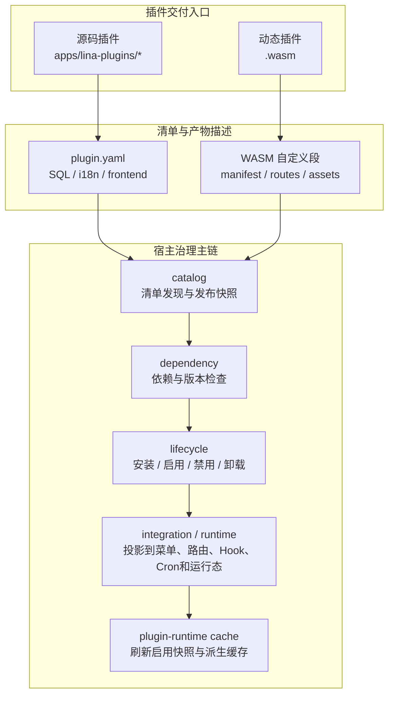
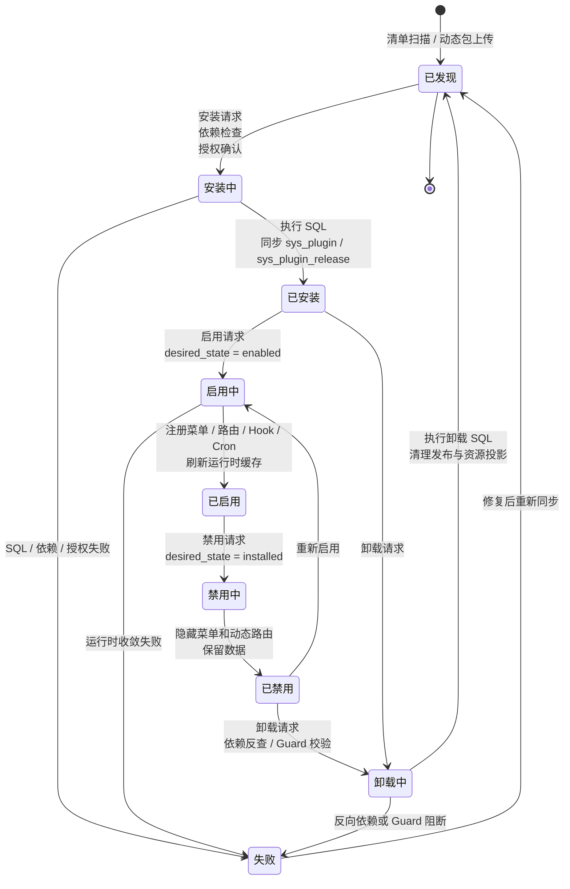
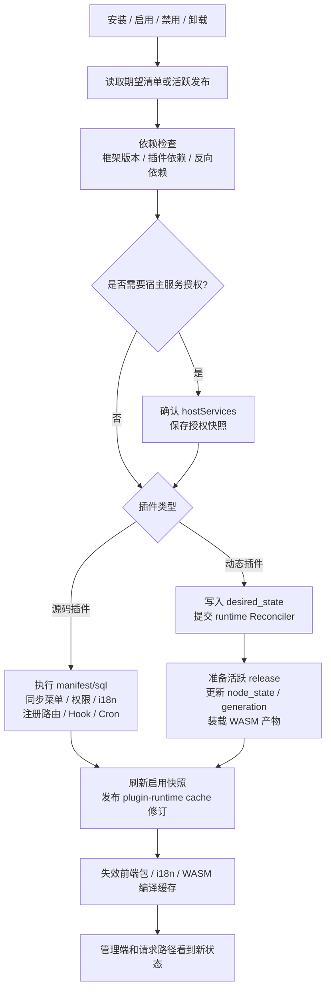
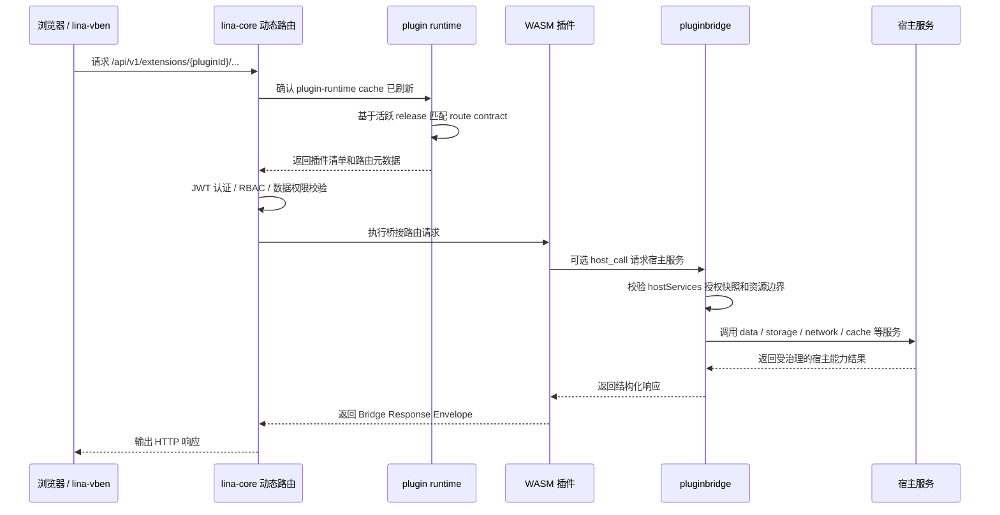

## 概述

插件系统是`LinaPro`实现业务扩展的核心机制。每个插件都是一个**自包含的功能模块**，可以独立声明`API`路由、业务服务、数据库表结构、前端页面和菜单项，**无需修改宿主代码**。源码插件随宿主一起编译，动态插件则以`.wasm`文件形式在运行时热加载，无需重启宿主或重新编译主框架。

## 架构总览

插件系统的核心不只是"扫描插件目录并注册路由"，而是一条完整的治理主链：从清单发现、依赖检查，到生命周期编排、运行时收敛，再到宿主服务授权。不论是源码插件还是`WASM`动态插件，最终都会进入同一套插件治理面，只是在运行形态和宿主能力访问方式上有所不同。

下图展示了插件从交付入口进入宿主治理主链的完整过程：



主链中三个关键组件的职责分工：

| 组件 | 职责 |
|------|------|
| `catalog` | 将`plugin.yaml`或`WASM`自定义段转换为宿主可审查的清单与发布快照 |
| `lifecycle` | 负责状态转换（安装/启用/禁用/卸载）和`SQL`执行；动态插件的运行态由`runtime Reconciler`最终收敛 |
| `pluginbridge` | 仅服务于动态插件的沙箱调用；源码插件直接通过`pkg/pluginhost`和`pluginservice/contract`接入宿主稳定服务 |


## 两种模式对比

`LinaPro`提供两种插件交付模式，分别面向不同的开发与运营场景：

- **源码插件**：与宿主一起编译打包，开发体验与主框架完全一致，适合长期维护的核心业务功能。
- **`WASM`动态插件**：以独立`.wasm`文件形式在运行时热加载，无需重启宿主，适合临时功能、热修复或不想暴露源码的商业分发场景。

| 维度 | 源码插件 | `WASM`动态插件 |
|------|---------|--------------|
| **交付方式** | 随宿主一起编译打包 | 独立编译为`.wasm`文件，运行时上传 |
| **热加载** | 不支持，需重启宿主 | 支持，无需重启宿主 |
| **性能** | 原生`Go`性能 | 略低于原生，有沙箱调用开销 |
| **隔离程度** | 命名空间隔离 | 完整`WASM`沙箱隔离 |
| **宿主服务访问** | 通过`pluginhost.HostServices`和`pluginservice/contract`稳定契约访问 | 通过`hostServices`授权快照和`pluginbridge`统一协议访问 |
| **源码可见性** | 与宿主仓库一起管理 | 可以只分发二进制，不暴露源码 |
| **适用场景** | 长期业务功能模块 | 临时功能、热修复、商业插件分发 |
| **开发复杂度** | 低，与宿主共享所有工具 | 中，需要了解`WASM`构建流程 |

**在大多数场景推荐优先选择源码插件**，开发体验更好、性能更优、与宿主工具链无缝集成。以下情况再考虑动态插件：

- 需要不重启宿主即可即插即用的热加载能力
- 生产环境紧急热修复，最小化影响范围
- 商业化插件分发，不想对外暴露源码

## 插件清单（plugin.yaml）

每个插件都需要在根目录放置一个`plugin.yaml`清单文件。宿主通过它识别插件身份、菜单结构、多租户策略和运行时依赖。以下是一个包含完整字段注释的示例：

```yaml
# 插件唯一标识（kebab-case）
id: content-article

# 插件显示名称
name: 文章管理

# 语义化版本号（semver 格式）
version: v0.1.0

# 插件类型：source（源码插件）或 dynamic（动态插件）
type: source

# 多租户作用域：platform_only 或 tenant_aware
scope_nature: tenant_aware

# 是否支持租户级安装与治理
supports_multi_tenant: true

# 默认安装模式：global 或 tenant_scoped
default_install_mode: tenant_scoped

# 插件说明
description: 提供文章内容的增删改查管理功能

# 插件作者
author: linapro

# 插件主页
homepage: https://example.com/plugins/content-article

# 插件许可证
license: Apache-2.0

# 插件菜单声明
menus:
  - key: plugin:content-article:list       # 菜单唯一标识，格式建议为 plugin:<插件ID>:<功能>
    name: 文章管理                          # 菜单显示名称（支持 i18n Key）
    path: content-article-list             # 前端路由路径，全局唯一
    component: system/plugin/dynamic-page  # 插件页面固定使用此组件，由宿主动态加载插件前端
    perms: content-article:article:view    # 访问该菜单所需的权限标识
    icon: ant-design:file-text-outlined    # 菜单图标，使用 Iconify 图标名
    type: M                                # 菜单类型：D=目录，M=菜单项，B=按钮
    sort: 1                                # 排序权重，数值越小越靠前
```

**声明运行时依赖（可选）**

如果插件依赖特定框架版本或其他插件，可以在清单中追加`dependencies`字段。宿主在安装或升级前会自动检查框架版本范围、插件依赖是否满足、自动安装策略，以及是否存在循环依赖：

```yaml
dependencies:
  framework:
    version: ">=0.1.0 <1.0.0"
  plugins:
    - id: plugin-demo-source
      version: ">=0.1.0"
      required: true
      install: auto
```

**声明宿主服务权限（动态插件专用）**

动态插件还需要通过`hostServices`字段声明希望调用的宿主服务、方法和资源边界。这是一份权限申请清单——真正生效的是宿主在安装或启用阶段确认后写入发布快照的授权结果，未申请的服务和资源在沙箱内无法访问：

```yaml
hostServices:
  - service: data
    methods:
      - list
      - get
    resources:
      tables:
        - content_article_record
  - service: storage
    methods:
      - put
      - get
    resources:
      paths:
        - content-article/
```

## 插件生命周期

插件状态分为**管理端可见状态**和**宿主内部收敛状态**两个维度。管理端主要关注发现、安装、启用、禁用和卸载这五个阶段；宿主内部则会进一步追踪`desired_state`、`current_state`、`generation`和`release_id`等字段，用于动态插件的跨节点收敛和缓存刷新。

下图展示插件的完整状态流转，包括中间过渡状态和失败回退路径：



| 状态 | 说明 |
|------|------|
| **已发现** | 宿主扫描到`plugin.yaml`，但尚未安装 |
| **安装中 / 启用中 / 禁用中 / 卸载中** | 宿主正在执行依赖检查、授权确认、`SQL`迁移、发布快照更新或`Reconciler`收敛 |
| **已安装** | 执行了安装`SQL`并同步治理数据，但功能未激活 |
| **已启用** | 菜单、路由、钩子、定时任务、前端资源和语言资源已进入运行时 |
| **已禁用** | 路由和菜单已隐藏，数据保留，可随时重新启用 |
| **失败** | 生命周期步骤被依赖、`SQL`、授权、运行时产物或`Guard Hook`阻断，修复后可重新同步或重新执行操作 |

**禁用 vs. 卸载**

- **禁用**：仅隐藏菜单和路由，插件的数据和数据表完整保留，随时可以重新启用恢复原状。
- **卸载**：管理端会弹窗询问是否同时清理插件自有数据。选择清理后执行卸载`SQL`，数据无法找回；选择保留则仅清理治理记录，数据表保持不动。

下图展示了生命周期各操作的内部执行步骤。源码插件和动态插件的差异主要体现在启用阶段的运行时收敛路径上：



## 动态插件请求流程

动态插件的所有`HTTP`请求统一由宿主固定前缀`/api/v1/extensions/{pluginId}/...`接收。宿主负责完成认证、`RBAC`、数据权限等校验后，再将请求封装为`pluginbridge`协议交给`WASM`沙箱执行——插件代码永远无法绕过这层校验直接响应请求。

下图展示了一次完整的动态插件`API`请求的处理链路：



## 插件隔离机制

`LinaPro`通过三个维度确保插件之间、以及插件与宿主之间相互不干扰：数据库命名空间隔离、文件存储命名空间隔离，以及`WASM`沙箱隔离。

**数据库命名空间隔离**

每个插件的数据表必须以插件`ID`（`kebab-case`转`snake_case`）作为前缀：

```text
宿主表：sys_user、sys_role、sys_menu ...
插件表：content_article_record、org_center_dept ...
       ^^^^^^^^^^^^^^^^       ^^^^^^^^^^^
        插件 ID 前缀            插件 ID 前缀
```

需要支持多租户的插件表应使用`tenant_id`列作为租户判别字段，并通过宿主发布的`TenantFilterService`追加租户过滤条件。未启用`multi-tenant`插件时，默认`tenant_id = 0`表示平台租户。

**文件存储命名空间隔离**

每个插件的文件存储路径以插件`ID`作为命名空间：

```text
宿主文件：temp/upload/
插件文件：temp/upload/content-article/
                    ^^^^^^^^^^^^^^^^
                     插件 ID 命名空间
```

**`WASM`沙箱隔离**

动态插件在`WASM`沙箱中运行，对宿主能力的访问受到严格约束：

- **文件系统访问**：通过宿主`storage`服务桥接，限制在插件命名空间内
- **数据库访问**：通过宿主`data`服务桥接，限制在插件命名空间内
- **网络访问**：通过宿主`network`服务桥接，受申请的权限约束
- **运行时信息访问**：通过宿主`runtime`服务桥接获取

动态插件必须在`plugin.yaml`中通过`hostServices`字段提前申请所需的宿主服务。宿主在安装和启用时验证权限声明，并将确认后的授权快照写入当前活跃发布——运行时任何未申请的调用都会被`pluginbridge`直接拒绝。

## 多租户插件字段

插件清单通过以下三个字段声明自己与多租户系统的边界关系，宿主和`multi-tenant`插件依据这些声明进行统一治理：

| 字段 | 可选值 | 说明 |
|------|--------|------|
| `scope_nature` | `platform_only` / `tenant_aware` | 插件仅在平台上下文治理，还是可进入租户上下文 |
| `supports_multi_tenant` | `true` / `false` | 是否支持租户级安装、开通和数据隔离 |
| `default_install_mode` | `global` / `tenant_scoped` | 默认全局启用，还是按租户独立启停 |

`platform_only`插件用于平台级治理，例如`multi-tenant`自身；`tenant_aware`插件可根据业务需要选择全局启用或租户级启用。详见：[多租户能力](/docs/multi-tenant)。

## 宿主与插件的边界规范

清晰的边界是插件系统长期稳定的基础。以下规范约束了插件可以做什么、不可以做什么，开发者在编写插件时需要严格遵守。

**宿主拥有顶级菜单目录**

宿主发布了一组稳定的顶级菜单目录键：`dashboard`、`iam`、`setting`、`scheduler`、`extension`、`developer`。插件菜单必须挂载在这些目录下（通过`parent_key`字段指定），或者使用自己独立的顶级目录。

官方插件的固定挂载点：

| 插件 | 挂载目录 |
|------|---------|
| `org-center` | `org` |
| `content-notice` | `content` |
| 所有`monitor-*`插件 | `monitor` |

**插件不直接访问宿主内部包**

插件只能通过`pkg/pluginhost`暴露的稳定接口与宿主交互，严禁`import`宿主`internal/`目录下的任何包。宿主内部实现随时可能变化，直接依赖会导致插件在宿主升级后编译失败。

**插件服务逻辑放在`internal/service/`下**

插件后端的所有业务逻辑必须在`backend/internal/service/`目录下实现，不能在插件根目录创建顶层`service/`包，以避免与宿主包命名冲突。

**安装`SQL`必须具备幂等性**

安装`SQL`必须使用`CREATE TABLE IF NOT EXISTS`等幂等语句。这是因为用户可能在「卸载时选择保留数据」后再重新安装，幂等写法可以确保数据正常复用，而不会因重复建表而报错。

## 扩展点注册示例

源码插件通过`pluginhost.SourcePlugin`接口向宿主注册自身能力。以下是一个典型的插件入口文件结构，涵盖前端资源绑定、路由注册、事件钩子和卸载清理：

```go
// backend/plugin.go
package backend

import "github.com/linaproai/linapro/apps/lina-core/pkg/pluginhost"

func Register(p pluginhost.SourcePlugin) {
    // 绑定嵌入的前端资源
    p.Assets().UseEmbeddedFiles(embedFS)

    // 注册 HTTP 路由
    p.HTTP().RegisterRoutes(
        pluginhost.ExtensionPointHTTPRouteRegister,
        pluginhost.CallbackExecutionModeBlocking,
        registerRoutes,
    )

    // 注册登录成功后的钩子
    p.Hooks().RegisterHook(
        pluginhost.ExtensionPointAuthLoginSucceeded,
        pluginhost.CallbackExecutionModeAsync,
        onLoginSucceeded,
    )

    // 注册卸载清理逻辑
    p.Lifecycle().RegisterUninstallHandler(onUninstall)
}
```

详细的插件开发手册参见[扩展开发](/docs/plugin-development)。
