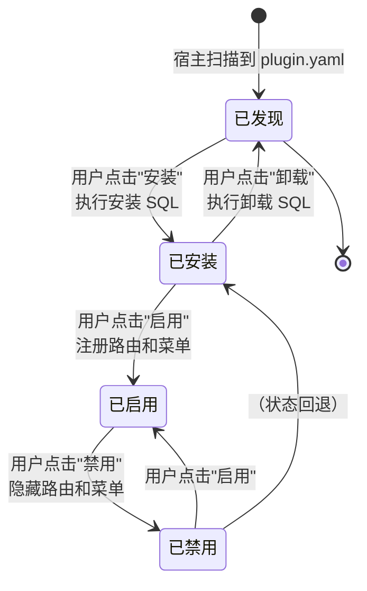

## 概述

插件系统是`LinaPro`的核心能力之一，支持以松耦合的方式扩展系统的任意能力。每个插件是一个自包含的模块包，可以独立声明`API`路由、业务服务、数据库表结构、前端页面和菜单项，宿主在运行时加载和卸载插件，无需修改宿主代码。

`LinaPro`支持两种插件模式，适应不同的交付场景：

- **源码插件**：与宿主一起编译，适合需要长期维护的业务功能
- **`WASM`动态插件**：运行时热加载，适合临时功能、热修复和不发布源码的场景

## 两种模式对比

| 维度 | 源码插件 | `WASM`动态插件 |
|------|---------|--------------|
| **交付方式** | 随宿主一起编译打包 | 独立编译为`.wasm`文件，运行时上传 |
| **热加载** | 不支持，需重启宿主 | 支持，无需重启宿主 |
| **性能** | 原生`Go`性能 | 略低于原生，有沙箱调用开销 |
| **隔离程度** | 命名空间隔离 | 完整`WASM`沙箱隔离 |
| **宿主服务访问** | 直接调用宿主包函数 | 通过受治理的桥接接口访问 |
| **源码可见性** | 与宿主仓库一起管理 | 可以只分发二进制，不暴露源码 |
| **适用场景** | 长期业务功能模块 | 临时功能、热修复、商业插件分发 |
| **开发复杂度** | 低，与宿主共享所有工具 | 中，需要了解`WASM`构建流程 |

**大部分时候推荐使用源码插件**，开发体验更好、性能更优、与宿主工具链无缝集成。当有以下需求时，选择动态插件：

- 需要在不重启宿主的情况下即插即用
- 生产环境快速热修复，最小化影响范围
- 商业化分发，不想暴露源码

## 插件清单（plugin.yaml）

每个插件都需要一个`plugin.yaml`清单文件，声明插件的元数据和菜单配置：

```yaml
# 插件唯一标识（kebab-case）
id: content-article

# 插件显示名称
name: 文章管理

# 语义化版本号（semver 格式）
version: v0.1.0

# 插件类型：source（源码插件）或 dynamic（动态插件）
type: source

# 插件说明
description: 提供文章内容的增删改查管理功能

# 插件作者
author: linapro

# 插件主页
homepage: https://example.com/plugins/content-article

# 插件许可证
license: Apache-2.0

# 插件菜单声明
menus:
  - key: plugin:content-article:list       # 菜单唯一标识，格式建议为 plugin:<插件ID>:<功能>
    name: 文章管理                          # 菜单显示名称（支持 i18n Key）
    path: content-article-list             # 前端路由路径，全局唯一
    component: system/plugin/dynamic-page  # 插件页面固定使用此组件，由宿主动态加载插件前端
    perms: content-article:article:view    # 访问该菜单所需的权限标识
    icon: ant-design:file-text-outlined    # 菜单图标，使用 Ant Design 图标名
    type: M                                # 菜单类型：M=菜单项，C=目录，B=按钮
    sort: 1                                # 排序权重，数值越小越靠前
```

## 插件生命周期

插件的完整生命周期包含五个状态：



| 状态 | 说明 |
|------|------|
| **已发现** | 宿主扫描到`plugin.yaml`，但尚未安装 |
| **已安装** | 执行了安装`SQL`，数据表已创建，但功能未激活 |
| **已启用** | 路由、菜单和钩子已注册，插件完全可用 |
| **已禁用** | 路由和菜单已隐藏，数据保留，可随时重新启用 |

**禁用 vs. 卸载的区别：**

- **禁用**：仅隐藏菜单和路由，插件数据和数据表完整保留，可随时恢复启用
- **卸载**：弹窗让用户选择是否同时清理插件自有数据，确认后执行卸载`SQL`

## 插件隔离机制

为了确保插件之间以及插件与宿主之间相互不影响，`LinaPro`提供了多层隔离机制：

**数据库命名空间隔离**

每个插件的数据表必须以插件`ID`（`kebab-case`转`snake_case`）作为前缀：

```text
宿主表：sys_user、sys_role、sys_menu ...
插件表：content_article_record、org_center_dept ...
       ^^^^^^^^^^^^^^^^       ^^^^^^^^^^^
        插件 ID 前缀            插件 ID 前缀
```

**文件存储命名空间隔离**

每个插件的文件存储路径以插件`ID`作为命名空间：

```text
宿主文件：temp/upload/
插件文件：temp/upload/content-article/
                    ^^^^^^^^^^^^^^^^
                     插件 ID 命名空间
```

**`WASM`沙箱隔离**

动态插件在`WASM`沙箱中运行，对宿主能力的访问受到严格约束：

- **文件系统访问**：通过宿主`storage`服务桥接，限制在插件命名空间内
- **数据库访问**：通过宿主`data`服务桥接，限制在插件命名空间内
- **网络访问**：通过宿主`network`服务桥接，受申请的权限约束
- **运行时信息访问**：通过宿主`runtime`服务桥接获取

动态插件必须在`plugin.yaml`中声明所需的宿主服务（`services`字段），宿主在安装和启用时验证服务权限。

## 宿主与插件的边界规范

理解并遵守以下边界规范，是开发高质量插件的基础：

**宿主拥有顶级菜单目录**

宿主发布了稳定的顶级菜单目录键：`dashboard`、`iam`、`setting`、`scheduler`、`extension`、`developer`。插件菜单只能挂载在这些目录下（使用`parent_key`字段），或者使用自己的顶级目录。

官方插件的固定挂载点：

| 插件 | 挂载目录 |
|------|---------|
| `org-center` | `org` |
| `content-notice` | `content` |
| 所有`monitor-*`插件 | `monitor` |

**插件不直接访问宿主内部包**

插件只能通过`pkg/pluginhost`暴露的稳定接口与宿主交互，不能`import`宿主`internal/`下的任何包。

**插件服务逻辑放在`internal/service/`下**

插件后端的所有业务逻辑必须在`backend/internal/service/`目录下实现，不能创建顶层`service/`目录。

**安装`SQL`必须具备幂等性**

安装`SQL`必须使用`CREATE TABLE IF NOT EXISTS`等幂等语句，确保在「卸载保留数据后重新安装」场景下可以正常复用现有数据。

## 扩展点注册示例

以下是源码插件注册路由和钩子的典型代码结构：

```go
// backend/plugin.go
package backend

import "github.com/linaproai/linapro/apps/lina-core/pkg/pluginhost"

func Register(p pluginhost.SourcePlugin) {
    // 绑定嵌入的前端资源
    p.Assets().UseEmbeddedFiles(embedFS)

    // 注册 HTTP 路由
    p.HTTP().RegisterRoutes(
        pluginhost.ExtensionPointHTTPRouteRegister,
        pluginhost.CallbackExecutionModeBlocking,
        registerRoutes,
    )

    // 注册登录成功后的钩子
    p.Hooks().RegisterHook(
        pluginhost.ExtensionPointAuthLoginSucceeded,
        pluginhost.CallbackExecutionModeAsync,
        onLoginSucceeded,
    )

    // 注册卸载清理逻辑
    p.Lifecycle().RegisterUninstallHandler(onUninstall)
}
```

详细的插件开发手册参见[扩展开发](/docs/extension-dev)。
