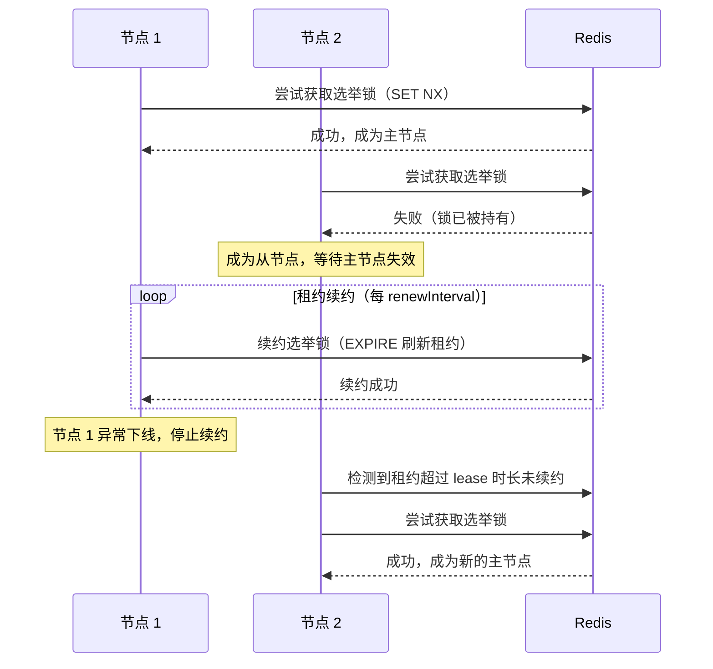
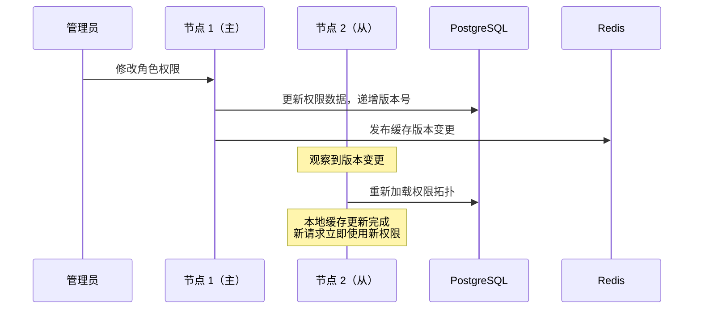

## 概述

`LinaPro`从设计之初就将分布式能力作为框架的原生特性，而不是事后叠加的扩展能力。框架底层支持单机和分布式两种部署模式，切换只需修改配置文件，业务代码无需任何改造。

## 部署模式

### 单机模式（默认）

默认情况下，`LinaPro`以单机模式运行，适合开发环境和小规模生产部署。单机模式不需要`Redis`，只依赖`PostgreSQL`和进程内缓存协调：

```yaml
cluster:
  enabled: false  # 默认值，单机模式
```

```text
          ┌──────────────────────────────────┐
          │             lina-core            │
          │    (single node, all-in-one)     │
          └─────────────────┬────────────────┘
                            │
                       ┌────▼─────┐
                       │PostgreSQL│
                       └──────────┘
```

### 集群模式

将`cluster.enabled`设置为`true`后，框架启用分布式协调机制，支持多节点水平扩展。**集群模式必须配置分布式协调器**，当前版本仅支持`redis`：

```yaml
cluster:
  enabled: true
  coordination: redis        # 必填，当前仅支持 redis
  election:
    lease: 30s               # 选举锁租约时长
    renewInterval: 10s       # 租约续约间隔（建议为租约时长的 1/3）
  redis:
    address: "127.0.0.1:6379"
    db: 0
    password: ""
    connectTimeout: 3s
    readTimeout: 2s
    writeTimeout: 2s
```

```text
       ┌───────────────────────────────────┐
       │           Load Balancer           │
       └───────┬──────────────┬────────────┘
               │              │
         ┌─────▼─────┐  ┌─────▼─────┐
         │   Node 1  │  │   Node 2  │  ...
         │ (primary) │  │ (replica) │
         └─────┬─────┘  └─────┬─────┘
               │    Redis     │
               └──────┬───────┘
                      │
              ┌───────▼──────┐
              │    Redis     │  ← 集群协调（选主、缓存、分布式锁）
              └──────────────┘
                      │
               ┌──────▼──────┐
               │ PostgreSQL  │  ← 数据持久化
               └─────────────┘
```

在集群模式下，各节点共享同一个`PostgreSQL`数据库作为数据存储，通过`Redis`实现分布式协调（选主锁、分布式锁、集群感知缓存等）。

## 分布式选主

集群模式通过`Redis`实现选主，轻量可靠：



**租约时长配置建议：**

- `lease`（租约时长）：建议设置为`30s`，即主节点下线后最多`30`秒内完成重新选主
- `renewInterval`（续约间隔）：建议为`lease`的`1/3`，即`10s`，确保有充裕的续约窗口

## 主从节点职责

`LinaPro`的主从节点在职责上有所区分：

**主节点独有职责：**

- 执行宿主级周期性维护任务
- 权限拓扑版本广播（通知所有节点刷新缓存）
- 动态插件生命周期协调

**所有节点共同职责：**

- 处理`HTTP`请求（业务`API`、插件`API`）
- 读取权限拓扑（从本地缓存或数据库）
- 执行持久化定时调度子系统中的任务（竞争锁后执行，防止重复执行）

## 权限拓扑版本同步

权限拓扑（用户角色、角色菜单、菜单权限）的变更需要在所有节点间同步，`LinaPro`通过版本号机制实现：



这种机制确保权限变更在所有节点上快速生效（最长不超过3秒），无需用户重新登录。

## 分布式任务调度

持久化定时调度子系统在集群模式下使用分布式锁防止任务重复执行：

- 每次任务触发时，竞争执行获取分布式锁
- 获得锁的节点执行任务，未获得锁的节点跳过
- 任务执行完成后释放锁，执行结果写入数据库
- 所有节点都可以查看任务执行历史

## 分布式锁

框架提供统一的分布式锁接口（`pkg/locker`），宿主和插件均可使用：

```go
// 示例：使用分布式锁保护临界区操作
err := locker.TryLock(ctx, "my-lock-key", 30*time.Second, func() error {
    // 临界区操作，集群中只有一个节点会执行
    return doSomething()
})
```

在单机模式下，分布式锁退化为本地互斥锁，行为一致。

## 键值缓存

框架提供集群感知的键值缓存接口（`pkg/kvcache`），在集群模式下支持缓存失效广播：

- 权限拓扑版本缓存
- 在线会话缓存
- 国际化资源缓存

## 扩容步骤

当业务量增长需要扩容时，只需：

1. 修改`config.yaml`，将`cluster.enabled`设为`true`
2. 配置`cluster.coordination: redis`和可连接的`cluster.redis`端点
3. 新启动一个宿主节点实例，指向同一个`PostgreSQL`数据库
4. 在负载均衡器中添加新节点

业务代码无需任何修改，框架自动完成节点发现、选主和权限同步。
