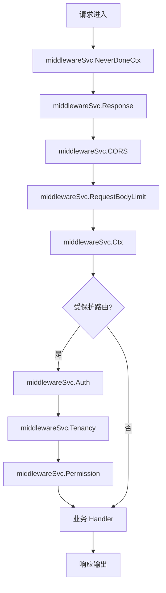
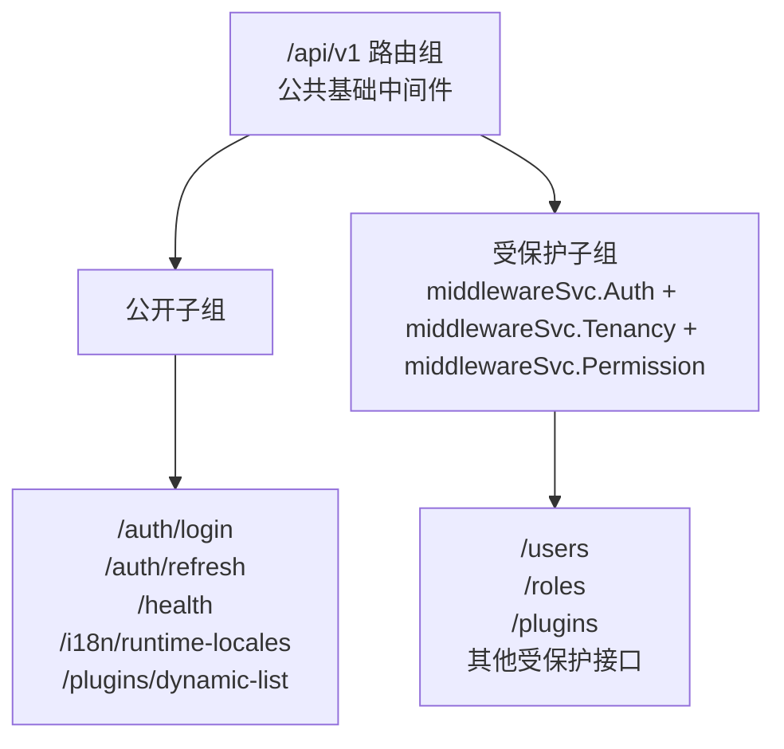
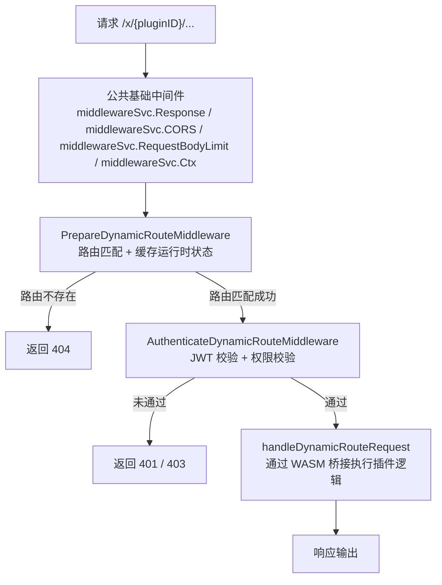

## 基本介绍

`lina-core`的路由体系围绕**版本前缀**、**中间件链**、**权限声明**和**插件扩展接口**四个维度统一设计，主框架通过`/api/v1`前缀管理自身`API`版本，通过有序的中间件链落地`CORS`、鉴权与权限治理，通过`g.Meta`结构体标签将接口属性与代码一体化维护，并为两类插件提供差异化的路由接入策略。

## API 版本管理

主框架的所有控制面`API`统一挂载在`/api/v1`路由组下。版本前缀通过`server.Group`声明，后续扩展到`/api/v2`时只需新增分组，已有`v1`接口不受影响。

```go
server.Group("/api/v1", func(group *ghttp.RouterGroup) {
    bindHostAPIMiddlewares(group, middlewareSvc)
    bindPublicStaticAPIRoutes(group, ...)
    bindProtectedStaticAPIRoutes(group, middlewareSvc, ...)
})
```

| 路径前缀 | 用途 |
|----------|------|
| `/api/v1` | 主框架当前稳定`API`版本，包含认证、用户、权限、插件治理等控制面接口 |
| `/x` | 动态插件数据面专属前缀，由主框架统一分发给对应的动态插件运行时处理 |
| `/` | 静态前端资源、健康探针等根路径入口 |

版本管理的设计原则是：**路由组即版本边界**。不同版本的`API`在同一服务进程内共存，各自拥有独立的中间件配置和处理器集合，不依赖`Content-Type`或请求头进行版本协商。

## 中间件体系

主框架将中间件分为两类：挂载在路由组上的**请求链中间件**，以及注册在服务器级别的**全局中间件**。请求链中间件按照声明顺序依次执行，任意一个中间件调用`r.ExitAll()`后链条即终止。

### 公共基础中间件

以下中间件对`/api/v1`路由组和动态插件路由组`/x`均生效，构成所有请求的基础处理链：

| 中间件 | 作用 |
|--------|------|
| `ghttp.MiddlewareNeverDoneCtx` | 将请求`Context`替换为永不取消的副本，防止客户端断连导致业务逻辑提前终止 |
| `middlewareSvc.Response` | 统一序列化`JSON`响应体，localize业务错误文案，处理`304`、`204`及流式响应透传 |
| `middlewareSvc.CORS` | 执行`CORSDefault`，允许跨域请求，处理`OPTIONS`预检 |
| `middlewareSvc.RequestBodyLimit` | 非`multipart`请求默认限制`8MB`；`multipart`上传请求按`sys.upload.maxSize`配置动态计算上限 |
| `middlewareSvc.Ctx` | 注入业务上下文（用户身份占位、租户占位、请求`locale`），设置`Content-Language`响应头 |

### 鉴权与权限中间件

以下中间件仅在受保护的路由子组中挂载，公开接口（如登录、健康探针）不经过这一层：

| 中间件 | 作用 |
|--------|------|
| `middlewareSvc.Auth` | 从`Authorization: Bearer <token>`解析`JWT`，校验`Token`签名与会话有效性，写入用户身份至请求上下文 |
| `middlewareSvc.Tenancy` | 根据请求上下文解析租户身份，注入租户`ID`；未启用多租户时默认注入平台租户 |
| `middlewareSvc.Permission` | 从`DTO`的`g.Meta`标签或手动声明读取`permission`字段，校验当前用户是否拥有所需权限 |

中间件执行顺序如下图所示：



### 源码插件可用的中间件

主框架通过`RouteMiddlewares`接口将上述中间件发布给源码插件，插件按需组合使用，无需直接依赖主框架内部包：

```go
routes.Group("/api/v1", func(group pluginhost.RouteGroup) {
    group.Middleware(
        middlewares.NeverDoneCtx(),
        middlewares.HandlerResponse(),
        middlewares.CORS(),
        middlewares.RequestBodyLimit(),
        middlewares.Ctx(),
    )
    // 公开路由子组
    group.Group("/", func(group pluginhost.RouteGroup) {
        group.Bind(demoController.Ping)
    })
    // 受保护路由子组
    group.Group("/", func(group pluginhost.RouteGroup) {
        group.Middleware(
            middlewares.Auth(),
            middlewares.Tenancy(),
            middlewares.Permission(),
        )
        group.Bind(demoController.ListRecords, ...)
    })
})
```

## 鉴权路由设计

主框架将路由分为**公开路由**和**受保护路由**两层，以路由子组的中间件差异来区分，而非依赖路径惯例或特殊标记。

### 路由分层结构



### 权限声明方式

受保护接口的权限标识通过`DTO`的`g.Meta`标签内联声明，`Permission`中间件在运行时读取该标识并校验当前用户的角色权限集合：

```go
type UserListReq struct {
    g.Meta   `path:"/users" method:"get" tags:"User" summary:"List users" permission:"user:list"`
    Page     int `json:"page"`
    PageSize int `json:"pageSize"`
}
```

`Auth`中间件的鉴权流程如下：

1. 从`Authorization`请求头读取`Bearer Token`
2. 解析`JWT`，验证签名与过期时间
3. 调用`SessionStore.TouchOrValidate`刷新会话活跃时间，并验证会话是否仍然有效（支持强制登出和超时清理）
4. 将用户身份（用户`ID`、租户`ID`、`TokenId`等）写入请求上下文

`Permission`中间件的权限校验流程如下：

1. 从`g.Meta`标签读取`permission`字段，支持多个权限用逗号分隔
2. 加载当前用户的访问上下文（权限列表、数据范围）
3. 匹配所需权限，任一满足即通过（`OR`语义）；通配符`*:*:*`表示超级管理员直接放行

鉴权机制的详细设计（包括`JWT`签发、会话管理、`RBAC`权限模型）请参见权限管理章节。

## API 标签一体化管理

`lina-core`基于`g.Meta`机制，将接口的所有属性——路径、方法、分组标签、摘要、描述、权限、`MIME`类型等——全部内联在请求`DTO`的结构体标签中，实现**代码与文档同源**。

### 主框架接口标签示例

```go
type CreateRecordReq struct {
    g.Meta  `path:"/plugins/linapro-demo-source/records" method:"post" mime:"multipart/form-data" tags:"Source Plugin Demo" summary:"Create source plugin sample record" dc:"创建示例记录" permission:"linapro-demo-source:example:create"`
    Title   string `json:"title" v:"required|length:1,128" dc:"记录标题"`
    Content string `json:"content" dc:"记录内容"`
}
```

### 动态插件接口标签示例

动态插件使用`gmeta.Meta`（而非`g.Meta`，沙箱环境的组件依赖缘故），标签内额外增加`access`和`operLog`字段：

```go
type CreateDemoRecordReq struct {
    gmeta.Meta `path:"/demo-records" method:"post" tags:"Dynamic Plugin Demo" summary:"创建示例记录" access:"login" permission:"linapro-demo-dynamic:record:create" operLog:"create"`
    Title      string `json:"title" v:"required|length:1,128"`
    Content    string `json:"content"`
}
```

### 常用标签字段说明

| 标签字段 | 适用范围 | 说明 |
|----------|----------|------|
| `path` | 主框架 / 源码插件 / 动态插件 | 接口路由路径 |
| `method` | 主框架 / 源码插件 / 动态插件 | `HTTP`方法，如`get`、`post` |
| `tags` | 主框架 / 源码插件 / 动态插件 | 接口分组标签，用于`OpenAPI`文档分类 |
| `summary` | 主框架 / 源码插件 / 动态插件 | 接口简介，展示在文档和插件管理页 |
| `dc` | 主框架 / 源码插件 | 接口详细描述（`description`缩写） |
| `permission` | 主框架 / 源码插件 / 动态插件 | 权限标识，由`Permission`中间件强制校验 |
| `mime` | 主框架 / 源码插件 | 请求体`MIME`类型，如`multipart/form-data` |
| `access` | 动态插件 | 访问控制，`public`表示匿名，`login`表示需要登录 |
| `operLog` | 动态插件 | 操作日志类型，如`create`、`update`、`delete`、`other` |

这种方式让接口定义、文档元数据和权限声明集中在同一个`DTO`文件中，主框架自动从标签中聚合`OpenAPI`文档，不需要单独维护接口注释或文档文件，从根本上消除了代码与文档之间的漂移风险。

## 源码插件路由策略

源码插件随主框架编译交付，通过`pluginhost.HTTPRegistrar`提供的`Routes()`接入主框架路由器，享有**自由注册任意路由路径**的能力。

### 注册方式

源码插件在`init()`阶段通过回调声明路由注册函数，主框架启动时在`registerSourcePluginHTTPRoutes`阶段统一触发回调：

```go
plugin.HTTP().RegisterRoutes(
    pluginhost.ExtensionPointHTTPRouteRegister,
    pluginhost.CallbackExecutionModeBlocking,
    registerRoutes,
)
```

`registerRoutes`回调接收`HTTPRegistrar`参数，插件通过`Routes().Group()`创建路由组，通过`Middlewares()`获取主框架发布的中间件目录：

```go
func registerRoutes(ctx context.Context, registrar pluginhost.HTTPRegistrar) error {
    routes      := registrar.Routes()
    middlewares := routes.Middlewares()

    routes.Group("/api/v1", func(group pluginhost.RouteGroup) {
        // 组合公共基础中间件
        group.Middleware(
            middlewares.NeverDoneCtx(),
            middlewares.HandlerResponse(),
            middlewares.CORS(),
            middlewares.RequestBodyLimit(),
            middlewares.Ctx(),
        )
        // 公开子组
        group.Group("/", func(group pluginhost.RouteGroup) {
            group.Bind(demoController.Ping)
        })
        // 受保护子组（必须遵循 Auth -> Tenancy -> Permission 顺序）
        group.Group("/", func(group pluginhost.RouteGroup) {
            group.Middleware(
                middlewares.Auth(),
                middlewares.Tenancy(),
                middlewares.Permission(),
            )
            group.Bind(demoController.CreateRecord, demoController.ListRecords, ...)
        })
    })
    return nil
}
```

### 路由自由与冲突风险

源码插件对路由路径没有任何强制限制，可以注册`/`、`/portal`、`/api/v1`、`/api/v2`或任意自定义前缀下的路由。这种自由度带来的开发规范要求是：

- **避免与主框架路由冲突**：主框架已占用`/api/v1`下的所有控制面路径（见 `API` 版本管理章节），源码插件应使用明确的命名空间，例如`/api/v1/plugins/{plugin-id}/`
- **避免插件间路由冲突**：多个源码插件同时安装时，路径冲突会导致路由注册失败报错终止程序启动，开发者需确保路径唯一性
- **受保护路由必须遵循中间件顺序**：凡是使用`middlewareSvc.Auth`中间件的路由子组，必须按照`middlewareSvc.Auth → middlewareSvc.Tenancy → middlewareSvc.Permission`的顺序组合中间件，主框架有自动化测试保障这一约束

### 源码插件路由捕获

主框架在路由注册阶段会捕获源码插件注册的所有`SourceRouteBinding`，并将可文档化的接口聚合进主框架`OpenAPI`文档，开发者无需额外操作即可在接口文档中查看源码插件暴露的接口。

## 动态插件路由策略

动态插件（`WASM`插件）的路由由主框架完全管理，由于动态插件本身运行在沙箱中，插件本身不直接接触`HTTP Server`的路由注册机制，路由能力受到明确约束。

### 路由命名空间约束

动态插件的所有路由强制挂载在`/x/{pluginID}/`前缀下：

```text
/x/linapro-demo-dynamic/backend-summary
/x/linapro-demo-dynamic/demo-records
/x/linapro-demo-dynamic/demo-records/{id}
```

这个约束由主框架在`/x`路由组上绑定的通配符处理器`/*dynamicPath`统一拦截后实现。插件无法绑定到`/api/v1`或任何`/x`之外的路径，确保动态插件路由不会对主框架路由结构造成混乱。

### 路由声明方式

动态插件的路由通过内嵌在`WASM`产物中的`RouteContract`声明，而非运行时注册。主框架加载产物时解析路由契约，后续请求到达时由主框架侧的`PrepareDynamicRouteMiddleware`负责路径匹配：

```go
// 动态插件路由契约（内嵌在 WASM 产物中）
type RouteContract struct {
    Path        string            // 插件内部路径，如 /demo-records
    Method      string            // HTTP 方法
    Tags        []string          // 分组标签
    Summary     string            // 接口简介
    Access      string            // "public" 或 "login"
    Permission  string            // 权限标识
    Meta        map[string]string // 插件自定义元数据
    RequestType string            // 反射分发时使用的请求类型名
}
```

`Path`字段是插件内部路径，主框架在对外暴露时自动拼接`/x/{pluginID}`前缀。

### 动态路由请求处理流程



### 动态插件权限声明

动态插件路由的权限通过`RouteContract`的`access`和`permission`字段声明：

| 字段 | 取值 | 说明 |
|------|------|------|
| `access` | `public` | 匿名访问，无需任何身份验证 |
| `access` | `login` | 需要已登录身份，主框架验证`JWT`有效性 |
| `permission` | 如`linapro-demo-dynamic:record:create` | 需要特定权限，由主框架查询用户权限集合校验 |

### 动态插件与源码插件路由策略对比

| 维度 | 源码插件 | 动态插件 |
|------|----------|----------|
| **路由注册方式** | 启动阶段通过`HTTPRegistrar`回调注册 | 运行时从`WASM`产物中解析路由契约 |
| **路由路径限制** | 无限制，可注册任意路径 | 强制在`/x/{pluginID}/`前缀下 |
| **中间件组合** | 插件自行从`RouteMiddlewares`选择并组合 | 主框架统一管理，插件通过`access`字段影响鉴权行为 |
| **权限声明位置** | `DTO`的`g.Meta`标签 | `RouteContract`的`permission`字段 |
| **OpenAPI 文档** | 自动聚合到主框架文档 | 主框架从路由契约中读取并聚合 |
| **路由冲突风险** | 开发者自行规避 | 主框架通过命名空间约束规避 |

## 全局中间件扩展

除了路由组级别的中间件，源码插件还可以通过`GlobalMiddlewares()`注册服务器级别的全局中间件，作用于服务器上所有匹配指定模式的请求：

```go
err := registrar.GlobalMiddlewares().Bind(
    pluginhost.MiddlewareScope("/*"),
    func(r *ghttp.Request) {
        // 插件的全局请求拦截逻辑（仅在插件启用时执行）
        r.Middleware.Next()
    },
)
```

主框架在全局中间件中自动注入插件启用状态检查，当插件被禁用时中间件逻辑自动跳过，开发者不需要在自己的中间件中手动处理插件状态。
