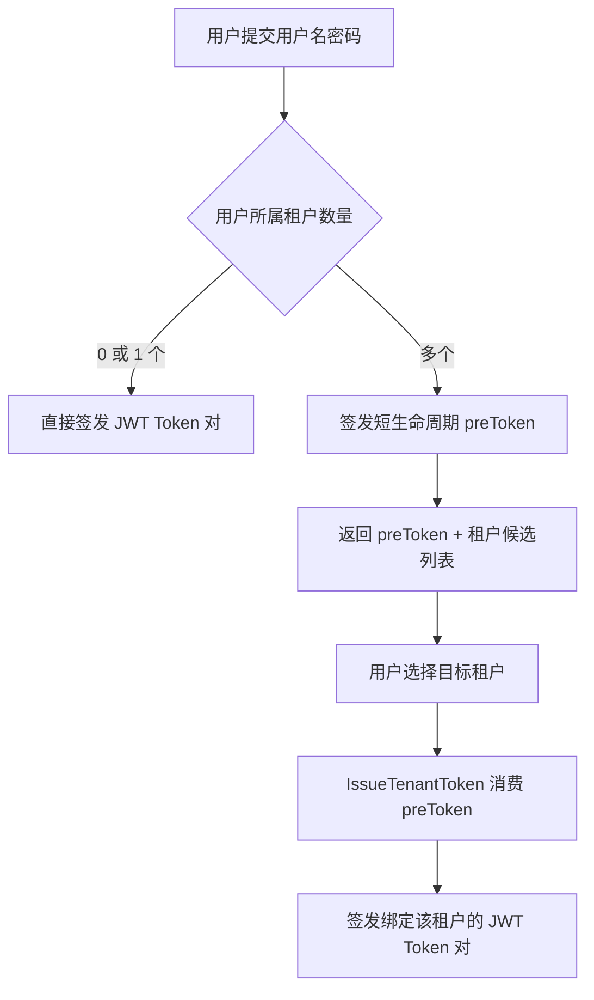
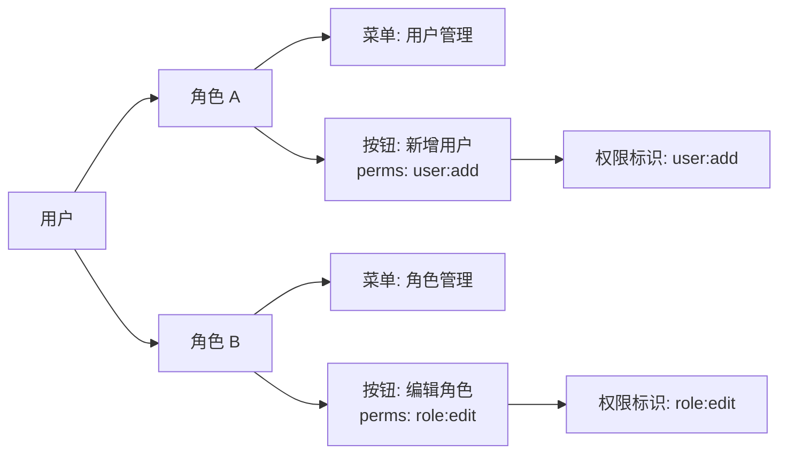
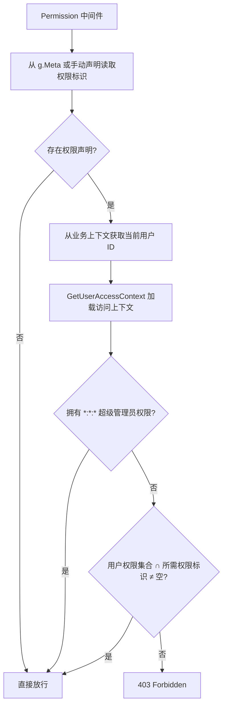
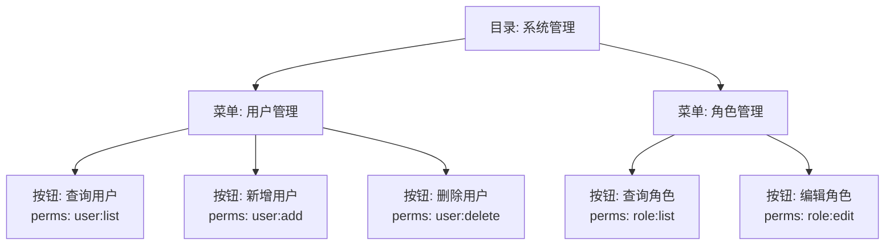

## 基本介绍

`lina-core`的权限管理体系围绕 **`JWT` 认证** 与 **`RBAC` 权限模型** 两个核心维度统一设计。`JWT` 负责用户身份的签发、传递与验证；`RBAC` 负责在身份确认之后确定该用户能够访问哪些 `API` 接口和菜单资源。两者通过中间件链在每次 `HTTP` 请求时协同工作：`Auth`中间件完成身份验证，`Permission`中间件完成权限校验。

## JWT 认证体系

### JWT Claims 结构

`lina-core`使用`golang-jwt/jwt/v5`库签发 `JWT`，`Claims` 结构体在`auth.Claims`中定义，包含以下核心字段：

| 字段 | 类型 | 说明 |
|------|------|------|
| `tokenId` | `string` | `Token` 唯一标识，全局唯一，用于 `Session` 关联和吊销追踪 |
| `tokenType` | `string` | `Token` 类型，`access`表示访问令牌，`refresh`表示刷新令牌 |
| `userId` | `int` | 登录用户 ID |
| `username` | `string` | 登录用户名 |
| `status` | `int` | 用户账号状态 |
| `tenantId` | `int` | 租户 ID，`0`表示平台租户 |
| `isImpersonation` | `bool` | 是否为身份模拟（管理员代入用户身份） |
| `actingUserId` | `int` | 模拟场景下真实操作用户的 ID |
| `RegisteredClaims` | 标准字段 | 包含`ExpiresAt`（过期时间）和`IssuedAt`（签发时间） |

所有 `Token` 统一使用`HS256`（`HMAC-SHA256`）签名算法，签名密钥从系统配置`GetJwtSecret`中读取，密钥在运行时按请求动态获取而不缓存在本地，以支持密钥轮换。

### 双 Token 机制

登录成功后，`generateTokenPair`函数使用同一个`tokenID`（`guid.S()`生成的全局唯一 ID）签发两个 `JWT`：

- **Access Token**：生命周期较短，由`GetJwtExpire`配置决定（默认较短），用于每次 `API` 请求的身份验证。携带方式为请求头`Authorization: Bearer <token>`。
- **Refresh Token**：生命周期较长，取`defaultRefreshTokenTTL`（7 天）、会话超时和 `Access Token TTL` 三者中的最大值，用于在 `Access Token` 过期后换取新的 `Access Token`，不能用于访问受保护接口。

```go
// 两个 Token 共享同一个 tokenID
tokenID := guid.S()
accessToken,  _ = s.signToken(ctx, user, tenantID, tokenID, tokenKindAccess,  ...)
refreshToken, _ = s.signToken(ctx, user, tenantID, tokenID, tokenKindRefresh, ...)
```

这种设计让 `Refresh Token` 在刷新时能够精准定位和关联已有的在线 `Session`，而不需要在服务端单独存储 `Refresh Token` 和 `Access Token` 之间的映射关系。

### Token 解析与验证

`Auth`中间件在每个受保护请求上执行以下步骤：

1. 从`Authorization: Bearer <token>`请求头提取 `Token` 字符串。
2. 调用`jwt.ParseWithClaims`解析签名并反序列化 `Claims`，签名密钥通过`GetJwtSecret`实时获取以支持密钥轮换。
3. 检查 `Token` 是否已被主动吊销（先查进程内本地吊销缓存，再查共享 KV 缓存）。
4. 调用`SessionStore.TouchOrValidate`刷新会话活跃时间并验证 `Session` 是否仍然有效（支持强制登出和超时清理）。
5. 将用户身份（`userId`、`username`、`tenantId`、`tokenId`等）写入请求的业务上下文中，供后续中间件和业务 Handler 读取。


### 会话管理

`lina-core`为每个登录会话在持久化存储（数据库）和可选的分布式热状态存储中维护一条在线 `Session` 记录。`Session` 包含以下信息：

| 字段 | 说明 |
|------|------|
| `TokenId` | 关联的 `JWT Token ID` |
| `TenantId` | 所属租户 |
| `UserId` | 所属用户 |
| `Username` | 用户名 |
| `LoginTime` | 登录时间 |
| `LastActiveTime` | 最后活跃时间（每分钟最多更新一次） |
| `Ip` / `Browser` / `Os` | 客户端信息 |

`TouchOrValidate`是核心校验方法，每次受保护请求都会调用它。它在验证 `Session` 有效性的同时，按最小更新窗口（`1` 分钟）节流地刷新`LastActiveTime`，避免每次请求都触发数据库写入。管理员可以通过在线用户列表强制踢出指定 `Session`，或者等待会话超时后系统自动清理。

### Token 吊销机制

吊销采用分层存储架构：进程内本地`memoryRevokeStore`和共享`kvRevokeStore`（KV 缓存）组合为`layeredRevokeStore`。

- 本地层：当前节点吊销后立即生效，无需等待 KV 缓存同步，确保本节点快速响应登出。
- 共享层：KV 缓存中记录`tokenID → expiresAt`的映射，集群其他节点读取后将结果回填到本地缓存，实现跨节点收敛。

吊销发生的时机包括：主动登出、管理员强制踢出、`Token` 刷新换新 `Token`（旧 `Token` 立即吊销）、租户切换等。

### 多租户预登录 Token

当用户同时属于多个租户时，密码验证通过后不直接签发 `JWT`，而是签发一个生命周期仅 `1` 分钟的`preToken`（前缀为`pre_`的随机字符串）。客户端收到`preToken`和租户候选列表后，引导用户选择目标租户，再调用`IssueTenantToken`接口，消费（一次性使用）`preToken`并签发绑定该租户的正式 `JWT` Token 对。



## RBAC 权限模型

### 设计思路

`lina-core`采用**角色 → 菜单 → 权限标识**的三层 `RBAC` 模型：

- **用户**可分配一个或多个**角色**，角色决定用户能访问哪些菜单和操作按钮。
- **角色**可关联一组**菜单**（含目录、页面菜单和操作按钮）。
- **菜单**（特别是按钮类型）携带**权限标识**（`Perms`字段），如`user:list`、`role:edit`。
- 用户的最终有效权限是其所有角色所关联菜单的权限标识集合。



### 用户访问上下文（UserAccessContext）

`GetUserAccessContext`负责加载并缓存用户的完整权限快照，结构体`UserAccessContext`包含：

| 字段 | 类型 | 说明 |
|------|------|------|
| `RoleIds` | `[]int` | 用户绑定的所有角色 ID |
| `RoleNames` | `[]string` | 启用角色的显示名称 |
| `MenuIds` | `[]int` | 通过角色可访问的所有菜单 ID |
| `Permissions` | `[]string` | 有效权限标识列表（经过插件过滤后的最终结果） |
| `DataScope` | `Scope` | 所有启用角色中最宽泛的数据范围级别 |
| `IsSuperAdmin` | `bool` | 是否为内置管理员账号（拥有所有权限） |

内置超级管理员用户（`isSuperAdmin = true`）直接加载所有已启用菜单的权限，无需走角色关联查询。对于普通用户，权限加载流程为：

```
用户 ID → 角色 ID 集合 → 菜单 ID 集合 → 权限标识集合
```

### 访问上下文缓存

权限加载涉及多次数据库查询，`lina-core`为此设计了 `Token` 级别的进程内缓存，并通过**权限拓扑版本修订**机制（`accessRevision`）实现缓存失效：

- 每个登录 `Token` 对应一个`cachedUserAccessContext`缓存条目，缓存构建时记录当前的权限拓扑版本号。
- 系统每 `3` 秒从共享存储同步最新版本号到进程本地。当角色、菜单、权限等数据发生变更时，版本号递增。
- 下一次请求命中缓存时，若版本号已过期，则丢弃缓存重新加载。
- 用户登出、管理员强制踢出等事件会立即失效对应 `Token` 的缓存（`InvalidateTokenAccessContext`）。

这种设计在保证最终一致性的前提下，大幅减少了高并发场景下的数据库权限查询压力。

### 数据范围控制（DataScope）

数据范围是 `RBAC` 模型的扩展维度，决定用户对**受治理资源**（如用户列表、操作日志）的数据可见性，而不仅仅是能否访问某个接口。`lina-core`定义了以下数据范围级别：

| 枚举值 | 说明 |
|--------|------|
| `ScopeNone (0)` | 拒绝访问受治理资源 |
| `ScopeAll (1)` | 可见全部数据（跨租户） |
| `ScopeTenant (2)` | 可见当前租户内全部数据 |
| `ScopeDept (3)` | 可见当前部门范围内的数据（依赖组织能力插件如`linapro-org-core`） |
| `ScopeSelf (4)` | 仅可见自己创建的数据 |

用户的有效数据范围取其所有启用角色中**最宽泛**的一级。数据范围约束通过`datascope.Service`在业务层写入数据库查询条件，不在中间件层拦截。

## API 权限管理

### 声明式权限标注

`API` 权限通过`DTO`结构体的`g.Meta`标签内联声明，`permission`字段支持用逗号分隔的多个权限标识，逻辑为**OR**（任意一个满足即通过）：

```go
type UserListReq struct {
    g.Meta   `path:"/users" method:"get" tags:"User" summary:"List users" permission:"user:list"`
    Page     int `json:"page"`
    PageSize int `json:"pageSize"`
}

type BatchDeleteUsersReq struct {
    g.Meta `path:"/users/batch-delete" method:"delete" tags:"User" summary:"Batch delete users" permission:"user:delete"`
    Ids    []int `json:"ids" v:"required|min-length:1"`
}
```

权限标识通常遵循`模块:资源:操作`三段式命名规范，例如`user:list`、`role:edit`、`plugin:manage:install`。这种方式将接口定义、文档元数据和权限声明集中在同一个`DTO`文件中，从根本上消除了权限声明与接口实现之间的漂移风险。

对于不通过`g.Meta`标签绑定的手动注册路由，可以使用`RequirePermission`显式声明权限要求：

```go
group.Group("/", func(group *ghttp.RouterGroup) {
    group.Middleware(middlewareSvc.RequirePermission("custom:resource:action"))
    group.Bind(customController.Handle)
})
```

### Permission 中间件校验流程

`Permission`中间件在`Auth`中间件之后执行，已经确保用户身份已注入上下文：



权限标识`*:*:*`是超级管理员的通配符权限，拥有该标识的用户在`Permission`中间件处直接放行，不进行具体权限比对。超级管理员的`*:*:*`权限在`loadAllEnabledMenuAccess`阶段追加到权限列表中。

`Permission`中间件同时负责将用户的数据范围信息（`DataScope`）写入业务上下文，供后续数据层查询使用：

```go
s.bizCtxSvc.SetUserAccess(
    r.Context(),
    int(accessContext.DataScope),
    accessContext.DataScopeUnsupported,
    accessContext.UnsupportedDataScope,
)
```

### 动态插件的 API 权限

动态插件使用`g.Meta`，权限声明方式与主框架一致，额外支持`access`和`operLog`字段：

```go
type CreateDemoRecordReq struct {
    g.Meta `path:"/demo-records" method:"post" tags:"Dynamic Plugin Demo" summary:"创建示例记录" access:"login" permission:"linapro-demo-dynamic:record:create" operLog:"create"`
    Title      string `json:"title" v:"required|length:1,128"`
    Content    string `json:"content"`
}
```

`access:"login"`表示该接口需要登录（仅验证身份，不校验权限标识）；`access:"public"`表示匿名可访问。

## 菜单权限管理

### 菜单类型与数据结构

`lina-core`的菜单系统支持三种类型，通过`SysMenu`表的`type`字段区分：

| 类型 | 说明 | Perms 字段 |
|------|------|-----------|
| `directory` | 目录节点，用于菜单导航分组，不对应具体页面 | 通常为空 |
| `menu` | 页面菜单，对应前端一个具体的路由页面 | 通常为空，也可填写查看权限 |
| `button` | 操作按钮，对应页面内的具体操作（新增、编辑、删除等） | 必填，用于后端权限校验 |

按钮类型的菜单节点是权限管理的关键，其`Perms`字段存储权限标识（如`user:list`、`user:add`），由`Permission`中间件在请求时读取并与用户的有效权限进行匹配。

### 角色-菜单关联与授权

角色通过`sys_role_menu`关联表与菜单建立多对多关系。管理员为角色配置可访问菜单的操作在`role`服务中实现，变更后触发**权限拓扑版本修订**递增，从而让所有节点的访问上下文缓存在下一次请求时失效并重建。

菜单权限树（`PermissionTree`）是专为角色授权表单设计的树形投影，显示时按目录 → 菜单 → 按钮的层次排列，并对动态插件注入的按钮节点进行规范化处理（归入动态权限目录）。



### 前端菜单权限

用户登录后，前端通过`/api/v1/users/menus`接口获取当前用户可见的菜单 ID 集合（由`UserAccessContext.MenuIds`决定）。前端框架根据这组菜单 ID 动态构建可访问的路由表，不在该集合中的菜单节点不会出现在导航栏中，对应的路由也不会注册。

按钮级别的权限在前端通过指令或条件渲染实现控制，前端从用户信息接口获取`Permissions`列表（权限标识集合），在渲染操作按钮前检查用户是否拥有对应的权限标识，从而隐藏无权限的按钮。

:::tip
前端的菜单和按钮可见性控制属于**用户体验层面的隐藏**，真正的安全边界由后端`Permission`中间件守护。即便客户端绕过前端控制直接调用 `API`，后端也会通过权限校验拒绝未授权请求。
:::
