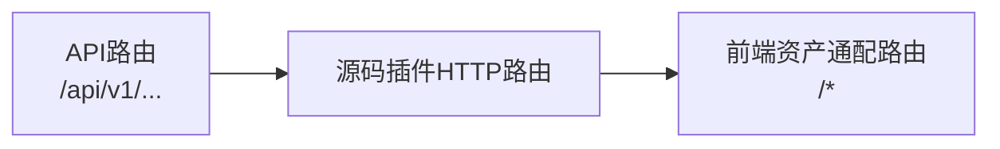
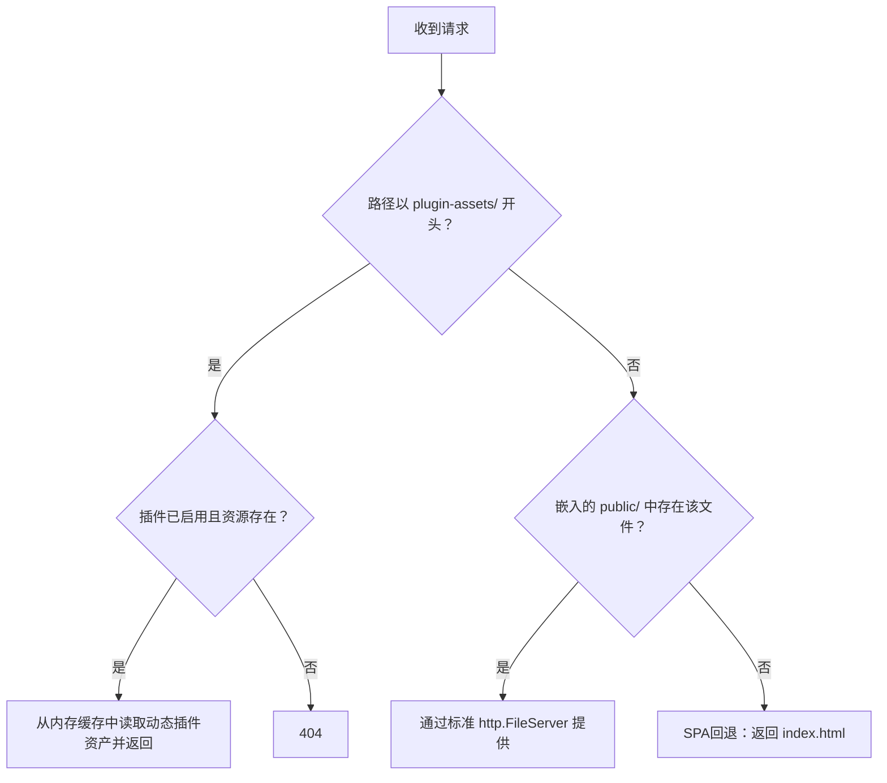
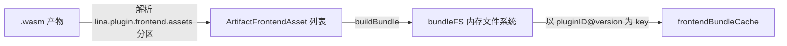

## 基本介绍

`LinaPro`通过`Go Embed`将所有静态资源在编译时一次性打包进可执行文件，使得单二进制部署无需额外的静态文件目录即可完整运行。主框架前端资产、清单模板、源码插件页面、动态插件前端包，全部遵循这一理念，仅根据资源所属层次选择不同的嵌入与供给策略。

## Go Embed 原理

`Go Embed`是`Go 1.16`引入的编译器内置功能，通过在变量声明上方添加`//go:embed`指令，将指定目录或文件的内容在编译时嵌入进可执行文件的只读数据段。

```go
import "embed"

//go:embed all:public all:manifest
var Files embed.FS
```

上述声明会在编译时将`public/`和`manifest/`两个目录下的所有文件（包括以`.`开头的隐藏文件，因使用了`all:`前缀）递归嵌入到`Files`变量中。`embed.FS`实现了标准库的`fs.FS`接口，支持路径查找、文件读取，但不支持写入。

| 指令形式 | 含义 |
|----------|------|
| `//go:embed file.txt` | 嵌入单个文件 |
| `//go:embed dir/` | 嵌入整个目录（跳过`.`和`_`开头的文件） |
| `//go:embed all:dir/` | 嵌入整个目录（包含`.`和`_`开头的文件） |
| `//go:embed dir1 dir2` | 同时嵌入多个目录或文件 |

嵌入的资源被编译进二进制文件后，运行时通过`embed.FS`的`Open`、`ReadFile`等方法访问，和访问普通磁盘文件的接口完全一致，无需解压或临时目录。

## 主框架服务的静态资源

### 资源目录与嵌入声明

`lina-core`主框架服务的静态资源在`internal/packed/`目录下统一管理：

```text
internal/packed/
├── packed.go           # embed.FS 声明
├── public/             # 前端构建产物（lina-vben 编译输出）
│   ├── index.html
│   ├── css/
│   ├── js/
│   └── ...
└── manifest/           # 运行时配置清单与初始化资源
    ├── config/
    ├── i18n/
    └── sql/
```

`packed.go`通过以下声明将两个目录统一嵌入到`Files`变量中：

```go
package packed

import "embed"

// Files stores embedded frontend static assets and prepared manifest assets.
//
//go:embed all:public all:manifest
var Files embed.FS
```

`public/`目录在构建阶段由`lina-vben`前端项目编译后写入；`manifest/`目录包含数据库初始化`SQL`、配置模板和国际化资源包，在主框架首次启动时用于引导环境。

### 静态资源路由优先级

主框架的`HTTP`路由采用**明确优先于通配**的原则。在服务器启动阶段，路由按以下顺序依次注册：



前端资产通配路由`/*`始终最后注册，是所有路由的兜底处理器。每次请求进入该处理器后，内部按照以下三步顺序依次尝试匹配：



1. **动态插件资产优先**：若请求路径匹配`plugin-assets/{pluginID}/{version}/{assetPath}`格式，则先检查对应插件是否已启用，再从内存缓存中取出对应资产文件进行响应。若插件未启用或资产不存在，直接返回`404`。
2. **嵌入前端资源次之**：若能在`public/`嵌入目录中找到对应文件，则使用标准`http.FileServer`提供服务。
3. **`SPA`回退兜底**：所有未匹配的路径均返回`public/index.html`，由`Vue`客户端路由接管。

## 源码插件的静态资源

### 嵌入声明

源码插件在插件根目录的`plugin_embed.go`中声明嵌入内容：

```go
package plugindemosource

import "embed"

// EmbeddedFiles contains the plugin manifest, convention-based SQL assets, and
// frontend source resources.
//
//go:embed plugin.yaml frontend manifest
var EmbeddedFiles embed.FS
```

该声明将`plugin.yaml`清单、`frontend/`页面目录和`manifest/`资源目录（含`SQL`文件和国际化包）全部嵌入到`EmbeddedFiles`变量中，随主框架二进制一起编译。

### 资产注册与使用

在插件的`init()`函数中，通过以下方式将嵌入文件系统注册到主框架：

```go
plugin := pluginhost.NewSourcePlugin(pluginID)
plugin.Assets().UseEmbeddedFiles(plugindemosource.EmbeddedFiles)
```

主框架在扫描源码插件清单时，会从嵌入的`embed.FS`中读取`plugin.yaml`，解析插件身份、菜单、权限等元数据，无需从磁盘查找文件。

### 前端页面资源

源码插件将前端页面`.vue`文件放置在`frontend/pages/`目录下：

```text
frontend/
├── pages/
│   ├── sidebar-entry.vue      # 对应菜单中的页面组件
│   └── components/
│       └── ...
└── slots/                     # 插槽页面（可选）
```

主框架通过`ListFrontendPagePaths`和`ListFrontendSlotPaths`扫描这些路径，但源码插件的`.vue`文件**不在运行时动态提供**，而是在`lina-vben`的前端构建阶段被引用和编译，最终进入`public/`打包产物，通过主框架的嵌入前端资产路由统一提供。

:::info
源码插件的`Vue`页面文件是编译时依赖关系，修改后需要重新编译主框架的前端和后端才能生效。这与动态插件前端资产的运行时热加载机制不同。
:::

## 动态插件的静态资源

### WASM自定义分区与资源存储

动态插件将前端资产打包进`.wasm`文件的自定义分区（`WASM Custom Section`）。主框架在解析`WASM`产物时，从以下固定分区名读取各类资源：

| 自定义分区名 | 内容 |
|---|---|
| `lina.plugin.manifest` | 插件身份清单（`JSON`格式） |
| `lina.plugin.dynamic` | 主框架运行时元数据（`ABI`版本、资产计数等） |
| `lina.plugin.frontend.assets` | 前端静态资产列表（路径、内容、`MIME`类型） |
| `lina.plugin.i18n.assets` | 国际化语言包 |
| `lina.plugin.install.sql` | 安装时执行的`SQL` |
| `lina.plugin.uninstall.sql` | 卸载时执行的`SQL` |

`ArtifactFrontendAsset`是每个前端资产的数据结构：

```go
type ArtifactFrontendAsset struct {
    Path          string // 资产相对路径，如 "pages/standalone.html"
    ContentBase64 string // 资产内容的 base64 编码
    ContentType   string // MIME 类型，如 "text/html"
    Content       []byte // 解码后的原始字节（运行时使用，不序列化）
}
```

动态插件同样使用`//go:embed`将前端文件目录嵌入到`EmbeddedFiles`，在构建时由`LinaPro`的插件构建工具将这些文件从`embed.FS`中读取，序列化后写入`WASM`自定义分区：

```go
// plugin_embed.go（动态插件）
//go:embed plugin.yaml frontend manifest
var EmbeddedFiles embed.FS
```

### 内存缓存机制

主框架读取动态插件的`.wasm`产物后，将前端资产解析为**内存中的虚拟文件系统**（`bundleFS`），并以`{pluginID}@{version}`为`key`缓存在进程内存中：



`bundleFS`实现了`fs.FS`接口，路径规范化后直接从内存映射中读取字节，不需要解压到磁盘。缓存的生命周期与运行中的主框架进程一致；当插件禁用或升级时，主框架主动调用`InvalidateBundle`使对应缓存失效。

主框架启动时会调用`PrewarmRuntimeFrontendBundles`对所有已启用的动态插件执行预热，确保首次请求时无需临时构建：

```text
主框架启动
  → 扫描 .wasm 产物
  → 对每个已启用的动态插件调用 EnsureBundle
  → 将解析结果写入 frontendBundleCache
  → 就绪，开始接受请求
```

单个插件预热失败不会阻止主框架整体启动，失败信息会聚合后写入日志。

### 公开访问路径

动态插件前端资产的访问路径格式为：

```
/plugin-assets/{pluginID}/{version}/{assetPath}
```

例如，`linapro-demo-dynamic`插件`v0.1.0`版本的`pages/standalone.html`，其完整访问路径为：

```
/plugin-assets/linapro-demo-dynamic/v0.1.0/pages/standalone.html
```

`BuildRuntimeFrontendPublicBaseURL`负责生成插件级别的基础路径，插件在`plugin.yaml`的菜单声明中使用该路径引用自身资产：

```yaml
menus:
  - key: plugin:linapro-demo-dynamic:standalone-page
    path: /plugin-assets/linapro-demo-dynamic/v0.1.0/pages/standalone.html
    component: system/plugin/dynamic-page
```

当主框架收到`/plugin-assets/...`请求时，会依次执行以下校验：

1. 解析路径中的`pluginID`和`version`
2. 检查插件已安装且处于启用状态
3. 确认请求的版本与当前激活版本一致
4. 从内存缓存（`bundleFS`）中读取对应路径的文件内容
5. 设置正确的`Content-Type`响应头后返回

任何校验失败均返回`404`，防止未启用或已卸载的插件资产被访问。

### 前端页面加载模式

动态插件支持两种前端页面加载模式：

#### `embedded-mount`（内嵌挂载）

内嵌挂载模式将插件的`JavaScript`模块（`.js`或`.mjs`文件）以`ESM`动态导入的方式加载到主框架的页面容器中。此模式下，插件的`JS`入口文件必须导出`mount(context)`函数：

```js
// 动态插件 mount.js 示例
export async function mount(context) {
    const { container, accessToken, locale, messages, t, query } = context;
    // 在 container 中渲染插件 UI
    return {
        unmount(context) {
            context.container.replaceChildren();
        },
        update(context) {
            // 处理路由更新
        }
    };
}
```

`mount(context)`接收的`context`对象包含以下字段：

| 字段 | 类型 | 说明 |
|------|------|------|
| `container` | `HTMLElement` | 主框架提供的挂载容器 |
| `accessToken` | `string` | 当前用户的`JWT`令牌 |
| `assetURL` | `string` | 当前入口资产的完整`URL` |
| `baseURL` | `string` | 资产所在目录的`URL`前缀 |
| `locale` | `string` | 当前用户界面语言 |
| `messages` | `object` | 运行时国际化消息快照 |
| `t` | `function` | 国际化消息查找函数 |
| `query` | `object` | 当前路由查询参数 |
| `route` | `object` | 当前`Vue Router`路由对象 |
| `title` | `string` | 当前菜单标题 |

菜单声明中通过`query_param`字段启用内嵌挂载模式：

```yaml
menus:
  - key: plugin:linapro-demo-dynamic:embedded-page
    path: /plugin-assets/linapro-demo-dynamic/v0.1.0/pages/mount.js
    component: system/plugin/dynamic-page
    query_param: '{"pluginAccessMode":"embedded-mount"}'
```

#### `standalone`（独立页面）

独立页面模式通过`iframe`加载插件资产中的`HTML`文件，插件页面拥有独立的浏览器上下文，适合需要完整`DOM`控制权或引入外部脚本的场景。菜单声明直接将`HTML`资产路径设为`path`即可，无需额外的`query_param`：

```yaml
menus:
  - key: plugin:linapro-demo-dynamic:standalone-page
    path: /plugin-assets/linapro-demo-dynamic/v0.1.0/pages/standalone.html
    component: system/plugin/dynamic-page
    is_frame: 1
```

### 启用时的资产校验

动态插件在启用操作时，主框架会调用`ValidateRuntimeFrontendMenuBindings`对所有菜单声明中的资产引用执行完整性校验：

1. 扫描插件拥有的所有菜单记录
2. 对每个指向`/plugin-assets/`前缀路径的菜单，提取资产相对路径
3. 确认路径中的版本号与当前激活版本一致
4. 从内存缓存中检查该路径对应的资产文件确实存在
5. 对`embedded-mount`模式额外验证入口文件扩展名为`.js`或`.mjs`

任何校验失败都会阻断插件启用流程并返回明确的错误信息，防止带有无效菜单绑定的插件进入服务状态。

## 各层次静态资源对比

| 维度 | 主框架静态资源 | 源码插件静态资源 | 动态插件静态资源 |
|----------|-------------|----------------|------------|
| **嵌入方式** | `//go:embed all:public all:manifest` | `//go:embed plugin.yaml frontend manifest` | `//go:embed plugin.yaml frontend manifest` |
| **变更生效** | 重新编译主框架 | 重新编译主框架前端和后端 | 上传新版本`.wasm`并执行显式升级 |
| **访问路径** | 任意路径（`SPA`兜底） | 经主框架前端路由解析 | `/plugin-assets/{id}/{version}/...` |
| **运行时缓存** | 嵌入二进制，直接读取 | 嵌入二进制，直接读取 | 进程内存（`bundleFS`） |
| **热加载** | 不支持 | 不支持 | 支持（上传新`WASM`并升级） |
| **资产校验** | 构建时保证 | 构建时保证 | 启用时实时校验 |
