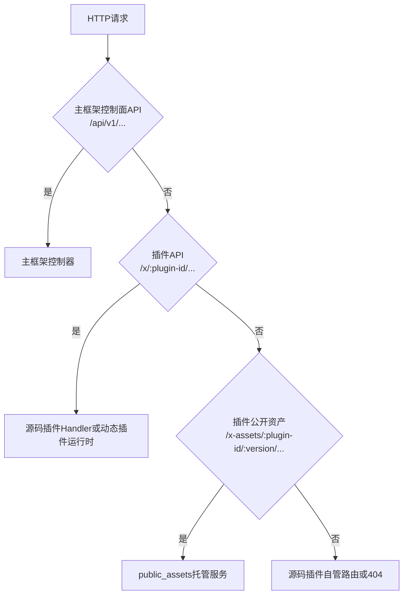

## 基本介绍

`LinaPro`通过`Go Embed`和插件声明式资源模型管理静态资源。主框架会打包运行时资源和工作台构建产物；插件的公开资源则必须通过`plugin.yaml`中的`public_assets`显式声明，再由主框架统一托管到版本化路径：

```text
/x-assets/{plugin-id}/{version}/...
```

这条路径是插件公开静态资源的统一入口，源码插件和动态插件共同使用。未声明到`public_assets`的文件不会因为存在于`embed.FS`、插件目录或动态插件产物中而被公开。

## Go Embed 原理

`Go Embed`是`Go 1.16`引入的编译器内置功能，通过在变量声明上方添加`//go:embed`指令，将指定目录或文件的内容在编译时嵌入进可执行文件的只读数据段。

```go
import "embed"

//go:embed all:public all:manifest
var Files embed.FS
```

上述声明会在编译时将`public/`和`manifest/`两个目录下的所有文件递归嵌入到`Files`变量中。`embed.FS`实现了标准库的`fs.FS`接口，支持路径查找和文件读取，但不支持写入。

| 指令形式 | 含义 |
|----------|------|
| `//go:embed file.txt` | 嵌入单个文件 |
| `//go:embed dir/` | 嵌入整个目录，跳过`.`和`_`开头的文件 |
| `//go:embed all:dir/` | 嵌入整个目录，包含`.`和`_`开头的文件 |
| `//go:embed dir1 dir2` | 同时嵌入多个目录或文件 |

嵌入资源被编译进二进制文件后，运行时通过`embed.FS`的`Open`、`ReadFile`等方法访问，和访问普通磁盘文件的接口一致。

## 主框架与工作台资源

`lina-core`的嵌入资源在`internal/packed/`目录下统一管理：

```text
internal/packed/
├── packed.go
├── public/             # 工作台构建产物和公开前端资源
│   ├── index.html
│   ├── css/
│   └── js/
└── manifest/           # 运行时配置、SQL和国际化资源
    ├── config/
    ├── i18n/
    └── sql/
```

`public/`目录由前端构建产物写入，`manifest/`目录包含主框架初始化和运行时资源。本地开发时，默认管理工作台由前端开发服务器提供，访问地址是`http://localhost:5666/admin`；主框架接口地址是`http://localhost:9120`。

`workspace.basePath`描述工作台的前端路由基准，默认值为`/admin`：

```yaml
workspace:
  basePath: "/admin"
```

默认情况下，`lina-vben`的`Vue Router`以`/admin`为基准。这个路径不是主框架控制面`API`，不要把主框架接口地址加上`/admin`当作默认工作台地址。如果部署在独立后台域名下，可以把`workspace.basePath`设置为`/`；该值不能使用`/api`、`/x`、`/x-assets`等保留命名空间。

## 后端路由边界

主框架后端路由遵循明确边界：



关键点是：`/api`是主框架控制面，`/x`是插件`API`，`/x-assets`是插件公开静态资源，`/admin`是默认管理工作台的前端路由基准。这几类路径互不替代。

## 插件公开资源模型

插件通过`plugin.yaml`根字段`public_assets`声明可公开资源：

```yaml
public_assets:
  - source: frontend/public
    mount: /
    index: index.html
  - source: frontend/pages
    mount: pages
    index: standalone.html
```

| 字段 | 说明 |
|------|------|
| `source` | 插件内相对目录，或动态插件产物中的前端资产前缀 |
| `mount` | 挂载到`/x-assets/{plugin-id}/{version}/`下的相对路径；为空或`/`表示版本根路径 |
| `index` | 访问挂载目录本身时返回的默认文件；省略时默认为`index.html` |

映射示例：

| source | mount | 插件内文件 | 公开路径 |
|--------|-------|------------|----------|
| `frontend/public` | `/` | `frontend/public/logo.png` | `/x-assets/{plugin-id}/{version}/logo.png` |
| `frontend/pages` | `pages` | `frontend/pages/standalone.html` | `/x-assets/{plugin-id}/{version}/pages/standalone.html` |

`public_assets`是显式发布授权边界。插件作者应只声明适合匿名访问的文件，不要把治理元数据、安装脚本、配置文件、租户专属文件或用户私有文件放进去。需要认证、租户过滤或个性化访问控制的文件，应由插件自己的`HTTP API`提供。

## 源码插件资源

源码插件在`plugin_embed.go`中把插件资源嵌入主框架编译产物：

```go
package plugindemosource

import "embed"

//go:embed plugin.yaml frontend manifest
var EmbeddedFiles embed.FS
```

插件注册时将嵌入文件系统交给主框架：

```go
plugin := pluginhost.NewSourcePlugin(pluginID)
plugin.Assets().UseEmbeddedFiles(plugindemosource.EmbeddedFiles)
```

主框架会从嵌入资源中读取`plugin.yaml`、安装`SQL`、语言包、插件配置和声明资源；但只有`public_assets`声明命中的资源会暴露到`/x-assets`。

源码插件前端页面通常位于`frontend/pages/`，由工作台构建阶段编译进内建前端产物。源码插件修改`.vue`页面后，需要重新构建前端和后端才能生效，这与动态插件前端资产运行时上传不同。

源码插件也可以注册自管公开路由，例如`/portal/...`、`/assets/...`或`/`。这些路由由插件代码闭环维护，不会因为`public_assets`存在而自动生成，也不会被主框架当作工作台菜单或`OpenAPI`接口。

## 动态插件资源

动态插件构建为`.wasm`产物时，构建工具会携带插件运行所需资源：

| 资源 | 来源 |
|------|------|
| 插件清单 | `plugin.yaml` |
| 前端资产 | `frontend/` |
| 安装与卸载脚本 | `manifest/sql/`、`manifest/sql/uninstall/` |
| 演示数据 | `manifest/sql/mock-data/` |
| 国际化和接口文档翻译 | `manifest/i18n/` |
| 默认配置 | `manifest/config/config.yaml` |
| 配置模板 | `manifest/config/config.example.yaml` |
| 声明资源 | `manifest/metadata.yaml`等普通声明文件 |

动态插件产物中存在前端文件并不代表这些文件自动公开。主框架只会服务命中`public_assets`声明的资产，并把它们映射到`/x-assets/{plugin-id}/{version}/...`。插件未安装、未启用、当前租户不可用或访问版本不匹配时，公开资产默认返回`404`。

资源缓存绑定到当前有效发布的校验和和生成号。安装、启用、禁用、卸载、升级或同版本刷新都会让相关运行时资源和前端资产缓存失效。

## 前端加载模式

动态插件菜单通常通过`system/plugin/dynamic-page`页壳加载公开资产。当前常见模式是`embedded-mount`：

```yaml
public_assets:
  - source: frontend/pages
    mount: /
    index: index.html

menus:
  - key: plugin:linapro-demo-dynamic:main-entry
    name: 动态插件示例
    path: /x-assets/linapro-demo-dynamic/v0.1.0/mount.js
    component: system/plugin/dynamic-page
    perms: linapro-demo-dynamic:view
    type: M
    query:
      pluginAccessMode: embedded-mount
```

在这种模式下，菜单`path`是动态页壳要加载的入口资产地址，而不是把该资产直接替换成普通工作台路由。入口文件通常导出`mount(context)`函数：

```js
export async function mount(context) {
  const { container, accessToken, locale, messages, t, query } = context;
  container.textContent = t('plugin.demo.title');
  return {
    unmount(nextContext) {
      nextContext.container.replaceChildren();
    },
    update(nextContext) {
      void nextContext;
    }
  };
}
```

`standalone`模式则通常用`iframe`加载独立`HTML`资产：

```yaml
menus:
  - key: plugin:linapro-demo-dynamic:standalone-page
    path: /x-assets/linapro-demo-dynamic/v0.1.0/standalone.html
    component: system/plugin/dynamic-page
    is_frame: 1
    type: M
```

内嵌挂载适合与工作台共享上下文、语言包和认证信息；独立页面适合需要完整`DOM`控制权或隔离第三方脚本的场景。

## 路径校验

主框架会对`public_assets`声明执行严格校验，以下配置会被拒绝：

| 无效配置 | 原因 |
|----------|------|
| 空`source` | 无法形成明确发布边界 |
| 绝对路径或`URL` | 可能越过插件资源集合 |
| 包含`../`或`.`穿越段 | 可能读取插件根目录外文件 |
| 包含通配符、查询串或片段 | 无法稳定映射为静态资源目录 |
| 重复或互相覆盖的`mount` | 同一访问路径会对应多个来源 |
| 不存在的`source` | 源码插件目录或动态产物前端资源前缀必须真实存在 |
| 符号链接逃逸插件根目录 | 可能读取插件外部文件 |
| 非文件名形式的`index` | 默认文件必须是安全的相对文件名 |

这些规则让静态资源发布成为可审查、可缓存、可升级的显式契约。

## 缓存与版本

`/x-assets`路径包含`{plugin-id, version}`，因此同一插件版本下的公开资源内容应保持稳定。如果资源内容变化，应升级`plugin.yaml`中的版本号，或引入等价的内容版本机制。不要在同一版本路径下发布不同内容，否则浏览器缓存、代理缓存和集群节点缓存都可能出现不一致。

动态插件可以在保持插件启用的前提下继续服务当前有效版本的公开资源；源码插件则从当前编译进主框架的插件资源或插件目录解析声明资源。

## 各层次对比

| 维度 | 默认工作台资源 | 源码插件资源 | 动态插件资源 |
|------|------------------|--------------|--------------|
| 嵌入方式 | `//go:embed all:public all:manifest` | `//go:embed plugin.yaml frontend manifest` | 构建为`.wasm`产物资源 |
| 访问入口 | 本地默认`http://localhost:5666/admin`；`workspace.basePath`默认`/admin` | 工作台构建产物、插件自管路由或`/x-assets` | `/x-assets/{id}/{version}/...` |
| 公开授权 | 主框架内建资源 | 仅`public_assets`声明命中的资源 | 仅`public_assets`声明命中的资源 |
| 变更生效 | 重新构建主框架 | 重新构建主框架或升级插件版本 | 上传新`.wasm`并执行运行时升级 |
| 运行时热加载 | 不支持 | 不支持 | 支持上传和显式升级 |
| 私有文件访问 | 主框架接口控制 | 插件自有`HTTP API`控制 | 插件`API`或`hostServices`控制 |
