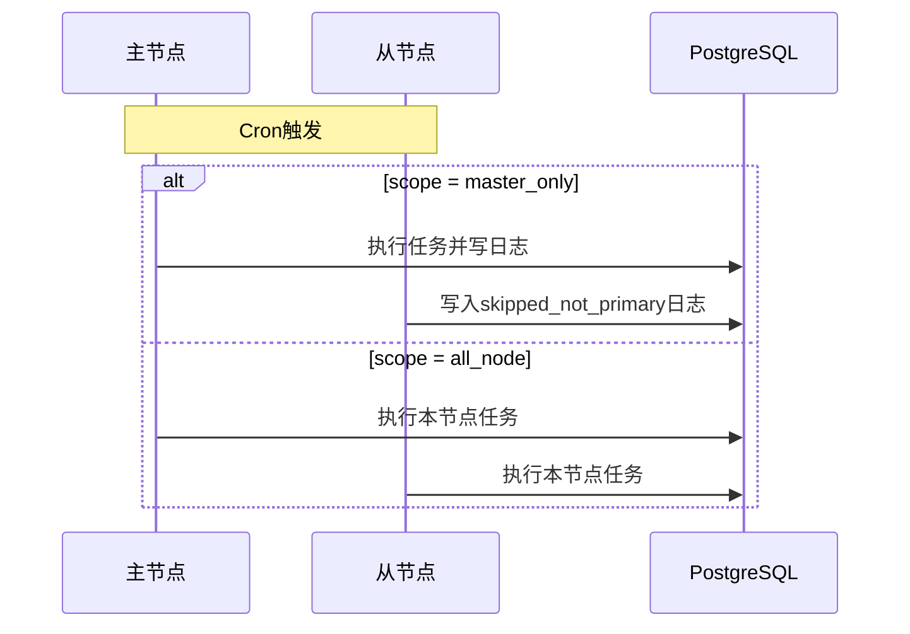

## 基本介绍

定时任务是`lina-core`提供的持久化调度能力。任务定义、运行状态和执行日志保存在数据库中，主框架启动后会把主框架内置任务、插件声明任务和管理员创建的任务统一纳入调度。

管理工作台提供任务列表、分组管理、手动触发、暂停恢复和执行日志查看。源码插件和`WASM`动态插件也可以把自己的任务能力投影到同一套治理模型中。

## 任务模型

任务系统包含这些核心字段：

| 字段 | 说明 |
|------|------|
| **任务名称** | 面向管理员展示的名称 |
| **任务分组** | 用于按业务域组织任务 |
| **任务类型** | `handler`或`shell` |
| **调用目标** | 处理器引用或`Shell`命令 |
| **Cron表达式** | 周期性触发规则 |
| **时区** | 任务自己的时区，未配置时使用`scheduler.defaultTimezone` |
| **超时时间** | 单次执行最长运行时间 |
| **执行范围** | `master_only`或`all_node` |
| **并发策略** | `singleton`或`parallel` |
| **最大执行次数** | 达到次数后停止继续调度 |
| **状态** | 启用、禁用或因插件不可用而暂停 |

`config.yaml`中的`scheduler.defaultTimezone`提供默认时区：

```yaml
scheduler:
  defaultTimezone: "UTC"
```

## 任务类型

| 类型 | 值 | 说明 | 适用场景 |
|------|----|------|----------|
| **处理器任务** | `handler` | 调用主框架或插件注册的`Go`处理器 | 数据清理、统计、同步、插件业务任务 |
| **Shell任务** | `shell` | 在主框架进程上下文执行系统命令 | 脚本任务、文件处理、运维辅助操作 |

处理器任务更适合业务逻辑，因为它可以复用主框架服务、数据库连接、权限上下文和插件治理信息。`Shell`任务具有主框架进程权限，生产环境应严格限制创建权限并设置合理超时。

## Cron表达式

常见表达式示例：

| 表达式 | 说明 |
|--------|------|
| `0 * * * *` | 每小时整点执行 |
| `0 2 * * *` | 每天凌晨 2 点执行 |
| `*/5 * * * *` | 每 5 分钟执行一次 |
| `0 9 * * 1-5` | 工作日上午 9 点执行 |
| `0 0 1 * *` | 每月 1 日零点执行 |

主框架内置任务中也会使用带秒级语义的内部表达式，例如`# 17 3 * * *`用于把维护任务错开到固定秒点执行。管理员在工作台中创建任务时，应以界面支持的表达式和预览结果为准。

## 任务分组与日志

任务分组用于按业务域组织任务，例如平台维护、插件任务、数据同步和本地节点维护。执行日志会记录每次触发的结果，包括开始时间、结束时间、耗时、触发方式、执行状态、错误信息和处理器返回结果。

常见日志状态包括：

| 状态 | 说明 |
|------|------|
| `success` | 执行成功 |
| `failed` | 执行失败 |
| `timeout` | 超过任务超时时间 |
| `cancelled` | 被手动取消 |
| `skipped_not_primary` | `master_only`任务在非主节点跳过 |
| `skipped_singleton` | `singleton`策略阻止重叠执行 |
| `skipped_max_concurrency` | `parallel`策略达到最大并发上限 |

## 内置任务

主框架会把内置维护任务投影为持久化任务，便于统一观察和治理：

| 处理器 | 默认范围 | 说明 |
|--------|----------|------|
| `host:cleanup-job-logs` | `master_only` | 清理超过保留策略的任务执行日志 |
| `host:session-cleanup` | `master_only` | 按`session.cleanupInterval`清理过期在线会话 |
| `host:kvcache-cleanup-expired` | `master_only` | 当缓存后端需要计划清理时，清理过期键值缓存 |
| `host:access-topology-sync` | `all_node` | 集群模式下同步权限拓扑修订快照 |
| `host:runtime-param-sync` | `all_node` | 集群模式下同步受保护运行时参数快照 |

其中`host:kvcache-cleanup-expired`只在当前键值缓存后端需要过期清理时注册，`host:access-topology-sync`和`host:runtime-param-sync`只在集群模式启用时注册。

## 插件任务

源码插件可以通过`pluginhost`注册任务处理器，随后管理员可以在工作台创建任务并选择该处理器作为调用目标：

```go
plugin.Cron().RegisterCron(
    pluginhost.ExtensionPointCronRegister,
    pluginhost.CallbackExecutionModeBlocking,
    func(registry pluginhost.CronRegistry) error {
        registry.Register("content-article:cleanup", cleanupExpiredArticles)
        return nil
    },
)
```

动态插件可以通过插件清单和`hostServices`授权声明自己的任务能力。主框架会把插件任务转换为统一的处理器引用，并在插件不可用、禁用或升级异常时暂停相关任务，避免调度到不可执行的目标。

## 执行范围

集群模式下，任务通过执行范围控制在哪些节点上运行：

| 范围 | 行为 | 适用场景 |
|------|------|----------|
| `master_only` | 仅当前主节点执行，其他节点记录跳过 | 全局唯一维护任务、统计汇总、数据归档 |
| `all_node` | 每个节点都执行 | 本地缓存刷新、节点自检、节点级同步 |

`master_only`依赖集群选主结果，不是让所有节点竞争同一把任务锁。非主节点感知到触发后会直接跳过并写入跳过日志。



## 并发策略

任务并发策略控制同一节点内是否允许重叠执行：

| 策略 | 行为 |
|------|------|
| `singleton` | 上一次执行未结束时，新的触发会被跳过 |
| `parallel` | 允许重叠执行，但受`maxConcurrency`限制 |

并发策略解决的是“同一节点内重叠执行”问题；执行范围解决的是“哪些节点允许执行”问题。两者需要一起设计。

## 手动触发

管理员可以在管理工作台中手动触发任务。手动触发仍然会写入执行日志，并遵守超时、处理器可用性和并发策略。

调试任务时建议先在测试环境执行，尤其是会写数据库、调用外部系统或执行`Shell`命令的任务。

## Shell任务安全

`Shell`任务会以主框架服务进程的权限运行系统命令。生产环境使用时应遵守这些原则：

- 只允许可信管理员创建和修改`Shell`任务。
- 设置合理超时时间，避免长时间占用进程资源。
- 不在任务中写入敏感信息到标准输出或错误输出。
- 避免执行不可逆破坏性命令。
- 优先把业务逻辑实现为处理器任务，而不是复杂脚本。

## 设计建议

| 场景 | 建议 |
|------|------|
| 全局唯一任务 | 使用`master_only`和`singleton` |
| 每个节点都需要执行的维护动作 | 使用`all_node`和`singleton` |
| 可并行的数据处理 | 使用`parallel`并设置明确的`maxConcurrency` |
| 插件自带任务 | 在插件中注册处理器，让主框架统一投影和治理 |
| 长期业务流程 | 优先使用处理器任务，保留可测试、可审计的代码结构 |

