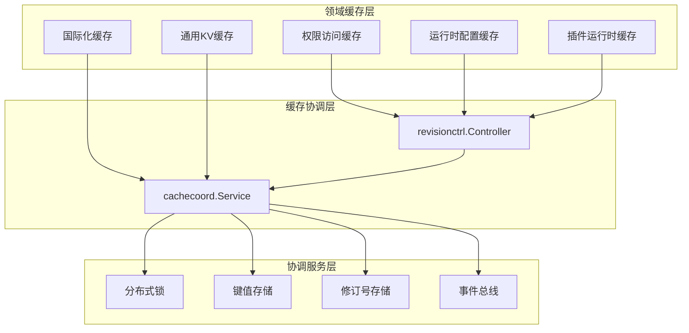
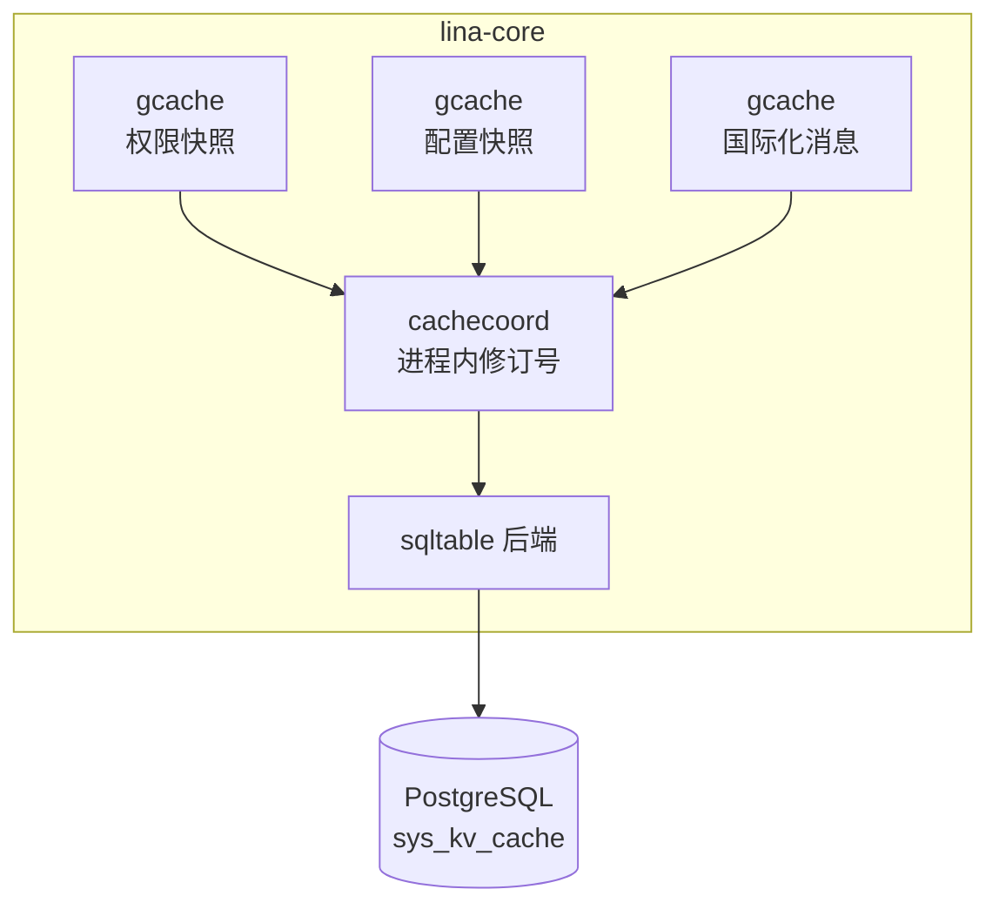
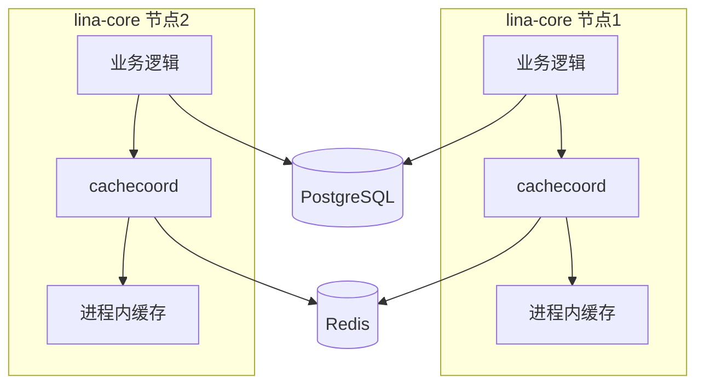
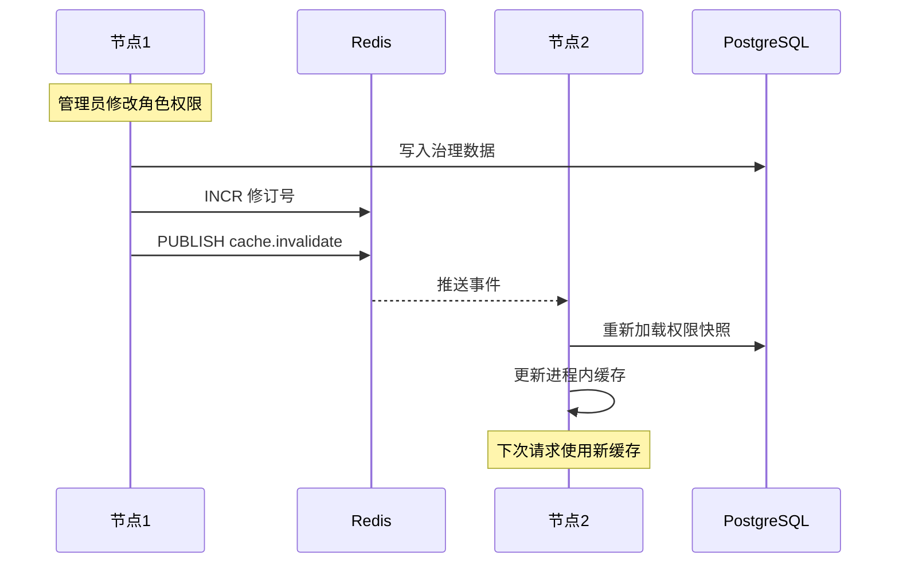
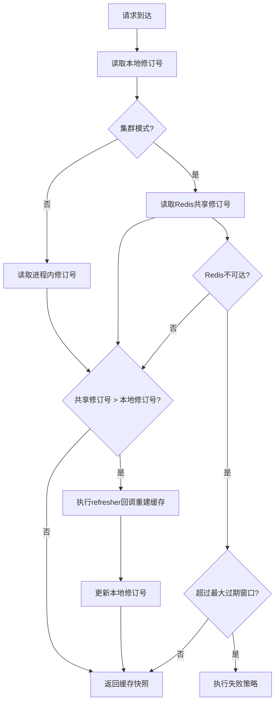
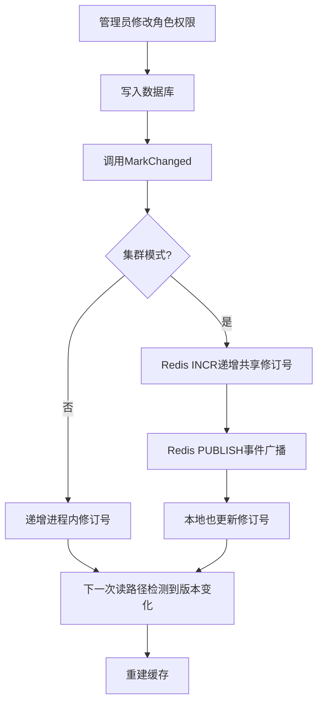

## 基本介绍

`LinaPro`采用多层、拓扑感知的缓存架构。单机模式下，所有缓存状态保存在进程内存和`PostgreSQL`中，不需要外部依赖；集群模式下，`Redis`承担跨节点协调职责，进程内缓存通过共享修订号和事件广播保持最终一致。

这套架构的核心设计理念是：**读路径检查版本号，写路径递增版本号**。每个缓存领域拥有独立的单调递增修订号，进程内缓存在构建时记录当时的修订号，后续每次读取时比对共享修订号与本地修订号，若共享修订号更新则触发本地缓存重建。这种机制避免了每次请求都回查数据库，同时保证变更能在多节点间收敛。

## 缓存架构总览

缓存体系由三个子系统组成，从上到下依次为领域缓存、缓存协调层和协调服务层。



**领域缓存层**直接面向业务读取路径，包括权限访问快照、运行时配置快照、国际化消息包和插件运行时状态等。每个领域缓存独立管理自己的失效逻辑。

**缓存协调层**（`cachecoord.Service`）提供统一的版本号管理接口，对上层屏蔽单机与集群的差异。`revisionctrl.Controller`是面向特定缓存领域的高层封装，将领域标识、作用域和租户范围绑定在一起，简化调用方的使用方式。

**协调服务层**（`coordination.Service`）提供最基础的分布式原语：分布式锁、键值存储、修订号存储和事件总线。单机模式下这些原语退化为进程内实现；集群模式下由`Redis`提供后端支持。

## 单机缓存设计

单机模式（`cluster.enabled: false`）是默认部署模式，不需要`Redis`。所有缓存状态保存在进程内存和`PostgreSQL`中。

### 进程内缓存

各领域缓存使用`GoFrame`的`gcache`组件管理进程内数据。`gcache`提供`GetOrSetFuncLock`方法防止缓存击穿——当多个请求同时发现缓存未命中时，只有一个请求执行加载逻辑，其他请求等待结果共享。

| 缓存领域 | 存储方式 | 过期策略 | 说明 |
|----------|---------|---------|------|
| 权限访问快照 | `gcache`实例 | 取`JWT`过期时间和会话超时的较小值 | 每个`Token`独立缓存，构建时记录当前修订号 |
| 运行时配置快照 | `gcache`实例 | 1小时硬过期 | 不可变快照，修改后整体替换 |
| 静态配置 | `sync.Once` | 进程生命周期 | `config.yaml`中的固定段落，解析一次后常驻内存 |
| 国际化消息包 | `gcache`实例 | 按版本号失效 | 按语言和来源（宿主、源码插件、动态插件）分桶管理 |

进程内缓存返回的快照经过深拷贝，防止请求作用域的修改污染共享状态。

### KV缓存后端

通用KV缓存用于保存短期状态、版本号和运行时快照。单机模式下使用`sqltable`后端，将缓存条目存储在`PostgreSQL`的`sys_kv_cache`表中。



`sqltable`后端在读取时过滤已过期的行，并通过后台定时任务批量清理过期条目（每批500条），避免表膨胀。

### 单机修订号

单机模式下，修订号保存在进程内存中（`processLocalRevisions`），递增和读取都是本地操作，没有网络开销。`cachecoord.NewStaticTopology(false)`将节点标记为独立主节点，所有协调逻辑退化为进程内操作。

## 集群缓存设计

集群模式（`cluster.enabled: true`）引入`Redis`作为跨节点协调后端。`PostgreSQL`继续负责业务数据和治理数据持久化；`Redis`负责选主、分布式锁、缓存修订号存储和跨节点事件广播。

### 协调服务

`coordination.Service`在集群模式下由`Redis`实现，提供五种子存储：

| 子存储 | 职责 | Redis实现 |
|--------|------|-----------|
| `LockStore` | 分布式锁，支持续约和隔离令牌 | `SET` + `EXPIRE` + Lua脚本 |
| `KVStore` | 短期键值状态，原生TTL、原子递增、`SetNX` | Redis原生命令 |
| `RevisionStore` | 单调递增修订号，按领域和作用域隔离 | `INCR` + `GET` |
| `EventBus` | 跨节点事件广播 | `Pub/Sub` |
| `HealthChecker` | 后端健康监测 | `PING` |



### KV缓存后端

集群模式下，KV缓存使用`coordination-kv`后端，将缓存条目委托给协调服务的`KVStore`（即Redis）。Redis原生支持TTL过期，不需要额外的清理任务。

### 跨节点事件

当某个节点递增共享修订号后，会通过`Redis Pub/Sub`发布`cache.invalidate`事件。事件载荷包含领域、作用域、租户标识、级联标志、修订号、变更原因和来源节点。其他节点接收事件后立即触发本地缓存刷新，不必等待下次读取时才发现版本落后。

事件广播是低延迟通知手段，修订号读取是兜底保障——即使事件丢失，读路径的版本号比对也能发现过期。



## 版本号缓存机制

版本号（修订号）缓存机制是`LinaPro`缓存体系的核心。每个缓存领域拥有一个单调递增的修订号，代表该领域权威数据源的当前版本。进程内缓存在构建时记录当时的修订号，后续读取时通过比对版本号判断缓存是否仍然有效。

### 核心接口

`cachecoord.Service`定义了版本号管理的核心接口：

| 方法 | 说明 |
|------|------|
| `ConfigureDomain(DomainSpec)` | 声明缓存领域的一致性契约 |
| `MarkChanged(ctx, domain, scope, reason)` | 发布修订号递增 |
| `MarkTenantChanged(ctx, domain, scope, tenantScope, reason)` | 带租户范围的修订号递增 |
| `EnsureFresh(ctx, domain, scope, refresher)` | 读路径检查，若过期则执行刷新回调 |
| `CurrentRevision(ctx, domain, scope)` | 返回当前可见的最新修订号 |
| `Snapshot(ctx)` | 诊断观测，返回所有领域的缓存状态 |

`revisionctrl.Controller`是面向特定领域的高层封装，将领域标识、作用域和租户范围预先绑定，调用方只需调用`EnsureFresh(ctx)`或`MarkChanged(ctx)`即可。

### 读路径流程

以权限检查为例，读路径的版本号比对流程如下：



关键步骤说明：

1. 读取本地记录的修订号，代表当前缓存构建时的数据版本。
2. 集群模式下从`Redis`读取共享修订号；单机模式下读取进程内计数器。
3. 若共享修订号大于本地修订号，说明数据已变更，执行`refresher`回调从数据库重新加载快照。
4. 若`Redis`不可达且未超过最大过期窗口（`MaxStale`），返回上次已知的缓存快照，实现软降级。
5. 若超过最大过期窗口，根据领域配置的失败策略处理。

### 写路径流程

以角色权限变更为例，写路径的修订号递增流程如下：



写路径完成后，本节点立即感知变更；其他节点通过事件广播或下次读取时的版本号比对感知变更。

### 领域一致性契约

每个缓存领域在注册时声明自己的一致性契约（`DomainSpec`），框架根据契约决定过期窗口和失败行为：

| 领域 | 标识 | 最大过期窗口 | 失败策略 | 说明 |
|------|------|-------------|---------|------|
| 权限访问 | `permission-access` | 3秒 | `FailClosed` | 权限相关，不可用时拒绝访问 |
| 运行时配置 | `runtime-config` | 10秒 | `ReturnVisibleError` | 配置相关，不可用时返回可见错误 |
| 插件运行时 | `plugin-runtime` | 5秒 | `ConservativeHide` | 插件相关，不可用时保守隐藏 |

失败策略的三种取值：

| 策略 | 行为 | 适用场景 |
|------|------|---------|
| `FailClosed` | 拒绝访问，返回权限不足 | 安全敏感的权限检查 |
| `ReturnVisibleError` | 向调用方返回明确错误 | 配置读取，需要让调用方知道状态异常 |
| `ConservativeHide` | 隐藏相关功能，降级运行 | 插件状态，不可用时不影响核心功能 |

### 租户隔离

修订号的存储键包含租户标识，确保租户间的缓存失效互不影响。当平台管理员修改平台级默认配置时，事件携带`cascadeToTenants=true`标志，所有租户的缓存视图都会被失效。租户级修改只影响该租户的修订范围。

```text
修订号键结构：{tenant_id}:{domain}:{scope}

示例：
  platform:permission-access:topology    → 平台级权限拓扑
  tenant-001:permission-access:topology   → 租户 tenant-001 的权限拓扑
  tenant-002:plugin-runtime:frontend      → 租户 tenant-002 的插件前端包
```

## 缓存失效策略

框架采用五种缓存失效机制，各领域根据自身特点组合使用。

### 版本号驱动失效

主要机制。通过单调递增的修订号感知数据变更，读路径比对版本号触发缓存重建。适用于权限拓扑、运行时配置、插件运行时等需要跨节点一致性的领域。

### 直接本地驱逐

针对`Token`级权限快照。用户登出或管理员强制踢出时，直接从`gcache`中移除对应`Token`的缓存条目。拓扑级变更（如角色权限调整）时清空所有`Token`快照，强制下次请求重新加载。

### 作用域国际化失效

国际化缓存支持按语言、来源（宿主、源码插件、动态插件）和单个插件标识进行细粒度失效。`InvalidateScope`结构体允许精确指定需要失效的语言和插件条目，不影响无关数据。

### 插件派生缓存失效

插件状态变更时，统一入口`publishPluginChange`一次性失效所有派生缓存：前端包、国际化插件扇区、`WASM`模块缓存、管理列表缓存和`OpenAPI`投影缓存。这种单入口设计确保所有派生状态同步失效，避免部分更新导致的状态不一致。

### TTL过期

`sys_kv_cache`表和Redis KV都支持基于TTL的过期。SQL后端需要后台定时任务清理过期行；Redis原生处理过期，不需要额外清理。

## 领域缓存设计

### 权限访问缓存

权限加载涉及多次数据库查询（用户→角色→菜单→权限标识），`lina-core`为此设计了`Token`级别的进程内缓存。每个登录`Token`对应一个`UserAccessContext`快照，包含角色集合、菜单`ID`集合、权限标识列表、数据范围和超级管理员标志。

缓存构建时记录当前的权限拓扑修订号。系统每`3`秒从共享存储同步最新版本号。当角色、菜单、权限等数据发生变更时，修订号递增，下一次请求命中缓存时检测到版本过期即丢弃缓存重新加载。

### 运行时配置缓存

受保护的运行时配置值（如`JWT`密钥、会话超时等）解析为不可变快照存储在`gcache`中，硬过期时间为1小时。配置修改后通过修订号机制触发快照重建。静态配置段落使用`sync.Once`一次性解析后常驻内存。

### 国际化缓存

国际化消息包按语言和来源分桶管理。每个桶维护独立的单调版本号和内容指纹，支持`ETag`协商。插件安装、卸载或更新时，仅失效对应插件扇区的语言包，不影响宿主和其他插件。

### 插件运行时缓存

插件运行时状态（启用快照、前端包路径、`WASM`模块、管理列表、`OpenAPI`投影）统一由`plugin-runtime`领域的修订号管理。插件治理操作通过`publishPluginChange`入口一次性失效所有派生缓存。

## 缓存配置

### 领域规格

| 配置项 | 说明 |
|--------|------|
| `Domain` | 领域标识，如`permission-access` |
| `AuthoritySource` | 权威数据源描述 |
| `ConsistencyModel` | 一致性模型：`local-only`或`shared-revision` |
| `MaxStale` | 最大过期窗口 |
| `SyncMechanism` | 同步机制描述 |
| `FailureStrategy` | 超过过期窗口时的失败策略 |

### KV缓存后端选择

后端由集群开关自动决定，业务代码无需感知：

| 模式 | 后端 | 存储位置 | 过期处理 |
|------|------|---------|---------|
| 单机 | `sqltable` | `PostgreSQL`的`sys_kv_cache`表 | 读取时过滤 + 后台批量清理 |
| 集群 | `coordination-kv` | Redis | Redis原生TTL |

### 大小限制

缓存条目有硬编码的大小限制，防止异常数据撑爆存储：

| 字段 | 最大大小 |
|------|---------|
| 所有者类型 | 16字节 |
| 所有者键 | 64字节 |
| 命名空间 | 64字节 |
| 缓存键 | 128字节 |
| 缓存值 | 4096字节 |

## 设计边界

- 缓存协调当前只支持`Redis`作为集群后端。
- 关键修订号不存储在通用KV缓存（`sys_kv_cache`或Redis KV）中，而是使用专用的`RevisionStore`，避免因缓存淘汰丢失版本信息。
- 后台同步任务按固定间隔轮询共享修订号（权限3秒、运行时配置10秒），即使没有请求到达也能保持本地缓存相对新鲜。
- 进程内缓存使用`GetOrSetFuncLock`防止缓存击穿，返回的快照经过深拷贝防止请求作用域污染。
- 高可用需要外部负载均衡、数据库可靠性和`Redis`可靠性共同保证，缓存机制本身不替代这些基础设施职责。
