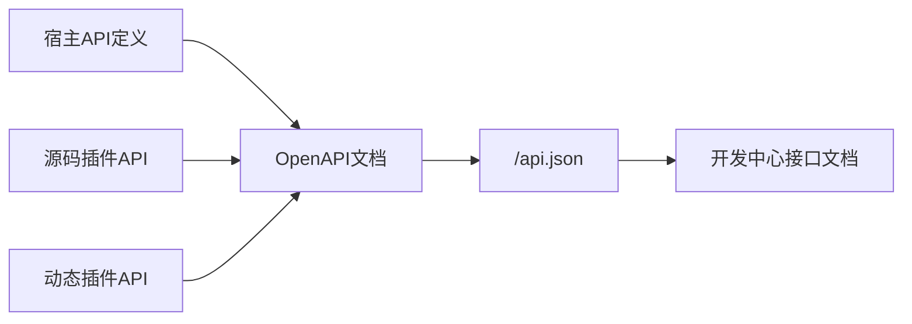

## 基本介绍

`lina-core`是`LinaPro`的后端宿主，也是所有通用平台能力的稳定底座。它基于`Go`语言构建，负责提供`RESTful API`契约、认证鉴权、权限治理、运行时配置、接口文档、定时调度、国际化、多租户上下文、插件生命周期和集群协调。

宿主的设计原则是：**宿主提供通用能力，业务领域通过插件扩展**。因此，`lina-core`不会直接内置具体业务模块，而是通过稳定的扩展接缝让源码插件和`WASM`动态插件接入。

## 目录结构

```text
apps/lina-core/
├── api/                     # API DTO与路由契约
├── internal/
│   ├── cmd/                 # 服务启动、路由绑定、插件扫描
│   ├── controller/          # HTTP控制器
│   └── service/             # 业务服务层
│       ├── apidoc/          # OpenAPI文档聚合
│       ├── auth/            # 认证服务
│       ├── bizctx/          # 请求身份与租户上下文
│       ├── cluster/         # 集群运行状态
│       ├── coordination/    # Redis协调抽象
│       ├── cron/            # 定时调度入口
│       ├── i18n/            # 国际化运行时
│       ├── jobmgmt/         # 持久化任务管理
│       └── plugin/          # 插件治理与运行时
├── manifest/
│   ├── config/              # 配置模板与框架元数据
│   ├── i18n/                # 宿主运行时语言包
│   └── sql/                 # 宿主DDL与初始化数据
└── pkg/
    ├── pluginhost/          # 源码插件扩展接缝
    ├── pluginbridge/        # WASM动态插件桥接协议
    ├── pluginservice/       # 发布给源码插件的宿主服务契约
    └── sourceupgrade/       # 源码插件运行时升级门面
```

## API契约层

宿主`API`层使用`g.Meta`结构体标签声明路径、方法、权限、摘要和参数。接口定义、权限标识和文档元数据共用同一个源头，避免文档和实现分离。

```go
type UserListReq struct {
    g.Meta   `path:"/users" method:"get" tags:"User" summary:"List users" permission:"user:list"`
    Page     int `json:"page" v:"min:1"`
    PageSize int `json:"pageSize" v:"min:1,max:100"`
}
```

这种方式带来三个好处：

| 能力 | 说明 |
|------|------|
| **契约集中** | 路径、方法、请求、响应和权限声明集中在`api/`目录 |
| **权限可审计** | `permission`标识直接绑定接口，便于角色和按钮权限治理 |
| **文档可生成** | 宿主启动后自动聚合为`OpenAPI`文档 |

## 治理服务

### 认证与会话

宿主使用`JWT`作为请求认证机制，登录成功后颁发`Token`，有效期由`jwt.expire`控制。会话服务记录在线状态、登录时间、设备信息和失效时间，并支持强制下线。

关键配置：

```yaml
jwt:
  secret: "lina-jwt-secret-key-change-in-production"
  expire: 24h

session:
  timeout: 24h
  cleanupInterval: 5m
```

生产环境必须替换`jwt.secret`，并避免在日志中输出敏感信息。

### RBAC权限

`LinaPro`采用声明式`RBAC`权限体系。角色通过菜单、页面和按钮权限获得访问范围，接口请求由认证中间件和权限中间件统一校验。

权限拓扑缓存在宿主运行时中，变更后通过缓存修订机制快速生效；在集群模式下，权限版本会通过协调服务同步到各节点。

### 操作审计

宿主中间件对写操作进行审计，记录请求路径、操作者、参数摘要和执行结果。密码等敏感字段应由中间件或服务层屏蔽，避免写入日志。

## 运行时配置

宿主默认配置位于：

```text
apps/lina-core/manifest/config/config.yaml
```

主要配置分组如下：

| 分组 | 说明 |
|------|------|
| `server` | `HTTP`监听地址、路由表输出、`/api.json`路径 |
| `logger` | 日志路径、级别、结构化日志和`TraceID` |
| `database` | 默认数据库连接串，生产推荐`PostgreSQL 14+` |
| `jwt` | 签名密钥和`Token`有效期 |
| `session` | 在线会话超时和清理间隔 |
| `scheduler` | 定时调度默认时区 |
| `i18n` | 默认语言、多语言开关和语言列表 |
| `cluster` | 单机/集群模式、`Redis`协调器和选主租约 |
| `upload` | 文件上传目录和单文件大小上限 |
| `plugin` | 强制卸载策略、动态插件产物目录和自动启用插件 |

数据库默认使用`PostgreSQL`：

```yaml
database:
  default:
    link: "pgsql:postgres:postgres@tcp(127.0.0.1:5432)/linapro?sslmode=disable"
```

`SQLite`仅适合单节点本地演示或冒烟验证，不建议用于生产，也不支持集群部署。

完整配置分组、生产环境检查项和插件自动启用说明见[配置管理](/docs/configuration)。

## 接口文档聚合

宿主启动后自动聚合宿主和已启用插件的接口，生成`OpenAPI`文档：

```text
http://localhost:8080/api.json
```

管理工作台在「开发中心 → 接口文档」中内嵌浏览和调试界面。接口文档会显示请求参数、响应结构、权限标识和多语言描述，便于前后端联调。



接口文档翻译位于`manifest/i18n/<locale>/apidoc/`。插件启用后，插件自己的接口文档翻译也会被纳入聚合。

接口契约声明、`permission`权限标签、源码插件和动态插件文档投影方式见[接口文档](/docs/api-reference)。

## 定时调度

宿主提供持久化定时调度子系统，任务配置和执行日志保存在数据库中。任务支持两种执行类型：

| 类型 | 说明 | 适用场景 |
|------|------|----------|
| `Go`处理器 | 调用宿主或插件注册的处理器 | 数据清理、统计、同步任务 |
| `Shell`命令 | 执行系统命令 | 文件处理、系统维护脚本 |

源码插件可以通过`pluginhost`注册自有任务处理器，随后在管理工作台中选择调用目标。任务还支持分组、手动触发、暂停恢复、超时控制和执行日志。

集群模式下，任务通过执行范围控制调度行为：

| 执行范围 | 说明 |
|----------|------|
| `master_only` | 仅主节点执行，适合全局唯一任务 |
| `all_node` | 每个节点都执行，适合节点本地任务 |

内置任务、执行日志、并发策略和插件任务注册方式见[定时任务](/docs/scheduled-tasks)。

## 国际化运行时

宿主默认提供`zh-CN`和`en-US`两套运行时语言资源。语言包位于：

```text
apps/lina-core/manifest/i18n/<locale>/
```

资源按语义域拆分，例如`menu.json`、`error.json`、`plugin.json`、`job.json`和`apidoc/`。插件在自己的`manifest/i18n/`中维护语言包，启用后由宿主自动合并。

国际化配置示例：

```yaml
i18n:
  default: zh-CN
  enabled: true
  locales:
    - locale: en-US
      nativeName: English
    - locale: zh-CN
      nativeName: 简体中文
```

修改语言包后，开发环境可以重启服务；生产环境应通过运行时缓存失效接口按语言或插件范围精确刷新，避免全量清空导致短暂翻译抖动。

语言包目录、运行时资源加载模式、插件语言包和接口文档翻译规则见[I18N国际化](/docs/i18n)。

## 多租户基础能力

宿主原生内置多租户基础接缝，但完整租户控制面由官方`multi-tenant`源码插件提供。未启用该插件时，系统默认运行在`tenant_id = 0`的平台租户上下文中，保持单租户开箱体验。

| 层级 | 职责 |
|------|------|
| 宿主 | `bizctx`请求上下文、身份快照、`tenant_id`过滤接缝、插件多租户元数据 |
| `multi-tenant`插件 | 租户主体、成员关系、租户解析、租户代管和租户插件治理 |
| 租户感知插件 | 在清单中声明多租户能力，并在自有表中使用`tenant_id`隔离数据 |

当前隔离模型为`Pool`共享表模型，使用`tenant_id`区分数据。`schema-per-tenant`、`database-per-tenant`、配额、计费和品牌定制保留为后续演进方向。

租户上下文、租户过滤服务、`multi-tenant`插件和租户级插件治理见[多租户能力](/docs/multi-tenant)。

## 插件运行时

宿主通过插件运行时加载和治理两类插件：

- 源码插件：随宿主编译，使用`pluginhost`注册路由、钩子、定时任务和生命周期回调。
- `WASM`动态插件：作为运行时产物上传，使用`pluginbridge`在沙箱中处理请求，并通过`hostServices`访问受治理的宿主能力。

插件运行时负责发现清单、检查依赖、执行安装和升级`SQL`、同步菜单权限、投影路由和钩子、刷新缓存，并在异常状态下控制业务入口。

## 集群协调

单机模式下，宿主只依赖`PostgreSQL`和进程内协调即可运行。集群模式启用后，必须配置分布式协调器（内置支持`Redis`，用户可自行适配修改）：

```yaml
cluster:
  enabled: true
  coordination: redis
  redis:
    address: "127.0.0.1:6379"
```

`Redis`用于选主、分布式锁、缓存修订和跨节点事件；`PostgreSQL`继续负责业务和治理数据持久化。更多部署细节见[原生分布式架构](/docs/distributed-architecture)。

## 健康探针

宿主提供`/health`端点，供负载均衡、容器编排和监控系统检查服务状态。默认检查数据库连通性，超时由`health.timeout`控制：

```yaml
health:
  timeout: 5s
```

健康探针返回标准`HTTP`状态码，正常为`200`，异常为`503`。

## 相关组件

- [默认管理工作台](/docs/admin-workspace)：宿主能力的标准前端消费者。
- [配置管理](/docs/configuration)：宿主运行时配置分组与生产检查项。
- [接口文档](/docs/api-reference)：宿主和插件统一`OpenAPI`文档聚合。
- [多租户能力](/docs/multi-tenant)：宿主租户上下文和官方租户控制面。
- [定时任务](/docs/scheduled-tasks)：持久化调度、内置任务和插件任务。
- [I18N国际化](/docs/i18n)：宿主、插件和接口文档语言资源。
- [双模式插件系统](/docs/plugin-system)：宿主如何治理源码插件和动态插件。
- [插件管理](/docs/plugin-management)：插件代码来源和运行时管理流程。
- [原生分布式架构](/docs/distributed-architecture)：集群模式的协调机制。
