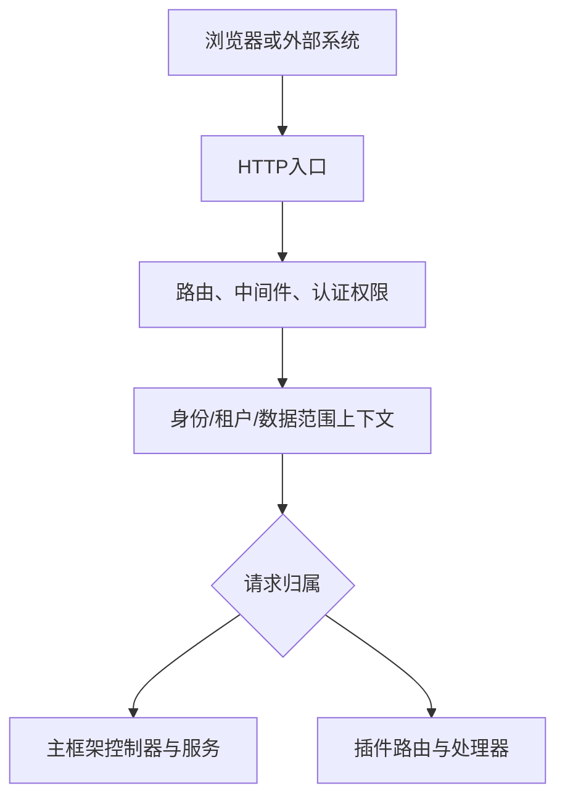

## 基本介绍

`lina-core`是`LinaPro`的后端主框架，也是平台级能力的稳定底座。它负责承载`HTTP`入口、认证鉴权、权限治理、运行时配置、接口文档聚合、定时调度、国际化、多租户上下文、插件治理、集群协调和健康探针。

这篇文档只解释主框架在整体系统中的位置和协作方式，不展开每个能力的完整配置和使用细节。需要深入了解某个专题时，可以从后文的能力矩阵跳转到对应文档。

`lina-core`的核心原则是：**主框架提供稳定公共能力，业务领域通过插件扩展**。主框架不直接内置具体业务模块，而是通过`pluginhost`、`pluginbridge`和`pluginservice`发布稳定扩展接缝，让源码插件和`WASM`动态插件接入统一治理面。

## 主框架边界

主框架的职责不是“包含所有功能”，而是把跨业务的公共能力统一治理起来，并为业务插件提供可复用的运行时环境。

| 范围 | 主框架职责 | 边界 |
|------|------------|------|
| <span style={{whiteSpace: 'nowrap'}}><strong>平台控制面</strong></span> | 管理用户、角色、菜单、会话、配置、文件、插件、任务等基础资源 | 不承载具体行业或项目业务模型 |
| <span style={{whiteSpace: 'nowrap'}}><strong>请求链路</strong></span> | 统一处理路由、中间件、认证、权限、租户上下文、数据范围和审计 | 不把业务规则写入全局中间件 |
| <span style={{whiteSpace: 'nowrap'}}><strong>接口扩展</strong></span> | 向源码插件发布`pluginhost`和`pluginservice`，向动态插件发布`pluginbridge`和`hostServices` | 插件不能直接依赖主框架`internal/`实现 |
| <span style={{whiteSpace: 'nowrap'}}><strong>运行时治理</strong></span> | 负责插件发现、安装、启用、禁用、升级、卸载、菜单权限同步和缓存刷新 | 插件自己的领域逻辑、前端页面和私有配置由插件维护 |
| <span style={{whiteSpace: 'nowrap'}}><strong>部署协调</strong></span> | 在单机模式下提供进程内协调，在集群模式下接入集群协调器 | 业务数据仍由数据库和插件自己的表结构承载 |

## 运行时架构

一次请求进入主框架后，会先经过统一入口和治理链路，再落到主框架控制器或插件路由。插件看到的是经过主框架整理后的身份、租户、权限和配置上下文，而不是主框架内部实现对象。



主路径只表达请求如何被治理和分发，旁路依赖通过下表理解：

| 关系 | 说明 |
|------|------|
| 主框架服务 → `PostgreSQL` | 保存用户、角色、菜单、配置、插件治理、任务日志和会话投影等数据 |
| 插件处理器 → `PostgreSQL` | 读写插件自有表，表结构和业务数据由插件负责 |
| 插件处理器 → `hostServices` | 动态插件通过授权快照访问配置、存储、锁、通知等宿主能力 |
| 主框架服务 → 集群协调器 | 在集群模式下处理选主、分布式锁、缓存修订、在线会话热状态和跨节点事件 |

## 目录结构

`lina-core`的代码目录围绕契约、控制器、服务、声明资源和公开扩展接口组织：

```text
apps/lina-core/
├── api/                     # API DTO与路由契约
├── internal/
│   ├── cmd/                 # 服务启动、路由绑定、插件扫描
│   ├── controller/          # HTTP控制器
│   ├── dao/                 # 数据访问对象
│   ├── model/               # 数据模型
│   ├── packed/              # 嵌入的主框架资源
│   └── service/             # 主框架内部服务
│       ├── auth/            # 认证服务
│       ├── bizctx/          # 请求身份与租户上下文
│       ├── cron/            # 定时调度入口
│       ├── i18n/            # 国际化运行时
│       ├── plugin/          # 插件治理与生命周期
│       └── ...              # 其他核心服务
├── manifest/
│   ├── config/              # 配置模板与框架元数据
│   ├── i18n/                # 主框架运行时语言包
│   └── sql/                 # 主框架DDL与初始化数据
└── pkg/
    ├── pluginhost/          # 源码插件扩展接口
    ├── pluginbridge/        # WASM动态插件桥接协议
    ├── pluginservice/       # 基础能力实现
    └── ...                  # 其他公共组件
```

目录边界也对应开发边界：主框架内部实现放在`internal/`中，插件只能依赖`pkg/`下发布的稳定契约。

## 内置平台能力

主框架内置的平台能力很多，但这篇文档只保留总览。每个专题的配置项、数据结构、开发方式和注意事项应放在对应专题页中维护。

| 能力 | 主框架职责 | 深入阅读 |
|------|------------|----------|
| <span style={{whiteSpace: 'nowrap'}}><strong>路由与中间件</strong></span> | 注册主框架`API`路由，承载插件的统一入口，执行认证、权限、审计等中间件 | <span style={{whiteSpace: 'nowrap'}}>[路由与中间件](/docs/routing)</span> |
| <span style={{whiteSpace: 'nowrap'}}><strong>认证与权限</strong></span> | 颁发和校验`JWT`，维护在线会话，按`RBAC`模型校验接口和菜单权限 | <span style={{whiteSpace: 'nowrap'}}>[权限管理策略](/docs/permission)</span> |
| <span style={{whiteSpace: 'nowrap'}}><strong>配置管理</strong></span> | 加载宿主配置，提供公开宿主配置白名单，并为插件提供插件作用域配置服务 | <span style={{whiteSpace: 'nowrap'}}>[服务配置管理](/docs/configuration)</span> |
| <span style={{whiteSpace: 'nowrap'}}><strong>接口文档</strong></span> | 聚合主框架、源码插件和动态插件的`OpenAPI`契约，输出`/api.json`并供工作台调试 | <span style={{whiteSpace: 'nowrap'}}>[一体化接口文档](/docs/api-reference)</span> |
| <span style={{whiteSpace: 'nowrap'}}><strong>定时调度</strong></span> | 管理持久化任务、任务处理器、执行日志、手动触发、集群执行范围和并发策略 | <span style={{whiteSpace: 'nowrap'}}>[定时任务调度与执行](/docs/cron-tasks)</span> |
| <span style={{whiteSpace: 'nowrap'}}><strong>I18N国际化</strong></span> | 加载主框架语言包，合并插件语言包，并为运行时文案和接口文档提供多语言资源 | <span style={{whiteSpace: 'nowrap'}}>[框架级I18N国际化](/docs/i18n)</span> |
| <span style={{whiteSpace: 'nowrap'}}><strong>多租户基础</strong></span> | 提供`bizctx`、身份快照、`tenant_id`过滤接口和插件多租户元数据 | <span style={{whiteSpace: 'nowrap'}}>[原生多租户能力](/docs/multi-tenant)</span> |
| <span style={{whiteSpace: 'nowrap'}}><strong>插件运行时</strong></span> | 发现插件清单，执行生命周期，投影路由、菜单、权限、钩子、任务和公开静态资源 | <span style={{whiteSpace: 'nowrap'}}>[双模式插件系统](/docs/plugin-system)</span> |
| <span style={{whiteSpace: 'nowrap'}}><strong>集群协调</strong></span> | 在集群模式下通过协调器处理选主、分布式锁、缓存修订、键值缓存和跨节点事件 | <span style={{whiteSpace: 'nowrap'}}>[原生分布式架构](/docs/distributed-architecture)</span> |
| <span style={{whiteSpace: 'nowrap'}}><strong>静态资源</strong></span> | 托管主框架嵌入资源、管理工作台资源和插件显式声明的公开资源 | <span style={{whiteSpace: 'nowrap'}}>[静态资源与前端资产](/docs/static-assets)</span> |

## 启动与加载流程

主框架启动时会先建立宿主运行时，再把插件能力接入统一治理面。推荐从这个顺序理解主框架和插件之间的关系：

1. 加载配置与框架元数据。
2. 初始化数据库连接与`DDL`。
3. 加载主框架语言包。
4. 扫描源码插件与动态插件声明。
5. 执行插件依赖、版本和治理资源检查。
6. 投影路由、菜单、权限、`Hook`、`Cron`和公开资产。
7. 构建运行时缓存与集群修订状态。
8. 启动定时调度。
9. 启动`HTTP`服务与健康探针。

这个流程体现了主框架的编排职责：它先保证自身控制面可用，再把插件声明转化为运行时能力。插件启用、禁用、升级或卸载时，也会沿着同一条治理主链刷新路由、权限、菜单、语言包、接口文档和缓存。

## 与其他组件的关系

`lina-core`是后端运行时中心，但它不独占系统能力。它通过公开契约与其他组件协作：

| 组件 | 协作方式 |
|------|----------|
| 管理工作台 | 通过主框架公开`API`读取菜单、权限、配置、插件状态、接口文档和任务数据 |
| 源码插件 | 随主框架编译，通过`pluginhost`注册路由、钩子、任务、生命周期回调和前端资产 |
| `WASM`动态插件 | 作为运行时产物上传，通过`pluginbridge`处理请求，并通过`hostServices`访问授权能力 |
| `PostgreSQL` | 保存主框架治理数据、插件治理数据、任务日志、会话投影和插件业务表 |
| `Redis`协调器 | 在集群模式下承担选主、锁、缓存修订、在线会话热状态和跨节点事件 |

从依赖方向看，工作台和插件都依赖主框架的公开契约；主框架不反向依赖具体业务插件的内部实现。

