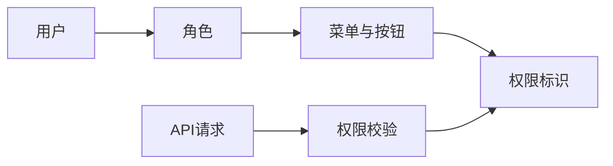
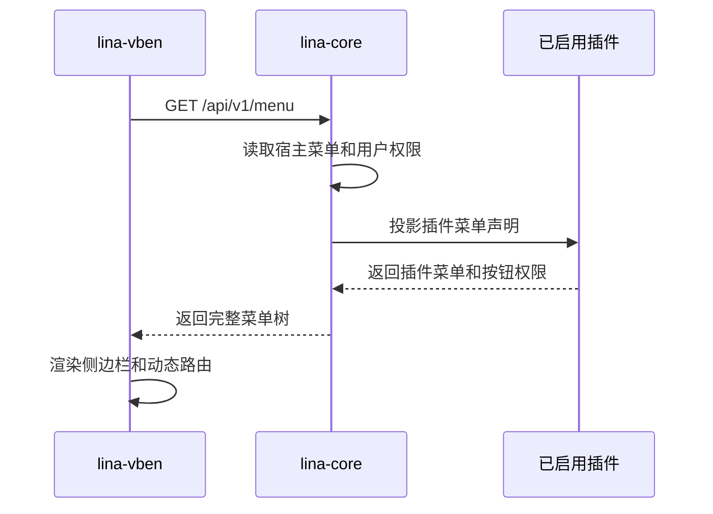

## 基本介绍

`lina-vben`是`LinaPro`内置的默认管理工作台，基于`Vue 3 + Vben5 + Ant Design Vue + TypeScript`构建。它不是业务逻辑的定义者，而是`lina-core`宿主`API`和所有已启用插件`API`的标准`UI`表达层。

开发者可以直接基于它构建业务应用，也可以替换为自定义前端。只要新的前端遵循宿主公开的`RESTful API`和权限模型，就能接入同一套后端能力。

## 技术栈

| 技术 | 说明 |
|------|------|
| `Vue 3` | 前端框架 |
| `Vben5` | 企业级管理工作台基础框架 |
| `Ant Design Vue` | 后台管理界面组件库 |
| `TypeScript` | 类型约束和前端工程质量保障 |
| `Vite` | 前端构建工具 |
| `Pinia` | 前端状态管理 |
| `TailwindCSS` | 样式工具链 |

## 设计边界

### 工作台消费契约，不定义契约

工作台从宿主读取菜单、权限、用户、角色、配置、任务、插件状态和接口文档等数据。接口行为由后端`API`契约定义，工作台只负责组织交互体验。

### 菜单来自宿主治理数据

侧边栏不是纯前端硬编码结果。宿主返回菜单树时会合并内置菜单和已启用插件声明的菜单，并根据当前用户权限过滤。插件禁用后，菜单和路由入口会自动消失。

### 插件页面通过动态页壳加载

源码插件和动态插件都可以声明前端页面。工作台通过`system/plugin/dynamic-page`页壳承载插件页面，减少插件接入时对工作台代码的侵入。

## 功能模块

工作台提供的是宿主和插件能力的可视化入口。不同模块的后端归属不同，但用户在界面中获得统一体验。

| 模块 | 主要能力 | 来源 |
|------|----------|------|
| **权限管理** | 用户、角色、菜单、按钮权限、权限分配 | 宿主 |
| **系统设置** | 字典、参数、文件管理、运行配置 | 宿主 |
| **任务调度** | 任务、分组、执行日志、手动触发 | 宿主 |
| **多租户管理** | 租户、成员、租户切换、租户插件治理 | `multi-tenant`插件 |
| **组织管理** | 部门、岗位 | `org-center`插件 |
| **内容管理** | 通知公告 | `content-notice`插件 |
| **系统监控** | 在线用户、服务监控、操作日志、登录日志 | `monitor-*`插件 |
| **扩展中心** | 插件发现、安装、启用、禁用、升级、卸载 | 宿主与插件系统 |
| **开发中心** | 接口文档、系统信息 | 宿主 |

## 权限管理体验

权限管理围绕`RBAC`模型展开：

用户管理、角色管理和菜单管理分别承担账号、授权集合和权限树维护。角色勾选菜单或按钮权限后，权限拓扑会快速生效；在集群模式下，宿主通过缓存修订机制通知其他节点刷新。

## 插件菜单动态注入

插件菜单的注入链路如下：

这种设计让插件启用、禁用和权限变更都能通过宿主治理数据驱动，工作台无需为每个插件单独改代码。

## 扩展中心

扩展中心是插件运行时治理的主要界面。它展示插件类型、版本、状态、运行时升级状态、依赖关系和可用操作。

常见操作包括：

| 操作 | 说明 |
|------|------|
| **安装** | 执行依赖检查、安装`SQL`并写入治理记录 |
| **启用** | 注册菜单、路由、钩子、定时任务并激活业务入口 |
| **禁用** | 隐藏菜单和路由，保留插件数据 |
| **卸载** | 清理治理记录，并按用户选择决定是否清理插件自有数据 |
| **升级** | 对`pending_upgrade`或`upgrade_failed`插件执行显式运行时升级 |
| **上传动态插件** | 上传`.wasm`产物，进入动态插件发现和治理流程 |

## 开发中心

开发中心聚合宿主和插件接口文档，开发者可以查看`OpenAPI`文档、请求参数、响应结构和权限标识，并直接发起调试请求。在线调试会使用当前登录用户的认证状态，写操作会产生真实数据变更，应在测试环境谨慎使用。

## 默认账号

本地演示环境通常使用以下默认账号：

| 字段 | 值 |
|------|----|
| 用户名 | `admin` |
| 密码 | `admin123` |
| 默认前端地址 | `http://localhost:5666` |

生产环境应在初始化后立即修改默认密码，并按组织安全策略配置角色和权限。

## 扩展建议

如果要在默认工作台上扩展业务功能，优先通过插件声明菜单、页面和`API`，而不是直接改工作台内部模块。只有当你要调整全局布局、主题、登录页或通用交互规范时，才需要修改`lina-vben`自身。
