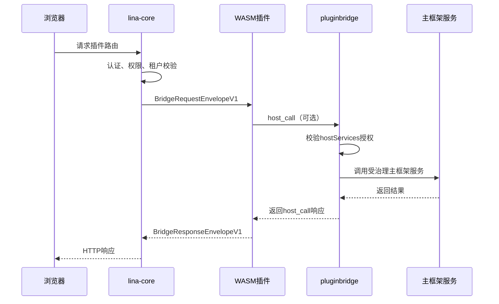

## 基本介绍

动态插件是`LinaPro`面向运行时扩展的插件形态。它将插件编译为`.wasm`产物，支持在主框架运行时上传、安装、启用、禁用、卸载和显式升级，不需要重新编译主框架。

动态插件运行在`WASM`沙箱中。它不能直接访问主框架文件系统、网络或数据库，所有主框架能力访问都必须通过`pluginbridge`和`hostServices`授权。

### 适用场景

| 场景 | 说明 |
|------|------|
| **运行时热加载** | 上传`.wasm`产物后即可进入插件治理流程 |
| **临时能力验证** | 可快速上线验证性功能，验证后再决定是否转源码插件 |
| **商业插件分发** | 可以只交付二进制产物，不暴露源码 |
| **受控外部集成** | 网络、存储、数据访问都通过授权快照治理 |

长期核心业务能力仍优先选择源码插件；动态插件适合热加载和隔离要求更高的场景。

### WebAssembly 简介

`WebAssembly`（简称`WASM`）是一种面向栈式虚拟机的二进制指令格式，由`W3C`标准化。它最初为浏览器设计，现已广泛应用于服务端、边缘计算和插件系统等场景。

- **跨平台性**：`WASM`模块是平台无关的二进制格式，同一份`.wasm`产物无需重新编译，即可在`Linux`、`macOS`、`Windows`等操作系统以及`x86`、`ARM`等不同指令集上运行。

- **安全沙箱**：`WASM`运行在严格隔离的沙箱环境中，默认无法访问主框架的文件系统、网络、内存或系统调用。所有主框架能力都必须通过显式接口授权才能使用，从根本上限制了恶意代码或漏洞的扩散范围。

- **接近原生的性能**：`WASM`使用紧凑的二进制格式，运行时可被即时编译（`JIT`）为原生机器码，在有沙箱隔离保障的同时仍能达到接近原生代码的执行效率。

- **热加载支持**：`WASM`模块可以在运行时动态加载和卸载，无需重启主框架进程。这为插件系统提供了天然的热更新能力，新版本模块可在不影响系统整体运行的情况下上线或回滚。

- **多语言生态**：`Go`、`Rust`、`C/C++`、`AssemblyScript`等主流语言均可编译为`WASM`，插件开发者无需绑定单一技术栈。`LinaPro`当前以`Go`为主要插件开发语言，并基于`WASI`（`WebAssembly System Interface`）扩展了沙箱与主框架服务的通信契约。

## 运行模型



主框架先完成认证、权限和租户上下文处理，再把请求快照传入`WASM`实例。动态插件看到的是结构化请求包，而不是裸主框架内部对象。


## 目录结构

动态插件的源码目录结构和源码插件一致，但会额外提供`main.go`作为`WASM`入口：

```text
apps/lina-plugins/<plugin-id>/
├── main.go                          # WASM导出函数入口
├── plugin.yaml
├── plugin_embed.go
├── backend/
│   ├── api/                         # API DTO与路由契约
│   ├── internal/
│   │   ├── controller/              # HTTP控制器
│   │   ├── service/                 # 业务服务层
│   │   ├── dao/                     # gf gen dao生成
│   │   └── model/                   # do/entity模型
│   └── plugin.go                    # 插件注册入口
├── frontend/
│   └── pages/                       # 动态插件前端资产
├── manifest/
│   ├── config/
│   │   ├── config.yaml              # 动态产物携带的默认配置
│   │   └── config.example.yaml      # 配置模板，不作为运行时默认值
│   ├── sql/                         # 安装与升级SQL
│   │   ├── mock-data/               # 演示数据，可选
│   │   └── uninstall/               # 卸载SQL
│   └── i18n/                        # 插件语言包
└── README.md
```

构建工具会优先读取插件嵌入资源，并在需要时回退扫描目录，把`plugin.yaml`、`frontend/`资产、`manifest/sql`、`manifest/i18n`、`manifest/config/config.yaml`、`manifest/config/config.example.yaml`和`manifest/`下的其他资源写入动态产物。运行时资源会绑定到当前有效发布的校验和与生成号，安装、启用、禁用、卸载、升级或同版本刷新都会触发相应缓存失效。

动态插件的配置与`manifest`资源路径语义和源码插件保持一致。`manifest/config/config.yaml`会作为动态`artifact`携带的默认配置快照，只有在没有生产外部配置和开发期配置文件时才作为回退来源；`manifest/config/config.example.yaml`只是模板。`profile.yaml`、`resources/policy.yaml`、`config/config.example.yaml`、`sql/*.sql`和`i18n/*.json`等文件都可以通过`manifest`类`hostServices`按原文读取，但必须在`resources.paths`中授权；读取原文不替代配置、`SQL`或国际化专用管线。完整说明参见[插件配置与manifest资源](/docs/plugin-config-and-manifest)。

## WASM入口

动态插件需要导出主框架约定的函数。以官方示例为例：

```go
var guestRuntime = pluginbridge.NewGuestRuntime(dynamicbackend.HandleRequest)

//go:wasmexport lina_dynamic_route_alloc
func linaDynamicRouteAlloc(size uint32) uint32 {
    return guestRuntime.Alloc(size)
}

//go:wasmexport lina_dynamic_route_execute
func linaDynamicRouteExecute(size uint32) uint64 {
    responsePointer, responseLength, err := guestRuntime.Execute(size)
    if err != nil {
        fallback, _ := pluginbridge.EncodeResponseEnvelope(
            pluginbridge.NewInternalErrorResponse(err.Error()),
        )
        responsePointer, responseLength, _ = guestRuntime.ExposeResponseBuffer(fallback)
    }
    return uint64(responsePointer)<<32 | uint64(responseLength)
}

//go:wasmexport lina_host_call_alloc
func linaHostCallAlloc(size uint32) uint32 {
    return guestRuntime.HostCallAlloc(size)
}

func main() {}
```

业务路由通常委托给`pluginbridge.MustNewGuestControllerRouteDispatcher`，由控制器方法处理具体请求。`linactl`会为`wasip1`构建注入零反射分发所需的契约元数据。

## hostServices授权

动态插件必须在`plugin.yaml`中声明需要访问的主框架服务、方法和资源范围。主框架安装或启用时会将授权写入发布快照，运行时任何未授权调用都会被拒绝。

| 服务 | 典型能力 |
|------|----------|
| `runtime` | 日志写入、插件状态、时间、`UUID`、节点信息 |
| `data` | 受表范围和租户过滤约束的数据库读写 |
| `storage` | 插件命名空间内的文件读写 |
| `network` | 受目标地址约束的外部`HTTP`请求 |
| `cache` | 集群感知缓存读写 |
| `lock` | 分布式锁获取、续约和释放 |
| `cron` | 动态插件内置任务注册 |
| `config` | 当前插件自己的只读配置读取 |
| `hostConfig` | 宿主公开配置白名单读取 |
| `manifest` | 当前插件`manifest/`原始资源读取 |
| `notify` | 主框架通知能力 |

示例：

```yaml
hostServices:
  - service: runtime
    methods: [log.write, info.now, info.node]
  - service: cron
    methods: [register]
  - service: data
    methods: [list, get, create, update, delete]
    resources:
      tables:
        - plugin_demo_dynamic_record
  - service: network
    methods: [request]
    resources:
      - url: https://api.example.com
  - service: config
    methods: [get]
  - service: hostConfig
    methods: [get]
    resources:
      keys:
        - workspace.basePath
        - i18n.default
  - service: manifest
    methods: [get]
    resources:
      paths:
        - profile.yaml
```

`config`、`hostConfig`和`manifest`只允许`get`方法。`guest`侧`SDK`提供的`String`、`Bool`、`Int`、`Duration`、`Scan`等便捷函数会转化为`get`调用，不需要也不能作为清单授权方法声明。`hostConfig`必须声明`resources.keys`，`manifest`必须声明`resources.paths`。`manifest`资源路径相对`manifest/`目录，例如示例中的`profile.yaml`不应写成`manifest/profile.yaml`。

## 构建动态插件

动态插件使用标准`Go`工具链编译到`wasip1/wasm`目标，同时项目提供`make`编译指令以简化使用复杂度：

```bash
make wasm
make wasm p=plugin-demo-dynamic
```

构建产物输出到`temp/output/<plugin-id>.wasm`，并包含插件清单、路由契约、公开前端资产、安装与卸载脚本、语言包、插件默认配置和`manifest`资源。构建产物中的默认配置只在没有生产外部配置和开发期配置时作为回退来源。

## 前端资产

动态插件通过`plugin.yaml`的`public_assets`声明可公开资源，主框架统一托管到`/x-assets/{plugin-id}/{version}/...`：

```yaml
public_assets:
  - source: frontend/pages
    mount: /
    index: index.html

menus:
  - key: plugin:linapro-demo-dynamic:main-entry
    path: /x-assets/linapro-demo-dynamic/v0.1.0/mount.js
    component: system/plugin/dynamic-page
    query:
      pluginAccessMode: embedded-mount
```

动态插件产物中存在的`frontend`文件不会自动全部公开，只有命中`public_assets`声明的资源才会通过`/x-assets`返回。插件禁用、未安装、租户不可用或访问版本不匹配时，公开资产默认返回`404`。

## 安装、启用与升级

动态插件的运行时流程：

1. 构建`.wasm`产物。
2. 在管理工作台的扩展中心上传动态插件包。
3. 主框架验证`WASM`文件头、自定义段、嵌入清单、`ABI`版本和资源。
4. 管理员确认`hostServices`授权；如果存在`storage`、`network`、`data`、`hostConfig`、`manifest`等资源型声明，需要确认资源范围。
5. 执行安装`SQL`并写入治理记录。
6. 启用后，主框架装载`WASM`沙箱并投影路由、菜单、公开资产和资源快照。

上传更高版本时，主框架不会直接切换有效版本，而是将插件标记为`pending_upgrade`。管理员在插件管理页预览差异并显式执行运行时升级。升级失败时保留旧有效版本，并记录失败诊断，便于修复后重试。

动态插件`API`最终公开在统一插件命名空间下。主框架只负责拼接`/x/{plugin-id}`前缀，后续路径来自插件自己的路由契约，因此外部访问路径形如：

```text
/x/linapro-demo-dynamic/demo-records
/x/linapro-demo-dynamic/backend-summary
```

## 与源码插件的差异

| 维度 | 源码插件 | `WASM`动态插件 |
|------|----------|----------------|
| 交付形式 | 源码参与主框架编译 | `.wasm`运行时产物 |
| 热加载 | 需要部署新主框架 | 支持运行时上传和启用 |
| 性能 | 原生`Go`性能 | 有沙箱和桥接开销 |
| 主框架能力访问 | `pluginhost`稳定契约 | `hostServices`授权桥接 |
| 隔离强度 | 命名空间隔离 | `WASM`沙箱隔离 |
| 调试体验 | 标准`Go`调试链路 | 更依赖日志和桥接诊断 |
| 适用场景 | 长期业务模块 | 商业分发、热加载、临时扩展 |

## 最佳实践

- 只申请实际需要的`hostServices`方法和资源范围。
- 数据表仍使用插件`ID`命名空间，避免与主框架和其他插件冲突。
- 对外网络访问应明确目标地址，避免泛化授权。
- 对运行时升级准备可回滚、幂等的升级`SQL`。
- 把长期高频业务逻辑沉淀为源码插件，把动态插件用于热加载和隔离场景。
