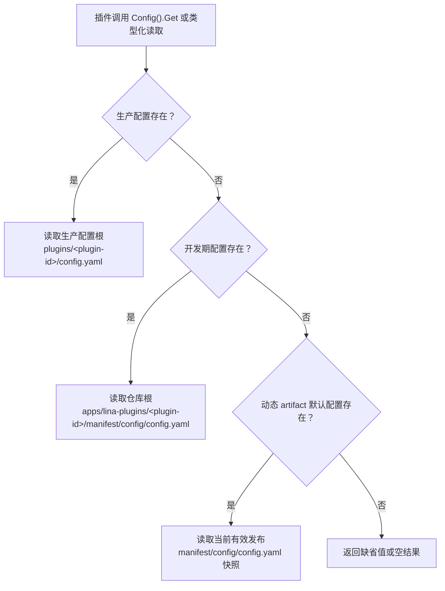

## 基本介绍

`LinaPro`的插件配置和`manifest`资源采用解耦设计。插件可以拥有自己的配置文件和`manifest`资源，不需要把业务配置塞进主框架`config.yaml`，也不需要让主框架为每个插件增加专用配置字段。

这套设计同时适用于源码插件和动态插件：

- **插件配置**：放在插件自己的`manifest/config/config.yaml`中，运行时通过插件作用域的`Config()`服务读取。
- **配置模板**：放在`manifest/config/config.example.yaml`中，用于说明可配置项，不作为运行时默认值读取。
- **manifest资源**：放在`manifest/`下的插件自有文件中，例如`profile.yaml`、`resources/policy.yaml`、`config/config.example.yaml`、`sql/*.sql`或`i18n/*.json`，运行时通过插件作用域的`Manifest()`服务按原始字节读取。

插件配置回答“这个插件在当前部署里怎么运行”，`manifest`资源回答“这个插件版本携带了哪些自有资源，以及插件要如何读取这些资源”。两者都归插件所有，但生命周期不同：配置允许生产环境覆盖，`manifest`资源更接近插件版本的一部分。

## 目录结构

典型插件目录如下：

```text
apps/lina-plugins/<plugin-id>/
├── plugin.yaml
├── manifest/
│   ├── config/
│   │   ├── config.yaml
│   │   └── config.example.yaml
│   ├── profile.yaml
│   ├── resources/
│   │   └── policy.yaml
│   ├── sql/
│   └── i18n/
└── backend/
```

| 路径 | 主要用途 | `Manifest()`读取路径 |
|------|----------|----------------------|
| `manifest/config/config.yaml` | 插件默认运行配置，由`Config()`决定是否作为默认配置生效 | `config/config.yaml` |
| `manifest/config/config.example.yaml` | 配置模板和说明，不作为运行时默认值读取 | `config/config.example.yaml` |
| `manifest/profile.yaml` | 插件自定义`YAML`资源示例 | `profile.yaml` |
| `manifest/resources/*.yaml` | 插件自定义资源 | `resources/*.yaml` |
| `manifest/sql/` | 安装、升级、卸载脚本，由生命周期管线决定是否执行 | `sql/*.sql` |
| `manifest/i18n/` | 插件语言包，由国际化管线决定是否加载 | `i18n/*.json` |

`Manifest()`读取路径始终相对`manifest/`。例如读取`manifest/profile.yaml`时，调用路径应写`profile.yaml`，不能写`manifest/profile.yaml`。

## 配置读取顺序

插件配置服务只读取当前插件作用域内的`config.yaml`，读取顺序如下：



### 生产部署配置路径

生产覆盖配置路径不是固定的仓库根路径，而是“生产配置路径”下的插件配置：

```text
工作目录/plugins/<plugin-id>/config.yaml
```

### 开发阶段默认配置

本地开发时，插件默认配置直接放在插件源码目录：

```text
apps/lina-plugins/<plugin-id>/manifest/config/config.yaml
```

这使插件开发者可以把插件自己的默认行为、演示开关、外部服务缺省地址或调度参数放在插件目录内维护。主框架不需要知道每个插件有哪些业务配置项。

### 动态插件默认配置

动态插件构建为`.wasm`产物时，构建工具会把`manifest/config/config.yaml`写入动态`artifact`。运行时如果没有生产覆盖配置，也没有开发期配置文件，主框架会使用当前有效发布中携带的默认配置快照。

这让动态插件可以随版本携带一份自描述默认配置，同时仍允许生产环境用外部配置覆盖。插件升级后，默认配置也随有效发布版本切换，不会依赖源码目录。

### 配置模板不参与读取

`manifest/config/config.example.yaml`只用于展示配置项和示例值，不参与运行时默认值读取。不要把只存在于`config.example.yaml`中的值当作插件运行时默认配置。

推荐写法是：

```text
manifest/config/config.yaml          # 可运行的默认配置
manifest/config/config.example.yaml  # 给运维或用户看的配置模板
```

## HostServices中的配置服务

插件通过`registrar.HostServices()`获取插件作用域的主框架服务。与配置和`manifest`资源相关的服务主要有三个：

| 服务 | 读取范围 | 典型用途 |
|------|----------|----------|
| `Config()` | 当前插件自己的配置 | 插件业务开关、外部系统地址、超时时间、调度参数 |
| `HostConfig()` | 宿主公开配置白名单 | 工作台基准路径、默认语言、已启用语言等少量公开键 |
| `Manifest()` | 当前插件`manifest/`下的原始资源 | 读取插件随版本携带的`YAML`、`JSON`、`SQL`、配置模板等文件内容 |

源码插件中可以这样读取：

```go
func registerRoutes(ctx context.Context, registrar pluginhost.HTTPRegistrar) error {
    services := registrar.HostServices()

    endpoint, err := services.Config().String(ctx, "sync.endpoint", "")
    if err != nil {
        return err
    }

    interval, err := services.Config().Duration(ctx, "sync.interval", 30*time.Second)
    if err != nil {
        return err
    }

    workspaceBase, err := services.HostConfig().String(ctx, "workspace.basePath", "/admin")
    if err != nil {
        return err
    }

    _ = endpoint
    _ = interval
    _ = workspaceBase
    return nil
}
```

动态插件通过`pluginbridge`的`guest`侧能力访问同类`hostServices`。动态插件必须先在`plugin.yaml`中声明授权：

```yaml
hostServices:
  - service: config
    methods: [get]
  - service: hostConfig
    methods: [get]
    resources:
      keys:
        - workspace.basePath
        - i18n.default
```

`config`只读取当前插件自己的配置；`hostConfig`只能读取宿主公开白名单键。插件不应通过全局`g.Cfg()`扫描宿主完整配置树，也不应要求用户把插件业务配置写进主框架`config.yaml`。

## manifest资源

插件可以通过`Manifest()`读取当前插件`manifest/`下的原始资源。`Manifest().Get()`返回文件字节，`Manifest().Exists()`检查文件是否存在，`Manifest().Scan()`用于把`YAML`资源或其中某个嵌套键扫描到结构体。

自定义声明型`YAML`只是`manifest`资源的一种常见用法。文件名没有框架级特殊语义，`profile.yaml`、`resources/policy.yaml`或团队约定的其他名称都可以，只要路径安全即可。例如：

```yaml
category: content
display:
  icon: ant-design:file-text-outlined
  accentColor: '#1677ff'
features:
  import: true
  export: true
external:
  provider: example-cms
  docsUrl: https://example.com/docs
```

### 读取来源

源码插件和动态插件的读取来源不同，但路径语义相同：调用路径都相对当前插件的`manifest/`根目录。

| 插件类型 | `Manifest()`读取来源 | 边界 |
|----------|----------------------|------|
| 源码插件 | 当前插件绑定的嵌入文件系统；缺失时回退到仓库开发目录`apps/lina-plugins/<plugin-id>/manifest/` | 只能读取当前插件自己的`manifest/`资源，不读取宿主或其他插件目录 |
| 动态插件 | 当前有效发布`artifact`中携带的`manifest/`资源快照 | 必须经过`plugin.yaml`的`service: manifest`和`resources.paths`授权快照校验 |

动态插件升级、回滚或同版本刷新后，`Manifest()`看到的是当前有效发布绑定的资源快照。这样可以保证动态插件读取到的原始资源和实际生效的发布版本一致。

### YAML便捷扫描

读取自定义`YAML`资源时可以使用`Manifest().Scan()`：

```go
type PluginProfile struct {
    Category string `yaml:"category"`
    Display  struct {
        Icon        string `yaml:"icon"`
        AccentColor string `yaml:"accentColor"`
    } `yaml:"display"`
    Features struct {
        Import bool `yaml:"import"`
        Export bool `yaml:"export"`
    } `yaml:"features"`
}

func loadProfile(ctx context.Context, services pluginhost.Services) (*PluginProfile, error) {
    profile := &PluginProfile{}
    if err := services.Manifest().Scan(ctx, "profile.yaml", "", profile); err != nil {
        return nil, err
    }
    return profile, nil
}
```

也可以只扫描某个嵌套键：

```go
var features struct {
    Import bool `yaml:"import"`
    Export bool `yaml:"export"`
}

if err := services.Manifest().Scan(ctx, "profile.yaml", "features", &features); err != nil {
    return err
}
```

也可以读取原始文本或字节内容：

```go
content, err := services.Manifest().Get(ctx, "config/config.example.yaml")
if err != nil {
    return err
}
if len(content) > 0 {
    _ = string(content)
}
```

### 动态插件授权

动态插件如果要读取`manifest`资源，也需要在`plugin.yaml`中声明资源范围：

```yaml
hostServices:
  - service: manifest
    methods: [get]
    resources:
      paths:
        - profile.yaml
        - resources/*.yaml
        - config/config.example.yaml
        - sql/*.sql
        - i18n/zh-CN/*.json
```

动态插件`manifest`资源路径支持精确路径和受控通配模式。路径仍然相对`manifest/`，不要写成`manifest/profile.yaml`。

源码插件不通过`plugin.yaml`的`resources.paths`做额外授权，因为源码插件随宿主编译和交付，属于受信任扩展；但源码插件仍受路径安全约束和插件作用域约束。动态插件通过`WASM`接入，必须显式声明并经过宿主确认后才能读取对应路径。

### 专用目录原文读取

`Manifest()`读取的是文件原始内容，不会让这些文件自动“生效”。例如：

| 读取路径 | 可以通过`Manifest()`获得什么 | 真正生效机制 |
|----------|------------------------------|--------------|
| `config/config.yaml` | 当前插件随源码或动态`artifact`携带的配置文件原始内容 | 运行配置仍由`Config()`按生产、开发期、动态默认配置顺序读取 |
| `config/config.example.yaml` | 配置模板原文 | 只作为模板和说明，不参与默认值读取 |
| `sql/*.sql` | 安装、升级或卸载脚本文本 | 是否执行由插件生命周期管线决定 |
| `i18n/*.json` | 插件语言包原文 | 是否加载由国际化管线决定 |

因此，`Manifest()`适合做资源检查、预览、诊断、自定义解析或插件内部个性化逻辑；不要把它当作执行`SQL`、加载语言包或覆盖运行配置的入口。

### 路径安全

`Manifest()`只接受相对当前插件`manifest/`根目录的 slash 路径。以下写法会被拒绝：

| 非法路径 | 拒绝原因 |
|----------|----------|
| `manifest/profile.yaml` | 重复包含`manifest/`前缀 |
| `../other-plugin/profile.yaml` | 试图逃逸当前插件`manifest/`目录 |
| `/etc/passwd` | 绝对路径 |
| `C:\secret.yaml` | Windows drive path |
| `https://example.com/config.yaml` | URL，不会触发网络读取 |

读取缺失资源时，`Get()`返回空内容，`Exists()`返回`false`，`Scan()`不会修改目标结构体。插件应按自己的业务语义决定缺失资源是允许回退还是需要报错。

## 设计收益

### 插件和主框架配置解耦

主框架只发布稳定的插件作用域读取服务，不需要为每个插件增加配置结构体。插件新增配置项时，只需要更新自己的`config.yaml`、`config.example.yaml`和读取逻辑。

### 支持生产环境独立覆盖

生产环境可以在外部配置根下维护`plugins/<plugin-id>/config.yaml`，避免直接修改插件源码目录。对于容器和多环境部署，这种方式更容易挂载、审计和回滚。

### 动态插件随版本携带默认配置

动态插件的默认配置随`.wasm`有效发布版本绑定。插件升级、回滚或同版本刷新时，主框架使用当前有效发布的资源快照，不需要依赖开发者本地目录。

### 原始读取不替代专用管线

`Manifest()`可以读取`manifest/`下的原始资源，但配置、`SQL`和语言包仍由各自专用管线决定运行时效果。这样既能让插件在需要时查看自己随版本携带的文件，又能避免把“读取文件”误解为“让文件生效”。

## 常见误区

| 误区 | 正确做法 |
|------|----------|
| 把插件业务配置写入主框架`config.yaml` | 写入插件自己的`manifest/config/config.yaml`，生产环境用生产配置根下的`plugins/<plugin-id>/config.yaml`覆盖 |
| 依赖`config.example.yaml`提供默认值 | 把真实默认值写入`config.yaml`，模板只做说明 |
| 用`Manifest()`读取`config/config.yaml`后当作当前运行配置 | 使用`Config()`读取插件运行配置；`Manifest()`只能拿到原始文件内容 |
| 用`Manifest()`读取`sql/`或`i18n/`后期待自动执行或加载 | 让插件生命周期和国际化管线处理这些资源；`Manifest()`只负责读取原文 |
| 调用`Manifest()`时传`manifest/profile.yaml` | 传相对路径`profile.yaml` |
| 动态插件申请泛化`manifest`访问范围 | 只声明实际需要读取的`profile.yaml`、`config/config.example.yaml`或`resources/*.yaml`等路径 |
