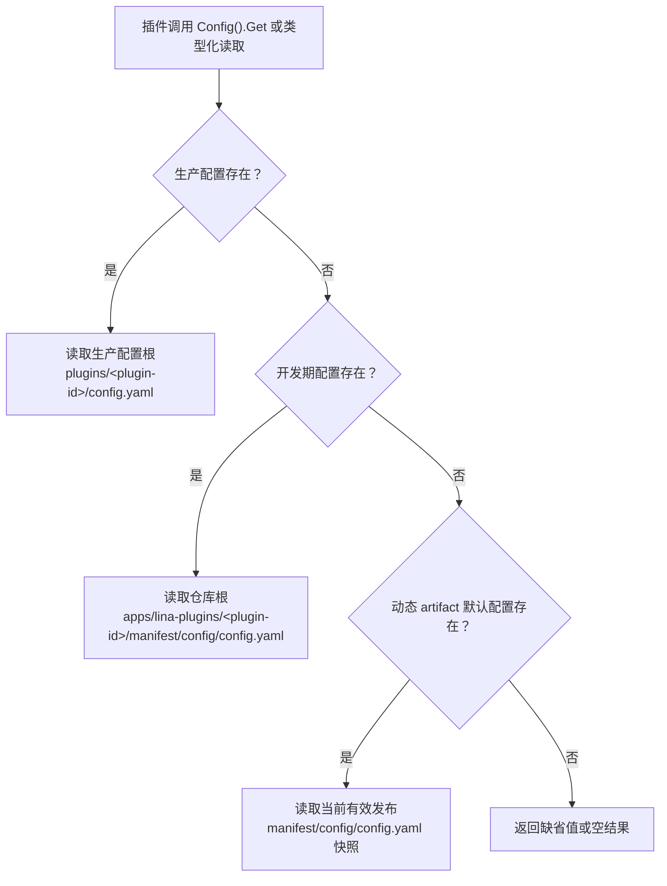

## 基本介绍

`LinaPro`的插件配置采用独立作用域设计。每个插件拥有自己的配置文件，不需要把业务配置塞进主框架`config.yaml`，主框架也不需要为每个插件增加专用配置字段。

插件配置回答"这个插件在当前部署里怎么运行"。它与`Manifest`交付资源不同：配置允许生产环境覆盖，而`Manifest`资源更接近插件版本的一部分。关于`Manifest`资源的管理和读取，参见[Manifest交付资源](/docs/plugin-manifest)。

插件配置的来源有三种，按优先级从高到低：

| 优先级 | 来源 | 说明 |
|--------|------|------|
| 1 | 生产配置根下`plugins/<plugin-id>/config.yaml` | 运维侧覆盖当前插件配置 |
| 2 | `apps/lina-plugins/<plugin-id>/manifest/config/config.yaml` | 开发期插件默认配置 |
| 3 | 动态插件产物中的`manifest/config/config.yaml` | 动态插件随发布版本携带的默认配置 |

`manifest/config/config.example.yaml`只是配置模板，不是运行时默认值。

## 配置读取顺序

插件配置服务只读取当前插件作用域内的`config.yaml`，读取顺序如下：



### 生产部署配置路径

生产覆盖配置路径不是固定的仓库根路径，而是"生产配置路径"下的插件配置：

```text
工作目录/plugins/<plugin-id>/config.yaml
```

### 开发阶段默认配置

本地开发时，插件默认配置直接放在插件源码目录：

```text
apps/lina-plugins/<plugin-id>/manifest/config/config.yaml
```

这使插件开发者可以把插件自己的默认行为、演示开关、外部服务缺省地址或调度参数放在插件目录内维护。主框架不需要知道每个插件有哪些业务配置项。

### 动态插件默认配置

动态插件构建为`.wasm`产物时，构建工具会把`manifest/config/config.yaml`写入动态`artifact`。运行时如果没有生产覆盖配置，也没有开发期配置文件，主框架会使用当前有效发布中携带的默认配置快照。

这让动态插件可以随版本携带一份自描述默认配置，同时仍允许生产环境用外部配置覆盖。插件升级后，默认配置也随有效发布版本切换，不会依赖源码目录。

### 配置模板不参与读取

`manifest/config/config.example.yaml`只用于展示配置项和示例值，不参与运行时默认值读取。不要把只存在于`config.example.yaml`中的值当作插件运行时默认配置。

推荐写法是：

```text
manifest/config/config.yaml          # 可运行的默认配置
manifest/config/config.example.yaml  # 给运维或用户看的配置模板
```

## Services中的配置服务

插件通过`registrar.Services()`获取插件作用域的主框架服务。与配置相关的服务主要有两个：

| 服务 | 读取范围 | 典型用途 |
|------|----------|----------|
| `Plugins().Config()` | 当前插件自己的配置 | 插件业务开关、外部系统地址、超时时间、调度参数 |
| `HostConfig()` | 宿主约定配置键 | 工作台基准路径、默认语言、已启用语言等少量公开键 |

`Plugins().Config()`只读取当前插件自己的`config.yaml`；`HostConfig()`读取宿主公开的配置键。两者职责不同，不应混用。

### 源码插件使用

源码插件通过`services.Plugins().Config()`和`services.HostConfig()`读取配置：

```go
func registerRoutes(ctx context.Context, registrar pluginhost.HTTPRegistrar) error {
    services := registrar.Services()

    endpoint, err := services.Plugins().Config().String(ctx, "sync.endpoint", "")
    if err != nil {
        return err
    }

    interval, err := services.Plugins().Config().Duration(ctx, "sync.interval", 30*time.Second)
    if err != nil {
        return err
    }

    workspaceBase, err := services.HostConfig().String(ctx, "workspace.basePath", "/admin")
    if err != nil {
        return err
    }

    _ = endpoint
    _ = interval
    _ = workspaceBase
    return nil
}
```

### 动态插件使用

动态插件通过`pluginbridge`的`guest`侧能力访问同类服务。动态插件必须先在`plugin.yaml`中声明授权：

```yaml
hostServices:
  - service: plugins
    methods: [config.get]
  - service: hostconfig
    methods: [get]
    resources:
      keys:
        - workspace.basePath
        - i18n.default
```

`plugins.config.get`只读取当前插件自己的配置；`hostconfig`只能读取已授权的宿主配置键。插件不应通过全局`g.Cfg()`扫描宿主完整配置树，也不应要求用户把插件业务配置写进主框架`config.yaml`。

## 设计收益

### 插件和主框架配置解耦

主框架只发布稳定的插件作用域读取服务，不需要为每个插件增加配置结构体。插件新增配置项时，只需要更新自己的`config.yaml`、`config.example.yaml`和读取逻辑。

### 支持生产环境独立覆盖

生产环境可以在外部配置根下维护`plugins/<plugin-id>/config.yaml`，避免直接修改插件源码目录。对于容器和多环境部署，这种方式更容易挂载、审计和回滚。

## 常见误区

| 误区 | 正确做法 |
|------|----------|
| 把插件业务配置写入主框架`config.yaml` | 写入插件自己的`manifest/config/config.yaml`，生产环境用生产配置根下的`plugins/<plugin-id>/config.yaml`覆盖 |
| 依赖`config.example.yaml`提供默认值 | 把真实默认值写入`config.yaml`，模板只做说明 |
| 用`Manifest()`读取`config/config.yaml`后当作当前运行配置 | 使用`Plugins().Config()`读取插件运行配置；`Manifest()`只能拿到原始文件内容 |
| 动态插件在`plugin.yaml`中声明`config.get`方法 | 插件配置通过`plugins`服务的`config.get`方法读取，不是独立的`config`服务 |
