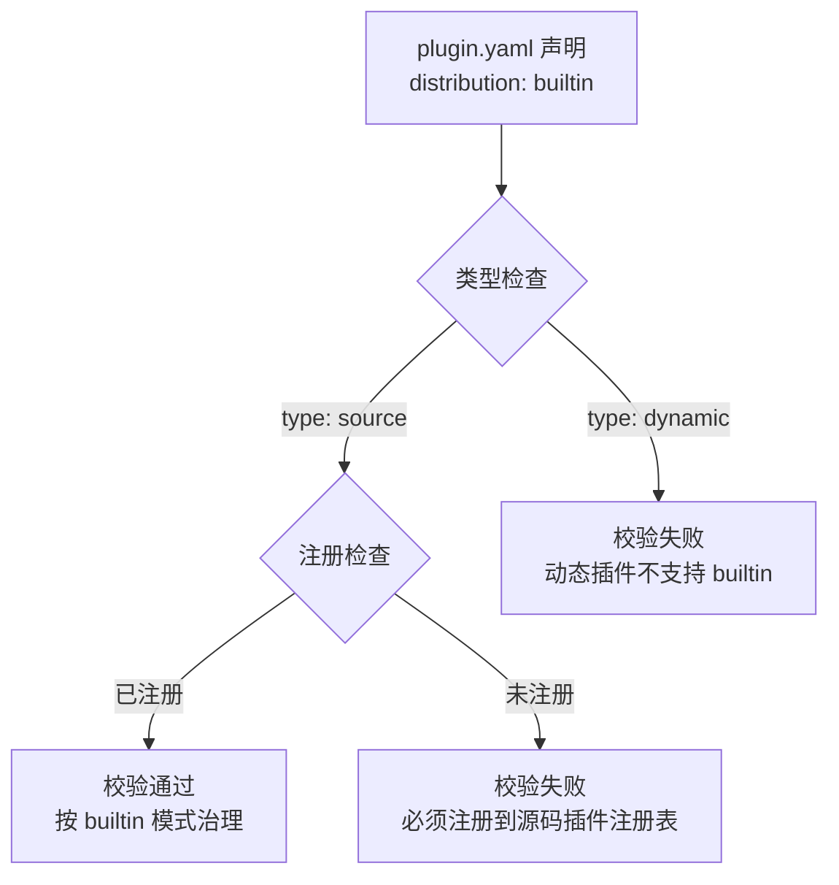
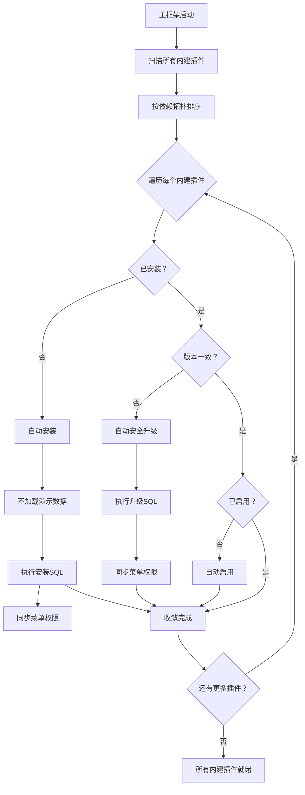

## 基本介绍

`Distribution`（分发治理）是`LinaPro`插件系统中描述插件如何被宿主平台治理的关键枚举字段。它决定了插件的生命周期管理策略、管理页面可见性以及启动时的行为。

通过在`plugin.yaml`中声明`distribution`字段，开发者可以明确指定插件是作为普通市场插件还是项目内建插件进行治理。两种分发模式在安装、启用、升级和管理操作上存在显著差异。

## 分发模式类型

`LinaPro`支持两种分发治理模式：

| 分发类型 | 语义 | 生命周期特征 | 适用场景 |
|----------|------|--------------|----------|
| `marketplace` | 普通插件，可被平台管理员显式管理 | 需要显式安装、启用、升级，或由`plugin.autoEnable`托管启用 | 第三方插件、可选功能模块 |
| `builtin` | 项目内建源码插件，是项目组成部分 | 启动时自动安装、启用、安全升级；普通插件管理入口不可操作 | 核心业务插件、项目必需功能 |

对于基于`LinaPro`开发自身业务系统的企业或团队，通常将业务插件声明为`builtin`分发模式。这是因为业务插件是系统的核心组成部分，需要随主框架一起编译、部署和升级，确保在生产环境中始终可用且版本一致。

:::info 提示
`distribution`字段的默认值为`marketplace`。如果`plugin.yaml`中未声明该字段，插件将按照市场插件的模式进行治理。
:::

## 配置示例

在`plugin.yaml`中声明分发模式：

```yaml
# 市场插件（默认）
id: linapro-ai-core
name: AI Hub
version: 0.1.0
type: source
distribution: marketplace
scope_nature: tenant_aware
```

```yaml
# 内建插件
id: linapro-tenant-core
name: 多租户核心
version: 0.1.0
type: source
distribution: builtin
scope_nature: tenant_aware
```

## 双因子约束

`distribution: builtin`的声明需要满足双因子约束：

1. **类型约束**：`type`必须为`source`（源码插件）
2. **注册约束**：必须通过`pluginhost.RegisterSourcePlugin`注册到源码插件注册表

动态插件（`type: dynamic`）不支持`builtin`分发模式。如果在动态插件的`plugin.yaml`中声明`distribution: builtin`，Manifest校验阶段将返回错误。



## 生命周期管理

两种分发模式在生命周期管理上存在显著差异：

### 市场插件生命周期

市场插件需要管理员显式操作或通过配置自动启用：

| 操作 | 触发方式 | 说明 |
|:------:|----------|------|
| **安装** | 管理员手动安装 | 从插件市场选择并安装 |
| **启用** | 管理员手动启用或`plugin.autoEnable` | 安装后需要显式启用 |
| **升级** | 管理员手动升级 | 需要确认新版本 |
| **禁用** | 管理员手动禁用 | 可随时禁用 |
| **卸载** | 管理员手动卸载 | 可随时卸载 |

### 内建插件生命周期

内建插件在启动时自动收敛，管理员无法通过管理界面进行操作：

| 操作 | 触发方式 | 说明 |
|:------:|----------|------|
| **安装** | 启动时自动安装 | 未安装则自动安装，不加载演示数据 |
| **启用** | 启动时自动启用 | 未启用则自动启用 |
| **升级** | 启动时自动安全升级 | 检测到新版本自动升级 |
| **禁用** | 不允许 | 管理界面隐藏禁用按钮 |
| **卸载** | 不允许 | 管理界面隐藏卸载按钮 |

## 启动收敛流程

内建插件在主框架启动时执行自动收敛，确保所有内建插件处于就绪状态：



启动顺序设计：

1. **源码清单同步**（`source manifest sync`）：扫描并同步所有源码插件的清单信息
2. **内建插件收敛**（`bootstrap builtin plugins`）：按依赖拓扑排序，依次安装、升级、启用所有内建插件
3. **自动启用插件收敛**（`bootstrap plugin.autoEnable`）：根据配置自动启用声明为自动启用的市场插件
4. **租户插件协调**（`reconcile auto-enabled tenant plugins`）：协调租户级别的插件启用状态
5. **注册路由和运行时入口**（`register routes and runtime entries`）：将所有已启用插件的路由和运行时入口注册到宿主框架

:::info 提示
内建插件的启动收敛采用`fail-fast`策略：如果任何一个内建插件的安装、升级或启用失败，默认中止启动流程。
:::

## 与 autoEnable 的关系

`plugin.autoEnable`配置项用于声明需要自动启用的插件列表，但它与`distribution: builtin`存在语义差异：

| 特性 | `plugin.autoEnable` | `distribution: builtin` |
|:------:|---------------------|-------------------------|
| **作用范围** | 仅影响启用阶段 | 影响安装、启用、升级全生命周期 |
| **管理操作** | 允许管理员手动操作 | 管理员无法操作 |
| **升级行为** | 不自动升级 | 启动时自动安全升级 |
| **启动失败** | 不中止启动 | `fail-fast`中止启动 |

如果`plugin.autoEnable`中包含已声明为`builtin`的插件，系统会在启动时发出警告，提示配置重叠。

## 最佳实践

1. **核心功能使用`builtin`**：将项目必需的核心业务插件声明为`builtin`，确保它们始终可用
2. **可选功能使用`marketplace`**：将可选的功能模块声明为`marketplace`，允许管理员灵活管理
3. **企业业务插件优先选择`builtin`**：基于 LinaPro 开发业务系统时，将自研业务插件声明为`builtin`，与主框架统一编译部署，避免生产环境遗漏或版本不一致
4. **遵循双因子约束**：声明`builtin`时确保同时满足类型和注册约束
5. **合理规划依赖顺序**：内建插件按依赖拓扑排序启动，确保依赖关系正确
6. **避免配置重叠**：不要将`builtin`插件同时添加到`plugin.autoEnable`

## 常见误区

| 误区 | 正确做法 |
|------|----------|
| 在动态插件中声明`distribution: builtin` | `builtin`仅支持源码插件（`type: source`） |
| 声明`builtin`但未注册到源码插件注册表 | 确保通过`pluginhost.RegisterSourcePlugin`完成注册 |
| 将`builtin`插件添加到`plugin.autoEnable` | `builtin`已包含自动启用逻辑，无需重复配置 |
| 期望通过管理界面操作内建插件 | 内建插件的管理操作在服务端被拒绝，前端完全隐藏 |
| 认为`builtin`插件可以跳过SQL迁移 | 内建插件仍走完整的SQL迁移流程 |
