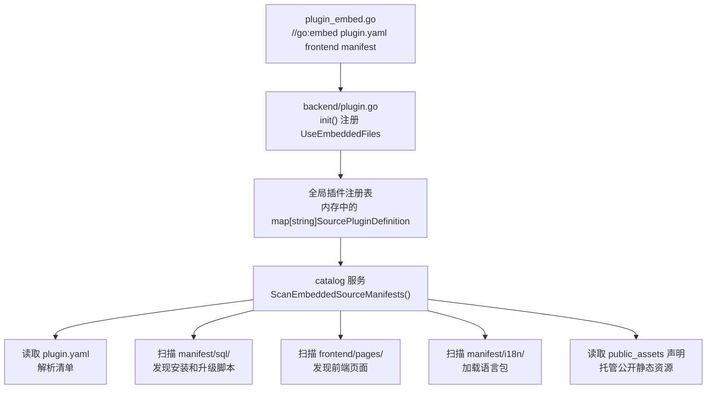

## 基本介绍

每个插件版本都会携带一组自有资源文件，包括安装和升级`SQL`、国际化语言包、前端页面、配置模板以及其他自定义文件。这些资源统称为`Manifest`交付资源，存放在插件目录的`manifest/`和`frontend/`下。

`Manifest`资源与插件配置不同：配置允许生产环境覆盖，`Manifest`资源则更接近插件版本的一部分——它们随源码编译嵌入二进制，或随动态插件`.wasm`产物打包，升级或回滚时随有效发布版本切换。关于插件配置的管理方式，参见[插件业务配置](/docs/plugin-configuration)。

## 目录结构

典型插件的资源目录如下：

```text
apps/lina-plugins/<plugin-id>/
├── plugin.yaml
├── frontend/
│   ├── pages/                       # 插件页面
│   └── slots/                       # 插槽页面，可选
├── manifest/
│   ├── config/
│   │   ├── config.yaml              # 开发期默认配置
│   │   └── config.example.yaml      # 配置模板
│   ├── profile.yaml                 # 插件自定义YAML资源
│   ├── resources/
│   │   └── policy.yaml              # 插件自定义资源
│   ├── sql/                         # 安装与升级SQL
│   │   ├── mock-data/               # 演示数据，可选
│   │   └── uninstall/               # 卸载SQL
│   └── i18n/                        # 插件语言包
└── backend/
```

| 路径 | 主要用途 | `Manifest()`读取路径 |
|------|----------|----------------------|
| `manifest/config/config.yaml` | 插件默认运行配置 | `config/config.yaml` |
| `manifest/config/config.example.yaml` | 配置模板，不作为运行时默认值 | `config/config.example.yaml` |
| `manifest/profile.yaml` | 插件自定义`YAML`资源示例 | `profile.yaml` |
| `manifest/resources/*.yaml` | 插件自定义资源 | `resources/*.yaml` |
| `manifest/sql/` | 安装、升级、卸载脚本 | `sql/*.sql` |
| `manifest/i18n/` | 插件语言包 | `i18n/*.json` |
| `frontend/pages/` | 插件前端页面 | — |

`Manifest()`读取路径始终相对`manifest/`。例如读取`manifest/profile.yaml`时，调用路径应写`profile.yaml`，不能写`manifest/profile.yaml`。

## 源码插件 embed 编译流程

源码插件通过`Go`语言的`//go:embed`机制将资源文件编译进主框架二进制。整个流程分为声明、注册、聚合和运行时读取四个阶段。

### 声明嵌入资源

每个源码插件在根目录下提供`plugin_embed.go`，使用`//go:embed`指令声明需要嵌入的资源：

```go
package plugindemosource

import "embed"

//go:embed plugin.yaml frontend manifest
var EmbeddedFiles embed.FS
```

嵌入目标通常包含三类：`plugin.yaml`清单、`frontend/`前端页面和`manifest/`下的所有资源（`SQL`、`i18n`、配置模板等）。`Go`编译器在构建时将这些文件打包到二进制中。

### 注册嵌入文件系统

源码插件在`backend/plugin.go`的`init()`中将嵌入的文件系统绑定到插件声明：

```go
func init() {
    plugin := pluginhost.NewDeclarations(pluginID)
    plugin.Assets().UseEmbeddedFiles(plugindemosource.EmbeddedFiles)
    // ... 注册生命周期、路由、任务等
    pluginhost.RegisterSourcePlugin(plugin)
}
```

`UseEmbeddedFiles`将`fs.FS`存储在插件定义的内存结构中，供后续运行时读取。

### 聚合入口触发初始化

主框架通过`lina-plugins.go`中的空白导入触发所有源码插件的`init()`：

```go
package linaplugins

import (
    _ "lina-plugin-linapro-ai-core/backend"
    _ "lina-plugin-linapro-content-notice/backend"
    _ "lina-plugin-linapro-demo-source/backend"
    // ... 其他源码插件
)
```

空白导入确保所有插件的`init()`在主框架启动时执行，嵌入的文件系统被注册到内存中的全局插件注册表。

### 运行时读取嵌入资源

主框架启动后，`catalog`服务遍历注册表中所有源码插件，从嵌入的文件系统中读取资源：



`catalog`服务通过嵌入文件系统执行以下操作：

| 操作 | 说明 |
|------|------|
| 清单发现 | 从`plugin.yaml`读取插件身份、依赖、菜单和权限声明 |
| `SQL`发现 | 扫描`manifest/sql/`、`manifest/sql/uninstall/`和`manifest/sql/mock-data/`下的脚本 |
| 前端发现 | 扫描`frontend/pages/`和`frontend/slots/`下的`.vue`文件 |
| 公开资源 | 读取`public_assets`声明的目录，托管到`/x-assets/{plugin-id}/{version}/...` |
| `i18n`加载 | 读取`manifest/i18n/`下的语言包，注入运行时翻译服务 |
| `API`文档 | 读取`manifest/i18n/{locale}/apidoc/`下的接口文档翻译 |

## 动态插件产物打包

动态插件的资源打包方式与源码插件不同。构建工具会读取插件嵌入资源（或在需要时回退扫描目录），将以下内容写入`.wasm`产物：

- `plugin.yaml`清单
- `frontend/`前端资产
- `manifest/sql`安装和升级脚本
- `manifest/i18n`语言包
- `manifest/config/config.yaml`默认配置
- `manifest/config/config.example.yaml`配置模板
- `manifest/`下的其他资源

运行时资源会绑定到当前有效发布的校验和与生成号，安装、启用、禁用、卸载、升级或同版本刷新都会触发相应缓存失效。

## 读取 Manifest 资源

插件可以通过`Manifest()`服务读取当前插件`manifest/`下的原始资源。

### 接口方法

| 方法 | 说明 |
|------|------|
| `Get` | 返回文件原始字节内容 |
| `Exists` | 检查文件是否存在 |
| `Scan` | 将`YAML`资源或其中某个嵌套键扫描到目标结构体 |

### 源码插件读取来源

源码插件从当前插件绑定的嵌入文件系统读取。如果嵌入文件系统不存在，则回退到仓库开发目录`apps/lina-plugins/<plugin-id>/manifest/`。源码插件只能读取当前插件自己的`manifest/`资源，不能读取宿主或其他插件目录。

```go
// 读取原始字节
content, err := services.Manifest().Get(ctx, "config/config.example.yaml")
if err != nil {
    return err
}
if len(content) > 0 {
    _ = string(content)
}
```

### 动态插件读取来源

动态插件从当前有效发布`artifact`中携带的`manifest/`资源快照读取。读取必须经过`plugin.yaml`的`service: manifest`和`resources.paths`授权快照校验。

动态插件升级、回滚或同版本刷新后，`Manifest()`看到的是当前有效发布绑定的资源快照。这样可以保证动态插件读取到的原始资源和实际生效的发布版本一致。

### YAML 便捷扫描

读取自定义`YAML`资源时可以使用`Manifest().Scan()`：

```go
type PluginProfile struct {
    Category string `yaml:"category"`
    Display  struct {
        Icon        string `yaml:"icon"`
        AccentColor string `yaml:"accentColor"`
    } `yaml:"display"`
    Features struct {
        Import bool `yaml:"import"`
        Export bool `yaml:"export"`
    } `yaml:"features"`
}

func loadProfile(ctx context.Context, services pluginhost.Services) (*PluginProfile, error) {
    profile := &PluginProfile{}
    if err := services.Manifest().Scan(ctx, "profile.yaml", "", profile); err != nil {
        return nil, err
    }
    return profile, nil
}
```

也可以只扫描某个嵌套键：

```go
var features struct {
    Import bool `yaml:"import"`
    Export bool `yaml:"export"`
}

if err := services.Manifest().Scan(ctx, "profile.yaml", "features", &features); err != nil {
    return err
}
```

## 动态插件授权

动态插件如果要读取`manifest`资源，需要在`plugin.yaml`中声明资源范围：

```yaml
hostServices:
  - service: manifest
    methods: [get]
    resources:
      paths:
        - profile.yaml
        - resources/*.yaml
        - config/config.example.yaml
        - sql/*.sql
        - i18n/zh-CN/*.json
```

动态插件`manifest`资源路径支持精确路径和受控通配模式。路径仍然相对`manifest/`，不要写成`manifest/profile.yaml`。

源码插件不通过`plugin.yaml`的`paths`做额外授权，因为源码插件随宿主编译和交付，属于受信任扩展；但源码插件仍受路径安全约束和插件作用域约束。动态插件通过`WASM`接入，必须显式声明并经过宿主确认后才能读取对应路径。

## 专用目录原文读取

`Manifest()`读取的是文件原始内容，不会让这些文件自动"生效"。例如：

| 读取路径 | 可以通过`Manifest()`获得什么 | 真正生效机制 |
|----------|------------------------------|--------------|
| `config/config.yaml` | 当前插件随源码或动态`artifact`携带的配置文件原始内容 | 运行配置仍由`Plugins().Config()`按生产、开发期、动态默认配置顺序读取 |
| `config/config.example.yaml` | 配置模板原文 | 只作为模板和说明，不参与默认值读取 |
| `sql/*.sql` | 安装、升级或卸载脚本文本 | 是否执行由插件生命周期管线决定 |
| `i18n/*.json` | 插件语言包原文 | 是否加载由国际化管线决定 |

因此，`Manifest()`适合做资源检查、预览、诊断、自定义解析或插件内部个性化逻辑；不要把它当作执行`SQL`、加载语言包或覆盖运行配置的入口。

## 路径安全

`Manifest()`只接受相对当前插件`manifest/`根目录的 slash 路径。以下写法会被拒绝：

| 非法路径 | 拒绝原因 |
|----------|----------|
| `manifest/profile.yaml` | 重复包含`manifest/`前缀 |
| `../other-plugin/profile.yaml` | 试图逃逸当前插件`manifest/`目录 |
| `/etc/passwd` | 绝对路径 |
| `C:\secret.yaml` | Windows drive path |
| `https://example.com/config.yaml` | `URL`，不会触发网络读取 |

读取缺失资源时，`Get()`返回空内容，`Exists()`返回`false`，`Scan()`不会修改目标结构体。插件应按自己的业务语义决定缺失资源是允许回退还是需要报错。

## 设计收益

### 动态插件随版本携带默认配置

动态插件的默认配置随`.wasm`有效发布版本绑定。插件升级、回滚或同版本刷新时，主框架使用当前有效发布的资源快照，不需要依赖开发者本地目录。

### 原始读取不替代专用管线

`Manifest()`可以读取`manifest/`下的原始资源，但配置、`SQL`和语言包仍由各自专用管线决定运行时效果。这样既能让插件在需要时查看自己随版本携带的文件，又能避免把"读取文件"误解为"让文件生效"。

## 常见误区

| 误区 | 正确做法 |
|------|----------|
| 用`Manifest()`读取`config/config.yaml`后当作当前运行配置 | 使用`Plugins().Config()`读取插件运行配置；`Manifest()`只能拿到原始文件内容 |
| 用`Manifest()`读取`sql/`或`i18n/`后期待自动执行或加载 | 让插件生命周期和国际化管线处理这些资源；`Manifest()`只负责读取原文 |
| 调用`Manifest()`时传`manifest/profile.yaml` | 传相对路径`profile.yaml` |
| 动态插件申请泛化`manifest`访问范围 | 只声明实际需要读取的`profile.yaml`、`config/config.example.yaml`或`resources/*.yaml`等路径 |
