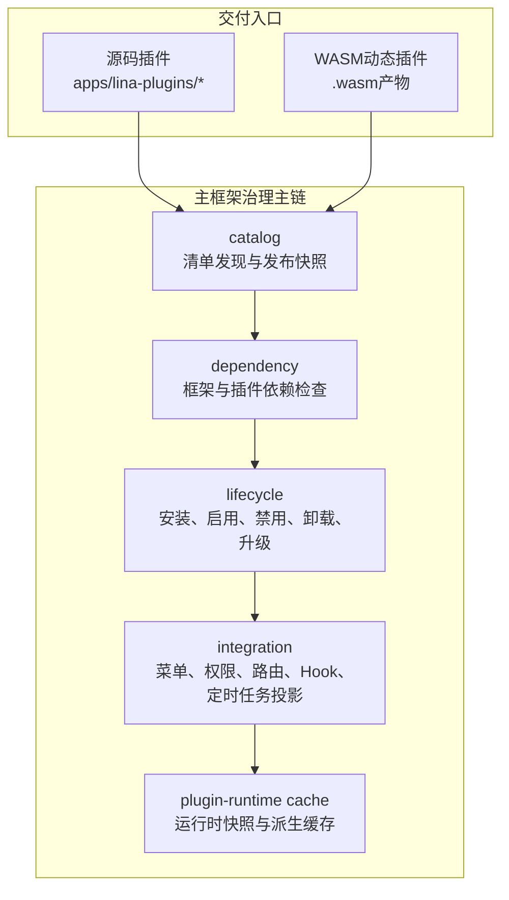
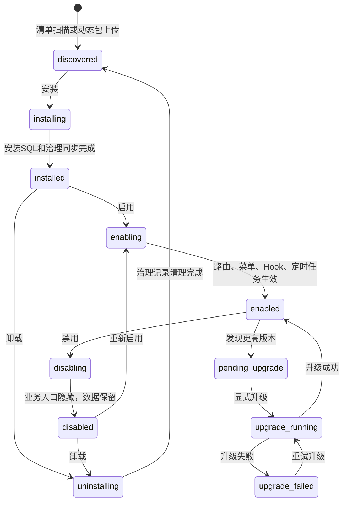

## 基本介绍

插件系统是`LinaPro`承载业务能力的核心扩展机制。每个插件都是自包含模块，可以声明`API`路由、数据库资源、前端页面、菜单权限、语言包、定时任务和生命周期回调。

`LinaPro`同时支持两种交付模式：

- **源码插件**：以`Go`源码形式参与主框架编译，适合长期维护的业务能力。
- **动态插件**：以`.wasm`产物运行时上传和加载，适合二进制分发、热加载和临时扩展。

两种模式运行形态不同，但共享同一套插件治理面。管理端看到的是同一类插件生命周期、依赖、权限、状态、多租户策略、公开静态资源和插件自身配置。

源码插件和动态插件的目录结构也趋于一致：根目录包含`plugin.yaml`，后端能力位于`backend/`，前端资源位于`frontend/`，安装脚本、语言包、配置和插件自有资源位于`manifest/`。源码插件通过`plugin_embed.go`把这些资源嵌入主框架编译产物；动态插件通过构建工具把同类资源写入`.wasm`产物，并在运行时绑定到当前有效发布版本。

## 插件不必包含前端页面

`LinaPro`的插件系统没有强制要求每个插件都提供前端页面。插件能否解决问题，不取决于它是否有界面，而取决于它是否实现了主框架所需的扩展能力。

许多插件的全部价值在于扩展后端行为，而不需要任何用户界面。典型的例子包括：

- **存储后端插件**：对接七牛云、`AWS S3`或其他对象存储服务，接管主框架的文件上传与读取逻辑。插件启用后，主框架的文件存储行为自动切换，无需修改任何调用方代码，界面侧完全无感。
- **认证方式插件**：对接`LDAP`目录服务或`OIDC`身份提供商，扩展用户登录能力。主框架通过认证接口调用插件提供的具体实现，业务层对底层协议完全透明。

对于这类纯后端插件，`plugin.yaml`中的`menus`字段通常为空，插件只需通过`pluginhost`注册`HTTP`路由或实现主框架扩展点接口，主框架以接口调用的方式消费插件能力。前端和后端的模块化是同一插件模型下的两个自然选择，并非对所有插件的强制要求。

## 为什么需要双模式

单一插件形态很难同时满足研发效率、运行性能、热加载和商业分发。

| 需求 | 更适合的模式 | 原因 |
|------|--------------|------|
| **长期业务模块** | 源码插件 | 原生`Go`性能，工具链完整，易测试和维护 |
| **紧急修复或临时能力** | 动态插件 | 可在运行时上传和启用，减少部署影响 |
| **商业插件分发** | 动态插件 | 可以只分发二进制产物，不暴露源码 |
| **与主框架能力深度协作** | 源码插件 | 可通过稳定`pluginhost`契约使用主框架能力 |

在大多数业务开发中，源码插件是默认选择；当热加载、源码保护或最终用户自行上传插件成为硬要求时，再选择动态插件。

## 治理主链

插件系统不是简单扫描目录再注册路由，而是一条从发现到运行的治理主链：



| 源码组件 | 组件职责 |
|------|------|
| `catalog` | 读取`plugin.yaml`或`WASM`自定义段，生成可审查的发布快照 |
| `dependency` | 检查框架版本范围、插件依赖和循环依赖 |
| `lifecycle` | 编排安装、启用、禁用、卸载和运行时升级 |
| `integration` | 将菜单、权限、路由、钩子和定时任务投影到主框架运行时 |
| `plugin-runtime cache` | 为请求路径提供低延迟的插件状态、路由和资源快照 |

## 关键公共契约

### plugin.yaml

每个插件都必须提供`plugin.yaml`。它是插件身份、依赖、菜单、多租户策略、公开静态资源和动态插件主框架能力授权的统一入口。

```yaml
# 插件唯一标识，必须在宿主和源码插件目录中保持唯一，使用 kebab-case 命名风格
# 推荐格式：<author>-<domain>-<capability>，例如 linapro-content-notice
id: linapro-content-notice

# 插件显示名称，用于插件管理页面、开发文档和展示
name: 内容通知

# 插件语义化版本号，建议统一使用带 v 前缀的写法
version: v0.1.0

# 插件类型枚举
# source: 随宿主源码编译交付，适合长期维护的业务能力
# dynamic: 作为运行时动态插件产物加载，适合热加载和商业分发
type: source

# 多租户作用域枚举
# platform_only: 仅平台上下文可见和治理
# tenant_aware: 按租户上下文治理（默认值）
scope_nature: tenant_aware

# 多租户支持标记，true 表示插件支持租户级安装与开通治理
supports_multi_tenant: true

# 默认安装模式枚举
# global: 全局统一安装启用
# tenant_scoped: 按租户独立启用或禁用（默认值）
default_install_mode: tenant_scoped

# 插件能力说明，概述插件的能力边界
description: 提供内容变更通知的发布与订阅能力

# 插件作者或归属团队
author: linapro

# 插件主页或文档地址，用于补充项目介绍、设计文档或外部说明链接
homepage: https://example.com/plugins/linapro-content-notice

# 插件许可证标识
license: Apache-2.0

# 发行方式声明（可选）
distribution: bundled

# 插件国际化配置，与宿主 i18n 配置结构保持一致
i18n:
  # 是否启用多语言支持
  enabled: true
  # 默认语言
  default: zh-CN
  # 启用的语言列表
  locales:
    # 语言代码
    - locale: en-US
      # 语言本地名称
      nativeName: English
    - locale: zh-CN
      nativeName: 简体中文

# 插件依赖声明
dependencies:
  # LinaPro 框架语义化版本范围，支持 >=, <=, >, <, = 操作符，多个约束用空格分隔
  framework:
    version: ">=0.1.0 <1.0.0"
  # 插件间依赖声明
  plugins:
    # 依赖插件 ID
    - id: linapro-org-core
      # 依赖插件语义化版本范围
      version: ">=0.1.0"

# 声明式公开静态资源目录，由宿主托管到 /x-assets/{plugin-id}/{version}/...
# 动态插件通常需要声明，源码插件可选
public_assets:
  # 插件相对目录或资源前缀
  - source: frontend/pages
    # URL 挂载点
    mount: /
    # 默认入口文件
    index: index.html

# 插件菜单声明列表，宿主按该列表同步菜单、按钮权限和路由入口
menus:
  # 菜单唯一键，必须使用 plugin:<plugin-id>:<menu-key> 格式
  - key: plugin:linapro-content-notice:main-entry
    # 父级菜单键，指向宿主内置目录或父菜单 key
    parent_key: extension
    # 菜单显示名称
    name: 内容通知
    # 前端路由路径（源码插件使用宿主内路由片段，动态插件使用完整托管路径）
    path: linapro-content-notice-list
    # 菜单渲染组件，动态页壳用于承载插件页面
    component: system/plugin/dynamic-page
    # 菜单访问权限标识
    perms: linapro-content-notice:notice:view
    # 菜单图标，使用 Iconify 图标名称
    icon: lucide:bell
    # 菜单类型枚举
    # D: 目录
    # M: 菜单页面
    # B: 按钮权限点
    type: M
    # 菜单排序值，数值越小越靠前
    sort: 10
    # 可见性：0 隐藏，1 显示（可选）
    visible: 1
    # iframe 标记：0 否，1 是（可选）
    is_frame: 0
    # 缓存标记：0 否，1 是（可选）
    is_cache: 0
    # 路由查询参数（可选，动态插件常用）
    query:
      pluginAccessMode: embedded-mount
    # 菜单备注，写入宿主菜单治理数据（可选）
    remark: 内容通知管理菜单

  # 按钮权限点示例
  - key: plugin:linapro-content-notice:notice-create
    # 父级菜单键，指向所属菜单页面
    parent_key: plugin:linapro-content-notice:main-entry
    # 按钮显示名称
    name: 创建通知
    # 按钮权限标识
    perms: linapro-content-notice:notice:create
    # 按钮权限点类型
    type: B
    # 按钮排序值
    sort: 1

# 宿主服务声明列表（动态插件专用），用于申请调用宿主 service、method 与资源边界
hostServices:
  # runtime 服务：提供日志、状态和运行时信息能力
  - service: runtime
    methods:
      # 写入宿主结构化日志
      - log.write
      # 读取插件隔离状态
      - state.get
      # 写入插件隔离状态
      - state.set
      # 删除插件隔离状态
      - state.delete
      # 读取宿主当前时间
      - info.now
      # 生成宿主侧 UUID
      - info.uuid

  # storage 服务：访问插件隔离存储对象
  - service: storage
    methods:
      # 写入存储对象
      - put
      # 启动分片存储对象上传
      - put.init
      # 追加一个存储对象上传分片
      - put.chunk
      # 提交分片存储对象上传
      - put.commit
      # 中止分片存储对象上传
      - put.abort
      # 读取存储对象
      - get
      # 删除存储对象
      - delete
      # 列出存储对象
      - list
      # 读取存储对象元数据
      - stat
    # 资源边界声明，限定可访问的存储路径前缀
    resources:
      paths:
        - notice-files/

  # network 服务：发起受治理的外部网络请求
  - service: network
    methods:
      # 发起外部网络请求
      - request
    # 资源边界声明，限定可访问的 URL
    resources:
      - url: https://api.example.com

  # data 服务：访问被授权的数据表
  - service: data
    methods:
      # 分页查询多条记录
      - list
      # 按主键读取单条记录
      - get
      # 新增记录
      - create
      # 更新记录
      - update
      # 删除记录
      - delete
      # 执行单表结构化事务
      - transaction
    # 资源边界声明，限定可访问的数据表
    resources:
      tables:
        - plugin_linapro_content_notice_record

  # plugins 服务：读取当前插件自己的运行期配置
  - service: plugins
    methods:
      - config.get

  # hostConfig 服务：读取白名单内的宿主公开配置
  - service: hostConfig
    methods:
      - get
    resources:
      keys:
        - workspace.basePath
        - i18n.default
```

### 插件ID命名规范

插件`ID`是贯穿整个插件生命周期的唯一标识，用于目录命名、`API`路由命名空间、数据库表前缀、菜单`key`和静态资源路径。`LinaPro`推荐的插件`ID`采用`<author>-<domain>-<capability>`三段式`kebab-case`结构：

| 段 | 含义 | 示例 |
|------|------|------|
| `<author>` | 插件作者或组织标识 | `linapro` |
| `<domain>` | 业务领域 | `content`、`monitor`、`org`、`tenant` |
| `<capability>` | 具体能力，可包含多个`kebab`段 | `notice`、`loginlog`、`demo-guard` |

`<author>-<domain>-<capability>`是官方推荐的命名约定和仓库治理规范，不是运行时强制规则。运行时校验只确保`ID`非空、最长`64`个字符且为合法`kebab-case`。主框架的`ParsePluginID`函数会尽力从`ID`中拆分出`Author`、`Domain`和`Capability`三段，但少于三段的`ID`同样会被接受。

`<domain>`段用于标识插件所属的业务领域，建议从以下常见领域中选取，也可根据实际业务自行定义：

| 领域 | 适用场景 | 插件命名示例 |
|------|----------|--------------|
| `content` | 内容管理、文章、公告、通知 | `linapro-content-notice` |
| `monitor` | 监控、日志、审计 | `linapro-monitor-loginlog` |
| `org` | 组织架构、部门、岗位 | `linapro-org-core` |
| `tenant` | 多租户、租户管理 | `linapro-tenant-core` |
| `ops` | 运维、安全、访问控制 | `linapro-ops-demo-guard` |
| `auth` | 认证、授权、单点登录 | — |
| `oidc` | `OIDC`身份提供商集成 | — |
| `ai` | 人工智能、大模型、向量检索 | `linapro-ai-core` |
| `storage` | 文件存储、对象存储 | — |
| `workflow` | 工作流、审批流 | — |
| `message` | 消息中心、站内信、推送 | — |
| `payment` | 支付、订单、账单 | — |
| `gateway` | 网关、限流、路由 | — |
| `data` | 数据集成、导入导出、`ETL` | — |


### pluginhost

`pluginhost`是**源码插件**面向主框架的宿主接口层，位于`pkg/plugin/pluginhost`目录。它不在总览页展开每个领域能力的具体方法，而是把源码插件的声明、资源、路由、生命周期和运行期服务入口收口到稳定的公共契约中。


源码插件无法直接`import`主框架的`internal/`目录，只能使用主框架发布的稳定契约。`pluginhost.Services`可访问哪些领域能力、可信管理命令和租户过滤能力，请阅读[领域能力设计与概览](/docs/domain-capabilities)。

### pluginbridge

`pluginbridge`是**动态插件**面向主框架的桥接接口层，位于`pkg/plugin/pluginbridge`目录。它负责把`WASM`插件的声明、路由处理、协议编解码和宿主能力调用隔离在沙箱边界内。


动态插件访问主框架能力时，需要通过`hostServices`声明授权范围，再由宿主按服务、方法和资源边界进行校验。详细的动态插件领域能力目录、`hostServices`授权模型和源码插件能力差异，请阅读[领域能力设计与概览](/docs/domain-capabilities)。

## 生命周期状态

插件生命周期覆盖发现、安装、启用、禁用、卸载和升级，并包含租户级禁用、租户删除、安装模式调整等治理钩子：



插件文件更新不会自动切换有效版本。主框架启动或扫描发现更高版本后，将插件标记为`pending_upgrade`，管理员在插件管理页预览并显式执行运行时升级。升级流程会执行依赖预检、生命周期回调、升级`SQL`、治理资源同步、有效发布切换、缓存失效和集群通知。

动态插件升级如果涉及资源型`hostServices`变化，需要重新确认授权快照。源码插件升级会比较当前编译发现版本与数据库中的有效版本，避免把文件覆盖误认为运行时升级已经完成。

## 隔离机制

### 数据库命名空间

插件自有表必须使用插件`ID`转换后的`snake_case`前缀：

```text
主框架表：sys_user、sys_role、sys_menu
插件表：linapro_content_notice_record、linapro_org_core_dept、linapro_demo_dynamic_record
```

系统表使用`sys_`前缀，插件表使用`<plugin_id>_`前缀。主框架能力和插件能力的数据完全隔离，避免命名冲突和权限误用。

插件如果需要支持多租户，那么需要自行设计包含`tenant_id`列，并通过主框架发布的租户过滤能力追加过滤条件。

### 文件命名空间

插件文件存储应以插件`ID`作为路径命名空间，例如：

```text
temp/upload/linapro-content-notice/
temp/upload/linapro-demo-dynamic/
```

### 沙箱隔离

`WASM`动态插件不能直接访问主框架文件系统、网络或数据库。所有访问都通过`hostServices`桥接，并受授权快照约束。

## 多租户字段

插件通过三个字段声明多租户边界：

| 字段 | 可选值 | 说明 |
|------|--------|------|
| `scope_nature` | `platform_only` / `tenant_aware` | 插件是平台级治理能力，还是可进入租户上下文 |
| `supports_multi_tenant` | `true` / `false` | 是否支持租户级安装、开通和数据隔离 |
| `default_install_mode` | `global` / `tenant_scoped` | 默认全局启用还是按租户独立启停 |

例如，`multi-tenant`插件本身是平台级治理插件，使用`platform_only`和`global`；内容、组织、审计类插件通常是`tenant_aware`。

## 主框架与插件边界

| 规则 | 原因 |
|------|------|
| 插件不直接依赖主框架的`internal/`包 | 主框架内部实现可演进，稳定契约由`pkg/`提供 |
| 插件菜单使用`plugin:<plugin-id>:<key>`格式 | 避免与主框架或其他插件冲突 |
| 安装`SQL`必须幂等 | 支持重复执行、保留数据后重新安装和升级恢复 |
| 插件服务逻辑放在`backend/internal/service/` | 保持插件后端结构一致，避免包命名混乱 |
| 插件`API`使用`/x/{plugin-id}/...` | 源码插件和动态插件共享统一插件`API`命名空间，避免占用主框架`/api/v1`控制面 |
| 公开静态资源必须声明`public_assets` | 主框架只托管插件显式授权公开的资源目录 |
| 插件配置通过插件作用域配置服务读取 | 避免插件直接依赖宿主全局配置结构 |
| 插件卸载区分保留数据和清理数据 | 降低误删风险，允许后续重新安装复用数据 |
