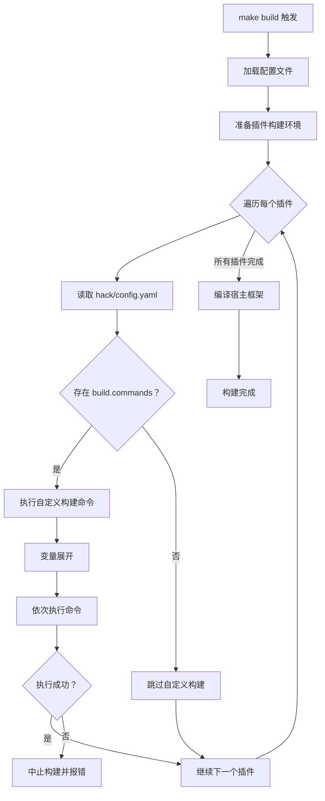

## 基本介绍

每个插件目录下的`hack/config.yaml`是插件级的工具配置文件，用于声明插件在构建过程中需要执行的自定义步骤。该配置文件主要服务于两个场景：

1. **自定义构建指令**：通过`build.commands`字段声明预编译构建步骤
2. **代码生成配置**：通过`gfcli.gen`字段配置数据库代码生成参数

本文重点介绍自定义构建指令的配置方式。关于代码生成的配置，请参考`GoFrame`官方文档。

## 配置层级

`LinaPro`的配置文件存在两个层级，各自承担不同的职责：

| 层级 | 文件路径 | 主要用途 |
|:------:|----------|----------|
| **仓库级** | `hack/config.yaml` | 控制整个仓库的编译、镜像构建和插件源管理 |
| **插件级** | `apps/lina-plugins/<plugin-id>/hack/config.yaml` | 控制单个插件的代码生成和自定义构建步骤 |

:::info 提示
仓库级和插件级的`hack/config.yaml`虽然文件名相同，但用途完全不同。插件级配置专注于单个插件的构建需求，不会影响其他插件或宿主框架。
:::

## 目录结构

典型插件的`hack/`目录结构如下：

```text
apps/lina-plugins/<plugin-id>/
├── plugin.yaml
├── backend/
├── manifest/
├── frontend/
├── hack/
│   ├── config.yaml              # 工具配置文件
│   └── tests/                   # 测试目录，可选
└── Makefile
```

## 自定义构建配置

### 基本语法

在`hack/config.yaml`中使用`build.commands`数组声明自定义构建步骤：

```yaml
build:
  commands:
    - "go generate ./..."
    - "go-bindata -o assets.go -pkg assets ./static/..."
```

每个命令按照数组顺序依次执行。如果任何一个命令执行失败，构建流程将中止并返回错误。

### 可用变量

构建命令支持变量展开，使用`$(变量名)`语法。可用的变量包括：

| 变量 | 说明 | 示例值 |
|------|------|--------|
| `$(PLUGIN_ROOT)` | 当前插件目录的绝对路径 | `/path/to/apps/lina-plugins/linapro-ai-core` |
| `$(REPO_ROOT)` | 仓库根目录的绝对路径 | `/path/to/linapro` |

使用变量的示例：

```yaml
build:
  commands:
    - "go -C $(REPO_ROOT) generate $(PLUGIN_ROOT)/backend/..."
    - "protoc --go_out=$(PLUGIN_ROOT)/backend/internal $(PLUGIN_ROOT)/api/proto/*.proto"
```

### 执行环境

自定义构建命令在以下环境中执行：

- **工作目录**：当前插件目录（`$(PLUGIN_ROOT)`）
- **环境变量**：继承宿主进程的环境变量
- **执行时机**：在宿主框架编译之前执行

## 完整配置示例

以下是一个包含自定义构建步骤和代码生成配置的完整示例：

```yaml
# 自定义构建步骤
build:
  commands:
    - "go generate ./..."
    - "go-bindata -o internal/assets/assets.go -pkg assets ./static/..."

# GoFrame DAO 代码生成配置
gfcli:
  gen:
    dao:
      - link: "pgsql:postgres:postgres@tcp(127.0.0.1:5432)/linapro?sslmode=disable"
        path: "internal"
        tables: "plugin_linapro_demo_source_record"
        removePrefix: "plugin_linapro_demo_source_"
        importPrefix: "lina-plugin-linapro-demo-source/backend/internal"
        descriptionTag: true
        noModelComment: true
        stdTime: true
        typeMapping:
          timestamp: {type: "*time.Time", import: time}
          timestamptz: {type: "*time.Time", import: time}
          date: {type: "*time.Time", import: time}
          time: {type: "*time.Time", import: time}
```

## 构建流程

插件的自定义构建步骤在整体构建流程中的位置：



## 与 Makefile 的关系

每个插件目录下的`Makefile`用于声明插件级的 make 目标，通常包含代码生成命令：

```makefile
PLUGIN_ROOT := $(patsubst %/,%,$(dir $(abspath $(lastword $(MAKEFILE_LIST)))))
REPO_ROOT := $(abspath $(PLUGIN_ROOT)/../../..)
include $(REPO_ROOT)/hack/makefiles/plugin.codegen.mk
```

共享的`plugin.codegen.mk`提供了两个常用目标：

| 目标 | 说明 |
|------|------|
| `make ctrl` | 生成控制器代码 |
| `make dao` | 生成数据库代码（读取`hack/config.yaml`中的`gfcli.gen.dao`配置） |

:::info 提示
`Makefile`中的目标用于开发期的手动代码生成，而`hack/config.yaml`中的`build.commands`用于构建期的自动执行。两者互补但不冲突。
:::

## 最佳实践

1. **保持命令简洁**：每个构建命令应专注于单一任务，便于调试和维护
2. **使用变量展开**：避免硬编码路径，使用`$(PLUGIN_ROOT)`和`$(REPO_ROOT)`确保可移植性
3. **处理依赖关系**：如果命令之间存在依赖，确保按正确顺序排列
4. **添加错误处理**：构建命令应返回正确的退出码，失败时中止构建
5. **文档化特殊命令**：对于复杂的构建步骤，在插件的 README 中说明用途

## 常见误区

| 误区 | 正确做法 |
|------|----------|
| 在`build.commands`中执行耗时操作 | 将耗时操作放在开发期的`Makefile`目标中，构建期只执行必要步骤 |
| 硬编码绝对路径 | 使用`$(PLUGIN_ROOT)`和`$(REPO_ROOT)`变量 |
| 忽略命令执行顺序 | 构建命令按数组顺序依次执行，确保依赖关系正确 |
| 在`build.commands`中修改宿主文件 | 自定义构建步骤应限制在插件目录内 |
| 混淆仓库级和插件级配置 | 仓库级控制整体构建，插件级控制单个插件 |
