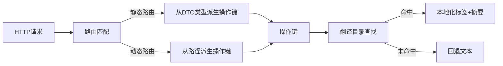
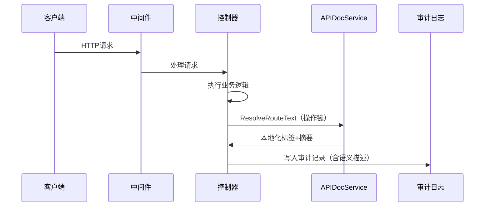

## 基本介绍

`APIDocService`为插件提供`API`文档本地化能力，将路由操作键解析为本地化的模块标签和操作摘要。该服务主要服务于审计日志、操作记录等需要展示路由语义信息的场景，而非`OpenAPI`文档生成本身。

插件通过`services.APIDoc()`获取该服务。典型消费方是操作日志插件（如`linapro-monitor-operlog`），它需要将拦截到的`HTTP`路由转换为用户可读的操作描述。

## 设计思路

`APIDocService`的核心设计围绕**操作键**展开。操作键是路由的稳定标识符，不随路径参数或版本变化而改变。

操作键的构建有两种策略：

- **静态路由**：从请求处理函数的`DTO`类型反射派生。`BuildOperationKeyFromHandler`解析处理函数的输入参数类型，将其包路径和类型名转换为点分隔的稳定键。例如`lina-core.backend.api.sys.user.ListReq`归一化为`core.backend.api.sys.user.ListReq`。
- **动态路由**：从请求路径派生。`BuildOperationKeyFromPath`将`OpenAPI`路径归一化后，结合`HTTP`方法生成操作键。动态插件路由（`/x/{pluginId}/...`）会被识别并转换为`plugins.{pluginId}.paths.{method}.{path}`格式。

操作键与翻译目录中的条目对应。`ResolveRouteText`根据操作键查找翻译目录，返回本地化的模块标签（`Title`）和操作摘要（`Summary`）。当翻译目录中没有对应条目时，返回调用方提供的回退文本。

## 架构位置

`APIDocService`位于请求处理链路的下游，通常在业务逻辑完成或审计记录写入时调用：

该服务与`BizCtxService`和`RouteService`共同构成请求上下文信息的读取层：

- `BizCtxService`提供请求的身份和租户上下文
- `RouteService`提供动态路由的元数据
- `APIDocService`提供路由的本地化语义

## 主要能力

| 方法 | 说明 |
|------|------|
| `ResolveRouteText` | 根据操作键解析单个路由的本地化模块标签和操作摘要 |
| `ResolveRouteTexts` | 批量解析多个路由文本，共享一次翻译目录加载，适合批量审计记录 |
| `FindRouteTitleOperationKeys` | 按关键词搜索匹配的模块标签操作键，用于审计日志的路由筛选 |

辅助函数方面，`BuildOperationKeyFromHandler`用于静态路由、`BuildOperationKeyFromPath`用于非`DTO`回退路由、`BuildDynamicOperationKey`用于动态插件路由，三者共同覆盖了操作键的全部构建场景。

## 设计约束

- **操作键是稳定标识**：操作键不随路径参数变化，相同业务操作在不同请求中应产生相同的操作键，这是翻译目录能正确匹配的前提。
- **翻译目录由宿主管理**：`APIDocService`只负责查找和返回，不负责翻译目录的维护。翻译条目的增删改通过`i18n`资源管理流程完成。
- **回退文本是安全网**：当翻译目录没有命中时，返回调用方提供的回退文本，确保审计记录始终有可展示的内容。
- **插件操作键需要命名空间**：源码插件的操作键会被归一化为`plugins.{pluginId}.`前缀，避免与主框架或其他插件冲突。

## 相关服务

- [BizCtxService](/docs/plugin-capability-bizctx) - 提供请求级身份和租户上下文
- [RouteService](/docs/plugin-capability-route) - 提供动态路由元数据
- [I18nService](/docs/plugin-capability-i18n) - 提供运行时翻译能力
