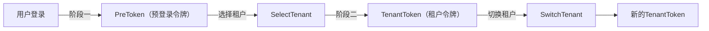
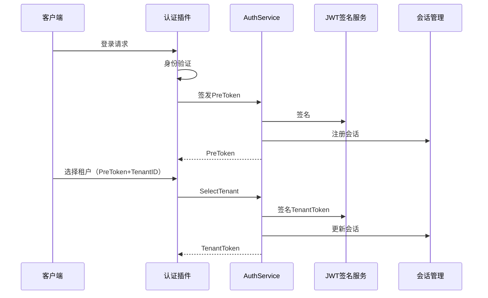

## 基本介绍

`AuthService`为插件提供租户认证`Token`的签发、切换和管理能力。它是多租户认证流程的核心服务，处理从登录到租户选择、租户切换、以及平台管理员模拟进入租户的全链路`Token`管理。

插件通过`services.Auth()`获取该服务。典型消费方是`linapro-tenant-core`插件，它实现了租户选择和切换的业务逻辑，通过`AuthService`完成`Token`的签发和撤销。

## 设计思路

`AuthService`采用**两阶段认证模型**：

**阶段一：登录产生PreToken。** 用户通过用户名密码或其他方式完成身份验证后，主框架签发一个短生命周期的`PreToken`。此时用户尚未绑定到具体租户。

**阶段二：选择租户签发TenantToken。** 用户选择目标租户后，插件调用`SelectTenant`将`PreToken`消费并签发绑定到该租户的`TenantToken`。`TenantToken`包含`AccessToken`和`RefreshToken`，后续请求使用`TenantToken`访问租户资源。

**租户切换。** 已认证用户需要切换到其他租户时，插件调用`SwitchTenant`。该方法校验用户在目标租户的成员关系，撤销当前`Token`并签发新的`TenantToken`。

**模拟令牌。** 平台管理员可以模拟进入任意租户。`IssueImpersonationToken`签发一个标记为模拟的`Token`，`RevokeImpersonationToken`用于撤销模拟会话。模拟令牌的业务授权和审计检查由调用方插件负责，宿主只负责`JWT`签名、会话状态和权限缓存。

## 架构位置

`AuthService`在认证链路中处于`Token`管理层，位于身份验证和业务授权之间：

该服务与以下服务协作：

- `BizCtxService`：`AuthService`签发的`Token`信息最终投影到`BizCtx`中，供业务逻辑读取
- `SessionService`：`Token`签发和撤销会同步更新在线会话状态
- `TenantService`：租户切换前需要校验用户在目标租户的可见性

## 主要能力

| 方法 | 说明 |
|------|------|
| `SelectTenant` | 消费`PreToken`，签发绑定到目标租户的`TenantToken` |
| `SwitchTenant` | 校验成员关系，撤销当前`Token`，签发新租户的`TenantToken` |
| `IssueImpersonationToken` | 为平台管理员签发模拟令牌，进入目标租户 |
| `RevokeImpersonationToken` | 撤销模拟令牌，结束模拟会话 |

## 设计约束

- **插件不直接签发JWT。** `Token`的签名、密钥管理和过期策略由宿主认证服务统一控制。插件通过`AuthService`申请签发，不接触签名细节。
- **模拟令牌需要调用方审计。** `IssueImpersonationToken`只负责签发`Token`，插件在调用前必须自行完成业务授权检查和审计记录。
- **`PreToken`是一次性的。** `SelectTenant`消费`PreToken`后即失效，不能重复使用。
- **租户切换会撤销旧`Token`。** `SwitchTenant`执行后，原`Token`立即失效，客户端需要使用新签发的`Token`。

## 相关服务

- [BizCtxService](/docs/plugin-capability-bizctx) - `Token`信息投影到业务上下文
- [SessionService](/docs/plugin-capability-session) - `Token`签发和撤销同步会话状态
- [TenantService](/docs/plugin-capability-tenant) - 租户切换前的可见性校验
