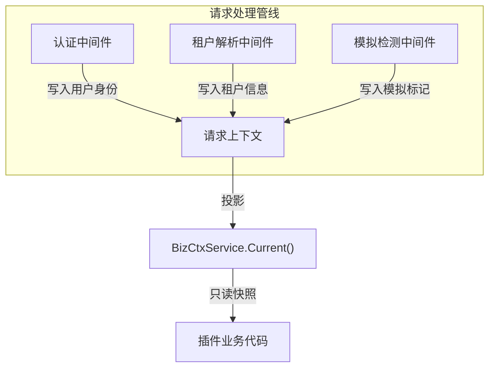
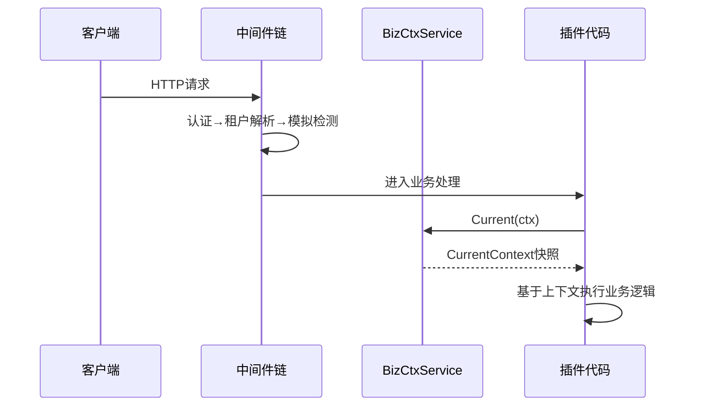

## 基本介绍

`BizCtxService`为插件提供当前请求的业务上下文只读投影。它将宿主内部复杂的请求上下文模型封装为一个稳定的`CurrentContext`快照，插件通过`services.BizCtx()`获取后读取用户、租户、模拟状态等信息，无需了解宿主内部的上下文存储机制。

该服务几乎所有需要感知请求身份的插件都会使用，是最基础的上下文读取能力之一。

## 设计思路

`BizCtxService`的核心设计是**只读投影**。宿主在请求进入业务处理前，将认证、租户解析、模拟检测等结果注入请求上下文。`BizCtxService`将这些结果投影为`CurrentContext`结构体，插件只能读取，不能修改。

`CurrentContext`包含以下关键字段：

| 字段 | 类型 | 说明 |
|------|------|------|
| `UserID` | `int` | 当前认证用户ID |
| `Username` | `string` | 当前认证用户名 |
| `TenantID` | `int` | 当前请求租户ID，`0`表示平台上下文 |
| `ActingUserID` | `int` | 模拟场景下的真实管理员ID |
| `ActingAsTenant` | `bool` | 是否以租户视角操作 |
| `IsImpersonation` | `bool` | 当前Token是否为模拟令牌 |
| `PlatformBypass` | `bool` | 是否允许绕过租户过滤 |

`PlatformBypass`的语义是：当`TenantID`为`0`时自动标记为`true`，表示该请求运行在平台范围，可以跨租户读取数据。插件在需要跨租户查询时应检查此字段。

## 架构位置

`BizCtxService`位于请求管线的输出端，是其他服务和插件业务逻辑获取请求身份的统一入口：

该服务是请求上下文信息的"消费者"，由以下"生产者"提供数据：

- `AuthService`：认证中间件使用`AuthService`验证Token后写入用户身份
- `TenantService`：租户解析中间件使用`TenantService`解析租户后写入租户信息
- 模拟检测中间件：检测Token中的模拟标记后写入`ActingUserID`和`IsImpersonation`

## 主要能力

| 方法 | 说明 |
|------|------|
| `Current` | 返回当前请求的`CurrentContext`只读快照，包含用户、租户、模拟状态等字段 |

`Current`是`BizCtxService`唯一的方法，设计意图是保持接口极简。所有请求上下文信息都封装在`CurrentContext`一个结构体中，插件按需读取字段。

## 设计约束

- **只读投影，不可修改。** `BizCtxService`返回的是快照，插件不能通过它修改请求上下文。需要修改上下文的场景（如租户切换）应使用`AuthService`。
- **不暴露宿主内部类型。** `CurrentContext`是插件可见的稳定投影，不暴露宿主内部的上下文模型、数据库实体或认证状态类型。
- **零值表示缺失。** 当上下文不可用时（如非`HTTP`请求、中间件未注入），`Current`返回零值结构体，不返回错误。插件应检查关键字段是否为零值。
- **`PlatformBypass`由宿主判定。** 插件不应自行设置或修改`PlatformBypass`标记，该字段由宿主根据`TenantID`自动判定。

## 相关服务

- [AuthService](/docs/plugin-capability-auth) - 认证中间件使用AuthService写入用户身份
- [TenantService](/docs/plugin-capability-tenant) - 租户解析中间件写入租户信息
- [TenantFilterService](/docs/plugin-capability-tenant-filter) - 使用BizCtx中的TenantID和PlatformBypass过滤数据
