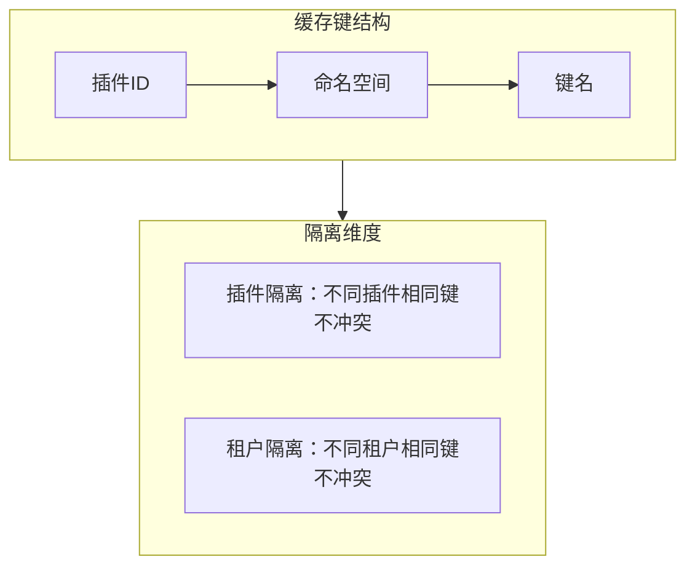
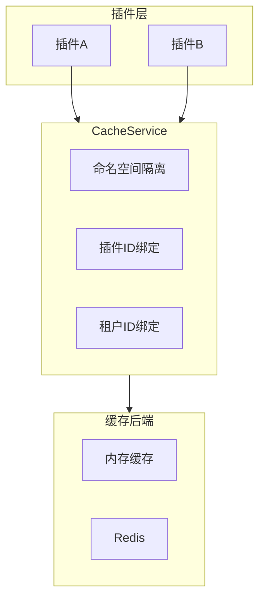

## 基本介绍

`CacheService`为插件提供作用域隔离的运行时缓存能力。插件通过`services.Cache()`获取该服务，缓存数据自动绑定到当前插件ID和租户范围，插件之间不会互相干扰。

该服务适用于插件内部的临时数据加速，如会话状态、计数器、热点数据等。缓存是失真性运行时加速数据，不应作为权限、配置、租户边界或业务记录的权威来源。

## 设计思路

`CacheService`采用**命名空间+插件ID+租户ID**三重隔离模型：

每个缓存操作都需要指定`namespace`和`key`。命名空间用于在同一插件内逻辑分组，键名在命名空间内唯一。宿主在实际存储时自动附加插件ID和租户ID前缀，确保跨插件和跨租户的隔离。

缓存支持两种值类型：

| 值类型 | 常量 | 说明 |
|--------|------|------|
| 字符串 | `CacheValueKindString` | 通用文本缓存 |
| 整数 | `CacheValueKindInt` | 计数器、序列号等整数场景 |

`Incr`方法专门用于整数缓存的原子递增，适用于访问计数、限流计数器等场景。

## 架构位置

`CacheService`位于插件业务层和宿主缓存后端之间，是插件缓存的唯一入口：

## 主要能力

| 方法 | 说明 |
|------|------|
| `Get` | 从指定命名空间读取未过期的缓存项 |
| `Set` | 存储字符串值到指定命名空间，`ttl=0`表示不过期 |
| `Delete` | 删除指定缓存项，删除不存在的项是成功的空操作 |
| `Incr` | 原子递增整数缓存项，适用于计数器场景 |
| `Expire` | 更新缓存项的过期策略，`ttl=0`清除过期 |

## 设计约束

- **缓存是失真性数据。** 缓存内容可能随时失效或被驱逐，不应作为权限判定、配置读取、租户边界或业务记录的权威来源。
- **插件不应直接操作缓存键前缀。** 宿主自动附加插件ID和租户ID前缀，插件只需关注命名空间和业务键名。
- **`ttl=0`的语义因方法而异。** `Set`时`ttl=0`表示不过期，`Expire`时`ttl=0`表示清除现有过期策略。
- **缓存后端由宿主控制。** 插件不能选择或配置缓存后端（内存、Redis等），由宿主统一管理。

## 相关服务

- [TenantFilterService](/docs/plugin-capability-tenant-filter) - 缓存键中的租户隔离与`TenantFilter`的租户过滤互补
- [ConfigService](/docs/plugin-capability-config) - 配置是持久数据，缓存是失真性运行时数据
