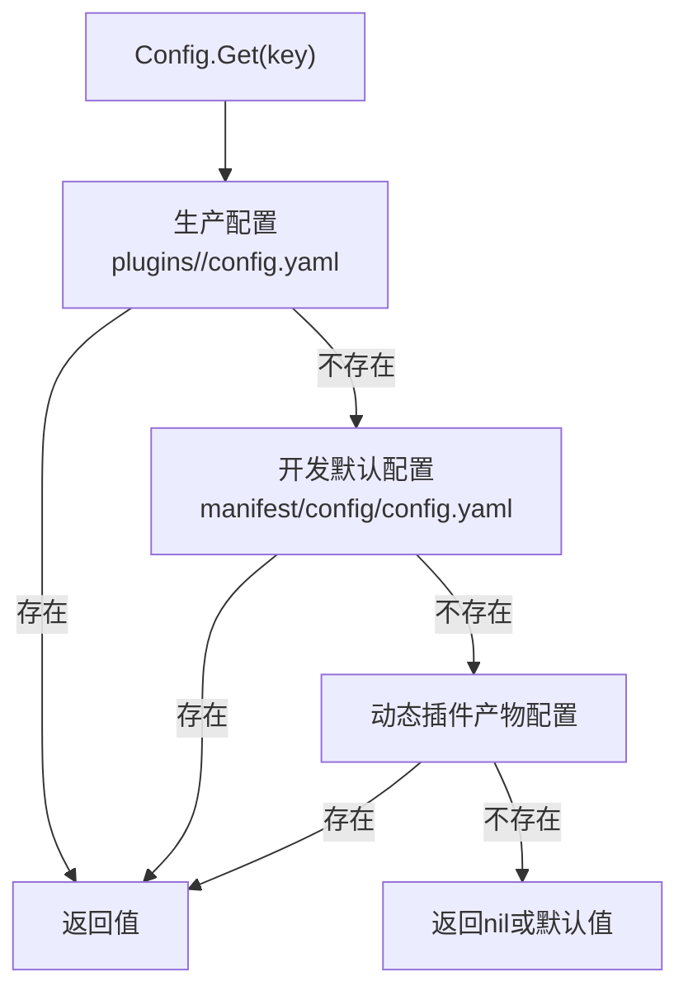
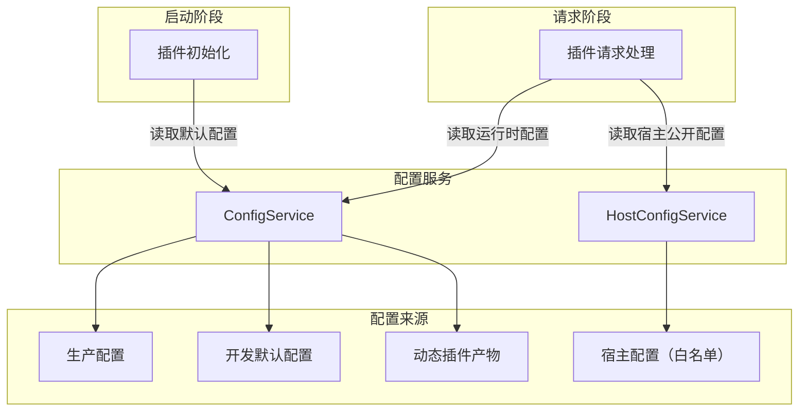

## 基本介绍

`LinaPro`为插件提供两个配置读取服务，分别服务于不同的配置层次：

- `ConfigService`：读取当前插件自己的业务配置，插件通过`services.Config()`获取
- `HostConfigService`：读取宿主公开的配置白名单键，插件通过`services.HostConfig()`获取

两个服务都提供类型化读取方法（`String`、`Bool`、`Int`、`Duration`、`Scan`），但职责边界严格分离：插件业务配置不应写入宿主`config.yaml`，宿主内部配置不应通过`HostConfigService`暴露给插件。

## 设计思路

### 插件配置 ConfigService

`ConfigService`采用**三层优先级覆盖**模型：

| 优先级 | 配置位置 | 说明 |
|--------|----------|------|
| 1 | 生产配置根下`plugins/<plugin-id>/config.yaml` | 运维侧覆盖，生产环境最高优先级 |
| 2 | `apps/lina-plugins/<plugin-id>/manifest/config/config.yaml` | 开发期默认配置 |
| 3 | 动态插件产物中的`manifest/config/config.yaml` | 动态插件随发布版本携带的默认配置 |

`manifest/config/config.example.yaml`是配置模板，不参与运行时默认读取。它只用于文档说明和初始化指导。

`ConfigService`是插件作用域的：主框架在构造服务时自动绑定当前插件ID，插件只能读取自己的配置，不能读取其他插件的配置。

### 宿主配置 HostConfigService

`HostConfigService`采用**白名单**模型：宿主维护一个公开配置键列表，只有列表中的键才能通过此服务读取。典型白名单键包括：

| 键 | 说明 |
|---|------|
| `workspace.basePath` | 工作台基础路径 |
| `i18n.default` | 默认Locale |
| `i18n.enabled` | 是否启用国际化 |

`HostConfigService`的白名单设计是为了防止插件扫描宿主完整配置树，避免读取数据库连接串、密钥等敏感配置。

## 架构位置

两个配置服务在启动和请求处理阶段都有使用：

插件在路由注册阶段（`registerRoutes`）通常读取启动级配置，在请求处理阶段按需读取运行时配置。

## 主要能力

两个服务共享相同的方法签名：

| 方法 | 说明 |
|------|------|
| `Get` | 返回原始配置值 |
| `Exists` | 检查配置键是否存在 |
| `Scan` | 将配置段扫描到目标结构体 |
| `String` | 读取字符串值，缺失时返回默认值 |
| `Bool` | 读取布尔值，缺失时返回默认值 |
| `Int` | 读取整数值，缺失时返回默认值 |
| `Duration` | 读取时间间隔值，缺失时返回默认值 |

## 设计约束

- **插件不应使用`g.Cfg()`。** 插件通过`ConfigService`读取自己的配置，不应直接使用GoFrame的全局配置扫描宿主完整配置树。
- **插件配置不应写入宿主`config.yaml`。** 插件业务配置应放在自己的配置路径下，保持配置隔离。
- `HostConfigService`**只读白名单键。** 插件不应尝试通过`HostConfigService`读取非白名单配置，这类请求会返回空值。
- **便捷方法基于`Get`。** `String`、`Bool`、`Int`、`Duration`、`Scan`是`Get`之上的类型化便捷方法，不是独立的授权方法。

## 相关服务

- [ManifestService](/docs/plugin-capability-manifest) - 读取`manifest/`下的原始资源文件，与配置服务互补
- [I18nService](/docs/plugin-capability-i18n) - 配置中的`i18n.default`等键影响翻译行为
