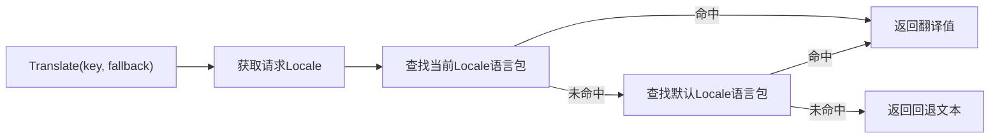
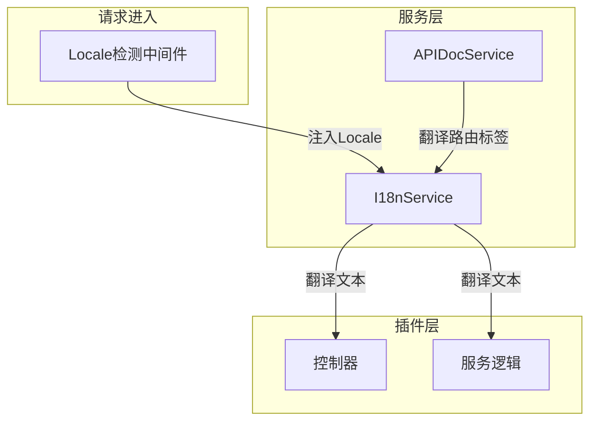

## 基本介绍

`I18nService`为插件提供运行时翻译能力，根据当前请求的`Locale`将翻译键解析为本地化文本。插件通过`services.I18n()`获取该服务，几乎所有需要展示用户可读文案的插件都会使用。

该服务与插件`manifest/i18n/`目录下的语言包配合工作：语言包定义翻译条目，`I18nService`在运行时根据请求`Locale`查找并返回对应翻译。

## 设计思路

`I18nService`的设计围绕**翻译键+回退文本**模型展开。每个翻译调用都提供一个翻译键和一个回退文本，翻译键用于在语言包中查找，回退文本在查找失败时作为安全网返回。

翻译键通常采用层级结构，例如`plugin.content-notice.article.create.success`，与插件语言包中的`JSON`或`YAML`层级对应。`Translate`方法按以下优先级查找：

1. 当前请求`Locale`对应的插件语言包
2. 插件默认`Locale`的语言包
3. 调用方提供的回退文本

`FindMessageKeys`方法支持反向查找：给定翻译键前缀和关键词，返回匹配的翻译键列表。这在审计日志等场景中用于搜索包含特定文案的翻译条目。

## 架构位置

`I18nService`在请求链路中作为翻译基础设施，被多个下游服务和插件业务逻辑消费：

`I18nService`是`APIDocService`的底层依赖：`APIDocService`使用`I18nService`翻译路由操作键对应的模块标签和操作摘要。

## 主要能力

| 方法 | 说明 |
|------|------|
| `GetLocale` | 获取当前请求的有效`Locale`，由宿主中间件注入 |
| `Translate` | 根据翻译键和回退文本返回本地化值 |
| `FindMessageKeys` | 按前缀和关键词搜索匹配的翻译键列表 |

## 设计约束

- **翻译键由插件定义。** `I18nService`只负责查找和返回，翻译条目的定义和维护在插件的`manifest/i18n/`语言包中。
- **回退文本是必须的。** 每次翻译调用都应提供回退文本，确保语言包缺失或翻译键错误时仍有可展示的内容。
- **Locale由宿主注入。** 插件不应自行解析`Accept-Language`头或其他`Locale`来源，应通过`GetLocale`获取宿主已解析的结果。
- **翻译值是运行时数据。** 翻译结果不应缓存为配置或写入数据库，它只适合在请求处理过程中临时使用。

## 相关服务

- [APIDocService](/docs/plugin-capability-apidoc) - 使用`I18n`翻译路由标签和操作摘要
- [ConfigService](/docs/plugin-capability-config) - 配置中的`i18n.default`等键影响`Locale`解析
- [ManifestService](/docs/plugin-capability-manifest) - 读取`manifest/i18n/`下的语言包资源
