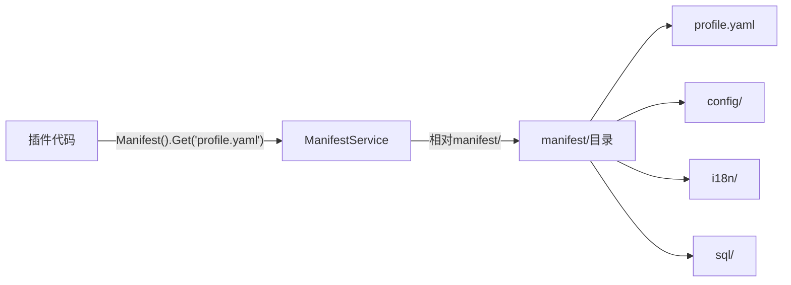
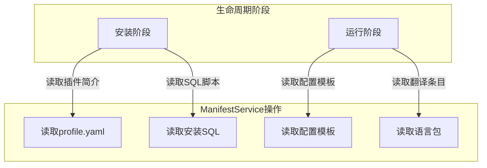

## 基本介绍

`ManifestService`为插件提供对`manifest/`目录下原始资源文件的只读访问。插件通过`services.Manifest()`获取该服务，用于读取`profile.yaml`、`config/config.example.yaml`、`i18n/zh-CN/plugin.json`、`sql/*.sql`等插件自有文件。

该服务与`ConfigService`互补：`ConfigService`读取经过优先级解析的插件配置值，`ManifestService`读取`manifest/`下的原始文件内容。

## 设计思路

`ManifestService`的核心设计是**原始资源读取**。它提供三种访问模式：

- `Get`：读取原始字节内容，适用于任意格式的资源文件
- `Exists`：检查资源是否存在，适用于条件判断
- `Scan`：将`YAML`资源反序列化到目标结构体，适用于结构化配置

路径语义是相对`manifest/`的斜杠分隔路径。例如：

| 路径 | 实际文件 | 说明 |
|------|----------|------|
| `profile.yaml` | `manifest/profile.yaml` | 插件简介 |
| `config/config.example.yaml` | `manifest/config/config.example.yaml` | 配置模板 |
| `i18n/zh-CN/plugin.json` | `manifest/i18n/zh-CN/plugin.json` | 中文语言包 |
| `sql/install.sql` | `manifest/sql/install.sql` | 安装脚本 |
| `resources/policy.yaml` | `manifest/resources/policy.yaml` | 策略配置 |

对于源码插件，`manifest/`资源通过`plugin_embed.go`嵌入编译产物。`ManifestService`从嵌入的文件系统中读取。对于动态插件，资源随`.wasm`产物打包，运行时绑定到当前有效发布版本。

## 架构位置

`ManifestService`在插件生命周期的多个阶段被使用：

该服务与以下服务形成互补关系：

- `ConfigService`：`ConfigService`读取经过优先级解析的配置值，`ManifestService`读取原始配置文件
- `I18nService`：`I18nService`在运行时翻译，`ManifestService`可以读取语言包原始文件

## 主要能力

| 方法 | 说明 |
|------|------|
| `Get` | 读取manifest/下指定路径的原始字节内容 |
| `Exists` | 检查manifest/下指定路径的资源是否存在 |
| `Scan` | 将YAML资源（或其中的嵌套键）反序列化到目标结构体 |

## 设计约束

- **路径相对`manifest/`。** 不要写成`manifest/profile.yaml`，应写成`profile.yaml`。
- **只读取原始资源。** `ManifestService`只负责读取文件内容，不负责让资源"生效"。读取SQL脚本不等于执行安装，读取语言包不等于注册翻译。
- **`config.example.yaml`不参与默认读取。** 它是配置模板，不是运行时默认值。`ConfigService`的默认值来自`manifest/config/config.yaml`。
- **插件只能读取自己的资源。** 与`ConfigService`类似，`ManifestService`是插件作用域的，不能读取其他插件的`manifest/`。

## 相关服务

- [ConfigService](/docs/plugin-capability-config) - 读取经过优先级解析的插件配置值
- [I18nService](/docs/plugin-capability-i18n) - 运行时翻译能力，语言包文件通过`ManifestService`读取
