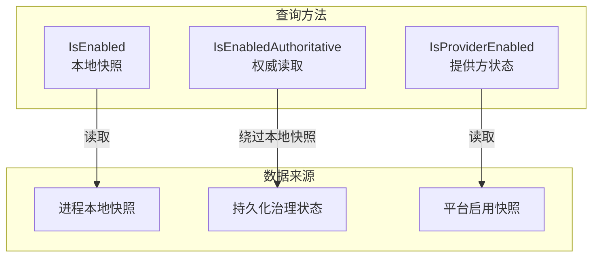
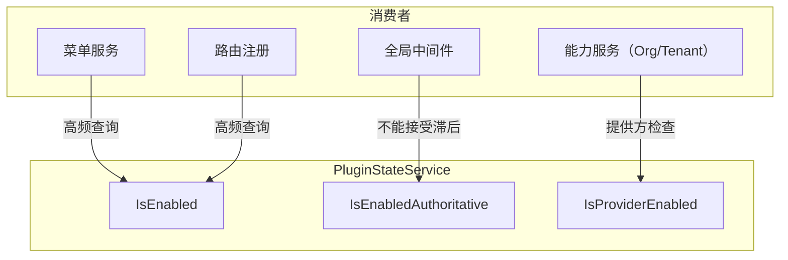

## 基本介绍

`PluginStateService`为插件提供启用状态查询能力，支持三种不同的查询语义。插件通过`services.PluginState()`获取该服务，根据业务场景选择合适的查询方法。

该服务是插件治理的核心基础设施，几乎所有需要感知自身或其他插件状态的场景都会使用。

## 设计思路

`PluginStateService`提供三种查询方法，分别服务于不同的时效性和一致性需求：

| 方法 | 数据来源 | 适用场景 |
|------|----------|----------|
| `IsEnabled` | 进程本地快照 | 菜单、路由、权限等高频判断 |
| `IsEnabledAuthoritative` | 持久化治理状态 | 全局中间件、写保护等不能接受滞后的控制 |
| `IsProviderEnabled` | 平台插件启用快照 | 能力提供方可用性判断 |

**本地快照 vs 权威读取。** `IsEnabled`读取进程内的启用状态快照，延迟极低但可能滞后于管理端的最新操作。`IsEnabledAuthoritative`绕过本地快照，直接读取持久化存储，确保获取最新状态但延迟更高。

**Provider启用状态。** `IsProviderEnabled`判断指定插件是否可以作为框架能力提供方。这个语义与`IsEnabled`独立：一个插件可能已启用但不能作为提供方（例如能力声明不完整），或者在某些上下文中作为提供方可用但业务入口不可见。

## 架构位置

`PluginStateService`在请求处理链路中被多个层消费：

## 主要能力

| 方法 | 说明 |
|------|------|
| `IsEnabled` | 查询插件是否已安装、启用且允许在当前请求范围暴露业务入口 |
| `IsEnabledAuthoritative` | 绕过本地快照，从持久化治理状态读取启用状态，适用于全局控制 |
| `IsProviderEnabled` | 查询插件是否作为框架能力提供方可用，独立于业务入口可见性 |

## 设计约束

- **高频判断用`IsEnabled`。** 菜单过滤、路由注册、权限检查等场景应使用`IsEnabled`，它从进程本地快照读取，延迟极低。
- **全局控制用`IsEnabledAuthoritative`。** 全局中间件、演示模式写保护等不能接受本地快照滞后的场景，应使用`IsEnabledAuthoritative`。
- **`IsProviderEnabled`独立于业务入口。** 一个插件的业务入口可能对当前租户不可见，但仍可作为能力提供方服务。这两个状态由不同的治理维度控制。
- **查询范围受请求上下文影响。** `IsEnabled`和`IsEnabledAuthoritative`的结果受当前请求的租户范围和运行时升级门禁影响，不同请求可能返回不同结果。

## 相关服务

- [PluginLifecycleService](/docs/plugin-capability-plugin-lifecycle) - 生命周期编排改变插件状态，`PluginStateService`查询插件状态
- [OrgService](/docs/plugin-capability-org) - 使用`IsProviderEnabled`判断组织能力提供方是否可用
- [TenantService](/docs/plugin-capability-tenant) - 使用`IsProviderEnabled`判断租户能力提供方是否可用
