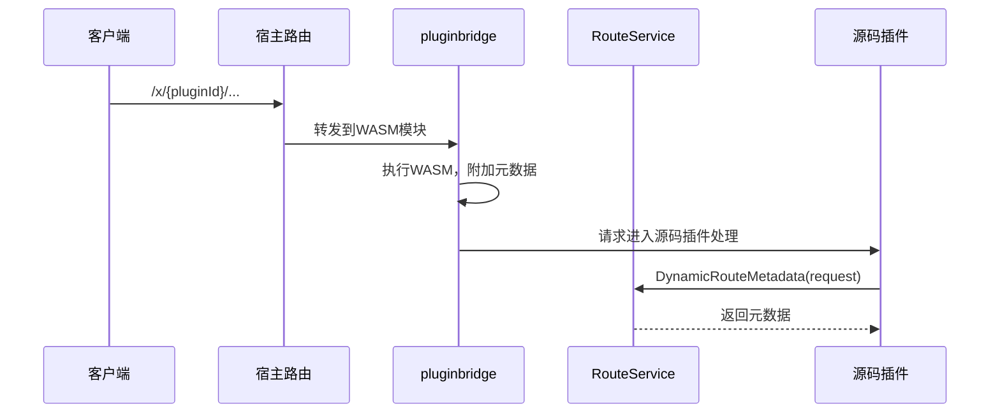

## 基本介绍

`RouteService`为插件提供当前动态路由请求的元数据访问能力。插件通过`services.Route()`获取该服务，用于读取动态插件路由的插件ID、HTTP方法、公开路径、标签、摘要等声明信息。

该服务主要服务于动态插件路由场景。源码插件通常在路由注册时已知自己的路由信息，不需要主动使用此服务；但在处理动态插件转发的请求时（如审计日志记录动态路由来源），需要通过`RouteService`获取路由元数据。

## 设计思路

`RouteService`的设计围绕**动态路由元数据投影**展开。当动态插件的请求通过`pluginbridge`进入宿主后，宿主在请求上下文中附加路由元数据。`RouteService`将这些元数据投影为`DynamicRouteMetadata`结构体。

`DynamicRouteMetadata`包含以下字段：

| 字段 | 说明 |
|------|------|
| `PluginID` | 拥有该路由的动态插件ID |
| `Method` | 路由声明的HTTP方法 |
| `PublicPath` | 请求匹配的公开宿主路径 |
| `Tags` | 路由声明的标签列表 |
| `Summary` | 路由声明的摘要 |
| `Meta` | 路由声明的附加元数据 |
| `ResponseBody` | 运行时分发器捕获的原始响应体 |
| `ResponseContentType` | 响应的内容类型 |

## 架构位置

`RouteService`位于动态插件请求分发链路中：

该服务是动态插件和源码插件之间的信息桥梁，让源码插件能够感知当前请求是否来自动态插件路由。

## 主要能力

| 方法 | 说明 |
|------|------|
| `DynamicRouteMetadata` | 从请求中提取动态路由元数据，非动态路由请求返回nil |

## 设计约束

- **主要服务动态插件场景。** 源码插件处理自己的路由时，路由信息在注册时已知，不需要通过`RouteService`查询。
- **非动态路由返回nil。** 当请求不是通过动态插件路由进入时，`DynamicRouteMetadata`返回`nil`，调用方需要判空。
- **元数据是只读投影。** 返回的元数据结构体是只读的，不能通过它修改路由声明或响应内容。
- **`ResponseBody`是运行时捕获。** 该字段存储的是`pluginbridge`分发器捕获的响应体，可能为空。

## 相关服务

- [APIDocService](/docs/plugin-capability-apidoc) - 使用路由元数据中的操作键进行文档本地化
- [BizCtxService](/docs/plugin-capability-bizctx) - 路由元数据与业务上下文共同构成请求全貌
