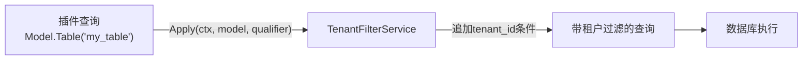
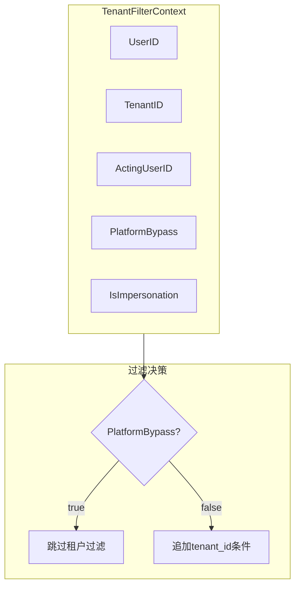
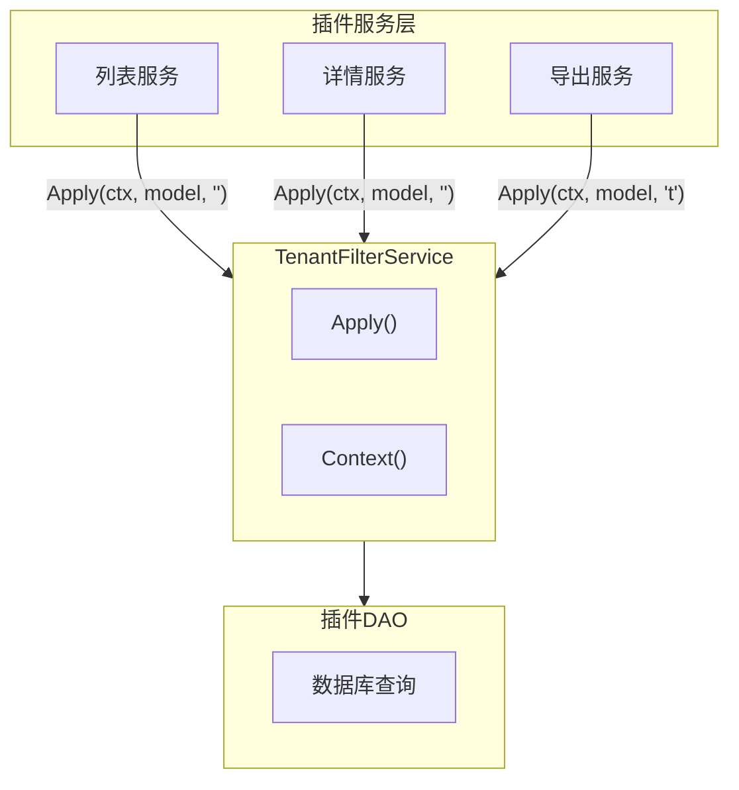

## 基本介绍

`TenantFilterService`为插件提供数据库查询的租户过滤注入能力。插件通过`services.TenantFilter()`获取该服务，用于为插件自有表追加`tenant_id`过滤条件，实现多租户数据隔离。

该服务是源码插件独有能力，不在`capability.Services`中暴露，而是通过`pluginhost.Services`扩展提供。这是因为`TenantFilterService`携带数据库查询构建器（`*gdb.Model`），按照能力服务的设计原则，这类能力不通过普通`capability.Services`暴露。

## 设计思路

`TenantFilterService`采用**查询注入**模式：插件将数据库查询模型传入`Apply`方法，服务自动追加`tenant_id`条件，返回修改后的查询模型。

`Apply`方法的`qualifier`参数用于指定表名或别名，适用于联合查询场景：

| qualifier值 | 说明 |
|-------------|------|
| 空字符串 | 对`tenant_id`列不加表限定符 |
| 表名 | 对`tenant_id`列加表限定符，如`my_table.tenant_id` |
| 别名 | 对`tenant_id`列加别名限定符，如`t.tenant_id` |

`Context`方法返回`TenantFilterContext`，包含当前请求的租户、用户、模拟状态等信息，供插件在需要手动构建查询条件时使用。

## 架构位置

`TenantFilterService`在插件数据访问层被广泛使用：

几乎所有租户感知的插件都会使用该服务。典型模式是在`DAO`层的查询方法中调用`Apply`，确保所有数据访问都经过租户过滤。

## 与pluginhost.Services的关系

`TenantFilterService`是`pluginhost.Services`扩展的能力，不在`capability.Services`中。
这样设计的原因是`TenantFilterService`的方法携带`*gdb.Model`数据库查询构建器。按照能力服务的设计原则，涉及数据库查询构建器的能力不通过普通`capability.Services`暴露，以防止普通消费接口泄露数据库细节。

## 主要能力

| 方法 | 说明 |
|------|------|
| `Context` | 返回当前请求的TenantFilterContext，包含租户、用户、模拟状态等信息 |
| `Apply` | 向查询模型追加`tenant_id`过滤条件，PlatformBypass时跳过过滤 |

## 设计约束

- **源码插件独有。** `TenantFilterService`不通过`capability.Services`暴露，动态插件通过`hostServices`授权机制访问等价能力。
- **`PlatformBypass`自动跳过。** 当请求运行在平台范围（`TenantID = 0`）时，`Apply`自动跳过租户过滤，允许跨租户读取。
- **插件不应手写租户过滤。** 使用`TenantFilterService`而非手写`WHERE tenant_id = ?`，确保过滤逻辑与宿主的平台绕过、模拟等策略一致。
- **`qualifier`用于联合查询。** 单表查询通常使用空字符串，联合查询时需要指定表名或别名避免列名歧义。

## 相关服务

- [BizCtxService](/docs/plugin-capability-bizctx) - TenantFilterContext中的身份信息来自BizCtx
- [TenantService](/docs/plugin-capability-tenant) - 租户能力提供租户解析，TenantFilter使用租户信息过滤数据
- [CacheService](/docs/plugin-capability-cache) - 缓存键中的租户隔离与TenantFilter的查询过滤互补
