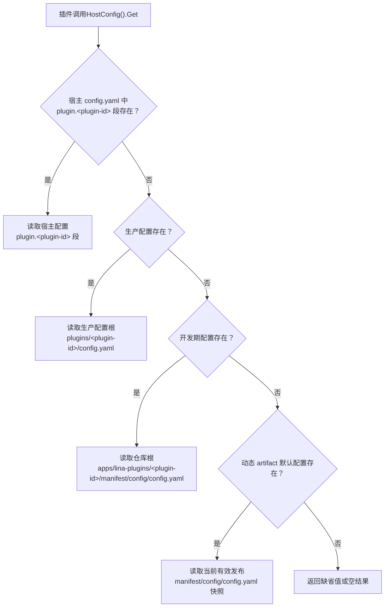
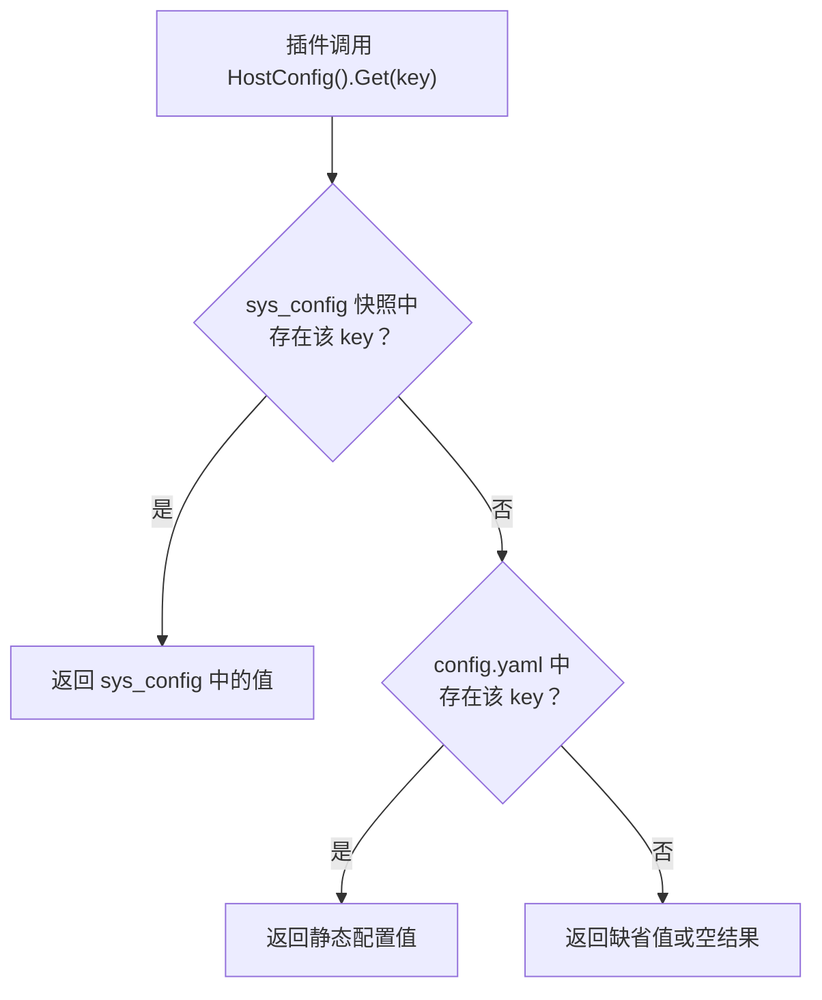

## 基本介绍

主框架`config.yaml`只保存主框架静态运行时配置，不承载插件自身业务配置。插件应通过插件作用域配置服务读取自己的配置，实现配置隔离和独立管理。

除静态配置外，主框架还提供了基于数据库`sys_config`表的运行时参数存储机制。`sys_config`是一个**通用的运行时键值存储**——主框架用它管理内置系统参数，插件同样可以在其中注册和读取自定义的运行时参数，所有条目均可通过`HostConfig()`服务统一访问。

## 配置读取优先级

插件业务配置的读取采用**独占式优先级**策略——多个配置源之间不做合并，第一个提供有效值的源即为最终结果。优先级从高到低如下：

| <span style={{whiteSpace: 'nowrap'}}>优先级</span> | 来源 | 路径 | 适用范围 |
|:---:|------|------|------|
| 1 | 宿主配置文件 | 主框架`config.yaml`中的`plugin.<plugin-id>`段 | 所有插件 |
| 2 | 生产配置文件 | `<productionRoot>/plugins/<plugin-id>/config.yaml` | 所有插件 |
| 3 | 开发配置文件 | `apps/lina-plugins/<plugin-id>/manifest/config/config.yaml` | 源码插件 |
| 4 | 产物内嵌配置 | 动态插件发布产物中内嵌的默认配置 | 动态插件 |

:::warning 独占式覆盖而非合并
当宿主`config.yaml`中存在`plugin.<plugin-id>`段时，该段即为该插件配置的**唯一来源**——即使段内缺少某些子键，也不会回退到文件配置中补全。例如：生产配置文件中定义了`storage.endpoint`和`storage.region`两个键，而宿主配置中仅覆盖了`storage.endpoint`，则`storage.region`不会从文件中读取，而是返回调用方的默认值。即使`plugin.<plugin-id>`为空对象`{}`，也会阻止回退到文件配置。
:::

`manifest/config/config.example.yaml`只是模板文件，不作为运行时默认值。




## `plugin.<plugin-id>` 配置

在宿主`config.yaml`中通过`plugin.<plugin-id>`段可以直接覆盖任意插件的业务配置。这一机制适用于需要在部署层面统一管控插件行为的场景，例如：强制覆盖开发环境默认值、为不同部署环境指定差异化配置，或者临时调整插件参数而无需修改插件自身的配置文件。

### 配置结构

`plugin.<plugin-id>`段与插件自身的`config.yaml`保持相同的键结构，插件标识（`<plugin-id>`）作为一级键名，其下的子键直接对应插件内部的配置项：

```yaml
plugin:
  # 框架级插件管理配置
  allowForceUninstall: true
  dynamic:
    storagePath: "/app/data/wasm"
  autoEnable:
    - id: "linapro-ai-core"
      withMockData: false

  # 插件业务配置覆盖——以插件标识作为一级键
  linapro-demo-source:
    demo:
      greeting: "Hello from host override"
      featureEnabled: false
```

上述示例中，`linapro-demo-source`是插件标识，`demo.greeting`和`demo.featureEnabled`是该插件内部的业务配置键。框架在解析时会将`plugin.linapro-demo-source`整体作为该插件的配置根，插件通过`config.Get(ctx, "demo.greeting")`读取时即可获得覆盖后的值。

### 使用场景

| 场景 | 说明 |
|------|------|
| 部署环境差异化 | 不同环境（开发、测试、生产）的`config.yaml`各自声明插件配置，无需修改插件自带的默认文件 |
| 集中管控 | 运维人员通过宿主配置文件统一管理所有插件的关键参数，避免分散在各插件目录中 |
| 临时调试 | 排查问题时临时覆盖某个插件的配置项，排查完成后移除覆盖段即可恢复默认行为 |

:::caution 配置独占性
一旦在宿主`config.yaml`中声明了`plugin.<plugin-id>`段，该插件的文件级配置（生产配置文件、开发配置文件、产物内嵌配置）将被完全忽略。如需保留文件配置中的部分键值，需要在`plugin.<plugin-id>`段中完整复制所需的全部配置项。
:::

### 生产配置文件路径解析

生产配置文件`<productionRoot>/plugins/<plugin-id>/config.yaml`中的`productionRoot`按以下优先级解析：

| <span style={{whiteSpace: 'nowrap'}}>优先级</span> | 来源 | 说明 |
|:---:|------|------|
| 1 | 工厂显式指定 | 框架初始化时注入的路径 |
| 2 | `GF_GCFG_PATH`环境变量 | 配置目录路径环境变量 |
| 3 | 仓库根目录 + `apps/lina-core/manifest/config` | 开发仓库内的默认位置 |
| 4 | 可执行文件所在目录 + `config` | 部署场景下的相对路径兜底 |

## 插件配置读取方式

### 源码插件

源码插件通过`HostServices().Config()`读取当前插件自己的配置。这种方式提供了完整的配置访问能力，插件可以读取自己作用域内的所有配置项。

### 动态插件

动态插件通过`hostServices`声明`service: config`和`methods: [get]`后读取配置。动态插件的配置访问受到更严格的限制，只能访问明确授权的配置方法。

## 访问主框架配置内容

插件在读取自身作用域配置之外，有时还需要访问主框架的全局配置。主框架配置分为两类：静态配置（来自`config.yaml`文件）和运行时参数（来自数据库`sys_config`表）。两种插件类型在访问宿主配置时存在显著差异。

### 运行时参数（sys_config）

`sys_config`表是一个通用的运行时键值存储，支持在运行时动态调整参数而无需重启服务。该表中的条目分为两类：

- **主框架内置参数**——由主框架预定义并管理的系统级参数，具有默认值和校验规则，`is_builtin`标记为`1`。
- **插件自定义参数**——由业务插件自行注册的运行时参数，键名和值由插件自主定义，`is_builtin`标记为`0`。

两类参数通过`HostConfig()`服务以相同方式读取，主框架不会区分参数来源。

#### 主框架内置参数

参数的`is_builtin`属性为`1`的参数由主框架管理，同时这些参数的键名以`sys.`为前缀，内置参数的键名不可重命名、不可删除，且其值会经过格式校验。插件自定义参数应避免使用这些前缀，以免与内置参数冲突。

#### 插件自定义参数

业务插件可以在`sys_config`表中注册自定义的运行时参数，通常由业务插件的安装 `SQL` 文件声明初始数据，并通过`HostConfig().SysConfig()`接口在运行时管理。这些参数与内置参数存储在同一个表中，通过`HostConfig()`服务以完全相同的方式读取。

##### SQL 文件声明初始参数

插件在安装时会执行`manifest/sql/`目录下的 `SQL` 文件。插件可以在安装 `SQL` 中直接向`sys_config`表插入自定义运行时参数，适合声明插件所需的初始配置值。

```sql
-- manifest/sql/001-my-plugin-config.sql
-- 插件自定义运行时参数——安装时自动写入 sys_config 表
INSERT INTO sys_config ("tenant_id", "name", "key", "value", "is_builtin", "remark", "created_at", "updated_at") VALUES
(0, 'API 网关地址', 'my-plugin.api.endpoint', 'https://api.example.com', 0, '第三方 API 网关地址', NOW(), NOW()),
(0, '最大重试次数', 'my-plugin.retry.max', '3', 0, '请求失败时的最大重试次数', NOW(), NOW()),
(0, '调试模式', 'my-plugin.debug.enabled', 'false', 0, '是否启用调试日志输出', NOW(), NOW())
ON CONFLICT DO NOTHING;
```

`SQL` 方式的关键约束如下。

| 约束项 | 说明 |
|------|------|
| `is_builtin` | 必须设置为`0`，标记为插件自定义参数而非主框架内置参数 |
| `tenant_id` | 设为`0`表示平台级默认值；多租户场景下可按租户 ID 插入覆盖值 |
| `ON CONFLICT DO NOTHING` | 幂等保护，重复安装不会覆盖已有的运行时值 |
| 键名前缀 | 建议以**插件标识**为前缀（如`my-plugin.`），避免与内置参数或其他插件冲突 |

##### HostConfig().SysConfig() 运行时管理

源码插件可以通过`HostConfig().SysConfig()`接口在运行时批量查询和更新已有的运行时参数。此方式适合在插件业务逻辑中动态读写配置值。

| 方法 | 说明 |
|------|------|
| `Get(ctx, key)` | 读取一个可见的运行时配置值 |
| `BatchGet(ctx, keys)` | 批量查询运行时参数，返回可见的参数投影和缺失键列表 |
| `List(ctx, input)` | 按关键词搜索可见的运行时配置 |
| `SetValue(ctx, key, value)` | 更新已有运行时参数的值，写入后自动推进共享修订号以触发快照刷新 |
| `Reset(ctx, key)` | 将运行时参数重置为默认值 |
| `EnsureVisible(ctx, keys)` | 校验配置键是否在调用方可见范围内 |

```go
// 批量读取运行时参数
result, err := services.HostConfig().SysConfig().BatchGet(ctx,
    []hostconfigcap.SysConfigKey{
        "my-plugin.api.endpoint",
        "my-plugin.retry.max",
    },
)
for key, info := range result.Items {
    fmt.Printf("%s = %s\n", key, info.Value)
}
// result.MissingIDs 中包含表里不存在的键

// 更新已有参数的值（键必须已存在于 sys_config 表中）
err = services.HostConfig().SysConfig().SetValue(ctx,
    "my-plugin.api.endpoint",
    "https://new-api.example.com",
)
```

:::caution SetValue 仅更新不创建
`SetValue`只能更新`sys_config`表中**已存在的**键。若键不存在，接口会返回权限拒绝错误。因此，插件的初始参数应通过 `SQL` 文件声明，后续在业务逻辑中通过`SetValue`更新值。
:::

##### 读取参数

无论参数通过哪种方式注册，读取均通过`HostConfig()`服务统一完成。读取流程为：先从`sys_config`运行时快照中查找，命中则返回；未命中则回退到`config.yaml`静态配置。



:::tip 运行时参数优先于静态配置
当`sys_config`中的键与`config.yaml`中的静态配置存在同名键时，`sys_config`中的值优先。例如：`config.yaml`中配置了`jwt.expire: 12h`，而`sys_config`表中存在`sys.jwt.expire: 24h`，则实际生效的 `JWT` 有效期为 `24` 小时。
:::

### 源码插件：无限制访问

源码插件通过`pluginhost.Services`获取`HostConfig()`服务实例，可以读取`sys_config`中的**任意键**（包括内置参数和插件自定义参数），也可以读取`config.yaml`中的**任意静态配置键**。主框架不会对键名做任何过滤或拦截，源码插件拥有与主框架内部模块相同的配置读取权限。

源码插件读取运行时参数的示例：

```go
// 读取主框架内置参数
jwtExpire, err := services.HostConfig().Duration(ctx, "sys.jwt.expire", 24*time.Hour)
uploadMaxSize, err := services.HostConfig().Int(ctx, "sys.upload.maxSize", 100)

// 读取插件自定义参数
apiEndpoint, err := services.HostConfig().String(ctx, "my-plugin.api.endpoint", "")
maxRetries, err := services.HostConfig().Int(ctx, "my-plugin.retry.max", 3)
debugMode, err := services.HostConfig().Bool(ctx, "my-plugin.debug.enabled", false)

// 通用读取——先查 sys_config 快照，未命中再回退到 config.yaml
rawValue, err := services.HostConfig().Get(ctx, "my-plugin.some.key")

// 检查配置键是否存在（优先匹配 sys_config）
exists, err := services.HostConfig().Exists(ctx, "my-plugin.some.key")
```

### 动态插件：声明式白名单

动态插件的宿主配置访问受到严格的白名单约束。插件必须在`plugin.yaml`的`hostServices`中声明`service: hostConfig`，并通过`resources.keys`显式列出允许读取的配置键。白名单同时适用于`sys_config`运行时参数和`config.yaml`静态配置键。主框架在插件安装和运行时会对声明进行多层校验：

1. **清单校验**——插件安装时，主框架检查`plugin.yaml`中`hostConfig`声明的完整性，要求至少声明一个键，且不允许空键或根路径`.`。
2. **能力检查**——运行时每次调用前，验证插件是否具备`host:hostconfig`能力。
3. **键级鉴权**——调用到达时，主框架从插件的授权快照中检索已声明的键集合，只有命中白名单的键才会被放行读取。

以下为动态插件在`plugin.yaml`中声明白名单的示例——同时声明了主框架内置参数和插件自定义参数：

```yaml
hostServices:
  - service: hostConfig
    methods:
      - get
    resources:
      keys:
        # 主框架静态配置
        - workspace.basePath
        - i18n.default
        - i18n.enabled
        # 主框架内置运行时参数
        - sys.jwt.expire
        - sys.upload.maxSize
        # 插件自定义运行时参数
        - my-plugin.api.endpoint
        - my-plugin.retry.max
```

:::caution 白名单覆盖所有配置来源
白名单中的键名统一适用于`sys_config`运行时参数和`config.yaml`静态配置——主框架会先从`sys_config`快照中查找，未命中再回退到静态配置。未在白名单中声明的键将被拒绝访问，无论该键存储在`sys_config`还是`config.yaml`中。
:::

## 配置隔离设计

插件配置与主框架配置的隔离设计遵循以下原则：

1. **独立管理**——插件配置由插件自己管理，不依赖主框架配置
2. **作用域隔离**——每个插件有独立的配置作用域，避免配置冲突
3. **分级访问**——源码插件可读取全部宿主配置，动态插件通过声明式白名单限定可访问的配置键，兼顾灵活性与安全性
4. **独占式覆盖**——宿主可通过`plugin.<plugin-id>`段覆盖插件配置，但该段一旦存在即成为唯一来源，文件配置不再参与解析
5. **运行时共享存储**——`sys_config`表作为通用运行时参数存储，主框架和插件均可在其中注册自定义参数，通过`HostConfig()`服务统一读取，无需重启即可生效

这种设计使得插件可以在不影响主框架的情况下独立配置和运行——通过文件级配置管理静态默认值，通过`sys_config`管理需要动态调整的运行时参数，通过独占式覆盖机制为部署层面的集中管控提供清晰的语义。
