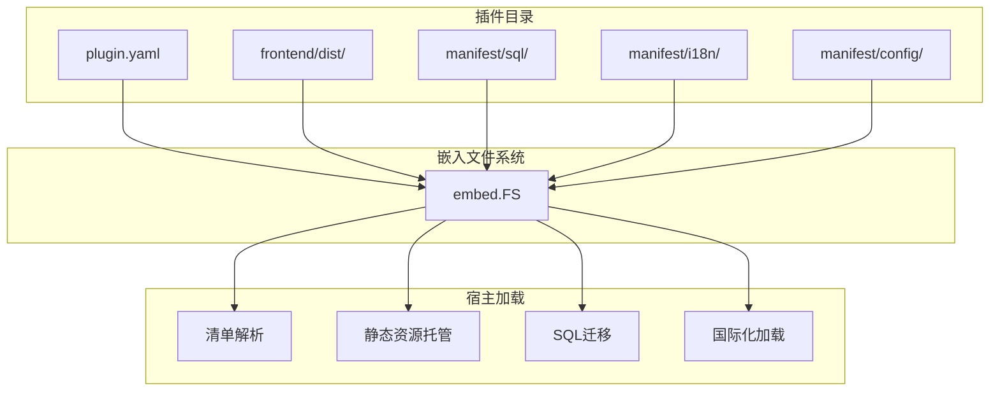

## 基本介绍

`Assets()`是源码插件的资源声明入口，通过`UseEmbeddedFiles()`绑定插件的嵌入文件系统。嵌入文件系统包含插件的清单文件、前端页面、`SQL`迁移脚本和`i18n`国际化资源，宿主在启动时加载这些资源完成插件集成。动态插件通过`WASM`自定义段嵌入资源，不需要显式绑定。

**能力阶段**：声明期

**类型支持**：仅源码插件

## 能力设计

### 资源目录结构

插件的标准目录结构如下：

```text
apps/lina-plugins/<plugin-id>/
├── plugin.yaml              # 插件清单                    [嵌入]
├── backend/                 # 后端Go代码                  [编译，不嵌入]
│   ├── plugin.go            # 注册入口
│   └── internal/            # 业务逻辑
├── frontend/                # 前端资源                    [嵌入]
│   └── dist/                # 构建产物
└── manifest/                # 清单资源                    [嵌入]
    ├── sql/                 # SQL迁移脚本
    │   ├── install.sql      # 安装脚本
    │   ├── uninstall.sql    # 卸载脚本
    │   └── mock.sql         # 模拟数据脚本
    ├── i18n/                # 国际化资源
    │   ├── zh-Hans.yaml
    │   └── en.yaml
    └── config/              # 配置模板
        ├── config.yaml      # 默认配置
        └── config.example.yaml  # 配置示例
```

### 嵌入文件系统绑定

源码插件通过`UseEmbeddedFiles()`将静态资源嵌入到二进制文件中。嵌入范围仅包含清单文件、前端资源和`manifest/`目录下的运维资源，不包含后端`Go`源代码：



### 资源类型

| 资源类型 | 目录 | 说明 |
|----------|------|------|
| 清单文件 | `plugin.yaml` | 插件身份、依赖、菜单、权限等声明 |
| 前端资源 | `frontend/dist/` | 前端构建产物，由宿主托管在`/x-assets/{plugin-id}/{version}/` |
| SQL迁移 | `manifest/sql/` | 安装、卸载和模拟数据脚本，必须是幂等的 |
| 国际化资源 | `manifest/i18n/` | 多语言翻译文件 |
| 配置模板 | `manifest/config/` | 插件默认配置和配置示例 |

### 前端资源托管

宿主将插件的前端资源托管在`/x-assets/{plugin-id}/{version}/`路径下。插件通过`plugin.yaml`的`public_assets`字段声明需要托管的目录：

```yaml
public_assets:
  - source: frontend/dist
    mount: /
    index: index.html
```

| 字段 | 说明 |
|------|------|
| `source` | 插件内的源目录路径 |
| `mount` | 挂载路径 |
| `index` | 默认索引文件 |

### SQL迁移脚本

`SQL`迁移脚本位于`manifest/sql/`目录下，宿主在插件安装和卸载时执行：

| 脚本 | 执行时机 | 说明 |
|------|----------|------|
| `install.sql` | 插件安装 | 创建表结构、初始化数据 |
| `uninstall.sql` | 插件卸载 | 清理表结构和数据 |
| `mock.sql` | 开发环境 | 插入模拟数据 |

`SQL`脚本必须是幂等的，使用`IF NOT EXISTS`或`IF EXISTS`确保重复执行不会出错。多租户插件的表需要包含`tenant_id`列。

### 国际化资源

国际化资源位于`manifest/i18n/`目录下，使用`YAML`格式：

```yaml
# manifest/i18n/zh-Hans.yaml
menu:
  dashboard: 仪表盘
  reports: 报表
  settings: 设置

messages:
  welcome: 欢迎使用
  error.notFound: 未找到资源
```

```yaml
# manifest/i18n/en.yaml
menu:
  dashboard: Dashboard
  reports: Reports
  settings: Settings

messages:
  welcome: Welcome
  error.notFound: Resource not found
```

宿主在插件启用时加载国际化资源，供运行时翻译使用。

## 接口定义

### 源码插件接口

源码插件通过`Assets()`声明嵌入文件系统：

| 方法 | 说明 |
|------|------|
| `UseEmbeddedFiles` | 绑定插件的嵌入文件系统 |

`AssetDeclarations`接口定义：

```go
type AssetDeclarations interface {
    UseEmbeddedFiles(fileSystem fs.FS)
}
```

### 动态插件资源管理

动态插件通过`WASM`自定义段嵌入资源，不需要显式绑定。构建工具自动将以下资源嵌入`.wasm`产物：

| 自定义段 | 内容 |
|----------|------|
| `lina.plugin.manifest` | 插件身份清单 |
| `lina.plugin.frontend.assets` | 前端资源 |
| `lina.plugin.i18n.assets` | 国际化资源 |
| `lina.plugin.apidoc.i18n.assets` | 接口文档国际化资源 |
| `lina.plugin.install.sql` | 安装SQL脚本 |
| `lina.plugin.uninstall.sql` | 卸载SQL脚本 |
| `lina.plugin.mock.sql` | 模拟数据SQL脚本 |
| `lina.plugin.manifest.resources` | 清单资源文件 |

## 能力使用

### 源码插件使用

源码插件在`init()`中通过`Assets()`绑定嵌入文件系统：

```go
package main

import (
    "embed"

    "lina-core/pkg/plugin/pluginhost"
)

//go:embed plugin.yaml all:manifest all:frontend/dist
var pluginFS embed.FS

func init() {
    plugin := pluginhost.NewDeclarations("my-author-my-domain-my-cap")
    plugin.Assets().UseEmbeddedFiles(pluginFS)

    if err := pluginhost.RegisterSourcePlugin(plugin); err != nil {
        panic(err)
    }
}
```

### 嵌入文件系统访问

宿主通过`SourcePluginDefinition.GetEmbeddedFiles()`访问插件的嵌入文件系统：

```go
// 读取插件清单
manifestData, err := fs.ReadFile(embeddedFS, "plugin.yaml")

// 读取SQL脚本
installSQL, err := fs.ReadFile(embeddedFS, "manifest/sql/install.sql")

// 读取国际化资源
i18nData, err := fs.ReadFile(embeddedFS, "manifest/i18n/zh-Hans.yaml")
```

### 动态插件资源管理

动态插件的资源在构建时自动嵌入`.wasm`产物。构建工具扫描插件目录并生成对应的自定义段：

```bash
# 构建动态插件
make wasm p=my-plugin
```

构建工具会自动：
1. 读取`plugin.yaml`并嵌入`lina.plugin.manifest`段
2. 扫描`frontend/dist/`并嵌入`lina.plugin.frontend.assets`段
3. 扫描`manifest/i18n/`并嵌入`lina.plugin.i18n.assets`段
4. 扫描`manifest/sql/`并嵌入对应的`SQL`段
5. 扫描`manifest/resources/`并嵌入`lina.plugin.manifest.resources`段

## 设计约束

- **`Assets()`仅限源码插件。** 动态插件通过`WASM`自定义段嵌入资源，不需要显式绑定。
- **嵌入文件系统是只读的。** 插件不能在运行时修改嵌入的资源。
- **`SQL`脚本必须是幂等的。** 使用`IF NOT EXISTS`或`IF EXISTS`确保重复执行不会出错。
- **多租户表需要`tenant_id`列。** 宿主会检查租户感知插件的表结构。
- **前端资源由宿主托管。** 插件不应自行托管静态资源，应通过`public_assets`声明。
- **国际化资源使用`YAML`格式。** 宿主统一解析`YAML`格式的国际化文件。

## 相关文档

- [声明期能力概览](/docs/declaration-capabilities)
- [插件清单](/docs/declaration-assets)
- [源码插件开发](/docs/source-plugins)
- [国际化能力](/docs/domain-capability-i18n)
