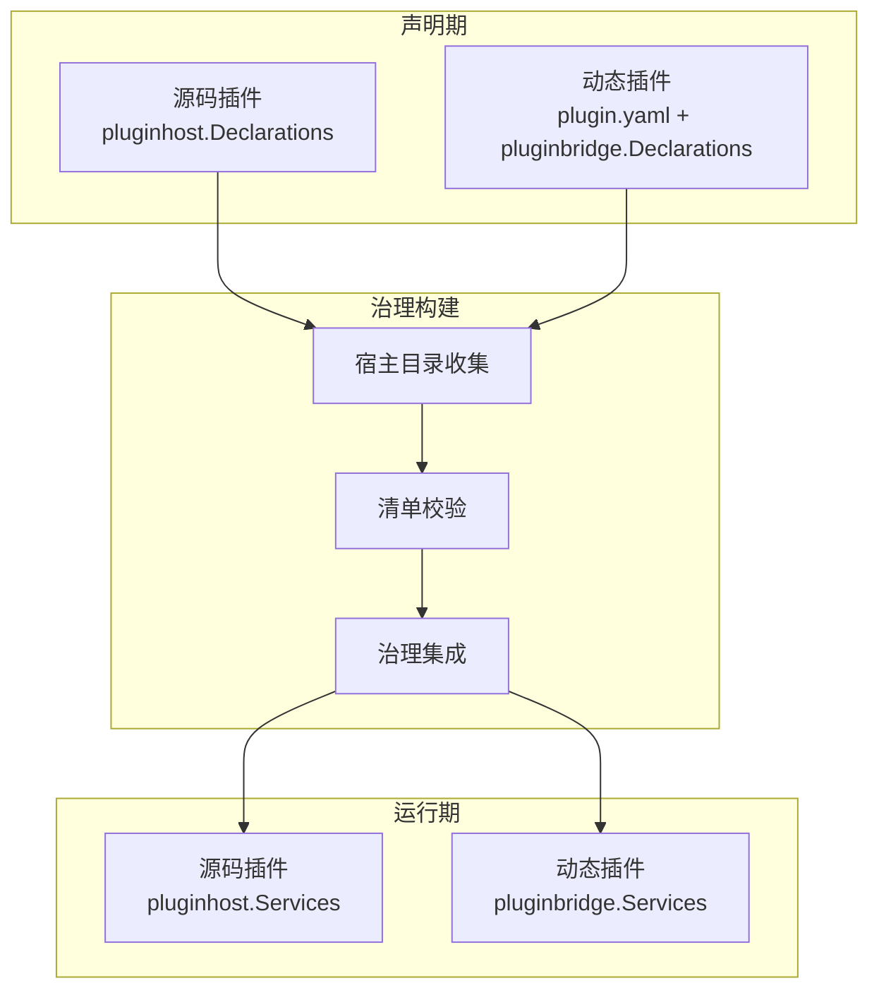
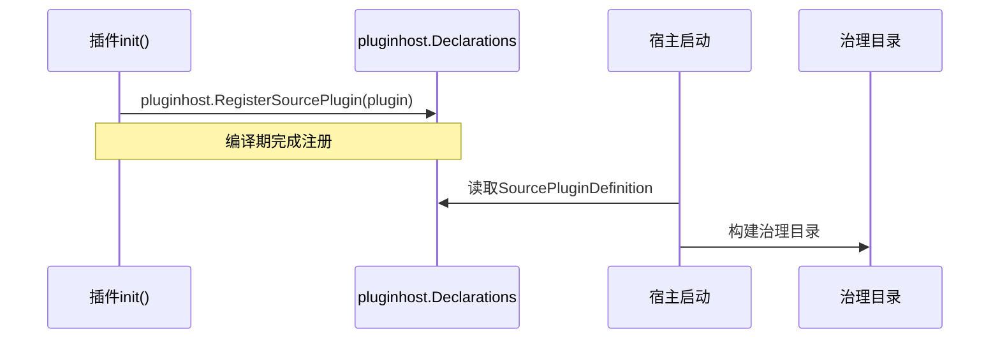
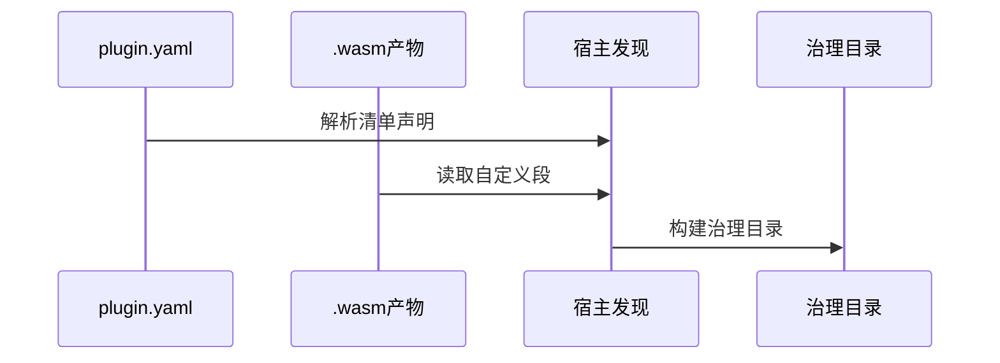

## 基本介绍

插件能力分为声明期和运行期两个阶段。声明期是插件的静态注册和发现阶段，主框架在业务执行前使用声明输出构建治理状态；运行期是插件业务逻辑执行阶段，插件消费主框架提供的领域能力服务。

## 能力设计

### 声明期与运行期的划分

| 阶段 | 说明 |
|------|------|
| 声明期 | 插件向宿主注册身份、依赖、能力请求和回调处理器；宿主收集声明后构建治理目录 |
| 治理构建 | 宿主校验清单合法性、解析依赖关系、执行安装`SQL`、构建运行时缓存 |
| 运行期 | 插件业务逻辑执行，消费宿主提供的领域能力服务 |

### 源码插件声明机制

源码插件通过`pluginhost.Declarations`接口在`init()`中注册声明。该接口是编译期`Go`注册，宿主在启动时扫描所有已注册的源码插件定义并构建治理目录。

源码插件声明期包含以下声明入口：

| 声明入口 | 说明 |
|----------|------|
| `ID()` | 返回与`plugin.yaml`一致的稳定插件标识 |
| `Assets()` | 绑定插件嵌入文件系统 |
| `Lifecycle()` | 注册安装、升级、禁用、卸载等生命周期回调 |
| `Hooks()` | 订阅主框架扩展点事件 |
| `HTTP()` | 注册`HTTP`路由贡献回调 |
| `Jobs()` | 注册定时任务贡献回调 |
| `Providers()` | 声明领域能力提供方工厂 |
| `Access()` | 注册菜单和权限过滤回调 |

### 动态插件声明机制

动态插件通过`plugin.yaml`清单文件和`.wasm`产物中的自定义段表达声明。宿主在发现阶段解析清单和产物元数据，构建治理目录。

动态插件声明期包含以下声明来源：

| 声明来源 | 说明 |
|----------|------|
| `plugin.yaml` | 声明插件身份、版本、依赖、菜单、权限、多租户策略、公开静态资源和`hostServices`授权申请 |
| `Routes()` | 声明路由组绑定，指定`API`前缀和路由包 |
| `Jobs()` | 通过`host-service`调用注册定时任务契约 |
| `WASM`自定义段 | 在`.wasm`产物中嵌入`ABI`版本、运行时类型、编解码器和导出函数名等元数据 |
| `protocol.BridgeSpec` | 定义桥接`ABI`契约，包括版本号、运行时类型、编解码方式和导出名称 |

### 声明期能力目录

| 声明能力 | 源码插件 | 动态插件 | 说明 |
|----------|----------|----------|------|
| [资源声明](/docs/declaration-assets) | `Assets()` | `WASM`自定义段 | 嵌入文件系统绑定，包含清单、前端、`SQL`和`i18n`资源 |
| [生命周期声明](/docs/declaration-lifecycle) | `Lifecycle()` | `LifecycleContract` | 安装、升级、禁用、卸载等回调注册 |
| [路由声明](/docs/declaration-routes) | `HTTP()` | `Routes()` | `HTTP`路由贡献和路由组绑定 |
| [任务声明](/docs/declaration-jobs) | `Jobs()` | `Jobs()` | 定时任务契约注册 |
| [钩子声明](/docs/declaration-hooks) | `Hooks()` | `HookSpec` | 扩展点事件订阅 |
| [提供方声明](/docs/declaration-providers) | `Providers()` | 不支持 | `SPI`能力提供方工厂注册 |
| [访问控制声明](/docs/declaration-access) | `Access()` | `MenuSpec` | 菜单和权限过滤回调注册 |

## 设计约束

- **声明期与运行期分离。** 声明期只负责注册和发现，不执行业务逻辑；运行期只消费已注册的能力服务。
- **源码插件是编译期注册。** 源码插件通过`init()`在编译期完成声明，不能在运行时动态添加或移除。
- **动态插件是发现期声明。** 动态插件在宿主发现阶段解析清单和产物元数据，声明在安装后生效。
- **声明输出驱动治理构建。** 宿主使用声明输出构建治理目录、校验依赖关系和执行安装流程。
- **提供方声明仅限源码插件。** 动态插件不能注册`SPI`工厂，只能消费已发布的`SPI`能力。

## 相关文档

- [领域能力概览](/docs/domain-capabilities)
- [插件系统概览](/docs/plugin-system)
- [源码插件开发](/docs/source-plugins)
- [动态插件与WASM运行时](/docs/wasm-plugins)
