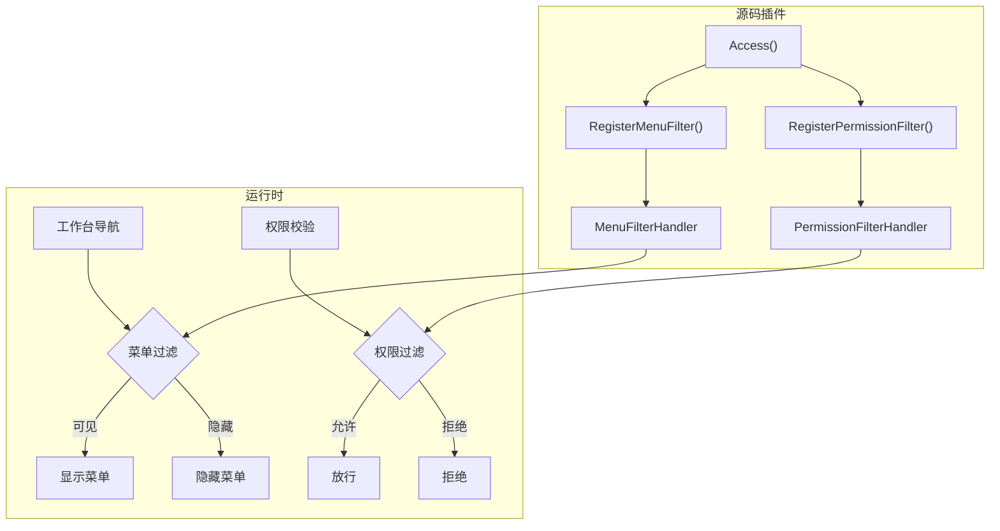

## 基本介绍

访问控制声明覆盖源码插件对菜单和权限过滤回调的注册。源码插件通过`pluginhost.Declarations.Access()`注册过滤器，在运行时根据业务上下文补充判断工作台菜单是否可见、权限是否继续生效。动态插件通过`plugin.yaml`中的菜单和权限清单声明基础结构，不支持运行时动态过滤回调。

**能力阶段**：声明期

**类型支持**：源码插件、动态插件

## 能力设计

### 访问控制过滤模型



### 菜单描述符

`MenuDescriptor`接口描述菜单项的完整信息：

| 方法 | 说明 |
|------|------|
| `ID()` | 菜单`ID` |
| `ParentID()` | 父菜单`ID` |
| `Name()` | 菜单名称 |
| `Path()` | 前端路由路径 |
| `Component()` | 前端组件路径 |
| `Permissions()` | 权限标识 |
| `MenuKey()` | 菜单唯一键 |
| `Type()` | 菜单类型：`D`（目录）、`M`（菜单）、`B`（按钮） |
| `Visible()` | 是否可见 |
| `Status()` | 状态 |

### 权限描述符

`PermissionDescriptor`接口描述权限项的信息：

| 方法 | 说明 |
|------|------|
| `MenuKey()` | 关联菜单键 |
| `MenuName()` | 关联菜单名称 |
| `Permission()` | 权限标识 |

### 过滤器返回值

| 返回值 | 说明 |
|--------|------|
| `true` | 允许：菜单可见或权限放行 |
| `false` | 拒绝：菜单隐藏或权限拒绝 |

## 接口定义

### 源码插件接口

源码插件通过`Access()`注册过滤器：

| 方法 | 说明 |
|------|------|
| `RegisterMenuFilter` | 注册菜单过滤器，指定扩展点、执行模式和处理函数 |
| `RegisterPermissionFilter` | 注册权限过滤器，指定扩展点、执行模式和处理函数 |

### 动态插件接口

动态插件通过`plugin.yaml`菜单清单声明菜单结构。清单字段：

| 字段 | 类型 | 说明 |
|------|------|------|
| `key` | `string` | 菜单唯一键 |
| `parent_key` | `string` | 父菜单键 |
| `name` | `string` | 菜单名称 |
| `path` | `string` | 前端路由路径 |
| `component` | `string` | 前端组件路径 |
| `perms` | `string` | 权限标识 |
| `type` | `string` | 菜单类型 |
| `sort` | `int` | 排序权重 |
| `visible` | `int` | 是否可见 |
| `status` | `int` | 状态 |

动态插件不支持运行时动态过滤，菜单结构和权限标识在清单中静态声明，并在安装或升级时由宿主同步到治理数据。

## 能力使用

### 源码插件使用

源码插件在`init()`中通过`pluginhost.NewDeclarations`返回的访问控制声明入口注册过滤器：

```go
func init() {
    plugin := pluginhost.NewDeclarations("my-author-my-domain-my-cap")

    // 菜单过滤：隐藏特定菜单
    if err := plugin.Access().RegisterMenuFilter(
        pluginhost.ExtensionPointMenuFilter,
        pluginhost.CallbackExecutionModeBlocking,
        func(ctx context.Context, menu pluginhost.MenuDescriptor) (bool, error) {
            // 根据业务逻辑决定菜单是否可见
            if menu.MenuKey() == "plugin:my-plugin:admin" {
                return isAdmin(ctx), nil
            }
            return true, nil
        },
    ); err != nil {
        panic(err)
    }

    // 权限过滤：动态权限校验
    if err := plugin.Access().RegisterPermissionFilter(
        pluginhost.ExtensionPointPermissionFilter,
        pluginhost.CallbackExecutionModeBlocking,
        func(ctx context.Context, perm pluginhost.PermissionDescriptor) (bool, error) {
            // 根据业务逻辑决定权限是否放行
            if perm.Permission() == "my-plugin:report:export" {
                return hasExportPermission(ctx), nil
            }
            return true, nil
        },
    ); err != nil {
        panic(err)
    }

    if err := pluginhost.RegisterSourcePlugin(plugin); err != nil {
        panic(err)
    }
}
```

### 动态插件使用

动态插件在清单中声明菜单结构：

```yaml
menus:
  - key: plugin:my-plugin:dashboard
    name: 仪表盘
    path: /my-plugin/dashboard
    component: pages/dashboard
    type: M
    sort: 1
    visible: 1
    status: 1
  - key: plugin:my-plugin:reports
    name: 报表
    path: /my-plugin/reports
    component: pages/reports
    perms: my-plugin:report:view
    type: M
    sort: 2
    visible: 1
    status: 1
    query:
      embedded-mount: "true"
```

动态插件的菜单在安装或升级时由宿主注册到治理数据中，不支持运行时动态过滤。

## 设计约束

- **过滤器回调必须快速返回。** 菜单和权限过滤在每个请求中执行，回调应避免耗时操作。
- **返回`false`表示拒绝。** 菜单过滤返回`false`隐藏菜单，权限过滤返回`false`拒绝访问。
- **多个过滤器按注册顺序执行。** 任一过滤器返回`false`即隐藏菜单或拒绝权限。
- **动态插件菜单静态声明。** 动态插件不支持运行时动态过滤，菜单结构在清单中固定。
- **访问控制声明不是运行期领域能力。** `Access()`只用于源码插件声明期注册，不会挂载到`pluginhost.Services`或`pluginbridge.Services`。
- **菜单键格式必须规范。** 菜单键必须符合`plugin:{plugin-id}:{resource}`格式。
- **权限标识格式必须规范。** 权限标识必须符合`{plugin-id}:{resource}:{action}`格式。

## 相关文档

- [声明期能力概览](/docs/declaration-capabilities)
- [插件清单](/docs/declaration-assets)
- [插件治理能力](/docs/domain-capability-plugins)
- [源码插件开发](/docs/source-plugins)
