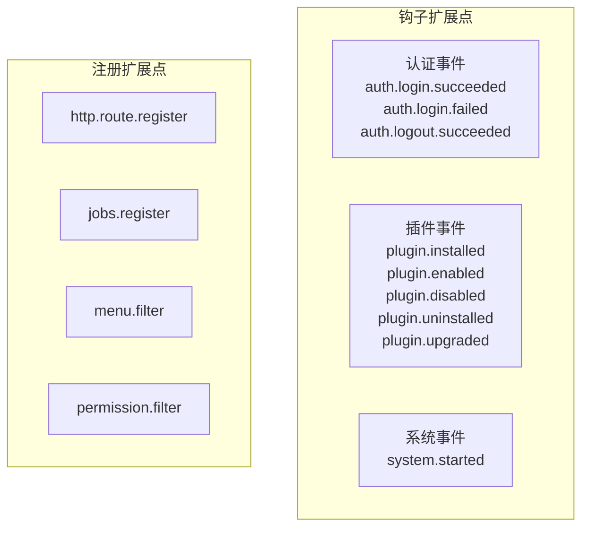

## 基本介绍

钩子声明覆盖插件对主框架扩展点事件的订阅。源码插件通过`pluginhost.Declarations.Hooks()`注册事件处理器，在特定事件发生时执行回调逻辑。动态插件通过`backend/hooks/*.yaml`声明`HookSpec`，构建工具会将其嵌入`.wasm`产物的`lina.plugin.backend.hooks`自定义段。

**能力阶段**：声明期

**类型支持**：源码插件、动态插件

## 能力设计

### 扩展点分类

扩展点分为钩子扩展点（`Hook`）和注册扩展点（`Registrar`）两类。钩子扩展点用于事件通知，注册扩展点用于声明收集。



### 钩子扩展点列表

| 扩展点 | 说明 |
|--------|------|
| `auth.login.succeeded` | 用户登录成功 |
| `auth.login.failed` | 用户登录失败 |
| `auth.logout.succeeded` | 用户登出成功 |
| `plugin.installed` | 插件安装完成 |
| `plugin.enabled` | 插件启用 |
| `plugin.disabled` | 插件禁用 |
| `plugin.uninstalled` | 插件卸载完成 |
| `plugin.upgraded` | 插件升级完成 |
| `system.started` | 系统启动完成 |

上表是`pluginhost`运行时发布的钩子扩展点。当前`linactl`动态插件构建器扫描`backend/hooks/*.yaml`时，只发布`auth.login.succeeded`、`auth.login.failed`、`auth.logout.succeeded`、`plugin.installed`、`plugin.enabled`、`plugin.disabled`、`plugin.uninstalled`和`system.started`；动态插件不要在`backend/hooks/*.yaml`中声明`plugin.upgraded`。

### 执行模式

| 模式 | 说明 | 适用扩展点 |
|------|------|----------|
| `blocking` | 阻塞执行，回调完成后才继续后续流程 | 所有扩展点 |
| `async` | 异步执行，回调在独立协程中执行 | 钩子扩展点 |

钩子扩展点支持`blocking`和`async`两种模式；注册扩展点只支持`blocking`模式。

### 钩子负载

钩子处理器接收`HookPayload`参数，包含事件数据：

| 方法 | 说明 |
|------|------|
| `ExtensionPoint()` | 返回当前扩展点 |
| `Value(key)` | 按键读取负载值 |
| `Values()` | 返回所有负载键值对 |
| `Services()` | 返回`Services`，用于访问宿主能力 |

### 负载键

| 键 | 说明 |
|----|------|
| `pluginId` | 插件标识 |
| `name` | 名称 |
| `version` | 版本 |
| `status` | 状态 |
| `userName` | 用户名 |
| `ip` | 客户端`IP` |
| `clientType` | 客户端类型 |
| `browser` | 浏览器 |
| `os` | 操作系统 |
| `message` | 消息 |
| `reason` | 原因 |

### 认证事件原因码

| 原因码 | 说明 |
|--------|------|
| `loginSuccessful` | 登录成功 |
| `loginFailed` | 登录失败 |
| `logoutSuccessful` | 登出成功 |
| `invalidCredentials` | 无效凭证 |
| `userDisabled` | 用户已禁用 |
| `ipBlacklisted` | `IP`已列入黑名单 |

### 动态插件钩子声明（HookSpec）

动态插件通过`backend/hooks/*.yaml`文件声明`HookSpec`钩子契约：

| 字段 | 类型 | 说明 |
|------|------|------|
| `event` | `string` | 扩展点名称；使用`linactl`构建时以动态构建器发布的钩子列表为准 |
| `action` | `string` | 动作类型：`insert`、`sleep`、`error` |
| `mode` | `string` | 执行模式：`blocking`或`async` |
| `table` | `string` | 关联表名 |
| `fields` | `map` | 字段映射 |
| `timeoutMs` | `int` | 超时毫秒数 |
| `sleepMs` | `int` | 休眠毫秒数（`sleep`动作） |
| `errorMessage` | `string` | 错误消息（`error`动作） |

## 接口定义

### 源码插件接口

源码插件通过`Hooks()`注册事件处理器：

| 方法 | 说明 |
|------|------|
| `RegisterHook` | 注册事件处理器，指定扩展点、执行模式和处理函数 |

### 动态插件接口

动态插件通过`backend/hooks/*.yaml`声明钩子契约，构建后嵌入`.wasm`产物的`lina.plugin.backend.hooks`自定义段。

## 能力使用

### 源码插件使用

源码插件在`init()`中通过`pluginhost.NewDeclarations`返回的钩子声明入口注册事件处理器：

```go
func init() {
    plugin := pluginhost.NewDeclarations("my-author-my-domain-my-cap")
    if err := plugin.Hooks().RegisterHook(
        pluginhost.ExtensionPointAuthLoginSucceeded,
        pluginhost.CallbackExecutionModeAsync,
        func(ctx context.Context, payload pluginhost.HookPayload) error {
            userName := payload.Value("userName")
            ip := payload.Value("ip")
            // 记录登录日志
            return logLoginEvent(ctx, userName.(string), ip.(string))
        },
    ); err != nil {
        panic(err)
    }

    if err := pluginhost.RegisterSourcePlugin(plugin); err != nil {
        panic(err)
    }
}
```

注册系统启动钩子：

```go
err := plugin.Hooks().RegisterHook(
    pluginhost.ExtensionPointSystemStarted,
    pluginhost.CallbackExecutionModeBlocking,
    func(ctx context.Context, payload pluginhost.HookPayload) error {
        // 系统启动后执行初始化
        return initializePlugin(ctx)
    },
)
```

### 动态插件使用

动态插件在`backend/hooks/001-plugin-enabled.yaml`中声明钩子契约：

```yaml
hooks:
  - event: plugin.enabled
    action: insert
    mode: blocking
    table: plugin_events
    fields:
      plugin_id: "{{pluginId}}"
      event: "enabled"
      timestamp: "{{now}}"
```

构建工具会扫描`backend/hooks/*.yaml`，校验`HookSpec`后嵌入`.wasm`产物的`lina.plugin.backend.hooks`自定义段。

## 设计约束

- **扩展点必须在宿主注册表中。** 注册未定义的扩展点会返回错误。
- **执行模式必须匹配扩展点类型。** 注册扩展点只支持`blocking`模式。
- **阻塞回调影响主流程。** `blocking`模式的回调会阻塞后续流程，应快速返回。
- **异步回调独立执行。** `async`模式的回调在独立协程中执行，失败不影响主流程。
- **负载值需要类型断言。** `HookPayload.Value()`返回`interface{}`，调用方需要类型断言。
- **动态插件钩子通过契约声明。** 动态插件的钩子在构建期通过`backend/hooks/*.yaml`声明，不支持运行时动态注册。

## 相关文档

- [声明期能力概览](/docs/declaration-capabilities)
- [插件清单](/docs/declaration-assets)
- [源码插件开发](/docs/source-plugins)
- [动态插件与WASM运行时](/docs/wasm-plugins)
