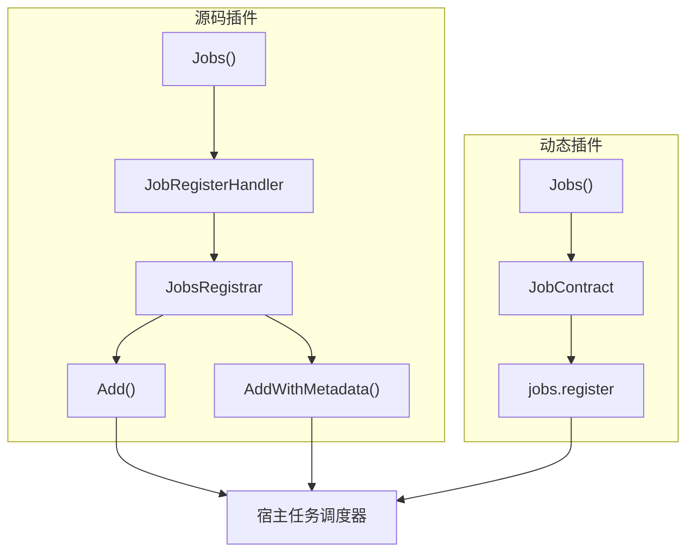

## 基本介绍

任务声明覆盖插件定时任务的注册和声明。源码插件通过`pluginhost.Declarations.Jobs()`注册任务贡献回调，由主框架调度时统一触发；动态插件通过`pluginbridge.Declarations.Jobs()`提交任务契约。

**能力阶段**：声明期

**类型支持**：源码插件、动态插件

## 能力设计

### 任务注册模型



### 任务契约字段

| 字段 | 类型 | 必填 | 说明 |
|------|------|------|------|
| `name` | `string` | 是 | 任务标识 |
| `displayName` | `string` | 否 | 任务展示名称 |
| `description` | `string` | 否 | 任务描述 |
| `pattern` | `string` | 是 | `Cron`表达式 |
| `timezone` | `string` | 否 | 时区，默认`Asia/Shanghai` |
| `scope` | `string` | 否 | 执行范围：`master_only`或`all_node` |
| `concurrency` | `string` | 否 | 并发模式：`singleton`或`parallel` |
| `maxConcurrency` | `int` | 否 | 最大并发数，默认`1` |
| `timeoutSeconds` | `int` | 否 | 超时秒数，默认`300` |
| `requestType` | `string` | 是 | 请求`DTO`名称（动态插件） |
| `internalPath` | `string` | 否 | 内部路由路径 |

### 执行范围

| 值 | 说明 |
|----|------|
| `master_only` | 仅主节点执行 |
| `all_node` | 所有节点执行（默认） |

### 并发模式

| 值 | 说明 |
|----|------|
| `singleton` | 单例模式，同一时刻只有一个实例执行（默认） |
| `parallel` | 并行模式，允许多个实例同时执行 |

## 接口定义

### 源码插件接口

源码插件通过`Jobs()`注册任务贡献回调：

| 方法 | 说明 |
|------|------|
| `RegisterJobs` | 注册任务贡献回调，由主框架调度时统一触发 |

回调处理器通过`JobsRegistrar`注册任务：

| 方法 | 说明 |
|------|------|
| `Add` | 注册定时任务，指定`Cron`表达式、名称和处理函数 |
| `AddWithMetadata` | 注册定时任务，额外指定展示名称和描述 |
| `IsPrimaryNode` | 判断当前节点是否为主节点 |
| `Services` | 返回`Services`，用于访问宿主能力 |

### 动态插件接口

动态插件通过`pluginbridge.Declarations.Jobs()`提交任务契约：

| 方法 | 说明 |
|------|------|
| `Register` | 提交`JobContract`，注册定时任务 |

## 能力使用

### 源码插件使用

源码插件在`init()`中注册任务贡献回调，再在回调里通过`JobsRegistrar`注册定时任务：

```go
func init() {
    plugin := pluginhost.NewDeclarations("my-author-my-domain-my-cap")
    if err := plugin.Jobs().RegisterJobs(
        pluginhost.ExtensionPointJobsRegister,
        pluginhost.CallbackExecutionModeBlocking,
        registerJobs,
    ); err != nil {
        panic(err)
    }

    if err := pluginhost.RegisterSourcePlugin(plugin); err != nil {
        panic(err)
    }
}

// 在注册回调中
func registerJobs(ctx context.Context, registrar pluginhost.JobsRegistrar) error {
    // 注册简单任务
    err := registrar.Add(ctx, "0 2 * * *", "daily-report", func(ctx context.Context) error {
        // 每天凌晨2点执行
        return generateDailyReport(ctx)
    })
    if err != nil {
        return err
    }

    // 注册带元数据的任务
    return registrar.AddWithMetadata(ctx, "0 3 * * *", "cleanup-temp", "临时文件清理", "每天凌晨3点清理过期临时文件",
        func(ctx context.Context) error {
            return cleanupTempFiles(ctx)
        },
    )
}
```

判断主节点：

```go
func registerJobs(ctx context.Context, registrar pluginhost.JobsRegistrar) error {
    if registrar.IsPrimaryNode() {
        // 只在主节点注册的任务
        return registrar.Add(ctx, "0 * * * *", "leader-task", leaderTask)
    }
    return nil
}
```

### 动态插件使用

动态插件通过`Jobs()`提交任务契约：

```go
func RegisterPlugin(ctx context.Context) error {
    decl := pluginbridge.NewDeclarations()

    // 注册定时任务
    err := decl.Jobs().Register(&protocol.JobContract{
        Name:           "cleanup-temp",
        DisplayName:    "临时文件清理",
        Description:    "每天凌晨3点清理过期临时文件",
        Pattern:        "0 3 * * *",
        Timezone:       "Asia/Shanghai",
        Scope:          protocol.JobScopeAllNode,
        Concurrency:    protocol.JobConcurrencySingleton,
        TimeoutSeconds: 300,
        RequestType:    "CleanupTempReq",
    })
    if err != nil {
        return err
    }

    return nil
}
```

动态插件的任务处理器使用标准函数签名：

```go
//go:build wasm

package backend

type JobController struct{}

func (c *JobController) CleanupTemp(ctx context.Context, req *CleanupTempReq) (*CleanupTempResp, error) {
    // 执行清理逻辑
    return &CleanupTempResp{Cleaned: count}, nil
}
```

构建工具会自动生成`JobContract`并嵌入`.wasm`产物。

## 设计约束

- **注册回调在发现阶段触发。** 源码插件的任务注册回调在宿主发现阶段统一触发，不是运行时动态注册。
- **动态插件任务走`host-service`。** 动态插件通过`jobs.register`宿主服务提交任务契约，不直接访问宿主调度器。
- **`Cron`表达式必须合法。** 宿主校验`Cron`表达式格式，拒绝不合法的表达式。
- **任务标识必须唯一。** 同一插件内的任务标识不能重复。
- **超时保护宿主。** 任务执行超过`timeoutSeconds`后被终止，默认`300`秒。
- **主节点判断用于分布式场景。** `IsPrimaryNode()`帮助插件决定是否注册仅主节点执行的任务。

## 相关文档

- [声明期能力概览](/docs/declaration-capabilities)
- [插件清单](/docs/declaration-assets)
- [任务与定时能力](/docs/domain-capability-jobs)
- [源码插件开发](/docs/source-plugins)
