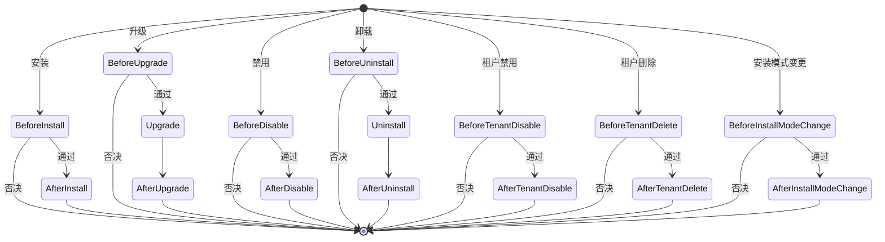

## 基本介绍

生命周期声明覆盖插件在安装、升级、禁用、卸载等治理操作中的回调注册。源码插件通过`pluginhost.Declarations.Lifecycle()`注册`Go`回调函数，动态插件通过`LifecycleContract`声明生命周期回调契约。

**能力阶段**：声明期

**类型支持**：源码插件、动态插件

## 能力设计

### 生命周期钩子分类

生命周期钩子分为前置钩子（`Before`）和后置钩子（`After`）两类。前置钩子可以否决操作，后置钩子用于观测和清理。



### 生命周期钩子列表

| 钩子 | 类型 | 可否决 | 说明 |
|------|------|--------|------|
| `BeforeInstall` | 前置 | 是 | 安装前校验，返回`ok=false`可阻止安装 |
| `AfterInstall` | 后置 | 否 | 安装后初始化，用于创建默认数据或配置 |
| `BeforeUpgrade` | 前置 | 是 | 升级前校验，返回`ok=false`可阻止升级 |
| `Upgrade` | 自定义 | 否 | 执行自定义升级逻辑 |
| `AfterUpgrade` | 后置 | 否 | 升级后清理或观测 |
| `BeforeDisable` | 前置 | 是 | 禁用前校验，返回`ok=false`可阻止禁用 |
| `AfterDisable` | 后置 | 否 | 禁用后清理 |
| `BeforeUninstall` | 前置 | 是 | 卸载前校验，返回`ok=false`可阻止卸载 |
| `Uninstall` | 自定义 | 否 | 执行卸载清理逻辑，例如清除插件数据 |
| `AfterUninstall` | 后置 | 否 | 卸载后观测 |
| `BeforeTenantDisable` | 前置 | 是 | 租户禁用前校验 |
| `AfterTenantDisable` | 后置 | 否 | 租户禁用后清理 |
| `BeforeTenantDelete` | 前置 | 是 | 租户删除前校验 |
| `AfterTenantDelete` | 后置 | 否 | 租户删除后清理 |
| `BeforeInstallModeChange` | 前置 | 是 | 安装模式变更前校验 |
| `AfterInstallModeChange` | 后置 | 否 | 安装模式变更后清理 |

### 回调超时

| 参数 | 默认值 | 说明 |
|------|--------|------|
| 单个回调超时 | `5`秒 | 单个生命周期回调的最大执行时间 |
| 聚合超时 | `10`秒 | 同一钩子所有插件回调的总执行时间 |

### 输入参数

| 输入接口 | 适用钩子 | 关键字段 |
|----------|----------|----------|
| `SourcePluginLifecycleInput` | 安装、禁用、卸载 | `PluginID()`、`Operation()`、`StartupAutoEnable()`、`PurgeStorageData()` |
| `SourcePluginUpgradeInput` | 升级 | `PluginID()`、`FromVersion()`、`ToVersion()`、`FromManifest()`、`ToManifest()` |
| `SourcePluginTenantLifecycleInput` | 租户禁用、租户删除 | `Operation()`、`TenantID()` |
| `SourcePluginInstallModeChangeInput` | 安装模式变更 | `PluginID()`、`Operation()`、`FromMode()`、`ToMode()` |
| `SourcePluginUninstallInput` | 卸载清理 | `PluginID()`、`PurgeStorageData()`、`Services()` |

## 接口定义

### 源码插件接口

源码插件通过`Lifecycle()`注册生命周期回调：

| 方法 | 回调类型 | 说明 |
|------|----------|------|
| `RegisterBeforeInstallHandler` | `SourcePluginBeforeLifecycleHandler` | 安装前校验 |
| `RegisterAfterInstallHandler` | `SourcePluginAfterLifecycleHandler` | 安装后初始化 |
| `RegisterBeforeUpgradeHandler` | `SourcePluginBeforeUpgradeHandler` | 升级前校验 |
| `RegisterUpgradeHandler` | `SourcePluginUpgradeHandler` | 自定义升级逻辑 |
| `RegisterAfterUpgradeHandler` | `SourcePluginUpgradeHandler` | 升级后清理 |
| `RegisterBeforeDisableHandler` | `SourcePluginBeforeLifecycleHandler` | 禁用前校验 |
| `RegisterAfterDisableHandler` | `SourcePluginAfterLifecycleHandler` | 禁用后清理 |
| `RegisterBeforeUninstallHandler` | `SourcePluginBeforeLifecycleHandler` | 卸载前校验 |
| `RegisterAfterUninstallHandler` | `SourcePluginAfterLifecycleHandler` | 卸载后清理 |
| `RegisterBeforeTenantDisableHandler` | `SourcePluginBeforeTenantLifecycleHandler` | 租户禁用前校验 |
| `RegisterAfterTenantDisableHandler` | `SourcePluginAfterTenantLifecycleHandler` | 租户禁用后清理 |
| `RegisterBeforeTenantDeleteHandler` | `SourcePluginBeforeTenantLifecycleHandler` | 租户删除前校验 |
| `RegisterAfterTenantDeleteHandler` | `SourcePluginAfterTenantLifecycleHandler` | 租户删除后清理 |
| `RegisterBeforeInstallModeChangeHandler` | `SourcePluginBeforeInstallModeChangeHandler` | 安装模式变更前校验 |
| `RegisterAfterInstallModeChangeHandler` | `SourcePluginAfterInstallModeChangeHandler` | 安装模式变更后清理 |
| `RegisterUninstallHandler` | `SourcePluginUninstallHandler` | 卸载清理逻辑 |

### 动态插件接口

动态插件通过`LifecycleContract`声明生命周期回调契约。每个契约定义一个操作和对应的`WASM`入口：

| 字段 | 类型 | 说明 |
|------|------|------|
| `operation` | `string` | 生命周期操作名称 |
| `requestType` | `string` | 请求`DTO`名称 |
| `internalPath` | `string` | 内部路由路径 |
| `timeoutMs` | `int` | 回调超时（毫秒） |

支持的`operation`值：`BeforeInstall`、`AfterInstall`、`BeforeUpgrade`、`Upgrade`、`AfterUpgrade`、`BeforeDisable`、`AfterDisable`、`BeforeUninstall`、`Uninstall`、`AfterUninstall`、`BeforeTenantDisable`、`AfterTenantDisable`、`BeforeTenantDelete`、`AfterTenantDelete`、`BeforeInstallModeChange`、`AfterInstallModeChange`。

## 能力使用

### 源码插件使用

源码插件在`init()`中通过`Lifecycle()`分组入口注册生命周期回调：

```go
func init() {
    plugin := pluginhost.NewDeclarations("my-author-my-domain-my-cap")

    if err := plugin.Lifecycle().RegisterBeforeInstallHandler(beforeInstall); err != nil {
        panic(err)
    }
    if err := plugin.Lifecycle().RegisterAfterInstallHandler(afterInstall); err != nil {
        panic(err)
    }

    if err := pluginhost.RegisterSourcePlugin(plugin); err != nil {
        panic(err)
    }
}
```

前置钩子返回`ok=false`和`reason`可以否决操作：

```go
func beforeInstall(ctx context.Context, input pluginhost.SourcePluginLifecycleInput) (ok bool, reason string, err error) {
    // 校验依赖是否满足
    if !checkDependencies() {
        return false, "缺少必要依赖", nil
    }
    return true, "", nil
}
```

后置钩子用于初始化或清理：

```go
func afterInstall(ctx context.Context, input pluginhost.SourcePluginLifecycleInput) error {
    // 创建默认配置
    return createDefaultConfig(ctx)
}
```

### 动态插件使用

动态插件在`WASM`产物中嵌入`LifecycleContract`。构建工具自动从`backend/`目录中的控制器提取生命周期契约：

```go
// backend/lifecycle.go
//go:build wasm

package backend

// 控制器方法对应生命周期操作
func (c *LifecycleController) BeforeInstall(ctx context.Context, req *BeforeInstallReq) (*LifecycleDecision, error) {
    // 安装前校验
    return &LifecycleDecision{OK: true}, nil
}

func (c *LifecycleController) AfterInstall(ctx context.Context, req *AfterInstallReq) (*LifecycleDecision, error) {
    // 安装后初始化
    return &LifecycleDecision{OK: true}, nil
}
```

构建工具会自动生成`LifecycleContract`并嵌入`.wasm`产物的`lina.plugin.backend.lifecycle`自定义段。

## 设计约束

- **前置钩子可以否决操作。** 返回`ok=false`时，宿主会阻止后续操作执行。
- **后置钩子不能否决操作。** 后置钩子在操作完成后执行，失败只记录日志，不回滚操作。
- **卸载清理是独立钩子。** `Uninstall`钩子用于执行数据清理，与`BeforeUninstall`和`AfterUninstall`分离。
- **超时机制保护宿主。** 单个回调超时`5`秒，聚合超时`10`秒，超时后回调被终止。
- **动态插件生命周期走桥接契约。** 动态插件的生命周期回调通过`WASM`桥接执行，不通过`hostServices`暴露。
- **`PurgeStorageData`控制数据清理。** 卸载时宿主通过此标志通知插件是否需要清除持久化数据。

## 相关文档

- [声明期能力概览](/docs/declaration-capabilities)
- [插件清单](/docs/declaration-assets)
- [插件治理能力](/docs/domain-capability-plugins)
- [插件管理](/docs/plugin-management)
