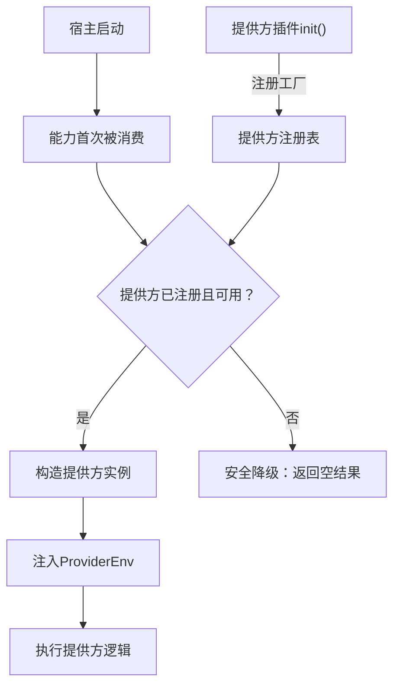

## 基本介绍

提供方声明覆盖源码插件对`SPI`能力提供方工厂的注册。`SPI`（`Service Provider Interface`）模式将能力契约与能力实现分离，宿主定义领域能力的公开接口，提供方插件负责实现具体业务逻辑。动态插件不能注册`SPI`工厂，只能消费已发布的`SPI`能力。

**能力阶段**：声明期

**类型支持**：仅源码插件

## 能力设计

### SPI架构



### 支持的提供方类型

| 提供方 | 工厂接口 | 能力包 | 官方插件 |
|--------|----------|--------|----------|
| `Tenant` | `tenantspi.ProviderFactory` | `tenantcap` | `linapro-tenant-core` |
| `Org` | `orgspi.ProviderFactory` | `orgcap` | `linapro-org-core` |
| `AI Text` | `aitext.ProviderFactory` | `aicap` | `linapro-ai-core` |

### ProviderEnv注入

宿主通过`ProviderEnv`向提供方注入运行期上下文：

| 注入项 | 说明 |
|--------|------|
| 插件身份 | 当前提供方插件的`ID`，用于审计和隔离 |
| 请求上下文 | 当前请求的租户、用户等业务上下文 |
| 辅助能力 | 提供方实现所需的宿主能力 |

### 提供方状态检查

宿主通过`Plugins().State().IsProviderEnabled()`判断提供方是否可用：

| 检查方法 | 语义 | 适用场景 |
|----------|------|----------|
| `IsEnabled` | 插件的业务入口对当前租户是否可见 | 菜单过滤、路由可见性 |
| `IsProviderEnabled` | 插件是否平台启用且可承接提供方调用 | `AI`、`Org`、`Tenant`能力调用前检查 |

提供方检查确保即使业务入口被租户级禁用，平台级能力仍可正常服务。

### 延迟构造

宿主只在能力首次被消费时构造提供方实例，避免启动阶段强依赖可选插件。

### 安全降级

没有可用提供方时，能力返回空结果或不可用状态，而非`nil`或错误。

## 接口定义

### 源码插件接口

源码插件通过`Providers()`注册提供方工厂：

| 方法 | 工厂接口 | 说明 |
|------|----------|------|
| `ProvideTenant` | `tenantspi.ProviderFactory` | 注册租户能力提供方 |
| `ProvideOrg` | `orgspi.ProviderFactory` | 注册组织能力提供方 |
| `ProvideAIText` | `aitext.ProviderFactory` | 注册`AI`文本能力提供方 |

每个工厂是一个构造函数，接收`ProviderEnv`参数并返回提供方实例。

### 动态插件接口

动态插件不能注册`SPI`工厂。动态插件通过以下方式与`SPI`能力交互：

| 交互方式 | 说明 |
|----------|------|
| 消费`SPI`能力 | 通过`hostServices`声明调用已发布的`SPI`能力方法 |
| 检查提供方状态 | 通过`plugins.provider_enabled.check`动态方法判断提供方是否可用 |
| 状态查询 | 通过`capability.available`和`capability.status`动态方法查询能力可用性 |

## 能力使用

### 源码插件使用

源码插件在`init()`中注册提供方工厂：

```go
func init() {
    plugin := pluginhost.NewDeclarations("my-author-my-org-provider")
    if err := plugin.Providers().ProvideOrg(orgProviderFactory); err != nil {
        panic(err)
    }

    if err := pluginhost.RegisterSourcePlugin(plugin); err != nil {
        panic(err)
    }
}

// 工厂函数
func orgProviderFactory(ctx context.Context, env orgspi.ProviderEnv) (orgspi.Provider, error) {
    return &myOrgProvider{env: env}, nil
}
```

实现提供方契约：

```go
type myOrgProvider struct {
    env orgspi.ProviderEnv
}

func (p *myOrgProvider) ListUserDeptAssignments(ctx context.Context, userIDs []int) (map[int]*orgcap.UserDeptAssignment, error) {
    // 查询提供方自己的组织数据
    return queryDeptAssignments(ctx, userIDs)
}

func (p *myOrgProvider) GetUserDeptInfo(ctx context.Context, userID int) (int, string, error) {
    // 实现部门信息查询
    return queryDeptInfo(ctx, userID)
}
```

注册`AI`文本提供方：

```go
func (p *myAIPlugin) ProvideAIText(factory aitext.ProviderFactory) error {
    p.aiTextProvider = factory
    return nil
}

func aiTextProviderFactory(env aitext.ProviderEnv) aitext.Provider {
    return &myAITextProvider{env: env}
}
```

### 动态插件使用

动态插件通过`hostServices`声明消费`SPI`能力：

```yaml
hostServices:
  - service: ai
    methods:
      - text.generate
  - service: org
    methods:
      - users.dept_name.get
  - service: tenant
    methods:
      - tenants.current
```

检查提供方状态：

```go
// 通过 plugins.provider_enabled.check 检查
enabled := pluginbridge.Default().Plugins().State().IsProviderEnabled(ctx, "linapro-ai-core")
if enabled {
    // 使用AI能力
}
```

## 设计约束

- **提供方声明仅限源码插件。** 动态插件不能注册`SPI`工厂，因为提供方需要实现`Go`接口并运行在宿主进程中。
- **每个能力只能有一个提供方。** 同一能力重复注册提供方会返回错误。
- **延迟构造避免强依赖。** 宿主只在能力首次被消费时构造提供方实例。
- **安全降级保证稳定性。** 没有可用提供方时，能力返回空结果而非错误。
- **提供方状态独立于业务入口。** 插件业务入口可能对租户不可见，但仍可作为平台能力提供方可用。
- **`ProviderEnv`是注入通道。** 宿主通过`ProviderEnv`向提供方注入上下文和辅助能力，提供方不应自行获取。

## 相关文档

- [声明期能力概览](/docs/declaration-capabilities)
- [领域能力概览](/docs/domain-capabilities)
- [插件治理能力](/docs/domain-capability-plugins)
- [源码插件开发](/docs/source-plugins)
