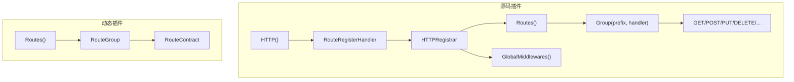

## 基本介绍

路由声明覆盖插件`HTTP`路由的注册和绑定。源码插件通过`pluginhost.Declarations.HTTP()`注册路由贡献回调，由主框架启动时统一触发；动态插件通过`pluginbridge.Declarations.Routes()`声明路由组绑定。

**能力阶段**：声明期

**类型支持**：源码插件、动态插件

## 能力设计

### 路由注册模型



### API命名空间

所有插件路由挂载在`/x/{plugin-id}/`命名空间下：

| 常量 | 值 | 说明 |
|------|-----|------|
| `PluginAPINamespaceSegment` | `x` | `API`路径段 |
| `PluginAPINamespacePrefix` | `/x` | `API`路径前缀 |

源码插件的`RouteRegistrar.APIPrefix()`返回`/x/{plugin-id}`，动态插件的路由前缀同样遵循此规则。

### 中间件体系

源码插件通过`RouteMiddlewares`访问宿主提供的八个标准中间件：

| 中间件 | 说明 |
|--------|------|
| `NeverDoneCtx` | 防止请求上下文超时的中间件 |
| `HandlerResponse` | 统一响应格式中间件 |
| `CORS` | 跨域资源共享中间件 |
| `RequestBodyLimit` | 请求体大小限制中间件 |
| `Ctx` | 请求上下文注入中间件 |
| `Auth` | 认证中间件 |
| `Tenancy` | 租户隔离中间件 |
| `Permission` | 权限校验中间件 |

### 全局中间件

源码插件可以通过`GlobalMiddlewareRegistrar`注册全局中间件，作用于所有请求：

| 字段 | 说明 |
|------|------|
| `scope` | 中间件作用域 |
| `handler` | 中间件处理函数 |

### 路由绑定

路由绑定定义`HTTP`方法、路径和处理器的映射关系。每个绑定包含以下元数据：

| 字段 | 说明 |
|------|------|
| `Method` | `HTTP`方法（`GET`、`POST`、`PUT`、`DELETE`等） |
| `Path` | 路由路径，相对于`API`前缀 |
| `Access` | 访问模式：`public`（公开）或`login`（需要登录） |
| `Permission` | 权限标识，格式为`{plugin-id}:{resource}:{action}` |
| `Summary` | 接口摘要 |
| `Description` | 接口描述 |

## 接口定义

### 源码插件接口

源码插件通过`HTTP()`注册路由贡献回调：

| 方法 | 说明 |
|------|------|
| `RegisterRoutes` | 注册路由贡献回调，由主框架启动时统一触发 |

回调处理器通过`HTTPRegistrar`访问路由注册能力：

| 方法 | 说明 |
|------|------|
| `Routes()` | 返回`RouteRegistrar`，用于注册路由组 |
| `GlobalMiddlewares()` | 返回`GlobalMiddlewareRegistrar`，用于注册全局中间件 |
| `Services()` | 返回`Services`，用于访问宿主能力 |

`RouteRegistrar`接口：

| 方法 | 说明 |
|------|------|
| `APIPrefix()` | 返回当前插件的`API`前缀 |
| `Group()` | 注册路由组 |
| `Middlewares()` | 返回标准中间件集合 |
| `RouteBindings()` | 返回已注册的路由绑定列表 |
| `Err()` | 返回注册过程中的错误 |

`RouteGroup`接口支持标准`HTTP`方法注册：

| 方法 | 说明 |
|------|------|
| `ALL` | 注册所有方法的路由 |
| `GET` | 注册`GET`路由 |
| `POST` | 注册`POST`路由 |
| `PUT` | 注册`PUT`路由 |
| `DELETE` | 注册`DELETE`路由 |
| `PATCH` | 注册`PATCH`路由 |
| `HEAD` | 注册`HEAD`路由 |
| `CONNECT` | 注册`CONNECT`路由 |
| `OPTIONS` | 注册`OPTIONS`路由 |
| `TRACE` | 注册`TRACE`路由 |
| `Group` | 嵌套路由组 |
| `Middleware` | 注册组级中间件 |
| `Bind` | 绑定路由处理器 |
| `Err()` | 返回注册过程中的错误 |

### 动态插件接口

动态插件通过`pluginbridge.Declarations.Routes()`声明路由组绑定：

| 方法 | 说明 |
|------|------|
| `Group` | 声明路由组绑定，指定`API`前缀和路由包 |

动态插件的路由通过`RouteContract`定义：

| 字段 | 类型 | 说明 |
|------|------|------|
| `path` | `string` | 路由路径，必须以`/`开头 |
| `method` | `string` | `HTTP`方法，自动转为大写 |
| `access` | `string` | 访问模式：`public`或`login` |
| `permission` | `string` | 权限标识 |
| `summary` | `string` | 接口摘要 |
| `description` | `string` | 接口描述 |
| `requestType` | `string` | 请求`DTO`名称 |

## 能力使用

### 源码插件使用

源码插件在`init()`中注册路由贡献回调，再在回调中使用`HTTPRegistrar`注册路由：

```go
func init() {
    plugin := pluginhost.NewDeclarations("my-author-my-domain-my-cap")
    if err := plugin.HTTP().RegisterRoutes(
        pluginhost.ExtensionPointHTTPRouteRegister,
        pluginhost.CallbackExecutionModeBlocking,
        registerRoutes,
    ); err != nil {
        panic(err)
    }

    if err := pluginhost.RegisterSourcePlugin(plugin); err != nil {
        panic(err)
    }
}

// 在注册回调中
func registerRoutes(ctx context.Context, registrar pluginhost.HTTPRegistrar) error {
    routes := registrar.Routes()
    middlewares := routes.Middlewares()

    routes.Group("/reports", func(group pluginhost.RouteGroup) {
        group.Middleware(middlewares.Auth())
        group.Middleware(middlewares.Tenancy())
        group.Middleware(middlewares.Permission())

        group.GET("/", listReports)
        group.GET("/:id", getReport)
        group.POST("/", createReport)
        group.PUT("/:id", updateReport)
        group.DELETE("/:id", deleteReport)
    })

    return routes.Err()
}
```

注册全局中间件：

```go
func registerGlobalMiddleware(ctx context.Context, registrar pluginhost.HTTPRegistrar) error {
    return registrar.GlobalMiddlewares().Bind(
        "", // 空字符串默认匹配所有路径 "/*"
        func(r *ghttp.Request) {
            // 全局中间件逻辑
            r.Middleware.Next()
        },
    )
}
```

### 动态插件使用

动态插件通过`Routes()`声明路由组绑定：

```go
func RegisterPlugin(ctx context.Context) error {
    decl := pluginbridge.NewDeclarations()

    // 声明路由组绑定
    err := decl.Routes().Group("/reports", "controllers")
    if err != nil {
        return err
    }

    return nil
}
```

动态插件的路由控制器使用标准`HTTP`方法签名：

```go
//go:build wasm

package controllers

type ReportController struct{}

func (c *ReportController) Get(ctx context.Context, req *GetReportReq) (*ReportResp, error) {
    // 处理GET请求
}

func (c *ReportController) Post(ctx context.Context, req *CreateReportReq) (*ReportResp, error) {
    // 处理POST请求
}
```

构建工具会自动生成`RouteContract`并嵌入`.wasm`产物的`lina.plugin.backend.routes`自定义段。

## 设计约束

- **路由挂载在插件命名空间下。** 所有插件路由必须在`/x/{plugin-id}/`前缀下。
- **注册回调在启动时触发。** 源码插件的路由注册回调在宿主启动时统一触发，不是运行时动态注册。
- **中间件链由插件组装。** 插件根据业务需要选择和组合中间件，宿主不强制中间件顺序。
- **权限标识格式必须规范。** 权限标识必须符合`{plugin-id}:{resource}:{action}`格式。
- **动态插件路由通过契约声明。** 动态插件的路由在构建期通过`RouteContract`声明，不支持运行时动态注册。
- **路由路径必须以`/`开头。** 宿主校验路由路径格式，拒绝不合法的路径。

## 相关文档

- [声明期能力概览](/docs/declaration-capabilities)
- [插件清单](/docs/declaration-assets)
- [源码插件开发](/docs/source-plugins)
- [动态插件与WASM运行时](/docs/wasm-plugins)
