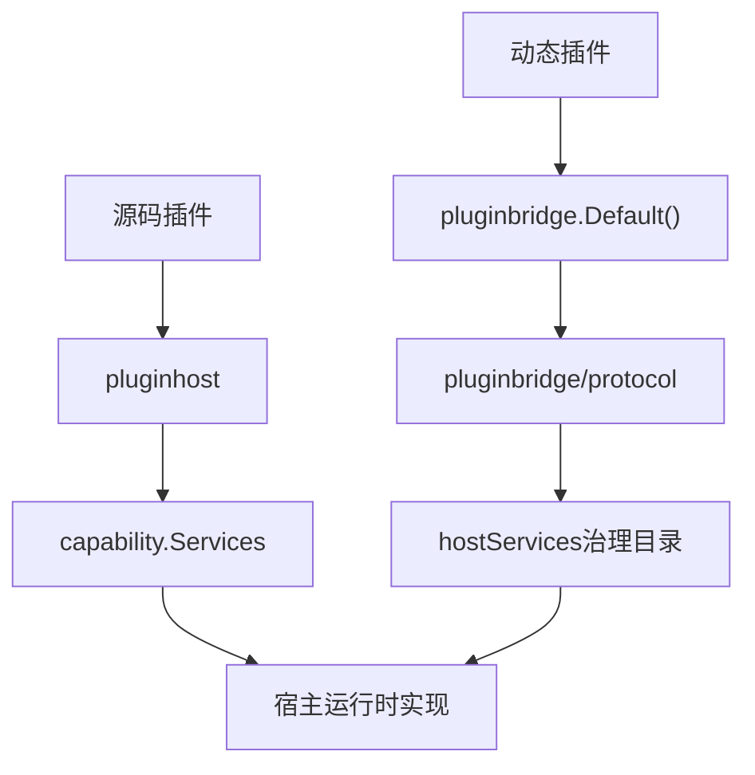
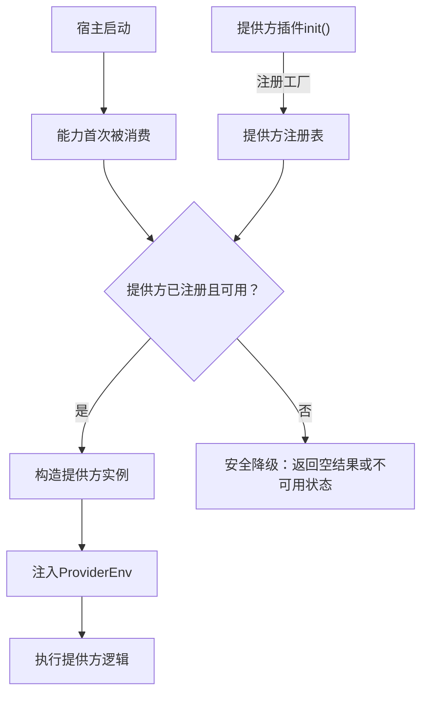
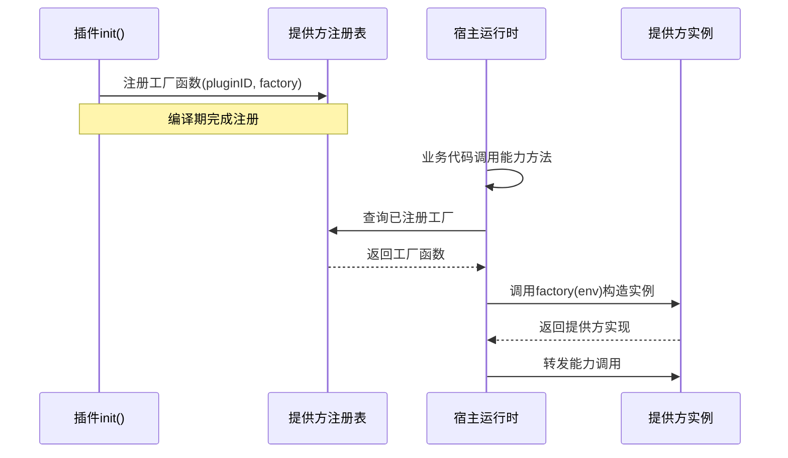

## 基本介绍

为提升框架整体的灵活性与可扩展性，主框架采用领域驱动的设计思路对核心能力进行建模，并以解耦方式组织各领域能力的实现与契约。`apps/lina-core/pkg/plugin`目录作为公开的`Go`契约边界，向插件暴露稳定的领域服务接口——源码插件通过`pluginhost.Services`消费完整的`capability.Services`目录，动态插件通过`pluginbridge.Default()`返回的`pluginbridge.Services`消费已经发布为`hostServices`的能力子集。

## 组件结构

| 路径 | 职责 |
|------|------|
| `capability/` | 聚合稳定宿主能力，包含`Services`、`AdminServices`、插件作用域服务绑定和各领域窄接口；源码插件直接使用完整目录，动态插件使用已发布的桥接子集 |
| `pluginhost/` | 源码插件宿主命名空间，提供编译期注册接口层和运行期回调契约 |
| `pluginbridge/` | 动态插件桥接命名空间，提供`pluginbridge.Default()`/`pluginbridge.New()`运行时能力目录、`Wasm`执行契约和`hostServices`编解码 |



## 声明期与运行期

插件能力分为声明期和运行期两个阶段。声明期是插件的静态注册和发现阶段，主框架在业务执行前使用声明输出构建治理状态；运行期是插件业务逻辑执行阶段，插件消费主框架提供的领域能力服务。

声明期能力的详细设计和使用方式请参阅[声明期能力概览](/docs/declaration-capabilities)，包括[资源声明](/docs/declaration-assets)、[生命周期声明](/docs/declaration-lifecycle)、[路由声明](/docs/declaration-routes)、[任务声明](/docs/declaration-jobs)、[钩子声明](/docs/declaration-hooks)、[提供方声明](/docs/declaration-providers)和[访问控制声明](/docs/declaration-access)。

### 声明期能力

声明期能力是插件的静态注册输出。源码插件在编译期通过`pluginhost.Declarations`注册，动态插件通过`plugin.yaml`清单和`pluginbridge.Declarations`声明。

#### 源码插件声明期

源码插件通过`pluginhost.Declarations`在`init()`中注册以下声明：

| 声明入口 | 功能说明 |
|----------|----------|
| `ID()` | 返回与`plugin.yaml`一致的稳定插件标识 |
| `Assets()` | 绑定插件嵌入文件系统，包含清单、前端页面、`SQL`和`i18n`资源 |
| `Lifecycle()` | 注册安装、升级、禁用、卸载、租户禁用、租户删除和安装模式变更等`16`个生命周期回调 |
| `Hooks()` | 订阅主框架扩展点事件，例如`auth.login.succeeded`、`plugin.enabled`、`system.started`等 |
| `HTTP()` | 注册插件`HTTP`路由贡献回调，由主框架启动时统一触发 |
| `Jobs()` | 注册定时任务贡献回调，由主框架调度时统一触发 |
| `Providers()` | 声明领域能力提供方工厂，例如`ProvideTenant`、`ProvideOrg`和`ProvideAIText` |
| `Access()` | 注册菜单过滤和权限过滤回调，用于运行时动态调整工作台导航和权限 |

#### 动态插件声明期

动态插件通过`plugin.yaml`清单和构建期契约表达声明：

| 声明来源 | 功能说明 |
|----------|----------|
| `plugin.yaml` | 声明插件身份、版本、依赖、菜单、权限、多租户策略、公开静态资源和`hostServices`授权申请 |
| `Routes()` | 声明路由组绑定，指定`API`前缀和路由包 |
| `Jobs()` | 通过`host-service`调用注册定时任务契约 |
| `WASM`自定义段 | 在`.wasm`产物中嵌入`ABI`版本、运行时类型、编解码器和导出函数名等元数据 |
| `protocol.BridgeSpec` | 定义桥接`ABI`契约，包括版本号、运行时类型、编解码方式和`alloc`/`execute`导出名称 |

### 运行期能力

运行期能力是插件业务逻辑执行时可用的服务。源码插件和动态插件共享宿主领域能力模型，但公开入口不同。

#### 源码插件运行期

源码插件通过`pluginhost.Services`访问运行期能力。该接口内嵌`capability.Services`，直接暴露全部领域能力方法，并额外提供源码插件专属能力：

| 能力入口 | 功能说明 |
|----------|----------|
| 全部领域能力 | 包括`AI`、`Auth`、`Cache`、`Storage`等能力 |
| `Admin()` | 可信管理命令，例如修改用户状态、替换角色权限、吊销会话、写入运行时配置等 |
| `TenantFilter()` | 为插件自有表追加租户过滤条件的数据库查询构建器 |

#### 动态插件运行期

动态插件通过`pluginbridge.Default()`访问已发布的运行期能力。所有调用经由`WASI host call`传输，由宿主按`hostServices`授权快照校验后分发执行。动态插件访问的是动态服务目录中的能力子集，并拥有三个专属能力：

| 能力入口 | 功能说明 |
|----------|----------|
| 已发布领域能力 | 例如`AI`、`Auth`、`Cache`、`Storage`等能力，通过`host-call`桥接访问；`I18n()`不发布为动态`hostServices` |
| `Runtime()` | 专属能力：日志写入、插件状态读写、时间获取、`UUID`生成、节点身份读取 |
| `Network()` | 专属能力：受治理的出站`HTTP`请求，需在`plugin.yaml`中声明授权目标地址 |
| `RecordStore()` | 专属能力：`data`服务的类`ORM`封装层，只能访问声明的插件自有表 |

#### `AdminServices`边界

`capability.AdminServices`是可信源码插件的管理命令目录，只通过`pluginhost.Services.Admin()`暴露。源码插件可以在宿主进程内接收经过领域治理的管理能力，例如用户管理、权限管理、通知管理、会话强退和插件治理命令。

动态插件的`pluginbridge.Services`接口不提供`Admin()`入口，因此不能直接使用`sessioncap.AdminService`、`notifycap.AdminService`或其他领域`AdminService`接口。动态插件只能调用已经发布为动态`hostServices`、已经写入`plugin.yaml`声明、经过宿主授权并注册到`WASM host-service`分发器中的具体方法。

例如当前`sessions`动态服务只提供`sessions.search`和`sessions.batch_get`，不包含`sessioncap.AdminService.RevokeSession`对应的强退命令。如果未来确实需要让动态插件使用某个管理动作，再考虑开放管理接口。

## 领域能力概览

| 方法 | 领域文档 | 说明 |
|------|----------|------|
| `AI()` | [AI能力](/docs/domain-capability-ai) | 聚合文本、图片、向量、音频、视觉、文档、安全和视频子能力 |
| `APIDoc()` | [接口文档能力](/docs/domain-capability-apidoc) | 解析路由操作键、本地化模块标签和操作摘要 |
| `Auth()` | [认证与授权能力](/docs/domain-capability-auth) | 聚合`Token()`和`Authz()`子能力 |
| `Users()` | [用户能力](/docs/domain-capability-users) | 用户视图、搜索和可见性校验 |
| `BizCtx()` | [业务上下文能力](/docs/domain-capability-bizctx) | 读取当前请求用户、租户、模拟登录和平台绕过状态 |
| `Cache()` | [缓存能力](/docs/domain-capability-cache) | 插件作用域运行时缓存 |
| `Dict()` | [字典能力](/docs/domain-capability-dict) | 字典标签解析和刷新视图 |
| `Files()` | [文件能力](/docs/domain-capability-files) | 文件视图和可见性校验 |
| `HostConfig()` | [配置管理能力](/docs/domain-capability-hostconfig) | 读取宿主配置值；动态插件读取时必须声明`keys` |
| `I18n()` | [国际化能力](/docs/domain-capability-i18n) | 源码插件运行时翻译能力；动态插件不开放对应`host service` |
| `Infra()` | [基础设施能力](/docs/domain-capability-infra) | 基础设施组件状态视图 |
| `Jobs()` | [任务与定时能力](/docs/domain-capability-jobs) | 定时任务视图读取 |
| `Manifest()` | [清单资源能力](/docs/domain-capability-manifest) | 读取当前插件`manifest/`下的只读资源 |
| `Notifications()` | [通知能力](/docs/domain-capability-notifications) | 通知消息视图读取 |
| `Org()` | [组织能力](/docs/domain-capability-org) | 可选组织能力，读取用户部门和岗位视图 |
| `Plugins()` | [插件治理能力](/docs/domain-capability-plugins) | 聚合插件注册表、插件配置、插件状态和生命周期子能力 |
| `Route()` | [动态路由能力](/docs/domain-capability-route) | 读取当前动态路由元数据 |
| `Sessions()` | [在线会话能力](/docs/domain-capability-sessions) | 在线会话搜索和批量读取 |
| `Storage()` | [文件能力](/docs/domain-capability-files) | 插件作用域对象存储操作 |
| `Tenant()` | [租户能力](/docs/domain-capability-tenant) | 可选租户能力，读取当前租户、可见性、切换校验和源码插件租户过滤 |
| `Lock()` | [分布式锁能力](/docs/domain-capability-lock) | 插件可见的分布式锁获取、续租和释放 |

插件作用域能力会由宿主绑定插件身份。例如`Plugins().Config()`只读取当前插件自己的`config.yaml`，`Manifest()`只读取当前插件的`manifest/`资源，`AI()`会把来源插件`ID`注入后续提供方请求。

## SPI架构设计

部分领域能力属于可选框架能力——它们不是主框架内置的，而是由提供方插件实现具体逻辑后注入到宿主运行时。当前采用`SPI`模式的能力比如`AI`、`Org`和`Tenant`等，对应的官方提供方插件分别为`linapro-ai-core`、`linapro-org-core`和`linapro-tenant-core`。

### 架构设计

`SPI`（`Service Provider Interface`）模式的核心思想是将能力契约与能力实现分离。宿主定义领域能力的公开接口（即`SPI`契约），提供方插件负责实现具体业务逻辑。宿主通过延迟构造避免启动阶段对可选插件的强依赖——只有当能力首次被消费时，宿主才会实例化提供方。



| 设计要点 | 说明 |
|----------|------|
| 延迟构造 | 宿主只在能力首次被消费时构造提供方实例，避免启动阶段强依赖可选插件 |
| 安全降级 | 没有可用提供方时，能力返回空结果或不可用状态，而非`nil`或错误 |
| 来源注入 | 宿主通过`ProviderEnv`向提供方注入请求上下文、插件身份和辅助能力 |
| 启用状态隔离 | 提供方状态独立于业务入口可见性——插件的业务入口可能对当前租户不可见，但仍可作为平台能力提供方可用 |

### SPI服务注册

源码插件通过`pluginhost.Declarations.Providers()`声明`SPI`工厂。每个工厂是一个构造函数，接收`ProviderEnv`参数并返回提供方实例：



`ProviderEnv`是宿主向提供方注入的运行期上下文，通常包含：

| 注入项 | 说明 |
|--------|------|
| 插件身份 | 当前提供方插件的`ID`，用于审计和隔离 |
| 请求上下文 | 当前请求的租户、用户等业务上下文 |
| 辅助能力 | 提供方实现所需的宿主能力，例如`TenantFilter`、用户视图等 |

### SPI提供方状态检查

宿主通过`Plugins().State().IsProviderEnabled()`判断提供方是否可用。该检查与`IsEnabled`语义不同：

| 检查方法 | 语义 | 适用场景 |
|----------|------|----------|
| `IsEnabled` | 插件的业务入口对当前租户是否可见 | 菜单过滤、路由可见性、权限过滤 |
| `IsProviderEnabled` | 插件是否平台启用且可承接框架能力提供方调用 | `AI`、`Org`、`Tenant`等能力调用前检查 |

提供方检查确保即使业务入口被租户级禁用，平台级能力仍可正常服务。

### 插件实现SPI提供方

源码插件实现`SPI`提供方分为注册和实现两个步骤。以`Org`能力为例：

**注册`SPI`工厂：**

提供方插件在`init()`中通过`Providers()`声明入口注册工厂函数：

```go
func init() {
    plugin := pluginhost.NewDeclarations("my-author-my-org-provider")
    if err := plugin.Providers().ProvideOrg(func(ctx context.Context, env orgspi.ProviderEnv) (orgspi.Provider, error) {
        return &myOrgProvider{env: env}, nil
    }); err != nil {
        panic(err)
    }

    if err := pluginhost.RegisterSourcePlugin(plugin); err != nil {
        panic(err)
    }
}
```

**实现`SPI`契约：**

提供方需要实现能力领域包中定义的`Provider`接口。以`orgcap.Provider`为例，提供方需要实现部门视图、岗位视图等完整组织能力：

```go
type myOrgProvider struct {
    env orgcap.ProviderEnv
}

func (p *myOrgProvider) ListUserDeptAssignments(ctx context.Context, userIDs []string) ([]DeptAssignment, error) {
    // 查询提供方自己的组织数据
    // 可通过 p.env 访问宿主注入的辅助能力
}

func (p *myOrgProvider) GetUserDeptInfo(ctx context.Context, userID string) (*DeptInfo, error) {
    // 实现部门信息查询
}
```

各能力的提供方接口定义位于对应的领域能力包中：

| 能力 | `SPI`接口 | `SPI`包 | 官方插件 |
|------|-----------|----------|----------|
| `AI` | 各子能力独立接口 | `aicap` | `linapro-ai-core` |
| `Org` | `orgcap.Provider` | `orgcap` | `linapro-org-core` |
| `Tenant` | `tenantcap.Provider` + `tenantcap.Resolver` | `tenantcap` | `linapro-tenant-core` |

`Tenant`能力额外提供`tenantcap.Resolver`接口，负责从`HTTP`请求中解析租户身份，可按请求头、域名、路径、令牌或其他策略组成责任链。

### 动态插件与SPI

动态插件不能直接注册`SPI`工厂，因为提供方需要实现`Go`接口并运行在宿主进程中。动态插件通过以下方式与`SPI`能力交互：

| 交互方式 | 说明 |
|----------|------|
| 消费`SPI`能力 | 通过`hostServices`声明调用已发布的`SPI`能力方法，例如`service: ai`、`service: org`、`service: tenant` |
| 检查`SPI`提供方状态 | 通过`plugins.provider_enabled.check`动态方法判断提供方是否可用 |
| 状态查询 | 通过`capability.available`和`capability.status`动态方法查询能力可用性和活跃提供方 |

动态插件在`plugin.yaml`中声明对`SPI`能力的消费：

```yaml
hostServices:
  - service: ai
    methods:
      - text.generate
  - service: org
    methods:
      - users.dept_name.get
  - service: tenant
    methods:
      - tenants.current
```

## 动态`hostServices`

动态插件不能直接访问宿主实现包，也不能直接使用源码插件专属的`AdminServices`管理命令目录。它们通过`plugin.yaml`中的`hostServices`声明需要调用的宿主服务，一个典型的`plugin.yaml`中的`hostServices`声明如下：
```yaml
hostServices:
  - service: runtime
    methods:
      - log.write
      - state.get
      - state.set
  - service: storage
    methods:
      - put
      - get
      - list
    resources:
      paths:
        - exports/
  - service: data
    methods:
      - list
      - get
      - create
    resources:
      tables:
        - plugin_demo_reports
  - service: network
    methods:
      - request
    resources:
      - url: https://api.example.com/v1/*
  - service: hostconfig
    methods: [get]
    resources:
      keys:
        - workspace.basePath
  - service: manifest
    methods: [get]
    resources:
      paths:
        - profile.yaml
  - service: ai
    methods:
      - text.generate
```

### 资源声明形态

| 资源类型 | 声明字段 | 服务 |
|----------|----------|------|
| `none` | 不声明`resources` | `runtime`、`apidoc`、`auth`、`authz`、`ai`、`users`、`bizctx`、`dict`、`files`、`infra`、`jobs`、`notifications`、`plugins`、`route`、`sessions`、`org`、`tenant` |
| `path` | `resources.paths` | `storage`、`manifest` |
| `table` | `resources.tables` | `data` |
| `key` | `resources.keys` | `hostconfig` |
| `resource` | `resources[].url`或`resources[].ref`及服务专属属性 | `network`、`cache`、`lock`、`notifications`（仅`messages.send`） |

生产校验会要求`data`服务表属于插件自有命名空间。动态插件不得声明`sys_*`这类宿主核心表，也不应把宿主表名作为插件数据能力的目标。

### 动态服务目录

| 服务 | 领域文档 | 资源类型 | 方法 |
|------|----------|----------|------|
| `runtime` | <span style={{whiteSpace: 'nowrap'}}>[动态`Runtime`能力](/docs/domain-capability-runtime)</span> | `none` | `log.write`、`state.get`、`state.set`、`state.delete`、`info.now`、`info.uuid`、`info.node` |
| `storage` | [文件能力](/docs/domain-capability-files) | `path` | `put`、`get`、`delete`、`list`、`stat` |
| `network` | [外部网络能力](/docs/domain-capability-network) | `resource` | `request` |
| `data` | [数据记录能力](/docs/domain-capability-recordstore) | `table` | `list`、`get`、`create`、`update`、`delete`、`transaction` |
| `cache` | [缓存能力](/docs/domain-capability-cache) | `resource` | `get`、`set`、`delete`、`incr`、`expire` |
| `lock` | [分布式锁能力](/docs/domain-capability-lock) | `resource` | `acquire`、`renew`、`release` |
| `hostconfig` | [配置管理能力](/docs/domain-capability-hostconfig) | `key` | `get` |
| `manifest` | [清单资源能力](/docs/domain-capability-manifest) | `path` | `get` |
| `apidoc` | [接口文档能力](/docs/domain-capability-apidoc) | `none` | `route_text.resolve`、`route_texts.resolve`、`route_title_operation_keys.find` |
| `auth` | [认证与授权能力](/docs/domain-capability-auth) | `none` | `tenant.select`、`tenant.switch`、`impersonation_token.issue`、`impersonation_token.revoke` |
| `authz` | [认证与授权能力](/docs/domain-capability-auth) | `none` | `permissions.batch_get`、`permissions.has`、`users.platform_admin.check` |
| `ai` | [AI能力](/docs/domain-capability-ai) | `none` | `text.generate`、`image.generate`、`image.edit`、`embedding.create`、`audio.transcribe`、`audio.synthesize`、`vision.analyze`、`document.analyze`、`document.cite`、`safety.moderate`、`video.generate`、`video.edit`、`video.extend`、`video.operation.get`、`video.operation.cancel` |
| `users` | [用户能力](/docs/domain-capability-users) | `none` | `users.batch_get`、`users.search`、`users.visible.ensure` |
| `bizctx` | [业务上下文能力](/docs/domain-capability-bizctx) | `none` | `current.get` |
| `dict` | [字典能力](/docs/domain-capability-dict) | `none` | `labels.resolve` |
| `files` | [文件能力](/docs/domain-capability-files) | `none` | `files.batch_get`、`files.visible.ensure` |
| `infra` | [基础设施能力](/docs/domain-capability-infra) | `none` | `status.batch_get` |
| `jobs` | [任务与定时能力](/docs/domain-capability-jobs) | `none` | `jobs.batch_get`、`jobs.register` |
| `notifications` | [通知能力](/docs/domain-capability-notifications) | 读取无资源；`messages.send`使用`resources[].ref` | `messages.batch_get`、`messages.send` |
| `plugins` | [插件治理能力](/docs/domain-capability-plugins) | `none` | `plugins.batch_get`、`plugins.tenant.list`、`plugins.enabled.check`、`plugins.provider_enabled.check`、`plugins.enabled_authoritative.check`、`config.get`、`lifecycle.tenant_plugin_disable.ensure`、`lifecycle.tenant_plugin_disabled.notify`、`lifecycle.tenant_delete.ensure`、`lifecycle.tenant_deleted.notify` |
| `route` | [动态路由能力](/docs/domain-capability-route) | `none` | `metadata.get` |
| `sessions` | [在线会话能力](/docs/domain-capability-sessions) | `none` | `sessions.search`、`sessions.batch_get` |
| `org` | [组织能力](/docs/domain-capability-org) | `none` | `capability.available`、`capability.status`、`users.dept_assignments.list`、`users.dept_info.get`、`users.dept_name.get`、`users.dept_ids.get`、`users.post_ids.get` |
| `tenant` | [租户能力](/docs/domain-capability-tenant) | `none` | `capability.available`、`capability.status`、`tenants.current`、`tenants.platform_bypass`、`tenants.visible.ensure`、`users.tenant_membership.validate`、`users.tenants.list`、`tenants.switch.validate` |
| `secret` | 预留 | `resource` | `resolve` |
| `event` | 预留 | `resource` | `publish` |
| `queue` | 预留 | `resource` | `enqueue` |

### 动态插件专属能力

`Runtime()`、`Network()`和`RecordStore()`是`pluginbridge.Default()`返回目录上的动态插件专属能力。它们不属于`capability.Services`，因为源码插件已经运行在宿主进程内，可以使用宿主原生等价能力。

| 能力 | 公开入口 | 说明 |
|------|----------|------|
| `Runtime()` | `pluginbridge.Default().Runtime()` | 动态插件通过`WASI host-service`客户端写日志、读写状态、读取时间、生成`UUID`和读取节点身份；源码插件直接使用宿主原生日志和运行期上下文 |
| `Network()` | `pluginbridge.Default().Network()` | 动态插件通过`host-service`授权访问受治理的出站`HTTP`；源码插件使用宿主原生`HTTP client`或注入的领域服务 |
| `RecordStore()` | `pluginbridge.Default().RecordStore()` | 动态插件使用`pluginbridge`侧`facade`封装`data host-service`协议和类型化查询计划；源码插件使用自有`DAO`或提供方接缝 |


## 相关文档

- [AI能力](/docs/domain-capability-ai)
- [配置管理能力](/docs/domain-capability-hostconfig)
- [Tenant能力](/docs/domain-capability-tenant)
- [数据记录能力](/docs/domain-capability-recordstore)
- [基础设施能力](/docs/domain-capability-infra)
- [动态`Runtime`能力](/docs/domain-capability-runtime)
- [动态插件与WASM运行时](/docs/wasm-plugins)
