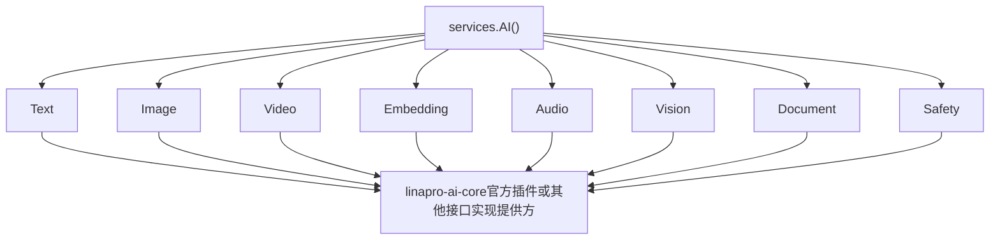

## 基本介绍

`AI`能力是`LinaPro`插件系统中的类型化智能能力命名空间。源码插件通过`services.AI()`访问，动态插件通过`plugin.yaml`声明`service: ai`后使用`pluginbridge.Default().AI()`客户端访问。

根命名空间只负责聚合子能力，不直接追加所有`AI`方法。每个子能力拥有自己的请求、响应、提供方契约、状态和降级行为。官方提供默认的`AI`能力实现插件`linapro-ai-core`，宿主通过插件治理状态判断该提供方是否可服务。

**能力阶段**：运行期

**类型支持**：源码插件、动态插件

## 能力设计

### 子能力体系

`AI`能力采用聚合子能力模式，每个子能力拥有独立的请求、响应、提供方契约和降级行为：

| <span style={{whiteSpace: 'nowrap'}}><strong>子能力</strong></span> | 源码入口 | 动态方法 | 说明 |
|--------|----------|----------|------|
| <span style={{whiteSpace: 'nowrap'}}><strong>文本</strong></span> | `AI().Text()` | `text.generate` | 文本生成，支持`purpose`、档位、消息、输出上限和推理力度 |
| <span style={{whiteSpace: 'nowrap'}}><strong>图片</strong></span> | `AI().Image()` | `image.generate`、`image.edit` | 图片生成和图片编辑，输入输出以受保护资产引用表达 |
| <span style={{whiteSpace: 'nowrap'}}><strong>向量</strong></span> | `AI().Embedding()` | `embedding.create` | 创建向量嵌入 |
| <span style={{whiteSpace: 'nowrap'}}><strong>音频</strong></span> | `AI().Audio()` | `audio.transcribe`、`audio.synthesize` | 语音转写（语音转文本）和语音合成（文本转语音） |
| <span style={{whiteSpace: 'nowrap'}}><strong>视觉</strong></span> | `AI().Vision()` | `vision.analyze` | 图片、截图、图示和帧内容分析 |
| <span style={{whiteSpace: 'nowrap'}}><strong>文档</strong></span> | `AI().Document()` | `document.analyze`、`document.cite` | 文档分析和带引用文档问答 |
| <span style={{whiteSpace: 'nowrap'}}><strong>安全</strong></span> | `AI().Safety()` | `safety.moderate` | 文本和资产输入安全审核 |
| <span style={{whiteSpace: 'nowrap'}}><strong>视频</strong></span> | `AI().Video()` | `video.generate`、`video.edit`、`video.extend`、`video.operation.get`、`video.operation.cancel` | 视频生成、编辑、延展和提供方操作查询或取消 |



### 来源身份和治理

宿主通过`aicap.ForPlugin`为插件绑定来源身份。该身份进入提供方请求，用于审计、用量归因、问题定位，以及后续插件级配额、限流、档位访问和`purpose`策略决策。

插件不应在请求中伪造来源插件`ID`。源码插件只需使用绑定后的`services.AI()`，动态插件的来源身份由宿主桥接层从当前插件产物和授权缓存状态中生成。

### 可用性和降级

每个子能力都支持降级。当未配置提供方或提供方插件不可用时，调用方会收到结构化的不可用状态或错误，而非返回`nil`服务。插件可先调用`Available()`或`Status()`判断能力状态，再决定是否展示入口、降级到规则逻辑或提示管理员配置智能中心。

## 接口定义

### 源码插件接口

源码插件通过`services.AI()`访问各子能力。每个子能力提供独立的类型化方法，例如`AI().Text().GenerateText(ctx, req)`、`AI().Image().Generate(ctx, req)`、`AI().Audio().Transcribe(ctx, req)`、`AI().Audio().Synthesize(ctx, req)`等。所有子能力均遵循`Available()`、`Status()`、类型化方法的统一模式。

### 动态插件接口

动态插件通过`hostServices.ai`声明授权的子能力方法：

| 动态方法 | 说明 |
|----------|------|
| `text.generate` | 文本生成 |
| `image.generate` | 图片生成 |
| `image.edit` | 图片编辑 |
| `embedding.create` | 创建向量嵌入 |
| `audio.transcribe` | 音频转写 |
| `audio.synthesize` | 语音合成 |
| `vision.analyze` | 图片内容分析 |
| `document.analyze` | 文档分析 |
| `document.cite` | 带引用文档问答 |
| `safety.moderate` | 输入安全审核 |
| `video.generate` | 视频生成 |
| `video.edit` | 视频编辑 |
| `video.extend` | 视频延展 |
| `video.operation.get` | 提供方操作查询 |
| `video.operation.cancel` | 提供方操作取消 |

## 能力使用

### 源码插件使用

源码插件通过`services.AI()`直接访问各子能力。宿主通过`aicap.ForPlugin`自动注入插件来源身份，插件无需手动管理：

```go
// 在路由注册回调中获取已绑定来源身份的AI服务
aiSvc := registrar.Services().AI()

// 使用文本生成子能力
result, err := aiSvc.Text().GenerateText(ctx, aitext.GenerateRequest{
    Purpose:  "report.summary", 
    Messages: messages,
    Tier:     aitext.TierStandard,
})
```

需要替换角色权限集合的源码插件，应使用`services.Auth().Authz().ReplaceRolePermissions`。

### 动态插件使用

动态插件在`plugin.yaml`中声明所需的`AI`子能力方法：

```yaml
hostServices:
  - service: ai
    methods:
      - text.generate
      - document.cite
```

`purpose`和`tier`在调用时通过请求`DTO`传递，不在清单中声明。动态插件通过`pluginbridge.Default().AI().Text().GenerateText(ctx, req)`等类型化方法调用：

```go
aiSvc := pluginbridge.Default().AI()

result, err := aiSvc.Text().GenerateText(ctx, aitext.GenerateRequest{
    Purpose:  "report.summary",
    Tier:     aitext.TierStandard,
    Messages: messages,
})
```

## 设计约束

- **方法授权与业务参数分离。** `plugin.yaml`只声明方法白名单，`purpose`和`tier`等业务参数在每次调用时通过请求DTO传递，授权检查和业务校验各司其职。
- **使用`purpose`表达业务场景。** `purpose`不是模型名，也不是供应商名，而是宿主治理、审计和配额使用的业务意图，调用时必须提供。
- **资产以引用传递。** `AssetRef`不携带内联文件字节或提供方认证下载地址，插件应使用受保护资产引用。
- **档位是平台抽象。** `basic`、`standard`和`advanced`由宿主映射到具体模型或提供方，插件不直接绑定供应商内部模型。
- **元数据不得包含正文。** 请求`metadata`只适合放短审计键，不应包含提示词、响应正文或敏感数据。

## 相关服务

- [插件可用领域能力概览](/docs/domain-capabilities)
- [Plugins能力](/docs/domain-capability-plugins)
