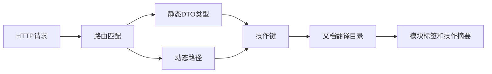

## 基本介绍

`APIDocService`为源码插件和动态插件提供`API`文档文本查询能力。源码插件通过`services.APIDoc()`访问，动态插件通过`plugin.yaml`声明`service: apidoc`后使用`pluginbridge.Default().APIDoc()`客户端访问。该服务把路由操作键解析为本地化的模块标签和操作摘要。

它的典型消费方是操作日志、审计日志或管理端筛选器。这些功能需要把一个请求路由转换为用户可读的业务语义，但不需要接触宿主`OpenAPI`生成器内部实现。

**能力阶段**：运行期

**类型支持**：源码插件、动态插件

## 能力设计

### 操作键构建体系

操作键是稳定标识，相同业务操作应产生相同操作键，不随路径参数值变化。三种路由类型使用不同的构建策略：

| 路由类型 | 构建方式 | 示例语义 |
|----------|----------|----------|
| <span style={{whiteSpace: 'nowrap'}}><strong>宿主静态路由</strong></span> | `BuildOperationKeyFromHandler`从`DTO`类型派生 | `lina-core.backend.api.sys.user.ListReq`归一化为`core.backend.api.sys.user.ListReq` |
| <span style={{whiteSpace: 'nowrap'}}><strong>源码插件路由</strong></span> | 源码插件包名归一化为`plugins.<plugin-id>`命名空间 | 避免与宿主或其他插件操作键冲突 |
| <span style={{whiteSpace: 'nowrap'}}><strong>动态插件路由</strong></span> | `BuildOperationKeyFromPath`从`/x/{pluginId}/...`路径和`HTTP`方法派生 | 生成`plugins.{pluginId}.paths.{method}.{path}`结构 |

操作键与翻译目录中的条目对应。`ResolveRouteText`根据操作键查找翻译目录；命中时返回本地化`Title`和`Summary`，未命中时返回调用方提供的回退文本。



### 翻译目录管理

翻译目录由宿主管理，`APIDocService`只负责查询和回退，不负责维护翻译条目。插件路由需要命名空间，源码插件和动态插件路由都进入`plugins.<plugin-id>`命名空间，避免冲突。

## 接口定义

### 源码插件接口

| 方法 | 说明 |
|------|------|
| `ResolveRouteText` | 解析单个路由的本地化模块标签和操作摘要 |
| `ResolveRouteTexts` | 批量解析多个路由文本，适合批量审计记录 |
| `FindRouteTitleOperationKeys` | 按关键词搜索匹配的模块标签操作键 |

辅助函数：

| 辅助函数 | 说明 |
|----------|------|
| `BuildOperationKeyFromHandler` | 从`GoFrame`严格路由处理函数的请求`DTO`类型派生操作键 |
| `BuildOperationKeyFromPath` | 从规范化路径和`HTTP`方法派生操作键 |
| `BuildDynamicOperationKey` | 动态插件路由操作键构建入口 |

### 动态插件接口

动态插件通过`hostServices.apidoc`声明授权的方法：

| 动态方法 | 说明 |
|----------|------|
| `route_text.resolve` | 解析单个路由的本地化模块标签和操作摘要 |
| `route_texts.resolve` | 批量解析多个路由文本 |
| `route_title_operation_keys.find` | 按关键词搜索匹配的模块标签操作键 |

## 能力使用

### 源码插件使用

源码插件通过`services.APIDoc()`解析路由文本，典型场景包括审计日志记录和管理端筛选：

```go
// 解析单个路由的文档文本
text := services.APIDoc().ResolveRouteText(ctx, apidoccap.RouteTextInput{
    OperationKey:    operationKey,
    FallbackTitle:   fallbackTitle,
    FallbackSummary: fallbackSummary,
})

// 批量解析多个路由文本
texts := services.APIDoc().ResolveRouteTexts(ctx, inputs)

// 按关键词搜索匹配的操作键
keys := services.APIDoc().FindRouteTitleOperationKeys(ctx, keyword)
```

辅助函数用于构建操作键：

```go
// 从DTO类型构建操作键
key := apidoc.BuildOperationKeyFromHandler(handlerFunc)

// 从路径构建操作键
key := apidoc.BuildOperationKeyFromPath("/api/users", "GET")
```

### 动态插件使用

动态插件在`plugin.yaml`中声明`apidoc`服务和授权方法：

```yaml
hostServices:
  - service: apidoc
    methods:
      - route_text.resolve
      - route_texts.resolve
```

动态插件通过`pluginbridge.Default().APIDoc()`客户端调用：

```go
apiDocSvc := pluginbridge.Default().APIDoc()

// 解析单个路由的文档文本
text := apiDocSvc.ResolveRouteText(ctx, apidoccap.RouteTextInput{
    OperationKey:    operationKey,
    FallbackTitle:   fallbackTitle,
    FallbackSummary: fallbackSummary,
})

// 批量解析多个路由文本
texts := apiDocSvc.ResolveRouteTexts(ctx, inputs)
```

## 设计约束

- **操作键是稳定标识。** 相同业务操作应产生相同操作键，不随路径参数值变化。
- **翻译目录由宿主管理。** `APIDocService`只负责查询和回退，不负责维护翻译条目。
- **插件路由需要命名空间。** 源码插件和动态插件路由都进入`plugins.<plugin-id>`命名空间，避免冲突。
- **回退文本必须可读。** 未命中翻译时会返回调用方回退文本，审计日志仍应有可展示内容。

## 相关服务

- [动态路由能力](/docs/domain-capability-route)
- [国际化能力](/docs/domain-capability-i18n)
- [业务上下文能力](/docs/domain-capability-bizctx)
