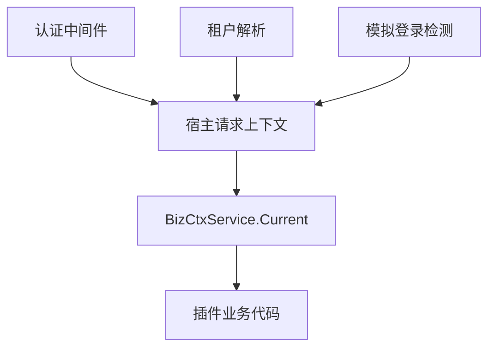

## 基本介绍

`services.BizCtx()`返回当前请求的业务上下文只读视图。源码插件通过`services.BizCtx()`访问，动态插件通过`plugin.yaml`声明`service: bizctx`后使用`pluginbridge.Default().BizCtx()`客户端访问。它只有一个方法`Current(ctx)`，返回`CurrentContext`结构体。

该服务适合插件在路由、钩子或任务回调中读取当前用户、租户和模拟状态。

**能力阶段**：运行期

**类型支持**：源码插件、动态插件

## 能力设计

### 上下文视图模型

`CurrentContext`是插件稳定视图，不包含宿主内部认证对象或数据库实体。视图字段覆盖请求身份、租户范围和模拟状态：

| 字段 | 说明 |
|------|------|
| `TokenID` | 当前认证令牌或在线会话标识 |
| `UserID` | 当前认证用户标识 |
| `Username` | 当前认证用户名 |
| `TenantID` | 当前请求租户标识，`0`通常表示平台上下文 |
| `ActingUserID` | 模拟场景下的真实平台用户标识 |
| `ActingAsTenant` | 当前请求是否以租户视角操作 |
| `IsImpersonation` | 当前令牌是否代表模拟登录 |
| `Permissions` | 当前请求的生效权限标识列表 |
| `DataScope` | 生效角色数据范围快照 |
| `DataScopeUnsupported` | 角色快照是否包含不支持的数据范围 |
| `UnsupportedDataScope` | 首个不支持的数据范围值 |
| `IsSuperAdmin` | 当前调用者是否绕过常规权限检查 |
| `PlatformBypass` | 当前请求是否运行在平台范围 |

当`WithCurrentContext`注入的`TenantID`为`0`时，`PlatformBypass`会被自动标记为`true`。插件不应自行修改该标记，而应把它视为宿主对当前请求范围的判断。

### 上下文注入流程



### 只读数据语义

`BizCtxService`是只读数据，插件无法通过它修改请求上下文。如需租户切换或令牌变更，应使用认证能力。在非请求场景或上下文未注入时，会返回零值结构体，调用方应检查关键字段是否有效。

## 接口定义

### 源码插件接口

| 方法 | 说明 |
|------|------|
| `Current` | 返回当前请求的`CurrentContext`只读视图 |

### 动态插件接口

动态插件通过`hostServices.bizctx`声明授权的方法：

| 动态方法 | 说明 |
|----------|------|
| `current.get` | 返回当前请求的`CurrentContext`只读视图 |

## 能力使用

### 源码插件使用

源码插件通过`services.BizCtx().Current(ctx)`读取当前请求上下文：

```go
current := services.BizCtx().Current(ctx)
if current.UserID == 0 {
    return errors.New("未认证用户")
}
if current.IsImpersonation {
    // 记录模拟登录审计
    log.Infof("用户 %d 正在模拟访问租户 %d", current.ActingUserID, current.TenantID)
}
if current.IsSuperAdmin {
    // 平台超级管理员，跳过常规权限检查
}
```

需要给插件自有表追加`tenant_id`条件时，源码插件使用`TenantFilter()`，动态插件使用`data`服务授权。

### 动态插件使用

动态插件在`plugin.yaml`中声明`bizctx`服务：

```yaml
hostServices:
  - service: bizctx
    methods:
      - current.get
```

动态插件通过`pluginbridge.Default().BizCtx()`客户端调用：

```go
bizCtxSvc := pluginbridge.Default().BizCtx()
current := bizCtxSvc.Current(ctx)
if current.UserID == 0 {
    return errors.New("未认证用户")
}
```

## 设计约束

- **只读数据。** 插件无法通过`BizCtxService`修改请求上下文；如需租户切换或令牌变更，应使用认证能力。
- **零值表示缺失。** 非请求场景或上下文未注入时会返回零值结构体，调用方应检查关键字段。
- **不暴露宿主类型。** `CurrentContext`是插件稳定视图，不包含宿主内部认证对象或数据库实体。
- **租户过滤由专用服务处理。** 需要给插件自有表追加`tenant_id`条件时，源码插件使用`TenantFilter()`，动态插件使用`data`服务授权。

## 相关服务

- [Auth能力](/docs/domain-capability-auth)
- [Tenant能力](/docs/domain-capability-tenant)
