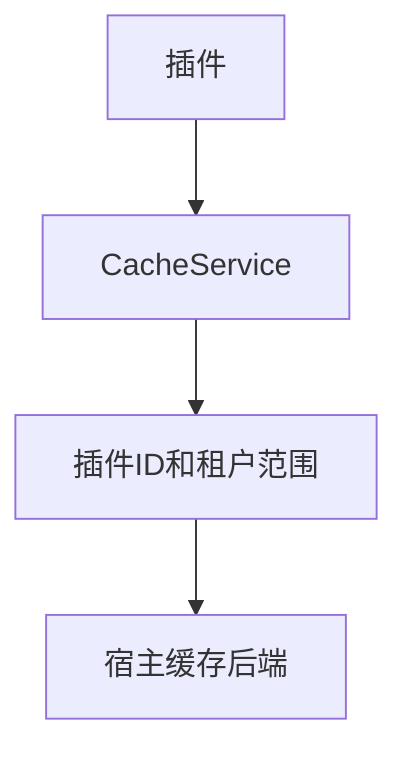

## 基本介绍

源码插件通过`services.Cache()`使用缓存能力。动态插件通过`plugin.yaml`声明`service: cache`后使用`pluginbridge.Default().Cache()`客户端。

缓存自动绑定插件身份和租户范围。插件只需传入业务命名空间和键名，不应拼接宿主缓存前缀。

**能力阶段**：运行期

**类型支持**：源码插件、动态插件

## 能力设计

### 缓存值类型

`CacheItem`支持两类值：

| 值类型 | 常量 | 说明 |
|--------|------|------|
| 字符串 | `CacheValueKindString` | 通用文本缓存 |
| 整数 | `CacheValueKindInt` | 计数器或序列号 |

### 作用域隔离

缓存自动绑定插件`ID`和租户范围，不同插件和不同租户之间的缓存天然隔离。插件只需传入业务命名空间和键名，宿主负责前缀拼接和范围限定。



### 易失性数据语义

缓存是易失数据，可能会过期、被淘汰或丢失，不应作为权限、租户边界、配置、插件状态或业务记录的权威来源。后端由宿主控制，插件不能选择内存、`Redis`或其他缓存后端。

## 接口定义

### 源码插件接口

| 方法 | 说明 |
|------|------|
| `Get` | 读取未过期缓存项，返回`CacheItem`和是否命中 |
| `GetMany` | 批量读取未过期缓存项，最多支持`100`个键 |
| `Set` | 写入字符串缓存，`ttl`必须为正 |
| `SetMany` | 批量写入字符串缓存，每项`ttl`必须为正，总负载上限`1MB` |
| `Delete` | 删除缓存项，缺失时为空操作 |
| `DeleteMany` | 批量删除缓存项，缺失时为空操作 |
| `Incr` | 按`delta`递增整数缓存，适合计数器 |
| `Expire` | 更新过期策略，`ttl`必须为正 |

### 动态插件接口

| 动态方法 | 动态`SDK`方法 | 说明 |
|----------|-------------|------|
| `get` | `Cache().Get` | 读取未过期缓存项 |
| `get_many` | `Cache().GetMany` | 批量读取未过期缓存项 |
| `set` | `Cache().Set` | 写入字符串缓存 |
| `set_many` | `Cache().SetMany` | 批量写入字符串缓存 |
| `delete` | `Cache().Delete` | 删除缓存项 |
| `delete_many` | `Cache().DeleteMany` | 批量删除缓存项 |
| `incr` | `Cache().Incr` | 递增整数缓存 |
| `expire` | `Cache().Expire` | 更新过期策略 |

## 能力使用

### 源码插件使用

源码插件通过`services.Cache()`操作缓存，命名空间用于插件内部逻辑分组：

```go
// 写入缓存
item, err := services.Cache().Set(ctx, "reports", "last_generated", value, time.Hour)

// 读取缓存
item, hit, err := services.Cache().Get(ctx, "reports", "last_generated")

// 批量读取
result, err := services.Cache().GetMany(ctx, cachecap.GetManyInput{
    Namespace: "reports",
    Keys:      []string{"last_generated", "export_count"},
})

// 递增计数器
countItem, err := services.Cache().Incr(ctx, "reports", "export_count", 1, time.Hour)

// 删除缓存
err := services.Cache().Delete(ctx, "reports", "last_generated")
```

### 动态插件使用

动态插件在`plugin.yaml`中声明缓存服务和授权资源：

```yaml
hostServices:
  - service: cache
    methods:
      - get
      - set
      - delete
      - incr
      - expire
    resources:
      - ref: plugin:reports
```

`cache`是资源型服务，必须声明`resources[].ref`。资源引用的具体命名策略由宿主治理约定，插件应使用清晰、稳定的业务场景名。在动态插件侧使用：

```go
// 写入缓存
item, err := pluginbridge.Default().Cache().Set(ctx, "reports", "last_generated", value, time.Hour)

// 读取缓存
item, hit, err := pluginbridge.Default().Cache().Get(ctx, "reports", "last_generated")
```

## 设计约束

- **缓存是易失数据。** 缓存可能过期、被淘汰或丢失，不应作为权限、租户边界、配置、插件状态或业务记录的权威来源。
- **命名空间由插件定义。** `namespace`用于插件内部逻辑分组，宿主会额外绑定插件和租户范围。
- **`ttl`必须为正。** `Set`、`SetMany`和`Incr`的`ttl`必须为正，`Expire`的`ttl`也必须为正。
- **批量操作有上限。** 单次批量最多`100`个键，单键最大`256`字节，批量写入总负载上限`1MB`。
- **后端由宿主控制。** 插件不能选择内存、`Redis`或其他缓存后端。

## 相关服务

- [Tenant能力](/docs/domain-capability-tenant)
- [插件配置与宿主配置](/docs/domain-capability-hostconfig)
- [插件可用领域能力概览](/docs/domain-capabilities)
